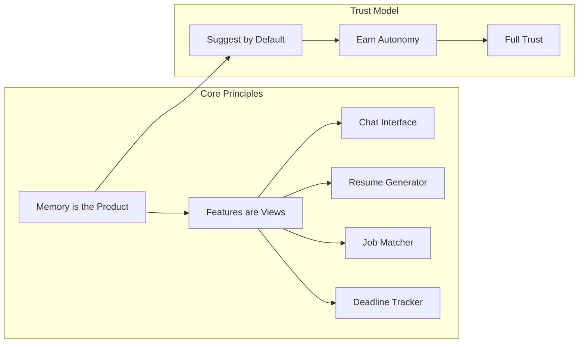
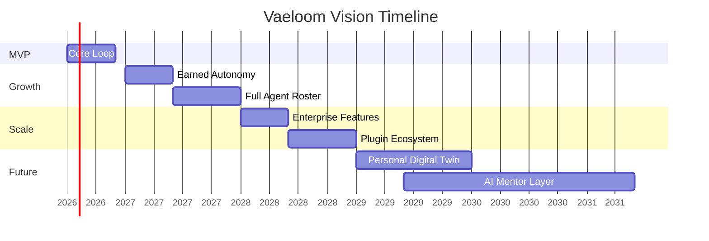

# Vision

> **Purpose:** Define the long-term strategic vision for Vaeloom as a personal intelligence platform
> **Status:** ✅ Upgraded to enterprise quality
> **Owner:** Product Team
> **Last Updated:** 2026-07-12
> **Canonical source:** [`/Docs/Vaeloom-Complete-Documentation.md#1-what-is-Vaeloom`](../../Docs/Vaeloom-Complete-Documentation.md#1-what-is-Vaeloom)

---

## Overview

Vaeloom's vision is to become the single, continuously learning intelligence layer that sits underneath everything a person does professionally and academically. Not a workspace app with AI bolted on. Not a chatbot with a long context window. An operating layer for a person's intellectual and professional life — built around a memory that compounds rather than resets every session.

This document defines the 5-year vision, the product philosophy that guides every decision, and the measurable milestones that mark progress toward that vision.

## Vision Statement

> A person's knowledge, work, and career should not live scattered across forty disconnected apps, each with no memory of the others. Vaeloom is one place that knows their education, their projects, their skills, their conversations, their applications, and their goals — and uses that knowledge to act on their behalf, with their permission, for years.

## Product Philosophy



| Principle | Description | Impact |
|-----------|-------------|--------|
| Memory before features | Every feature is evaluated by what it teaches the memory system | Features compound automatically |
| Consent is architecture | Permission scopes are core data-model concepts | Security + trust built in |
| Earned autonomy | System starts conservative, earns trust per agent | Users control their experience |

## Five-Year Horizon



### Milestone Descriptions

| Horizon | Target | Exit Criteria |
|---------|--------|---------------|
| **MVP** (2026) | Prove core loop | Users complete first-week journey without team intervention |
| **v1.5** (2027 H1) | Earned autonomy | >80% of users grant at least one autonomous action |
| **V2** (2027 H2) | Full memory system | 20+ memory types, Reflection Agent live |
| **V3** (2028) | 28 agents | Agent accuracy improving release over release |
| **Enterprise** (2028) | Multi-tenant | Verified tenant isolation, first design partner live |
| **Future** (2029+) | Personal AI | Digital Twin, AI Mentor, Opportunity Radar |

## What Makes This Vision Unique

Existing tools solve individual problems in isolation:

| Tool | Solves | Misses |
|------|--------|--------|
| Resume builders | Formatting | Real activity connection |
| Job boards | Discovery | Personal fit signal |
| Note apps | Knowledge capture | Automatic linking |
| AI chatbots | Conversation | Persistent memory |

Vaeloom's differentiator: **One memory, many views. Each view makes every other view smarter.**

## Goals

- Achieve broad team alignment: every team member can explain the vision to an external stakeholder in <30 seconds
- Complete MVP core loop proving the vision thesis within 12 months of project start
- Secure first enterprise design partner within 18 months of MVP launch
- Demonstrate compounding value: Month 6 users show 3x higher engagement than Month 1 users of same cohort
- Maintain vision consistency across all external communications — no mixed messaging about product category

## Scope

| | |
|---|---|
| **In Scope** | 5-year vision statement; 3 core product principles (memory-first, consent-as-architecture, earned autonomy); 6-phase timeline (MVP through Future); competitive differentiation matrix; vision communication best practices |
| **Out of Scope** | Specific feature specifications (see Feature Specs); engineering architecture (see Architecture docs); pricing strategy (see Pricing and Business Model); quarterly OKRs (see Goals) |

## Workflows

### Vision Decision Filter Workflow

1. New initiative proposed — team lead presents to product council
2. First question: "Does this initiative align with Vaeloom's vision as defined in this document?"
3. If yes: proceed to strategy and resource estimation
4. If maybe: schedule vision alignment workshop with stakeholders
5. If no: reject, with documented reasoning
6. All decisions logged in decision registry with vision alignment score (1-5)
7. Quarterly review of decision registry to identify systematic vision drift patterns

## Limitations

| Limitation | Impact | Workaround | Future Resolution |
|------------|--------|------------|-------------------|
| 5-year vision extends beyond what current technology can reliably deliver | Risk of over-promising on capabilities like "Personal Digital Twin" | Frame future phases as aspirational horizons, not committed roadmaps; use "exploring" language for post-2028 items | Annual vision recalibration to align with actual technological progress |
| Vision is ambitious for a startup team of current size | Team may feel pressure to deliver beyond capacity | Separate "vision" (long-term direction) from "plan" (next 12 months); only the plan has resource commitments | Phased hiring plan aligned to vision phases |

## Examples

### Vision Milestones (JSON)

```json
{
  "horizons": [
    { "name": "MVP", "year": 2026, "target": "Core loop proven", "exit": "Users complete first-week journey" },
    { "name": "v1.5", "year": 2027, "target": "Earned autonomy", "exit": ">80% grant autonomous action" },
    { "name": "Enterprise", "year": 2028, "target": "Multi-tenant", "exit": "First design partner live" },
    { "name": "Future", "year": 2029, "target": "Personal AI", "exit": "Digital Twin, AI Mentor" }
  ]
}
```

### Vision Alignment (CLI)

```bash
# Check feature against vision
curl -s -X POST https://api.Vaeloom.dev/v1/admin/vision-check \
  -H "Authorization: Bearer $ADMIN_TOKEN" \
  -d '{"initiative": "Add AI resume builder", "vision_principle": "memory_is_product"}' | jq '.score'
```

## Future Improvements

| Improvement | Priority | Complexity | Timeline |
|-------------|----------|------------|----------|
| Interactive vision timeline visualization for external stakeholders | Medium | Low | v1.5 (2027 H1) |
| Vision-aligned OKR template for all teams | High | Low | MVP (2026 Q4) |
| External advisory board for vision validation | Low | Medium | Enterprise (2028) |

## Risks

| Risk | Likelihood | Impact | Mitigation |
|------|------------|--------|------------|
| Vision is too ambitious for current technology constraints | Medium | High | Phase vision into concrete 12-month plans; communicate "stretch" vs "committed" explicitly |
| Competitor releases product fitting our vision before we do | Medium | Critical | Focus on trust architecture as differentiator (competitors will skip consent, audit, and earned autonomy) |
| Team loses sight of vision during day-to-day execution | High | Medium | Open vision document in every kickoff; vision check as first agenda item in quarterly planning |
| Vision document becomes stale and irrelevant | Medium | High | Quarterly vision review with founder/CTO; update language to reflect learnings |

## Best Practices for Communicating This Vision

| Practice | Why |
|----------|-----|
| Lead with the problem, not the solution | Users connect with "my resume is always outdated" before "memory layer with agentic RAG" |
| Use the "one brain" metaphor consistently | "Chat is one view into your Vaeloom brain" builds a mental model |
| Show compounding value over time | Month 1 value is organization; Month 6 is career intelligence |
| Emphasize trust architecture | "Nothing happens without your approval" addresses the core objection |

## Best Practices

| Practice | Why |
|----------|-----|
| Revisit the vision document quarterly | A vision that isn't reviewed drifts from reality — schedule a quarterly vision review with the founding team to validate or adjust direction |
| Use the vision as a decision filter | When facing a product or strategy decision, ask "does this align with our vision?" — the vision document should be the first test any major initiative passes |
| Share the vision broadly across the team | A vision that lives in a doc and isn't discussed doesn't guide behavior — include vision alignment in kickoffs, retrospectives, and quarterly planning |

## Common Mistakes

| Mistake | Consequence |
|---------|-------------|
| Calling it "AI-powered" first | Users expect chatbot, not memory system |
| Listing features before philosophy | No cohesive product story |
| Skipping the trust explanation | Users assume their data is being used without consent |
| Comparing to ChatGPT | Wrong category — we're a memory system with agents attached |

## Security Considerations

| Concern | Mitigation |
|---------|------------|
| Vision documents describe long-term architecture plans | Avoid including specific security implementation details or infrastructure topology in public vision docs |
| Ambitious vision claims about trust and privacy require engineering validation | Every trust-related vision claim should map to a specific, verifiable engineering requirement |
| The vision's "trust architecture" positioning raises expectations | Ensure legal and compliance teams review public vision statements about data use before publication |

## Performance Considerations

| Concern | Mitigation |
|---------|------------|
| Vision docs with multiple Mermaid diagrams (philosophy + Gantt) can be heavy | Use simplified inline diagrams and link to detailed architecture docs for depth |
| The five-year Gantt chart adds significant rendering complexity | Consider a simplified timeline view as the primary diagram with expandable detail |
| Long-term vision docs are accessed frequently at onboarding | Cache at the documentation site level — vision content changes infrequently |

## Related Documents

- [Mission.md](./Mission.md)
- [Product Strategy.md](./Product-Strategy.md)
- [Problem.md](./Problem.md)
- [Goals.md](./Goals.md)
- [Roadmap.md](./Roadmap.md)
- [`/Docs/Vaeloom-Complete-Documentation.md#1-what-is-Vaeloom`](../../Docs/Vaeloom-Complete-Documentation.md#1-what-is-Vaeloom)
