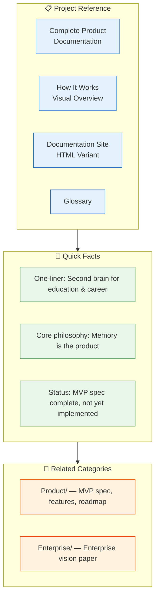

# Project

> **Purpose:** Project-level overview, vision, and reference documentation
> **Status:** Active
> **Owner:** Product Team
> **Last Updated:** 2026-07-13

## Overview

The Project directory provides the top-level project overview, vision, and reference documentation for Meridian. It is the starting point for anyone wanting to understand what Meridian is, its core philosophy, and where to find detailed documentation.

Key documents include the Complete Product Documentation, the How It Works visual overview, the Documentation Site HTML variant, and the glossary. Meridian's core philosophy is that memory is the product — chat, resumes, and job matches are views into one underlying memory system.

The project is fully specified at both MVP and Enterprise scope, with implementation yet to begin. Related product and enterprise documentation can be accessed through the links in this directory.



## What's here

| Document | Location | Status |
|----------|----------|--------|
| Complete Product Documentation | [`/Docs/Meridian-Complete-Documentation.md`](../../Docs/Meridian-Complete-Documentation.md) | ✅ Canonical |
| How It Works — Visual Overview | [`/Docs/Meridian-How-It-Works-Visual.md`](../../Docs/Meridian-How-It-Works-Visual.md) | ✅ Canonical |
| Documentation Site (HTML variant) | [`/Docs/Meridian-Documentation-Site.md`](../../Docs/Meridian-Documentation-Site.md) | ✅ Reference |
| Glossary | Extracted from Complete Documentation §17 | |

## Quick links

- **One-liner:** Meridian is a second brain for a person's education and career — it reads, organizes, remembers, and acts.
- **Core philosophy:** Memory is the product. Chat, resumes, job matches are views into one underlying memory.
- **Current status:** MVP scope fully specified; Enterprise scope fully specified; implementation not yet started.

## Goals

- Provide the top-level project overview and vision for anyone new to Meridian
- Index key reference documents (complete documentation, how-it-works, glossary)
- Communicate the core philosophy ("memory is the product") and current project status
- Direct readers to the right detailed documentation for their area of interest
- Serve as the landing page for the documentation tree

---

## Scope

### In Scope
- Project vision and one-liner description
- Core philosophy statement
- Document index (complete docs, how-it-works, glossary)
- Quick links to product, enterprise, architecture, and AI documentation
- Current project status

### Out of Scope
- Product feature details (covered in Product docs)
- Enterprise architecture (covered in Enterprise docs)
- Implementation specifics (covered in Engineering docs)
- Technical architecture (covered in Architecture docs)

---

## Examples

```bash
# Project setup
git clone https://github.com/meridian-ai/meridian
cd meridian
meridian project init
meridian dev

# Project management
meridian project status
meridian project validate
meridian project build
```

```bash
# Project lifecycle
meridian project archive old-workspace
meridian project restore old-workspace --target new-workspace
meridian project migrate --from ws_old --to ws_new
```

## Future Improvements

| Improvement | Priority | Complexity | Timeline |
|-------------|----------|------------|----------|
| Project health dashboard with milestone tracking | High | Medium | Q1 2027 |
| Automated project status reporting | Medium | Low | Q4 2026 |
| Stakeholder communication template library | Low | Low | Q4 2026 |

## Related categories

- [`Product/`](../Product/) — MVP spec, features, roadmap
- [`Enterprise/`](../Enterprise/) — Enterprise vision paper
- [`Architecture/`](../Architecture/) — System architecture
- [`AI/`](../AI/) — Agent system documentation

## Related Documents

- [Complete Documentation](../Meridian-Complete-Documentation.md) — Full product reference
- [Product Overview](../Product/README.md) — Product specifications and features
- [Enterprise Overview](../Enterprise/README.md) — Enterprise vision and architecture
