# Vaeloom Documentation

> **Purpose:** Master index and navigation hub for all Vaeloom documentation
> **Status:** ✅ Published
> **Owner:** Platform Team
> **Version:** 2.0
> **Last Updated:** 2026-07-17
> **Total Documents:** 256

## Documentation Taxonomy

```mermaid
graph TD
    classDef core fill:#e3f2fd,stroke:#1565c0
    classDef platform fill:#e8f5e9,stroke:#2e7d32
    classDef product fill:#fff3e0,stroke:#e65100
    classDef ops fill:#f3e5f5,stroke:#6a1b9a

    DOC["📚 Vaeloom Docs"] --> ARCH["Architecture"]
    DOC --> AI["AI / Agents"]
    DOC --> BACKEND["Backend"]
    DOC --> DB["Database"]
    DOC --> DEVOPS["DevOps"]
    DOC --> ENG["Engineering"]
    DOC --> ENT["Enterprise"]
    DOC --> FE["Frontend"]
    DOC --> OPS["Operations"]
    DOC --> PROD["Product"]
    DOC --> SEC["Security"]
    DOC --> TEST["Testing"]
    DOC --> API["API Reference"]
    DOC --> GUIDES["Guides"]
    DOC --> CONTRIB["Contributing"]

    class ARCH,AI,BACKEND,DB core
    class DEVOPS,ENG,ENT platform
    class FE,OPS,PROD product
    class SEC,TEST,API,GUIDES,CONTRIB ops
```

## Category Index

### 🏗️ Architecture
| # | Document | Description |
|---|----------|-------------|
| 1 | [System Design](./Architecture/System-Design.md) | High-level system architecture |
| 2 | [High Level Design](./Architecture/High-Level-Design.md) | HLD with component breakdown |
| 3 | [Low Level Design](./Architecture/Low-Level-Design.md) | LLD with detailed specifications |
| 4 | [Service Architecture](./Architecture/Service-Architecture.md) | Service decomposition |
| 5 | [Microservices](./Architecture/Microservices.md) | Microservices architecture |
| 6 | [C4 Architecture](./Architecture/C4-Architecture.md) | C4 model diagrams |
| 7 | [Event Architecture](./Architecture/Event-Architecture.md) | Event-driven architecture |
| 8 | [Event Flow](./Architecture/Event-Flow.md) | Event flow diagrams |
| 9 | [Data Flow](./Architecture/Data-Flow.md) | Data flow across services |
| 10 | [Caching](./Architecture/Caching.md) | Caching strategy |
| 11 | [Queue](./Architecture/Queue.md) | Message queue architecture |
| 12 | [Search](./Architecture/Search.md) | Search architecture |
| 13 | [Storage](./Architecture/Storage.md) | Storage strategy |
| 14 | [Scalability](./Architecture/Scalability.md) | Scaling strategy |
| 15 | [Performance](./Architecture/Performance.md) | Performance targets |
| 16 | [Disaster Recovery](./Architecture/Disaster-Recovery.md) | DR plan |
| 17 | [Infrastructure](./Architecture/Infrastructure.md) | Infrastructure overview |
| 18 | [ADRs](./Architecture/03-adrs.md) | Architecture Decision Records |

### 🤖 AI / Agents
| # | Document | Description |
|---|----------|-------------|
| 1 | [AI Agents](./AI/AI-Agents.md) | Agent architecture overview |
| 2 | [Memory](./AI/Memory.md) | Memory system design |
| 3 | [Knowledge Graph](./AI/Knowledge-Graph.md) | Knowledge graph architecture |
| 4 | [LLM Architecture](./AI/LLM-Architecture.md) | LLM integration |
| 5 | [RAG](./AI/RAG.md) | RAG pipeline |
| 6 | [Agentic RAG](./AI/Agentic-RAG.md) | Agentic retrieval |
| 7 | [MCP](./AI/MCP.md) | Model Context Protocol |
| 8 | [Tool Calling](./AI/Tool-Calling.md) | Tool execution |
| 9 | [Reasoning](./AI/Reasoning.md) | Reasoning patterns |
| 10 | [Guardrails](./AI/Guardrails.md) | Safety guardrails |
| 11 | [Safety](./AI/Safety.md) | AI safety |
| 12 | [Prompt Engineering](./AI/Prompt-Engineering.md) | Prompt design |
| 13 | [Prompt Standards](./AI/Prompt-Standards.md) | Prompt conventions |
| 14 | [Prompt Library](./AI/Prompt-Library.md) | Prompt templates |
| 15 | [Agent Prompt Specs](./AI/Agent-Prompt-Specs.md) | Agent prompt specifications |
| 16 | [Evaluation](./AI/Evaluation.md) | AI evaluation framework |
| 17 | [Eval Datasets](./AI/Eval-Datasets.md) | Evaluation datasets |
| 18 | [Model Routing](./AI/Model-Routing.md) | Model routing logic |
| 19 | [Model Benchmarking](./AI/Model-Benchmarking.md) | Model benchmarks |
| 20 | [Inference Pipeline](./AI/Inference-Pipeline.md) | Inference pipeline |
| 21 | [AI Cost Strategy](./AI/AI-Cost-Strategy.md) | Cost optimization |
| 22 | [AI Versioning](./AI/AI-Versioning.md) | Versioning strategy |
| 23 | [Embeddings](./AI/Embeddings.md) | Embedding strategy |

### ⚙️ Backend
| # | Document | Description |
|---|----------|-------------|
| 1 | [Backend Architecture](./Backend/Backend-Architecture.md) | Backend overview |
| 2 | [API Architecture](./Backend/API-Architecture.md) | API design |
| 3 | [API Reference](./Backend/API-Reference.md) | API endpoint reference |
| 4 | [API Versioning](./Backend/API-Versioning.md) | Versioning strategy |
| 5 | [REST Standards](./Backend/REST-Standards.md) | REST conventions |
| 6 | [GraphQL](./Backend/GraphQL.md) | GraphQL integration |
| 7 | [Authentication](./Backend/Authentication.md) | Auth patterns |
| 8 | [Authorization](./Backend/Authorization.md) | Authorization model |
| 9 | [RBAC](./Backend/RBAC.md) | Role-based access control |
| 10 | [ABAC](./Backend/ABAC.md) | Attribute-based access control |
| 11 | [Validation](./Backend/Validation.md) | Input validation |
| 12 | [Error Standards](./Backend/Error-Standards.md) | Error handling |
| 13 | [Service Contracts](./Backend/Service-Contracts.md) | Service interfaces |
| 14 | [Module Specs](./Backend/Module-Specs.md) | Module specifications |
| 15 | [Event Catalog](./Backend/Event-Catalog.md) | Event definitions |
| 16 | [Business Logic](./Backend/Business-Logic.md) | Business logic patterns |
| 17 | [Connectors](./Backend/Connectors.md) | Connector architecture |
| 18 | [Workers](./Backend/Workers.md) | Background workers |
| 19 | [Cron Jobs](./Backend/Cron-Jobs.md) | Scheduled tasks |
| 20 | [Rate Limiting](./Backend/Rate-Limiting.md) | Rate limiting |
| 21 | [Queue](./Backend/Queue.md) | Queue management |

### 🗄️ Database
| # | Document | Description |
|---|----------|-------------|
| 1 | [Database Design](./Database/Database-Design.md) | Database architecture |
| 2 | [Schema](./Database/Schema.md) | Schema definitions |
| 3 | [ER Diagram](./Database/ER-Diagram.md) | Entity-relationship model |
| 4 | [Data Dictionary](./Database/Data-Dictionary.md) | Data definitions |
| 5 | [Indexes](./Database/Indexes.md) | Index strategy |
| 6 | [Migrations](./Database/Migrations.md) | Migration strategy |
| 7 | [Backups](./Database/Backups.md) | Backup strategy |
| 8 | [Replication](./Database/Replication.md) | Replication setup |
| 9 | [Partitioning](./Database/Partitioning.md) | Partitioning strategy |
| 10 | [Optimization](./Database/Optimization.md) | Query optimization |

### 🚀 DevOps
| # | Document | Description |
|---|----------|-------------|
| 1 | [CI/CD](./DevOps/CI-CD.md) | Pipeline architecture |
| 2 | [Docker](./DevOps/Docker.md) | Containerization |
| 3 | [Kubernetes](./DevOps/Kubernetes.md) | K8s deployment |
| 4 | [Terraform](./DevOps/Terraform.md) | IaC configuration |
| 5 | [Monitoring](./DevOps/Monitoring.md) | Monitoring setup |
| 6 | [Alerting](./DevOps/Alerting.md) | Alert configuration |
| 7 | [Logging](./DevOps/Logging.md) | Logging infrastructure |
| 8 | [Tracing](./DevOps/Tracing.md) | Distributed tracing |
| 9 | [Configuration Management](./DevOps/Configuration-Management.md) | Config management |
| 10 | [Deployment](./DevOps/Deployment.md) | Deployment strategy |
| 11 | [Container Signing](./DevOps/Container-Signing.md) | Container security |
| 12 | [SBOM Policy](./DevOps/SBOM-Policy.md) | SBOM compliance |

### 📐 Engineering
| # | Document | Description |
|---|----------|-------------|
| 1 | [Coding Standards](./Engineering/Coding-Standards.md) | Code style guide |
| 2 | [Naming Convention](./Engineering/Naming-Convention.md) | Naming rules |
| 3 | [Branch Strategy](./Engineering/Branch-Strategy.md) | Git branching |
| 4 | [Git Workflow](./Engineering/Git-Workflow.md) | Git process |
| 5 | [Commit Convention](./Engineering/Commit-Convention.md) | Commit standards |
| 6 | [Code Review](./Engineering/Code-Review.md) | Review process |
| 7 | [PR Guidelines](./Engineering/PR-Guidelines.md) | PR standards |
| 8 | [Release Process](./Engineering/Release-Process.md) | Release management |
| 9 | [Versioning](./Engineering/Versioning.md) | Version strategy |
| 10 | [Folder Structure](./Engineering/Folder-Structure.md) | Repository layout |
| 11 | [TEMPLATE.md](./TEMPLATE.md) | Document template |

### 🏢 Enterprise
| # | Document | Description |
|---|----------|-------------|
| 1 | [Enterprise Architecture](./Enterprise/Enterprise-Architecture.md) | Enterprise design |
| 2 | [Multi-Tenancy](./Enterprise/Multi-Tenancy.md) | Tenant isolation |
| 3 | [Organizations](./Enterprise/Organizations.md) | Org structure |
| 4 | [Admin Portal](./Enterprise/Admin-Portal.md) | Admin UI |
| 5 | [Billing](./Enterprise/Billing.md) | Billing system |
| 6 | [Licensing](./Enterprise/Licensing.md) | License management |
| 7 | [Feature Flags](./Enterprise/Feature-Flags.md) | Feature toggles |
| 8 | [Enterprise APIs](./Enterprise/Enterprise-APIs.md) | Enterprise API specs |
| 9 | [Plugin Marketplace](./Enterprise/Plugin-Marketplace.md) | Plugin ecosystem |

### 🎨 Frontend
| # | Document | Description |
|---|----------|-------------|
| 1 | [Frontend Architecture](./Frontend/Frontend-Architecture.md) | Frontend overview |
| 2 | [UI Architecture](./Frontend/UI-Architecture.md) | UI structure |
| 3 | [Component Library](./Frontend/Component-Library.md) | Component catalog |
| 4 | [Design System](./Frontend/Design-System.md) | Design tokens |
| 5 | [Theme System](./Frontend/Theme-System.md) | Theming |
| 6 | [State Management](./Frontend/State-Management.md) | State patterns |
| 7 | [Navigation](./Frontend/Navigation.md) | Navigation system |
| 8 | [Responsive Design](./Frontend/Responsive-Design.md) | Responsive strategy |
| 9 | [Accessibility](./Frontend/Accessibility.md) | WCAG compliance |
| 10 | [Animation System](./Frontend/Animation-System.md) | Motion design |
| 11 | [UX Guidelines](./Frontend/UX-Guidelines.md) | UX principles |
| 12 | [Dashboard](./Frontend/Dashboard.md) | Dashboard spec |
| 13 | [Forms](./Frontend/Forms.md) | Form patterns |
| 14 | [Charts](./Frontend/Charts.md) | Chart components |
| 15 | [Mobile Architecture](./Frontend/Mobile-Architecture.md) | React Native |
| 16 | [Internationalization](./Frontend/Internationalization.md) | i18n strategy |

### 🔧 Operations
| # | Document | Description |
|---|----------|-------------|
| 1 | [Operations Runbook](./Operations/01-operations-runbook.md) | Operations guide |
| 2 | [Incident Response](./Operations/02-incident-response.md) | Incident management |
| 3 | [SLA](./Operations/SLA.md) | Service level agreements |
| 4 | [SLI](./Operations/SLI.md) | Service level indicators |
| 5 | [SLO](./Operations/SLO.md) | Service level objectives |
| 6 | [SRE](./Operations/SRE.md) | Site reliability engineering |
| 7 | [Observability](./Operations/Observability.md) | Observability stack |
| 8 | [Business Continuity](./Operations/Business-Continuity-Plan.md) | BC/DR plan |
| 9 | [Capacity Planning](./Operations/Capacity-Planning.md) | Capacity management |
| 10 | [Cost Optimization](./Operations/Cost-Optimization.md) | Cost management |
| 11 | [Rollback Strategy](./Operations/Rollback-Strategy.md) | Rollback procedures |
| 12 | [Support](./Operations/Support.md) | Support model |
| 13 | [Vendor Risk](./Operations/Vendor-Risk-Assessment.md) | Vendor assessment |
| 14 | [Maintenance](./Operations/Maintenance.md) | Maintenance schedules |

### 📈 Product
| # | Document | Description |
|---|----------|-------------|
| 1 | [Vision](./Product/Vision.md) | Product vision |
| 2 | [Mission](./Product/Mission.md) | Company mission |
| 3 | [PRD](./Product/PRD.md) | Product requirements |
| 4 | [MVP Spec](./01-Vaeloom-MVP-Spec.md) | MVP specification |
| 5 | [Business Requirements](./Product/Business-Requirements.md) | Business needs |
| 6 | [Functional Requirements](./Product/Functional-Requirements.md) | Functional specs |
| 7 | [Non-Functional Requirements](./Product/Non-Functional-Requirements.md) | NFRs |
| 8 | [Features](./Product/Features.md) | Feature catalog |
| 9 | [User Stories](./Product/User-Stories.md) | User stories |
| 10 | [User Personas](./Product/User-Personas.md) | User profiles |
| 11 | [User Journey](./Product/User-Journey.md) | Journey maps |
| 12 | [User Research](./Product/User-Research.md) | Research findings |
| 13 | [Product Strategy](./Product/Product-Strategy.md) | Strategy document |
| 14 | [Roadmap](./Product/Roadmap.md) | Product roadmap |
| 15 | [Goals](./Product/Goals.md) | Product goals |
| 16 | [KPIs](./Product/KPIs.md) | Key performance indicators |
| 17 | [Success Metrics](./Product/Success-Metrics.md) | Success measures |
| 18 | [Competitive Analysis](./Product/Competitive-Analysis.md) | Competitive landscape |
| 19 | [Pricing](./Product/Pricing.md) | Pricing model |
| 20 | [Business Model](./Product/Business-Model.md) | Business model |
| 21 | [FAQ](./Product/FAQ.md) | Frequently asked questions |
| 22 | [Problem](./Product/Problem.md) | Problem statement |

### 🔒 Security
| # | Document | Description |
|---|----------|-------------|
| 1 | [Security Architecture](./Security/Security-Architecture.md) | Security overview |
| 2 | [Threat Model](./Security/Threat-Model.md) | Threat analysis |
| 3 | [OWASP](./Security/OWASP.md) | OWASP compliance |
| 4 | [IAM](./Security/IAM.md) | Identity & access |
| 5 | [Encryption](./Security/Encryption.md) | Encryption strategy |
| 6 | [Secrets](./Security/Secrets.md) | Secrets management |
| 7 | [Privacy](./Security/Privacy.md) | Privacy policy |
| 8 | [GDPR](./Security/GDPR.md) | GDPR compliance |
| 9 | [SOC2](./Security/SOC2.md) | SOC 2 compliance |
| 10 | [Compliance](./Security/Compliance.md) | Compliance overview |
| 11 | [Audit Policy](./Security/Audit-Policy.md) | Audit framework |
| 12 | [Audit Logs](./Security/Audit-Logs.md) | Audit logging |
| 13 | [Data Retention](./Security/Data-Retention-Policy.md) | Data retention |
| 14 | [Penetration Test](./Security/Penetration-Test-Procedure.md) | Pentest procedures |

### 🧪 Testing
| # | Document | Description |
|---|----------|-------------|
| 1 | [Testing Strategy](./Testing/Testing-Strategy.md) | Testing overview |
| 2 | [Unit Testing](./Testing/Unit-Testing.md) | Unit test patterns |
| 3 | [Integration Testing](./Testing/Integration-Testing.md) | Integration tests |
| 4 | [E2E Testing](./Testing/E2E-Testing.md) | End-to-end tests |
| 5 | [Performance Testing](./Testing/Performance-Testing.md) | Performance tests |
| 6 | [Load Testing](./Testing/Load-Testing.md) | Load tests |
| 7 | [Security Testing](./Testing/Security-Testing.md) | Security tests |
| 8 | [Regression Testing](./Testing/Regression-Testing.md) | Regression tests |
| 9 | [Chaos Testing](./Testing/Chaos-Testing.md) | Chaos engineering |
| 10 | [Coverage](./Testing/Coverage.md) | Coverage targets |
| 11 | [AI Testing](./Testing/AI-Testing.md) | AI evaluation |
| 12 | [Prompt Testing](./Testing/Prompt-Testing.md) | Prompt testing |

### 📡 API Reference
| # | Document | Description |
|---|----------|-------------|
| 1 | [SDK Documentation](./SDK-Documentation.md) | SDK overview |
| 2 | [Integration Guide](./Integration-Guide.md) | Integration docs |
| 3 | See also: [API Architecture](./Backend/API-Architecture.md) | |
| 4 | See also: [API Reference](./Backend/API-Reference.md) | |

### 📖 Guides
| # | Document | Description |
|---|----------|-------------|
| 1 | [Developer Guide](./Developer_Experience/Developer-Guide.md) | Developer setup |
| 2 | [Setup Guide](./Developer_Experience/Setup.md) | Environment setup |
| 3 | [Architecture Walkthrough](./Developer_Experience/Architecture-Walkthrough.md) | Codebase tour |
| 4 | [API Examples](./Developer_Experience/API-Examples.md) | API usage examples |
| 5 | [CLI Reference](./Developer_Experience/CLI.md) | CLI commands |
| 6 | [Debugging](./Developer_Experience/Debugging.md) | Debug guide |
| 7 | [Scripts](./Developer_Experience/Scripts.md) | Automation scripts |
| 8 | [How It Works](./Vaeloom-How-It-Works-Visual.md) | Visual overview |
| 9 | [Enterprise Paper](./Vaeloom-Enterprise-Paper.md) | Enterprise whitepaper |

### 🤝 Contributing
| # | Document | Description |
|---|----------|-------------|
| 1 | [Contributing](./Contributing/README.md) | Contribution guide |
| 2 | [Environment Setup](./Developer_Experience/Environment.md) | Environment config |

## Quick Navigation

| I want to... | Start here |
|---|---|
| Understand the overall architecture | [System Design](./Architecture/System-Design.md) |
| Learn about AI agents | [AI Agents](./AI/AI-Agents.md) + [Memory](./AI/Memory.md) |
| Set up my dev environment | [Developer Guide](./Developer_Experience/Developer-Guide.md) |
| Review API endpoints | [API Reference](./Backend/API-Reference.md) |
| Deploy the platform | [Deployment](./DevOps/Deployment.md) |
| Review security posture | [Security Architecture](./Security/Security-Architecture.md) |
| Understand the product vision | [Vision](./Product/Vision.md) + [PRD](./Product/PRD.md) |
| Start contributing code | [Contributing](./Contributing/README.md) |

---

## Document Lifecycle

| Status | Meaning |
|---|---|
| 🆕 New | Initial draft, under review |
| ✅ Upgraded | Reviewed, approved, enterprise quality |
| 🔄 Needs Update | Content is stale, needs refresh |
| 🗄️ Deprecated | Superseded, kept for reference |

---

*Last generated: 2026-07-17 | Total documents: 256*

## Unindexed Documents

- [00-DOCUMENTATION-COMPLETION-REPORT](./00-DOCUMENTATION-COMPLETION-REPORT.md)
- [00-GAP-ANALYSIS-REPORT](./00-GAP-ANALYSIS-REPORT.md)
- [02-system-architecture](./02-system-architecture.md)
- [03-agent-workflow](./03-agent-workflow.md)
- [04-memory-knowledge-graph](./04-memory-knowledge-graph.md)
- [05-Vaeloom-MVP-Spec](./05-Vaeloom-MVP-Spec.md)
- [06-Vaeloom-Enterprise-Paper](./06-Vaeloom-Enterprise-Paper.md)
- [Admin](./Admin.md)
- [Analytics](./Analytics.md)
- [AUDIT-REPORT](./AUDIT-REPORT.md)
- [DOCUMENTATION-MAP](./DOCUMENTATION-MAP.md)
- [USAGE-GUIDE](./USAGE-GUIDE.md)
- [Vaeloom-Complete-Documentation](./Vaeloom-Complete-Documentation.md)
- [Vaeloom-Documentation-Site](./Vaeloom-Documentation-Site.md)
- [AI\Agent-Prompt-Specs](./AI\Agent-Prompt-Specs.md)
- [AI\Agentic-RAG](./AI\Agentic-RAG.md)
- [AI\AI-Agents](./AI\AI-Agents.md)
- [AI\AI-Cost-Strategy](./AI\AI-Cost-Strategy.md)
- [AI\AI-Versioning](./AI\AI-Versioning.md)
- [AI\Embeddings](./AI\Embeddings.md)
- [AI\Eval-Datasets](./AI\Eval-Datasets.md)
- [AI\Evaluation](./AI\Evaluation.md)
- [AI\Guardrails](./AI\Guardrails.md)
- [AI\Inference-Pipeline](./AI\Inference-Pipeline.md)
- [AI\Knowledge-Graph](./AI\Knowledge-Graph.md)
- [AI\LLM-Architecture](./AI\LLM-Architecture.md)
- [AI\MCP](./AI\MCP.md)
- [AI\Memory](./AI\Memory.md)
- [AI\Model-Benchmarking](./AI\Model-Benchmarking.md)
- [AI\Model-Routing](./AI\Model-Routing.md)
- [AI\Prompt-Engineering](./AI\Prompt-Engineering.md)
- [AI\Prompt-Library](./AI\Prompt-Library.md)
- [AI\Prompt-Standards](./AI\Prompt-Standards.md)
- [AI\RAG](./AI\RAG.md)
- [AI\README](./AI\README.md)
- [AI\Reasoning](./AI\Reasoning.md)
- [AI\Safety](./AI\Safety.md)
- [AI\Tool-Calling](./AI\Tool-Calling.md)
- [API\README](./API\README.md)
- [Architecture\03-adrs](./Architecture\03-adrs.md)
- [Architecture\C4-Architecture](./Architecture\C4-Architecture.md)
- [Architecture\Caching](./Architecture\Caching.md)
- [Architecture\Data-Flow](./Architecture\Data-Flow.md)
- [Architecture\Disaster-Recovery](./Architecture\Disaster-Recovery.md)
- [Architecture\Event-Architecture](./Architecture\Event-Architecture.md)
- [Architecture\Event-Flow](./Architecture\Event-Flow.md)
- [Architecture\High-Level-Design](./Architecture\High-Level-Design.md)
- [Architecture\Infrastructure](./Architecture\Infrastructure.md)
- [Architecture\Low-Level-Design](./Architecture\Low-Level-Design.md)
- [Architecture\Microservices](./Architecture\Microservices.md)
- [Architecture\Performance](./Architecture\Performance.md)
- [Architecture\Queue](./Architecture\Queue.md)
- [Architecture\README](./Architecture\README.md)
- [Architecture\Scalability](./Architecture\Scalability.md)
- [Architecture\Search](./Architecture\Search.md)
- [Architecture\Service-Architecture](./Architecture\Service-Architecture.md)
- [Architecture\Storage](./Architecture\Storage.md)
- [Architecture\System-Design](./Architecture\System-Design.md)
- [Backend\ABAC](./Backend\ABAC.md)
- [Backend\API-Architecture](./Backend\API-Architecture.md)
- [Backend\API-Reference](./Backend\API-Reference.md)
- [Backend\API-Versioning](./Backend\API-Versioning.md)
- [Backend\Authentication](./Backend\Authentication.md)
- [Backend\Authorization](./Backend\Authorization.md)
- [Backend\Backend-Architecture](./Backend\Backend-Architecture.md)
- [Backend\Business-Logic](./Backend\Business-Logic.md)
- [Backend\Connectors](./Backend\Connectors.md)
- [Backend\Cron-Jobs](./Backend\Cron-Jobs.md)
- [Backend\Error-Standards](./Backend\Error-Standards.md)
- [Backend\Event-Catalog](./Backend\Event-Catalog.md)
- [Backend\GraphQL](./Backend\GraphQL.md)
- [Backend\Module-Specs](./Backend\Module-Specs.md)
- [Backend\Queue](./Backend\Queue.md)
- [Backend\Rate-Limiting](./Backend\Rate-Limiting.md)
- [Backend\RBAC](./Backend\RBAC.md)
- [Backend\README](./Backend\README.md)
- [Backend\REST-Standards](./Backend\REST-Standards.md)
- [Backend\Service-Contracts](./Backend\Service-Contracts.md)
- [Backend\Validation](./Backend\Validation.md)
- [Backend\Workers](./Backend\Workers.md)
- [Build_Prompts\README](./Build_Prompts\README.md)
- [Contributing\README](./Contributing\README.md)
- [Database\Backups](./Database\Backups.md)
- [Database\Data-Dictionary](./Database\Data-Dictionary.md)
- [Database\Database-Design](./Database\Database-Design.md)
- [Database\ER-Diagram](./Database\ER-Diagram.md)
- [Database\Indexes](./Database\Indexes.md)
- [Database\Migrations](./Database\Migrations.md)
- [Database\Optimization](./Database\Optimization.md)
- [Database\Partitioning](./Database\Partitioning.md)
- [Database\README](./Database\README.md)
- [Database\Replication](./Database\Replication.md)
- [Database\Schema](./Database\Schema.md)
- [Developer_Experience\API-Examples](./Developer_Experience\API-Examples.md)
- [Developer_Experience\Architecture-Walkthrough](./Developer_Experience\Architecture-Walkthrough.md)
- [Developer_Experience\CLI](./Developer_Experience\CLI.md)
- [Developer_Experience\Contributing](./Developer_Experience\Contributing.md)
- [Developer_Experience\Debugging](./Developer_Experience\Debugging.md)
- [Developer_Experience\Developer-Guide](./Developer_Experience\Developer-Guide.md)
- [Developer_Experience\Environment](./Developer_Experience\Environment.md)
- [Developer_Experience\Scripts](./Developer_Experience\Scripts.md)
- [Developer_Experience\Setup](./Developer_Experience\Setup.md)
- [DevOps\Alerting](./DevOps\Alerting.md)
- [DevOps\CI-CD](./DevOps\CI-CD.md)
- [DevOps\Configuration-Management](./DevOps\Configuration-Management.md)
- [DevOps\Container-Signing](./DevOps\Container-Signing.md)
- [DevOps\Deployment](./DevOps\Deployment.md)
- [DevOps\Docker](./DevOps\Docker.md)
- [DevOps\Kubernetes](./DevOps\Kubernetes.md)
- [DevOps\Logging](./DevOps\Logging.md)
- [DevOps\Monitoring](./DevOps\Monitoring.md)
- [DevOps\README](./DevOps\README.md)
- [DevOps\SBOM-Policy](./DevOps\SBOM-Policy.md)
- [DevOps\Terraform](./DevOps\Terraform.md)
- [DevOps\Tracing](./DevOps\Tracing.md)
- [Engineering\Branch-Strategy](./Engineering\Branch-Strategy.md)
- [Engineering\Code-Review](./Engineering\Code-Review.md)
- [Engineering\Coding-Standards](./Engineering\Coding-Standards.md)
- [Engineering\Commit-Convention](./Engineering\Commit-Convention.md)
- [Engineering\Folder-Structure](./Engineering\Folder-Structure.md)
- [Engineering\Git-Workflow](./Engineering\Git-Workflow.md)
- [Engineering\Naming-Convention](./Engineering\Naming-Convention.md)
- [Engineering\PR-Guidelines](./Engineering\PR-Guidelines.md)
- [Engineering\README](./Engineering\README.md)
- [Engineering\Release-Process](./Engineering\Release-Process.md)
- [Engineering\Versioning](./Engineering\Versioning.md)
- [Engineering\Implementation\00-master-build-order](./Engineering\Implementation\00-master-build-order.md)
- [Engineering\Implementation\01-foundation-infra](./Engineering\Implementation\01-foundation-infra.md)
- [Engineering\Implementation\02-database-schema](./Engineering\Implementation\02-database-schema.md)
- [Engineering\Implementation\03-ingestion-pipeline](./Engineering\Implementation\03-ingestion-pipeline.md)
- [Engineering\Implementation\04-memory-system](./Engineering\Implementation\04-memory-system.md)
- [Engineering\Implementation\05-agent-harness-orchestration](./Engineering\Implementation\05-agent-harness-orchestration.md)
- [Engineering\Implementation\06-rag-retrieval](./Engineering\Implementation\06-rag-retrieval.md)
- [Engineering\Implementation\07-mcp-tool-ecosystem](./Engineering\Implementation\07-mcp-tool-ecosystem.md)
- [Engineering\Implementation\08-specialist-agents](./Engineering\Implementation\08-specialist-agents.md)
- [Engineering\Implementation\09-ai-gateway-model-routing](./Engineering\Implementation\09-ai-gateway-model-routing.md)
- [Engineering\Implementation\10-evaluation-framework](./Engineering\Implementation\10-evaluation-framework.md)
- [Engineering\Implementation\11-guardrails-safety](./Engineering\Implementation\11-guardrails-safety.md)
- [Engineering\Implementation\12-observability-tracing](./Engineering\Implementation\12-observability-tracing.md)
- [Engineering\Implementation\13-api-backend](./Engineering\Implementation\13-api-backend.md)
- [Engineering\Implementation\14-frontend-workspace](./Engineering\Implementation\14-frontend-workspace.md)
- [Engineering\Implementation\15-security-compliance](./Engineering\Implementation\15-security-compliance.md)
- [Engineering\Implementation\16-deployment-infrastructure](./Engineering\Implementation\16-deployment-infrastructure.md)
- [Engineering\Implementation\17-agent-orchestration-at-scale](./Engineering\Implementation\17-agent-orchestration-at-scale.md)
- [Enterprise\Admin-Portal](./Enterprise\Admin-Portal.md)
- [Enterprise\Billing](./Enterprise\Billing.md)
- [Enterprise\Enterprise-APIs](./Enterprise\Enterprise-APIs.md)
- [Enterprise\Enterprise-Architecture](./Enterprise\Enterprise-Architecture.md)
- [Enterprise\Feature-Flags](./Enterprise\Feature-Flags.md)
- [Enterprise\Licensing](./Enterprise\Licensing.md)
- [Enterprise\Multi-Tenancy](./Enterprise\Multi-Tenancy.md)
- [Enterprise\Organizations](./Enterprise\Organizations.md)
- [Enterprise\Plugin-Marketplace](./Enterprise\Plugin-Marketplace.md)
- [Enterprise\README](./Enterprise\README.md)
- [Frontend\Accessibility-Audit](./Frontend\Accessibility-Audit.md)
- [Frontend\Accessibility](./Frontend\Accessibility.md)
- [Frontend\Animation-System](./Frontend\Animation-System.md)
- [Frontend\Charts](./Frontend\Charts.md)
- [Frontend\Component-Library](./Frontend\Component-Library.md)
- [Frontend\Dashboard](./Frontend\Dashboard.md)
- [Frontend\Design-System](./Frontend\Design-System.md)
- [Frontend\Forms](./Frontend\Forms.md)
- [Frontend\Frontend-Architecture](./Frontend\Frontend-Architecture.md)
- [Frontend\Internationalization](./Frontend\Internationalization.md)
- [Frontend\Mobile-Architecture](./Frontend\Mobile-Architecture.md)
- [Frontend\Navigation](./Frontend\Navigation.md)
- [Frontend\Responsive-Design](./Frontend\Responsive-Design.md)
- [Frontend\State-Management](./Frontend\State-Management.md)
- [Frontend\Theme-System](./Frontend\Theme-System.md)
- [Frontend\UI-Architecture](./Frontend\UI-Architecture.md)
- [Frontend\UX-Guidelines](./Frontend\UX-Guidelines.md)
- [Guides\README](./Guides\README.md)
- [Operations\01-operations-runbook](./Operations\01-operations-runbook.md)
- [Operations\02-incident-response](./Operations\02-incident-response.md)
- [Operations\Business-Continuity-Plan](./Operations\Business-Continuity-Plan.md)
- [Operations\Capacity-Planning](./Operations\Capacity-Planning.md)
- [Operations\Cost-Optimization](./Operations\Cost-Optimization.md)
- [Operations\Maintenance](./Operations\Maintenance.md)
- [Operations\Observability](./Operations\Observability.md)
- [Operations\README](./Operations\README.md)
- [Operations\Rollback-Strategy](./Operations\Rollback-Strategy.md)
- [Operations\SLA](./Operations\SLA.md)
- [Operations\SLI](./Operations\SLI.md)
- [Operations\SLO](./Operations\SLO.md)
- [Operations\SRE](./Operations\SRE.md)
- [Operations\Support](./Operations\Support.md)
- [Operations\Vendor-Risk-Assessment](./Operations\Vendor-Risk-Assessment.md)
- [Operations\Runbooks\AI-Service-Outage](./Operations\Runbooks\AI-Service-Outage.md)
- [Operations\Runbooks\Cache-Failure](./Operations\Runbooks\Cache-Failure.md)
- [Operations\Runbooks\DB-Failover](./Operations\Runbooks\DB-Failover.md)
- [Product\Business-Model](./Product\Business-Model.md)
- [Product\Business-Requirements](./Product\Business-Requirements.md)
- [Product\Competitive-Analysis](./Product\Competitive-Analysis.md)
- [Product\FAQ](./Product\FAQ.md)
- [Product\Features](./Product\Features.md)
- [Product\Functional-Requirements](./Product\Functional-Requirements.md)
- [Product\Goals](./Product\Goals.md)
- [Product\KPIs](./Product\KPIs.md)
- [Product\Mission](./Product\Mission.md)
- [Product\Non-Functional-Requirements](./Product\Non-Functional-Requirements.md)
- [Product\PRD](./Product\PRD.md)
- [Product\Pricing](./Product\Pricing.md)
- [Product\Problem](./Product\Problem.md)
- [Product\Product-Strategy](./Product\Product-Strategy.md)
- [Product\README](./Product\README.md)
- [Product\Roadmap](./Product\Roadmap.md)
- [Product\Success-Metrics](./Product\Success-Metrics.md)
- [Product\User-Journey](./Product\User-Journey.md)
- [Product\User-Personas](./Product\User-Personas.md)
- [Product\User-Research](./Product\User-Research.md)
- [Product\User-Stories](./Product\User-Stories.md)
- [Product\Vision](./Product\Vision.md)
- [Product\Feature-Specs\ATS-Scoring](./Product\Feature-Specs\ATS-Scoring.md)
- [Product\Feature-Specs\Auto-Organization](./Product\Feature-Specs\Auto-Organization.md)
- [Product\Feature-Specs\Chat](./Product\Feature-Specs\Chat.md)
- [Product\Feature-Specs\Dashboard](./Product\Feature-Specs\Dashboard.md)
- [Product\Feature-Specs\Deadline-Detection](./Product\Feature-Specs\Deadline-Detection.md)
- [Product\Feature-Specs\Document-Viewer](./Product\Feature-Specs\Document-Viewer.md)
- [Product\Feature-Specs\Global-Search](./Product\Feature-Specs\Global-Search.md)
- [Product\Feature-Specs\Gmail-Digest](./Product\Feature-Specs\Gmail-Digest.md)
- [Product\Feature-Specs\Job-Search](./Product\Feature-Specs\Job-Search.md)
- [Product\Feature-Specs\Learning-Roadmap](./Product\Feature-Specs\Learning-Roadmap.md)
- [Product\Feature-Specs\Master-Resume](./Product\Feature-Specs\Master-Resume.md)
- [Product\Feature-Specs\Memory-Graph](./Product\Feature-Specs\Memory-Graph.md)
- [Product\Feature-Specs\Tailored-Applications](./Product\Feature-Specs\Tailored-Applications.md)
- [Project\README](./Project\README.md)
- [Security\Audit-Logs](./Security\Audit-Logs.md)
- [Security\Audit-Policy](./Security\Audit-Policy.md)
- [Security\Compliance](./Security\Compliance.md)
- [Security\Data-Retention-Policy](./Security\Data-Retention-Policy.md)
- [Security\Encryption](./Security\Encryption.md)
- [Security\GDPR](./Security\GDPR.md)
- [Security\IAM](./Security\IAM.md)
- [Security\OWASP](./Security\OWASP.md)
- [Security\Penetration-Test-Procedure](./Security\Penetration-Test-Procedure.md)
- [Security\Privacy](./Security\Privacy.md)
- [Security\README](./Security\README.md)
- [Security\Secrets](./Security\Secrets.md)
- [Security\Security-Architecture](./Security\Security-Architecture.md)
- [Security\SOC2](./Security\SOC2.md)
- [Security\Threat-Model](./Security\Threat-Model.md)
- [Testing\AI-Testing](./Testing\AI-Testing.md)
- [Testing\Chaos-Testing](./Testing\Chaos-Testing.md)
- [Testing\Coverage](./Testing\Coverage.md)
- [Testing\E2E-Testing](./Testing\E2E-Testing.md)
- [Testing\Integration-Testing](./Testing\Integration-Testing.md)
- [Testing\Load-Testing](./Testing\Load-Testing.md)
- [Testing\Performance-Testing](./Testing\Performance-Testing.md)
- [Testing\Prompt-Testing](./Testing\Prompt-Testing.md)
- [Testing\README](./Testing\README.md)
- [Testing\Regression-Testing](./Testing\Regression-Testing.md)
- [Testing\Security-Testing](./Testing\Security-Testing.md)
- [Testing\Testing-Strategy](./Testing\Testing-Strategy.md)
- [Testing\Unit-Testing](./Testing\Unit-Testing.md)
