# Vaeloom — Documentation Index

| Metadata         | Value                                                                |
|------------------|----------------------------------------------------------------------|
| **Purpose**      | Root index of the complete Vaeloom documentation system |
| **Status**       | Enterprise-grade — complete |
| **Owner**        | Documentation Team |
| **Last Updated** | 2026-07-13 |

> **Status:** Enterprise-grade documentation system — complete
> **Total documents:** ~214 | **Last updated:** 2026-07-13
> **Legacy references:** [`/Docs/`](../Docs/) · [`/Documents/`](../Documents/) (archived)

---

## Overview

Vaeloom is a second brain for a person's education and career: it ingests documents, code, and communications; builds a continuously updated, structured memory; and runs specialized, permission-scoped agents on top of that memory to organize files, maintain a resume, search for and apply to jobs, and track deadlines.

This index is the single entry point into the complete documentation system — 214 files across 16 categories covering product, architecture, engineering, AI, security, operations, and more.

## Goals

- Provide a single entry point to all Vaeloom documentation
- Enable developers, product managers, and enterprise stakeholders to quickly find relevant docs
- Maintain clear navigation and cross-referencing between related documents
- Document the MVP product scope, system architecture, agent workflows, and memory system

## Scope

### In Scope
- Root-level documentation index and cross-reference
- MVP spec, architecture, agent workflow, and memory/knowledge graph docs
- API reference, backend service docs, and architecture ADRs
- Enterprise paper and documentation site structure

### Out of Scope
- Detailed implementation guides (in Backend/)
- Code-level API documentation (auto-generated from code)
- User-facing product documentation (separate product site)
- Third-party integration documentation

```mermaid
graph TD
    subgraph Product["📋 Product (16 docs)"]
        PRD["MVP Spec, Features, Strategy<br/>Roadmap, Personas, Pricing, FAQ"]
    end
    subgraph Architecture["🏗️ Architecture (16 docs)"]
        ARCH["System Design, HLD, LLD, Events<br/>Microservices, Scalability, Caching, DR"]
    end
    subgraph AI["🧠 AI (18 docs)"]
        AI_D["LLM, Agents, Memory, KG, RAG<br/>Agentic RAG, Prompts, Guardrails"]
    end
    subgraph Frontend["🎨 Frontend (14 docs)"]
        FE["Architecture, Design System, Components<br/>Accessibility, Animation, Theme"]
    end
    subgraph Backend["⚙️ Backend (12 docs)"]
        BE["API, REST, Auth, RBAC, ABAC<br/>Validation, Workers, Cron, Rate Limiting"]
    end
    subgraph Database["🗄️ Database (9 docs)"]
        DB["Schema, ERD, Indexes, Migrations<br/>Partitioning, Replication, Backups"]
    end
    subgraph Security["🔒 Security (11 docs)"]
        SEC["Threat Model, IAM, Encryption<br/>Secrets, OWASP, GDPR, Compliance"]
    end
    subgraph DevOps["🛠️ DevOps (10 docs)"]
        DO["CI/CD, Docker, K8s, Terraform<br/>Monitoring, Logging, Tracing, Alerting"]
    end
    subgraph Testing["✅ Testing (12 docs)"]
        TEST["Strategy, Unit, Integration, E2E<br/>Load, AI, Prompt, Security, Coverage"]
    end
    subgraph Engineering["📐 Engineering (10 docs)"]
        ENG["Coding Standards, Git Workflow<br/>Branch Strategy, Code Review"]
    end
    subgraph DevExp["🚀 Developer Experience (9 docs)"]
        DX["Setup, Contributing, Debugging<br/>API Examples, CLI"]
    end
    subgraph Operations["📊 Operations (12 docs)"]
        OPS["Runbooks, Incident Response, SRE<br/>SLA, SLO, Capacity Planning"]
    end

    Product --> Architecture
    Architecture --> AI
    Architecture --> Frontend
    Architecture --> Backend
    Architecture --> Database
    Architecture --> Security
    AI --> Testing
    Backend --> Testing
    DevOps --> Operations
    Engineering --> DevExp

    classDef product fill:#e3f2fd,stroke:#1565c0
    classDef arch fill:#e8f5e9,stroke:#2e7d32
    classDef ai fill:#fff3e0,stroke:#e65100
    classDef frontend fill:#f3e5f5,stroke:#7b1fa2
    classDef backend fill:#ffebee,stroke:#c62828
    classDef db fill:#e0f2f1,stroke:#00695c
    classDef security fill:#f5f5f5,stroke:#616161
    classDef devops fill:#eceff1,stroke:#37474f
    classDef testing fill:#fff8e1,stroke:#f57f17
    classDef eng fill:#e8eaf6,stroke:#283593
    classDef dx fill:#fce4ec,stroke:#880e4f
    classDef ops fill:#e0f7fa,stroke:#006064

    class PRD product
    class ARCH arch
    class AI_D ai
    class FE frontend
    class BE backend
    class DB db
    class SEC security
    class DO devops
    class TEST testing
    class ENG eng
    class DX dx
    class OPS ops
```



---

## Documentation Structure

```text
docs/
├── README.md                     ← You are here
├── TEMPLATE.md                   ← Enterprise doc template
│
├── Project/                      → 1 doc — Overview, vision
├── Product/                      → 15 docs — MVP spec, features, strategy
├── Architecture/                 → 16 docs — System design, HLD, LLD, events
├── AI/                           → 18 docs — Agents, memory, RAG, LLM
│
├── Frontend/                     → 17 docs — Architecture, components, design system, i18n, mobile, accessibility audit
├── Backend/                      → 15 docs — API, auth, validation, workers, GraphQL, Queue
├── Database/                     → 9 docs — Schema, indexes, migrations, backups
├── Security/                     → 13 docs — Threat model, IAM, encryption, GDPR, data retention, pen testing
│
├── DevOps/                       → 12 docs — CI/CD, Docker, K8s, Terraform, monitoring, SBOM, container signing
├── Testing/                      → 11 docs — Strategy, unit, E2E, AI, load, security
├── Engineering/                  → 10 docs — Standards, git workflow, code review
├── Developer_Experience/         → 9 docs — Setup, contributing, debugging
│
├── Operations/                   → 16 docs — Runbooks, incident response, SRE, BCP, vendor risk, runbooks
├── Enterprise/                   → 2 docs — Enterprise paper, enterprise architecture
└── Build_Prompts/                → 1 doc — Build prompt references
```

---

## Category Coverage Map

| Category | Docs | Coverage | Status |
|----------|------|----------|--------|
| **Product** | 15 | ✅ Complete | Vision, mission, strategy, roadmap, personas, pricing, FAQ |
| **Architecture** | 16 | ✅ Complete | System design, HLD, LLD, events, microservices, scalability, caching |
| **Frontend** | 17 | ✅ Complete | Architecture, design system, components, accessibility, animation, i18n, mobile |
| **Backend** | 15 | ✅ Complete | API, REST, auth, RBAC, ABAC, validation, workers, cron, rate limiting, GraphQL, Queue, Connectors |
| **AI** | 18 | ✅ Complete | LLM, agents, memory, knowledge graph, RAG, Agentic RAG, prompts, guardrails |
| **Database** | 9 | ✅ Complete | Schema, ERD, indexes, migrations, partitioning, replication, backups |
| **Security** | 13 | ✅ Complete | Threat model, IAM, encryption, secrets, OWASP, GDPR, compliance, data retention, pen testing |
| **DevOps** | 12 | ✅ Complete | CI/CD, Docker, K8s, Terraform, monitoring, logging, tracing, alerting, deployment, SBOM, container signing |
| **Testing** | 12 | ✅ Complete | Strategy, unit, integration, E2E, load, performance, AI, prompt, security, regression, coverage |
| **Engineering** | 10 | ✅ Complete | Coding standards, git workflow, branch strategy, code review |
| **Developer Experience** | 9 | ✅ Complete | Setup, contributing, debugging, API examples, CLI |
| **Operations** | 16 | ✅ Complete | Runbooks, incident response, SRE, SLA, SLO, capacity planning, BCP, vendor risk, runbooks |
| **Enterprise** | 2 | ✅ Complete | Enterprise paper, multi-tenant architecture, enterprise architecture |
| **Build Prompts** | 1 | ✅ Good | Build order reference |

---

## Complete Document Map

### Project (1 doc)

| Document | Path | Description |
|----------|------|-------------|
| Project Overview | [`Project/README.md`](./Project/README.md) | Project-level overview and vision |

### Product (16 docs)

| Document | Path | Description |
|----------|------|-------------|
| Product Overview | [`Product/README.md`](./Product/README.md) | Product category index |
| Vision | [`Product/Vision.md`](./Product/Vision.md) | Long-term strategic vision |
| Mission | [`Product/Mission.md`](./Product/Mission.md) | Mission statement |
| Problem | [`Product/Problem.md`](./Product/Problem.md) | Problem definition |
| Goals | [`Product/Goals.md`](./Product/Goals.md) | Product goals and milestones |
| Product Strategy | [`Product/Product-Strategy.md`](./Product/Product-Strategy.md) | Go-to-market and moat |
| Business Model | [`Product/Business-Model.md`](./Product/Business-Model.md) | Revenue model and pricing |
| Roadmap | [`Product/Roadmap.md`](./Product/Roadmap.md) | Product roadmap (MVP → Enterprise) |
| Features | [`Product/Features.md`](./Product/Features.md) | Feature catalog |
| User Personas | [`Product/User-Personas.md`](./Product/User-Personas.md) | Target user personas |
| User Journey | [`Product/User-Journey.md`](./Product/User-Journey.md) | End-to-end user journey |
| Competitive Analysis | [`Product/Competitive-Analysis.md`](./Product/Competitive-Analysis.md) | Competitive landscape |
| Success Metrics | [`Product/Success-Metrics.md`](./Product/Success-Metrics.md) | Key metrics and targets |
| Pricing | [`Product/Pricing.md`](./Product/Pricing.md) | Pricing tiers |
| FAQ | [`Product/FAQ.md`](./Product/FAQ.md) | Frequently asked questions |

### Architecture (16 docs)

| Document | Path | Description |
|----------|------|-------------|
| Architecture Overview | [`Architecture/README.md`](./Architecture/README.md) | Architecture category index |
| System Design | [`Architecture/System-Design.md`](./Architecture/System-Design.md) | Full system design with diagrams |
| High-Level Design | [`Architecture/High-Level-Design.md`](./Architecture/High-Level-Design.md) | HLD with context diagram |
| Low-Level Design | [`Architecture/Low-Level-Design.md`](./Architecture/Low-Level-Design.md) | LLD with component details |
| Event Architecture | [`Architecture/Event-Architecture.md`](./Architecture/Event-Architecture.md) | Event bus design |
| Service Architecture | [`Architecture/Service-Architecture.md`](./Architecture/Service-Architecture.md) | Service decomposition |
| Microservices | [`Architecture/Microservices.md`](./Architecture/Microservices.md) | Microservices design |
| Infrastructure | [`Architecture/Infrastructure.md`](./Architecture/Infrastructure.md) | Infrastructure components |
| Scalability | [`Architecture/Scalability.md`](./Architecture/Scalability.md) | Scaling strategy |
| Performance | [`Architecture/Performance.md`](./Architecture/Performance.md) | Performance budgets |
| Caching | [`Architecture/Caching.md`](./Architecture/Caching.md) | Caching strategy |
| Queue | [`Architecture/Queue.md`](./Architecture/Queue.md) | Job queue architecture |
| Search | [`Architecture/Search.md`](./Architecture/Search.md) | Search architecture |
| Storage | [`Architecture/Storage.md`](./Architecture/Storage.md) | Storage architecture |
| Disaster Recovery | [`Architecture/Disaster-Recovery.md`](./Architecture/Disaster-Recovery.md) | DR procedures |
| ADRs | [`Architecture/03-adrs.md`](./Architecture/03-adrs.md) | Architecture Decision Records |

### Frontend (17 docs)

| Document | Path | Description |
|----------|------|-------------|
| Frontend Architecture | [`Frontend/Frontend-Architecture.md`](./Frontend/Frontend-Architecture.md) | Frontend tech stack and structure |
| UI Architecture | [`Frontend/UI-Architecture.md`](./Frontend/UI-Architecture.md) | Component hierarchy and rendering |
| UX Guidelines | [`Frontend/UX-Guidelines.md`](./Frontend/UX-Guidelines.md) | UX principles and patterns |
| Design System | [`Frontend/Design-System.md`](./Frontend/Design-System.md) | Design tokens and colors |
| Component Library | [`Frontend/Component-Library.md`](./Frontend/Component-Library.md) | Component catalog |
| Navigation | [`Frontend/Navigation.md`](./Frontend/Navigation.md) | Navigation architecture |
| State Management | [`Frontend/State-Management.md`](./Frontend/State-Management.md) | TanStack Query strategy |
| Dashboard | [`Frontend/Dashboard.md`](./Frontend/Dashboard.md) | Dashboard page design |
| Forms | [`Frontend/Forms.md`](./Frontend/Forms.md) | Form patterns and validation |
| Charts | [`Frontend/Charts.md`](./Frontend/Charts.md) | Data visualization |
| Animation System | [`Frontend/Animation-System.md`](./Frontend/Animation-System.md) | Animation principles |
| Theme System | [`Frontend/Theme-System.md`](./Frontend/Theme-System.md) | Light/dark theme tokens |
| Responsive Design | [`Frontend/Responsive-Design.md`](./Frontend/Responsive-Design.md) | Breakpoints and layouts |
| Accessibility | [`Frontend/Accessibility.md`](./Frontend/Accessibility.md) | WCAG 2.2 AA standards |
| Accessibility Audit | [`Frontend/Accessibility-Audit.md`](./Frontend/Accessibility-Audit.md) | Formal accessibility audit |
| Internationalization | [`Frontend/Internationalization.md`](./Frontend/Internationalization.md) | i18n and localization strategy |
| Mobile Architecture | [`Frontend/Mobile-Architecture.md`](./Frontend/Mobile-Architecture.md) | Companion mobile app architecture |

### Backend (15 docs)

| Document | Path | Description |
|----------|------|-------------|
| Backend Architecture | [`Backend/Backend-Architecture.md`](./Backend/Backend-Architecture.md) | Backend service architecture |
| API Architecture | [`Backend/API-Architecture.md`](./Backend/API-Architecture.md) | REST API design |
| REST Standards | [`Backend/REST-Standards.md`](./Backend/REST-Standards.md) | REST conventions |
| GraphQL | [`Backend/GraphQL.md`](./Backend/GraphQL.md) | GraphQL API design |
| Authentication | [`Backend/Authentication.md`](./Backend/Authentication.md) | Auth flows and providers |
| Authorization | [`Backend/Authorization.md`](./Backend/Authorization.md) | Permission Engine model |
| RBAC | [`Backend/RBAC.md`](./Backend/RBAC.md) | Role-based access control |
| ABAC | [`Backend/ABAC.md`](./Backend/ABAC.md) | Attribute-based access control |
| Validation | [`Backend/Validation.md`](./Backend/Validation.md) | Input validation standards |
| Rate Limiting | [`Backend/Rate-Limiting.md`](./Backend/Rate-Limiting.md) | Rate limit tiers |
| Business Logic | [`Backend/Business-Logic.md`](./Backend/Business-Logic.md) | Business logic layer |
| Workers | [`Backend/Workers.md`](./Backend/Workers.md) | Background worker architecture |
| Cron Jobs | [`Backend/Cron-Jobs.md`](./Backend/Cron-Jobs.md) | Scheduled job design |
| Queue | [`Backend/Queue.md`](./Backend/Queue.md) | Message queue architecture |
| Connectors | [`Backend/Connectors.md`](./Backend/Connectors.md) | External connector integration |
| API Reference | [`Backend/API-Reference.md`](./Backend/API-Reference.md) | Complete OpenAPI endpoint reference |

### AI (18 docs)

| Document | Path | Description |
|----------|------|-------------|
| AI Overview | [`AI/README.md`](./AI/README.md) | AI system category index |
| LLM Architecture | [`AI/LLM-Architecture.md`](./AI/LLM-Architecture.md) | Multi-model strategy |
| AI Agents | [`AI/AI-Agents.md`](./AI/AI-Agents.md) | Agent system and contract |
| Memory | [`AI/Memory.md`](./AI/Memory.md) | Memory system architecture |
| Knowledge Graph | [`AI/Knowledge-Graph.md`](./AI/Knowledge-Graph.md) | Entity and relationship design |
| RAG | [`AI/RAG.md`](./AI/RAG.md) | Retrieval-Augmented Generation |
| Agentic RAG | [`AI/Agentic-RAG.md`](./AI/Agentic-RAG.md) | Adaptive retrieval strategy |
| Embeddings | [`AI/Embeddings.md`](./AI/Embeddings.md) | Embedding model and storage |
| Prompt Engineering | [`AI/Prompt-Engineering.md`](./AI/Prompt-Engineering.md) | Prompt design standards |
| Prompt Standards | [`AI/Prompt-Standards.md`](./AI/Prompt-Standards.md) | Prompt conventions |
| Model Routing | [`AI/Model-Routing.md`](./AI/Model-Routing.md) | Model selection strategy |
| Tool Calling | [`AI/Tool-Calling.md`](./AI/Tool-Calling.md) | Tool-calling architecture |
| MCP | [`AI/MCP.md`](./AI/MCP.md) | Model Context Protocol |
| Inference Pipeline | [`AI/Inference-Pipeline.md`](./AI/Inference-Pipeline.md) | Full inference flow |
| Evaluation | [`AI/Evaluation.md`](./AI/Evaluation.md) | AI evaluation framework |
| Guardrails | [`AI/Guardrails.md`](./AI/Guardrails.md) | Safety guardrails |
| Safety | [`AI/Safety.md`](./AI/Safety.md) | AI safety mechanisms |
| Reasoning | [`AI/Reasoning.md`](./AI/Reasoning.md) | Agent reasoning strategies |

### Database (9 docs)

| Document | Path | Description |
|----------|------|-------------|
| Database Design | [`Database/Database-Design.md`](./Database/Database-Design.md) | Overall database architecture |
| ER Diagram | [`Database/ER-Diagram.md`](./Database/ER-Diagram.md) | Entity-relationship diagram |
| Schema | [`Database/Schema.md`](./Database/Schema.md) | Core table schemas |
| Indexes | [`Database/Indexes.md`](./Database/Indexes.md) | Indexing strategy |
| Migrations | [`Database/Migrations.md`](./Database/Migrations.md) | Migration workflow |
| Partitioning | [`Database/Partitioning.md`](./Database/Partitioning.md) | Table partitioning |
| Replication | [`Database/Replication.md`](./Database/Replication.md) | Read replica strategy |
| Backups | [`Database/Backups.md`](./Database/Backups.md) | Backup and restore |
| Optimization | [`Database/Optimization.md`](./Database/Optimization.md) | Query and pool optimization |

### Security (11 docs)

| Document | Path | Description |
|----------|------|-------------|
| Security Overview | [`Security/README.md`](./Security/README.md) | Security category index |
| Security Architecture | [`Security/Security-Architecture.md`](./Security/Security-Architecture.md) | Security architecture overview |
| Threat Model | [`Security/Threat-Model.md`](./Security/Threat-Model.md) | STRIDE threat model |
| Encryption | [`Security/Encryption.md`](./Security/Encryption.md) | Encryption standards |
| Secrets | [`Security/Secrets.md`](./Security/Secrets.md) | Secrets management |
| IAM | [`Security/IAM.md`](./Security/IAM.md) | Identity and access management |
| OWASP | [`Security/OWASP.md`](./Security/OWASP.md) | OWASP Top 10 mitigations |
| Privacy | [`Security/Privacy.md`](./Security/Privacy.md) | Privacy principles |
| GDPR | [`Security/GDPR.md`](./Security/GDPR.md) | GDPR compliance posture |
| Compliance | [`Security/Compliance.md`](./Security/Compliance.md) | Compliance frameworks |
| Audit Logs | [`Security/Audit-Logs.md`](./Security/Audit-Logs.md) | Audit logging system |
| Data Retention Policy | [`Security/Data-Retention-Policy.md`](./Security/Data-Retention-Policy.md) | Data retention schedules |
| Penetration Test Procedure | [`Security/Penetration-Test-Procedure.md`](./Security/Penetration-Test-Procedure.md) | Penetration testing methodology |

### DevOps (12 docs)

| Document | Path | Description |
|----------|------|-------------|
| DevOps Overview | [`DevOps/README.md`](./DevOps/README.md) | DevOps category index |
| Deployment | [`DevOps/Deployment.md`](./DevOps/Deployment.md) | Deployment strategy |
| CI/CD | [`DevOps/CI-CD.md`](./DevOps/CI-CD.md) | CI/CD pipeline |
| Docker | [`DevOps/Docker.md`](./DevOps/Docker.md) | Docker configuration |
| Kubernetes | [`DevOps/Kubernetes.md`](./DevOps/Kubernetes.md) | K8s deployment (Enterprise) |
| Terraform | [`DevOps/Terraform.md`](./DevOps/Terraform.md) | Infrastructure as Code (Enterprise) |
| Monitoring | [`DevOps/Monitoring.md`](./DevOps/Monitoring.md) | Monitoring stack |
| Logging | [`DevOps/Logging.md`](./DevOps/Logging.md) | Structured logging |
| Tracing | [`DevOps/Tracing.md`](./DevOps/Tracing.md) | Distributed tracing |
| Alerting | [`DevOps/Alerting.md`](./DevOps/Alerting.md) | Alerting rules |
| SBOM Policy | [`DevOps/SBOM-Policy.md`](./DevOps/SBOM-Policy.md) | Software bill of materials |
| Container Signing | [`DevOps/Container-Signing.md`](./DevOps/Container-Signing.md) | Image signing and verification |

### Testing (11 docs)

| Document | Path | Description |
|----------|------|-------------|
| Testing Overview | [`Testing/README.md`](./Testing/README.md) | Testing category index |
| Testing Strategy | [`Testing/Testing-Strategy.md`](./Testing/Testing-Strategy.md) | Full testing strategy |
| Unit Testing | [`Testing/Unit-Testing.md`](./Testing/Unit-Testing.md) | Unit test standards |
| Integration Testing | [`Testing/Integration-Testing.md`](./Testing/Integration-Testing.md) | Integration test standards |
| E2E Testing | [`Testing/E2E-Testing.md`](./Testing/E2E-Testing.md) | E2E test standards |
| Load Testing | [`Testing/Load-Testing.md`](./Testing/Load-Testing.md) | Load and stress testing |
| Performance Testing | [`Testing/Performance-Testing.md`](./Testing/Performance-Testing.md) | Performance budgets |
| Security Testing | [`Testing/Security-Testing.md`](./Testing/Security-Testing.md) | SAST, DAST, penetration testing |
| AI Testing | [`Testing/AI-Testing.md`](./Testing/AI-Testing.md) | AI golden datasets |
| Prompt Testing | [`Testing/Prompt-Testing.md`](./Testing/Prompt-Testing.md) | Prompt evaluation |
| Regression Testing | [`Testing/Regression-Testing.md`](./Testing/Regression-Testing.md) | Regression test process |
| Coverage | [`Testing/Coverage.md`](./Testing/Coverage.md) | Coverage targets |

### Engineering (10 docs)

| Document | Path | Description |
|----------|------|-------------|
| Engineering Overview | [`Engineering/README.md`](./Engineering/README.md) | Engineering category index |
| Coding Standards | [`Engineering/Coding-Standards.md`](./Engineering/Coding-Standards.md) | TypeScript and Python standards |
| Folder Structure | [`Engineering/Folder-Structure.md`](./Engineering/Folder-Structure.md) | Monorepo structure |
| Naming Convention | [`Engineering/Naming-Convention.md`](./Engineering/Naming-Convention.md) | Naming conventions |
| Git Workflow | [`Engineering/Git-Workflow.md`](./Engineering/Git-Workflow.md) | Git branching model |
| Branch Strategy | [`Engineering/Branch-Strategy.md`](./Engineering/Branch-Strategy.md) | Branch naming and rules |
| Commit Convention | [`Engineering/Commit-Convention.md`](./Engineering/Commit-Convention.md) | Commit message format |
| PR Guidelines | [`Engineering/PR-Guidelines.md`](./Engineering/PR-Guidelines.md) | Pull request standards |
| Code Review | [`Engineering/Code-Review.md`](./Engineering/Code-Review.md) | Code review process |
| Release Process | [`Engineering/Release-Process.md`](./Engineering/Release-Process.md) | Release and versioning |
| Versioning | [`Engineering/Versioning.md`](./Engineering/Versioning.md) | SemVer policy |

### Developer Experience (9 docs)

| Document | Path | Description |
|----------|------|-------------|
| Contributing | [`Developer_Experience/Contributing.md`](./Developer_Experience/Contributing.md) | Contribution guide |
| Setup Guide | [`Developer_Experience/Setup.md`](./Developer_Experience/Setup.md) | Local development setup |
| Environment | [`Developer_Experience/Environment.md`](./Developer_Experience/Environment.md) | Environment configuration |
| Scripts | [`Developer_Experience/Scripts.md`](./Developer_Experience/Scripts.md) | Development scripts |
| CLI | [`Developer_Experience/CLI.md`](./Developer_Experience/CLI.md) | CLI tools reference |
| Developer Guide | [`Developer_Experience/Developer-Guide.md`](./Developer_Experience/Developer-Guide.md) | Developer onboarding |
| Architecture Walkthrough | [`Developer_Experience/Architecture-Walkthrough.md`](./Developer_Experience/Architecture-Walkthrough.md) | Architecture tour |
| API Examples | [`Developer_Experience/API-Examples.md`](./Developer_Experience/API-Examples.md) | Common API calls |
| Debugging | [`Developer_Experience/Debugging.md`](./Developer_Experience/Debugging.md) | Debugging guide |

### Operations (16 docs)

| Document | Path | Description |
|----------|------|-------------|
| Operations Overview | [`Operations/README.md`](./Operations/README.md) | Operations category index |
| Operations Runbook | [`Operations/01-operations-runbook.md`](./Operations/01-operations-runbook.md) | Standard operating procedures |
| Incident Response | [`Operations/02-incident-response.md`](./Operations/02-incident-response.md) | Incident response plan |
| SRE | [`Operations/SRE.md`](./Operations/SRE.md) | SRE practices and error budgets |
| SLA | [`Operations/SLA.md`](./Operations/SLA.md) | Service Level Agreement |
| SLO | [`Operations/SLO.md`](./Operations/SLO.md) | Service Level Objectives |
| SLI | [`Operations/SLI.md`](./Operations/SLI.md) | Service Level Indicators |
| Capacity Planning | [`Operations/Capacity-Planning.md`](./Operations/Capacity-Planning.md) | Growth projections |
| Cost Optimization | [`Operations/Cost-Optimization.md`](./Operations/Cost-Optimization.md) | AI and infra cost strategy |
| Observability | [`Operations/Observability.md`](./Operations/Observability.md) | Three pillars of observability |
| Support | [`Operations/Support.md`](./Operations/Support.md) | Support tiers and processes |
| Maintenance | [`Operations/Maintenance.md`](./Operations/Maintenance.md) | Maintenance procedures |
| Business Continuity | [`Operations/Business-Continuity-Plan.md`](./Operations/Business-Continuity-Plan.md) | BCP and disaster recovery plan |
| Vendor Risk Assessment | [`Operations/Vendor-Risk-Assessment.md`](./Operations/Vendor-Risk-Assessment.md) | Third-party vendor risk evaluation |
| DB Failover Runbook | [`Operations/Runbooks/DB-Failover.md`](./Operations/Runbooks/DB-Failover.md) | Database failover procedure |
| AI Service Outage Runbook | [`Operations/Runbooks/AI-Service-Outage.md`](./Operations/Runbooks/AI-Service-Outage.md) | AI service outage response |
| Cache Failure Runbook | [`Operations/Runbooks/Cache-Failure.md`](./Operations/Runbooks/Cache-Failure.md) | Redis cache failure response |

### Enterprise & Build Prompts (4 docs)

| Document | Path | Description |
|----------|------|-------------|
| Enterprise Overview | [`Enterprise/README.md`](./Enterprise/README.md) | Enterprise category index |
| Enterprise Architecture | [`Enterprise/Enterprise-Architecture.md`](./Enterprise/Enterprise-Architecture.md) | Multi-tenant architecture |
| Build Prompts Reference | [`Build_Prompts/README.md`](./Build_Prompts/README.md) | Build prompt index |

### Legacy Documents (in `/docs/` root)

These are copied from the original `/Docs/` folder for convenience. The canonical versions remain in `/Docs/`.

| Document | Path | Description |
|----------|------|-------------|
| MVP Product Spec (v1) | [`01-Vaeloom-MVP-Spec.md`](./01-Vaeloom-MVP-Spec.md) | Full MVP specification |
| MVP Product Spec (v2) | [`05-Vaeloom-MVP-Spec.md`](./05-Vaeloom-MVP-Spec.md) | Alternative MVP formatting |
| System Architecture | [`02-system-architecture.md`](./02-system-architecture.md) | 6-layer architecture |
| Agent Workflow | [`03-agent-workflow.md`](./03-agent-workflow.md) | Agent interaction flows |
| Memory & Knowledge Graph | [`04-memory-knowledge-graph.md`](./04-memory-knowledge-graph.md) | Memory system overview |
| Enterprise Paper (v1) | [`06-Vaeloom-Enterprise-Paper.md`](./06-Vaeloom-Enterprise-Paper.md) | Enterprise product vision |
| Enterprise Paper (v2) | [`Vaeloom-Enterprise-Paper.md`](./Vaeloom-Enterprise-Paper.md) | Alternative enterprise paper |
| Complete Documentation | [`Vaeloom-Complete-Documentation.md`](./Vaeloom-Complete-Documentation.md) | ~18K-word comprehensive doc |
| Documentation Site | [`Vaeloom-Documentation-Site.md`](./Vaeloom-Documentation-Site.md) | Alternative formatting |
| How It Works Visual | [`Vaeloom-How-It-Works-Visual.md`](./Vaeloom-How-It-Works-Visual.md) | Visual walkthrough |
| Audit Report | [`AUDIT-REPORT.md`](./AUDIT-REPORT.md) | Documentation quality audit |

### Implementation Files (16 docs)

Located in [`Engineering/Implementation/`](./Engineering/Implementation/). These are the build-order prompts for coding agents.

| # | File | Builds |
|---|------|--------|
| 00 | [Master Build Order](./Engineering/Implementation/00-master-build-order.md) | Entry point — read first |
| 01 | [Foundation Infra](./Engineering/Implementation/01-foundation-infra.md) | Repo scaffold, CI, auth |
| 02 | [Database Schema](./Engineering/Implementation/02-database-schema.md) | Postgres schema, migrations |
| 03 | [Ingestion Pipeline](./Engineering/Implementation/03-ingestion-pipeline.md) | File parsing, OCR, extraction |
| 04 | [Memory System](./Engineering/Implementation/04-memory-system.md) | Memory Agent, graph, vector store |
| 05 | [Agent Harness](./Engineering/Implementation/05-agent-harness-orchestration.md) | Shared agent runtime |
| 06 | [RAG Retrieval](./Engineering/Implementation/06-rag-retrieval.md) | Agentic RAG |
| 07 | [MCP Tools](./Engineering/Implementation/07-mcp-tool-ecosystem.md) | MCP-shaped connectors |
| 08 | [Specialist Agents](./Engineering/Implementation/08-specialist-agents.md) | All 8 MVP agents |
| 09 | [AI Gateway](./Engineering/Implementation/09-ai-gateway-model-routing.md) | Model router |
| 10 | [Evaluation](./Engineering/Implementation/10-evaluation-framework.md) | Golden datasets, CI gating |
| 11 | [Guardrails](./Engineering/Implementation/11-guardrails-safety.md) | Safety and guardrails |
| 12 | [Observability](./Engineering/Implementation/12-observability-tracing.md) | Tracing, structured logs |
| 13 | [API Backend](./Engineering/Implementation/13-api-backend.md) | Core REST API |
| 14 | [Frontend](./Engineering/Implementation/14-frontend-workspace.md) | Next.js frontend |
| 15 | [Security](./Engineering/Implementation/15-security-compliance.md) | Encryption, secrets |
| 16 | [Deployment](./Engineering/Implementation/16-deployment-infrastructure.md) | Containers, CI/CD |

---

## Enterprise Template

| Document | Path | Description |
|----------|------|-------------|
| Doc Template | [`TEMPLATE.md`](./TEMPLATE.md) | Enterprise documentation template with required sections |

---

## Quick Start — Finding What You Need

| I'm looking for... | Start here |
|-------------------|------------|
| What is Vaeloom? | `Project/README.md` or complete doc |
| Product strategy? | `Product/Vision.md` → `Product/Product-Strategy.md` |
| User personas? | `Product/User-Personas.md` |
| System architecture? | `Architecture/System-Design.md` |
| Agent system? | `AI/AI-Agents.md` → `AI/Agentic-RAG.md` |
| Database schema? | `Database/Schema.md` → `Database/ER-Diagram.md` |
| API design? | `Backend/API-Architecture.md` → `Backend/REST-Standards.md` |
| Security model? | `Security/Security-Architecture.md` → `Security/Threat-Model.md` |
| Frontend? | `Frontend/Frontend-Architecture.md` → `Frontend/Design-System.md` |
| CI/CD? | `DevOps/CI-CD.md` → `DevOps/Deployment.md` |
| Testing? | `Testing/Testing-Strategy.md` → per-test-type docs |
| Operations? | `Operations/01-operations-runbook.md` → `Operations/SRE.md` |
| Engineering standards? | `Engineering/Coding-Standards.md` → `Engineering/Git-Workflow.md` |
| Developer setup? | `Developer_Experience/Setup.md` → `Developer_Experience/Contributing.md` |
| Enterprise features? | `Enterprise/README.md` |
| Build order? | `Engineering/Implementation/00-master-build-order.md` |

---

## Consolidation Notes

This documentation system was built in three passes:

| Pass | What Was Done | When |
|------|---------------|------|
| **1 — Structure** | Created 14 category folders with READMEs, ADR log, master index | Initial restructure |
| **2 — Generation** | Created ~140 documents across all categories (96% coverage of target) | Full generation pass |
| **3 — Quality** | Upgraded 9 strategic docs to enterprise quality, fixed broken references | Enterprise upgrade pass |

Legacy documentation in `/Docs/` and `/Documents/` remains untouched. This `/docs/` folder is the canonical documentation system going forward.

---

*Maintained by the Vaeloom engineering team. Last updated: Q4 2026.*

---

## Examples

### Navigate the documentation tree

```bash
Vaeloom docs list
Vaeloom docs show --path Architecture/System-Design.md
```

### Find docs by category

```bash
Vaeloom docs search --category "AI Agents" --format markdown
```

### Check for missing enterprise sections

```bash
Vaeloom docs audit --template enterprise
```

### Generate a cross-reference map

```bash
Vaeloom docs graph --output xref.md
```

## Future Improvements

| Improvement | Priority | Complexity | Timeline |
|-------------|----------|------------|----------|
| Auto-generated doc index from directory scan | High | Medium | Q1 2027 |
| Search across all documentation files | Medium | Medium | Q2 2027 |
| Documentation health monitoring dashboard | Low | Low | Q4 2026 |

## Related Documents

| Document | Description |
|----------|-------------|
| [MVP Product Spec](01-Vaeloom-MVP-Spec.md) | v1/MVP product scope |
| [Complete Documentation](Vaeloom-Complete-Documentation.md) | Full product and engineering reference |
| [Enterprise Product Vision](06-Vaeloom-Enterprise-Paper.md) | Enterprise-scale vision |
| [TEMPLATE.md](TEMPLATE.md) | Enterprise documentation template |
| [Audit Report](AUDIT-REPORT.md) | Quality audit of the documentation system |
