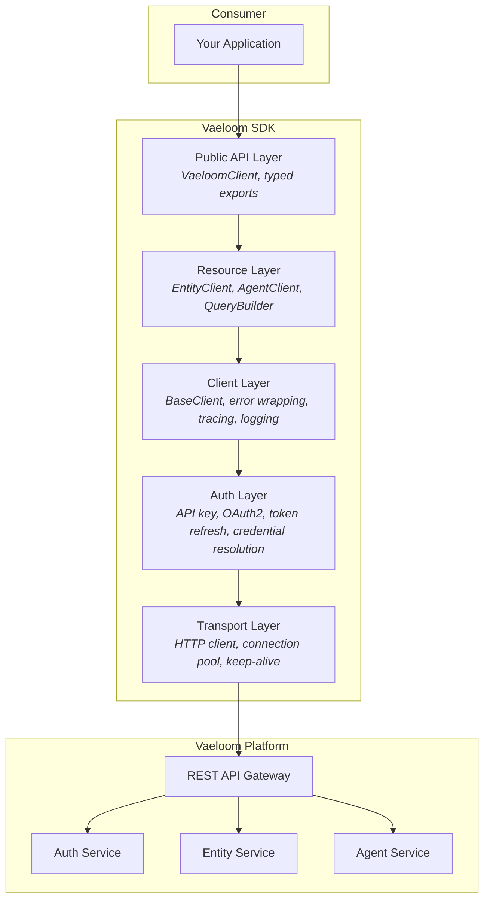
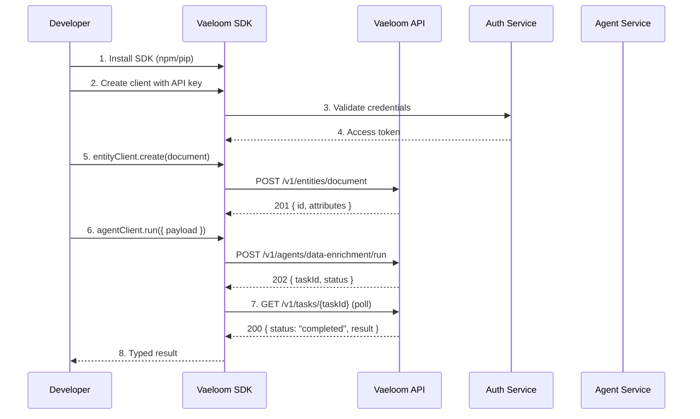

# Vaeloom SDK Documentation

> **Purpose:** SDK architecture, installation, usage, and governance for the Vaeloom platform
> **Status:** 🆕 New
> **Owner:** Engineering Team
> **Last Updated:** 2026-07-13

| Metadata         | Value                          |
|------------------|--------------------------------|
| **Purpose**      | SDK architecture, installation, usage, and governance for the Vaeloom platform |
| **Status**       | 🆕 New                         |
| **Owner**        | Engineering Team               |
| **Last Updated** | 2026-07-13                     |
| **Version**      | 1.0.0                          |

---

## Table of Contents

1. [Overview](#1-overview)
2. [Goals](#2-goals)
3. [Scope](#3-scope)
4. [Architecture](#4-architecture)
5. [Components](#5-components)
6. [Workflows](#6-workflows)
7. [SDK Structure](#7-sdk-structure)
8. [Installation](#8-installation)
9. [Authentication](#9-authentication)
10. [Query Builder](#10-query-builder)
11. [Entity CRUD](#11-entity-crud)
12. [Agent Execution](#12-agent-execution)
13. [Error Handling](#13-error-handling)
14. [Rate Limiting](#14-rate-limiting)
15. [Security](#15-security)
16. [Performance](#16-performance)
17. [Scalability](#17-scalability)
18. [Monitoring](#18-monitoring)
19. [Versioning](#19-versioning)
20. [Examples](#20-examples)
21. [Best Practices](#21-best-practices)
22. [Common Mistakes](#22-common-mistakes)
23. [Risks](#23-risks)
24. [Limitations](#24-limitations)
25. [Future Improvements](#25-future-improvements)
26. [Related Documents](#26-related-documents)

---

## 1. Overview

The **Vaeloom SDK** is a first-class, type-safe client library that enables developers to interact with the Vaeloom platform programmatically. It abstracts HTTP transport concerns, handles authentication, provides a fluent query builder, and exposes dedicated clients for entity CRUD operations and agent lifecycle management.

**Audience:** Backend engineers, data engineers, and platform integrators building against Vaeloom APIs.

**Why SDK Architecture:** A dedicated SDK reduces boilerplate, centralizes error handling, enforces consistent authentication flows, and provides discoverable APIs with full editor intellisense — dramatically reducing integration time compared to raw HTTP calls.

---

## 2. Goals

1. **Type Safety** — Leverage TypeScript generics and Python type hints to catch contract violations at compile time.
2. **Consistency** — Uniform patterns across auth, query, CRUD, and agent modules so developers can predict API shapes.
3. **Resilience** — Built-in retry, backoff, rate-limit awareness, and timeout enforcement without user configuration.
4. **Discoverability** — Self-documenting method signatures, comprehensive JSDoc/Python docstrings, and exported TypeScript interfaces.
5. **Minimal Dependencies** — Keep the dependency surface small to avoid version conflicts in consumer projects.

---

## 3. Scope

### In Scope

| Component          | Languages       | Description                                      |
|--------------------|-----------------|--------------------------------------------------|
| TypeScript SDK     | TypeScript 5.x  | Full-featured client for Node.js and browser     |
| Python SDK         | Python 3.11+    | Native async client for Python services          |
| Auth Helpers       | Both            | API key, OAuth2, and token refresh flows         |
| Query Builder      | Both            | Fluent, type-safe query construction             |
| Entity CRUD        | Both            | Create, read, update, delete for Vaeloom entities |
| Agent Execution    | Both            | Submit, poll, cancel, and webhook-based agents   |

### Out of Scope

| Item                    | Rationale                                      |
|-------------------------|-------------------------------------------------|
| Mobile SDK (iOS/Android)| Separate native team; REST compatibility only   |
| Frontend Components     | UI concerns are owned by the web app team       |
| CLI Tool                | Covered by `Vaeloom-cli` package separately    |
| GraphQL Client          | Future consideration (see §25)                  |

---

## 4. Architecture

The SDK is organised into five logical layers. Each layer depends only on the layer directly beneath it.



**Request flow:** Consumer calls a public method → resource client builds the request → base client enriches with auth headers → transport dispatches via connection pool → response is unwrapped, errors are classified, and a typed result is returned.

---

## 5. Components

### 5.1 TypeScript SDK (`@vaeloom/sdk-ts`)

The primary SDK for Node.js and browser environments. Exposes a single `VaeloomClient` entry point.

```typescript
import { VaeloomClient } from "@vaeloom/sdk-ts";

const client = new VaeloomClient({
  apiKey: process.env.Vaeloom_API_KEY,
});
```

### 5.2 Python SDK (`Vaeloom-sdk-py`)

Async-first Python SDK targeting Python 3.11+.

```python
from Vaeloom_sdk import VaeloomClient

client = VaeloomClient(
    api_key=os.environ["Vaeloom_API_KEY"],
)
```

### 5.3 Shared Types (`@vaeloom/sdk-types`)

Platform-defined interfaces consumed by both SDKs and automatically generated from the OpenAPI spec.

```typescript
// packages/sdk-types/src/entity.ts
export interface Entity {
  id: string;
  type: string;
  attributes: Record<string, unknown>;
  createdAt: string; // ISO-8601
  updatedAt: string;
}

export interface Page<T> {
  data: T[];
  meta: {
    total: number;
    page: number;
    pageSize: number;
    hasMore: boolean;
  };
}
```

### 5.4 Auth Module

Handles credential resolution, token caching, and automatic refresh.

| Strategy    | Token Source              | Refresh Mechanism               |
|-------------|--------------------------|---------------------------------|
| API Key     | `Vaeloom_API_KEY` env    | Static, no refresh              |
| OAuth2      | `Vaeloom_CLIENT_ID` + `Vaeloom_CLIENT_SECRET` | OAuth2 client credentials grant, auto-refreshed at 80% TTL |
| Access Token| `Vaeloom_ACCESS_TOKEN` env | Manual refresh via `client.auth.refresh()` |

### 5.5 Query Builder

Fluent builder that constructs query parameters and supports type-safe filters.

```typescript
const query = client
  .query("documents")
  .filter("status", "eq", "published")
  .filter("author.id", "in", ["usr_1", "usr_2"])
  .sort("createdAt", "desc")
  .page(2)
  .pageSize(50);
```

### 5.6 Entity Client

Dedicated client for lifecycle operations on Vaeloom entities.

```typescript
const entityClient = client.entity("documents");
await entityClient.create({ title: "Q4 Report", type: "report" });
await entityClient.get("doc_abc123");
await entityClient.list({ filter: { status: "published" } });
await entityClient.update("doc_abc123", { title: "Q4 Report v2" });
await entityClient.delete("doc_abc123");
```

### 5.7 Agent Client

Manages agent task submission, status polling, and webhook registration.

```typescript
const agentClient = client.agent("data-enrichment");

// Fire-and-forget with webhook callback
await agentClient.run({
  payload: { documentId: "doc_abc123" },
  webhookUrl: "https://myapp.com/webhooks/Vaeloom",
});

// Poll for completion
const result = await agentClient.runAndWait({
  payload: { documentId: "doc_abc123" },
  pollIntervalMs: 2000,
  timeoutMs: 300_000,
});
```

---

## 6. Workflows



---

## 7. SDK Structure

### 7.1 TypeScript SDK

```text
packages/sdk-ts/
├── src/
│   ├── client/
│   │   ├── VaeloomClient.ts        # Public entry point
│   │   └── BaseClient.ts             # HTTP transport, auth injection
│   ├── auth/
│   │   ├── AuthProvider.ts           # Auth interface
│   │   ├── ApiKeyAuth.ts             # API key strategy
│   │   └── OAuth2Auth.ts             # OAuth2 client credentials
│   ├── resources/
│   │   ├── EntityClient.ts           # Entity CRUD operations
│   │   ├── AgentClient.ts            # Agent execution lifecycle
│   │   └── QueryBuilder.ts           # Fluent query builder
│   ├── errors/
│   │   ├── VaeloomError.ts          # Base error class
│   │   ├── AuthenticationError.ts
│   │   ├── RateLimitError.ts
│   │   ├── ValidationError.ts
│   │   └── NotFoundError.ts
│   ├── transport/
│   │   ├── HttpClient.ts             # Axios/fetch wrapper
│   │   ├── RetryHandler.ts           # Exponential backoff
│   │   └── RateLimiter.ts            # Token-bucket limiter
│   ├── types/
│   │   ├── entity.ts
│   │   ├── agent.ts
│   │   ├── query.ts
│   │   └── common.ts
│   ├── utils/
│   │   ├── logger.ts
│   │   ├── tracer.ts                 # X-Request-Id propagation
│   │   └── version.ts
│   └── index.ts                      # Barrel exports
├── test/
│   ├── unit/
│   ├── integration/
│   └── fixtures/
├── package.json
├── tsconfig.json
└── README.md
```

### 7.2 Python SDK

```text
packages/sdk-py/
├── src/Vaeloom_sdk/
│   ├── __init__.py
│   ├── client.py                      # VaeloomClient entry point
│   ├── base_client.py                 # HTTP transport, auth injection
│   ├── auth/
│   │   ├── __init__.py
│   │   ├── provider.py                # Auth interface
│   │   ├── api_key.py                 # API key strategy
│   │   └── oauth2.py                  # OAuth2 client credentials
│   ├── resources/
│   │   ├── entity_client.py
│   │   ├── agent_client.py
│   │   └── query_builder.py
│   ├── errors/
│   │   ├── __init__.py
│   │   ├── Vaeloom_error.py
│   │   ├── authentication_error.py
│   │   ├── rate_limit_error.py
│   │   ├── validation_error.py
│   │   └── not_found_error.py
│   ├── transport/
│   │   ├── http_client.py
│   │   ├── retry_handler.py
│   │   └── rate_limiter.py
│   ├── types/
│   │   ├── entity.py
│   │   ├── agent.py
│   │   ├── query.py
│   │   └── common.py
│   └── utils/
│       ├── logger.py
│       ├── tracer.py
│       └── version.py
├── tests/
│   ├── unit/
│   ├── integration/
│   └── fixtures/
├── pyproject.toml
├── setup.cfg
└── README.md
```

---

## 8. Installation

### 8.1 TypeScript SDK

```bash
npm install @vaeloom/sdk-ts@^1.0.0
# or
yarn add @vaeloom/sdk-ts@^1.0.0
# or
pnpm add @vaeloom/sdk-ts@^1.0.0
```

**Version pinning:** Always pin the major version with the `^` range (e.g. `^1.0.0`). The SDK follows [SemVer](#19-versioning) strictly: minors and patches are safe upgrades.

### 8.2 Python SDK

```bash
pip install "Vaeloom-sdk-py>=1.0.0,<2.0.0"
```

**Version pinning:** Use the `>=X.Y.Z,<NEXT_MAJOR` range to receive patch and minor updates while breaking changes remain opt-in.

### 8.3 Verifying Installation

```typescript
// TypeScript
import { version } from "@vaeloom/sdk-ts";
console.log(`Vaeloom SDK v${version}`);
```

```python
# Python
from Vaeloom_sdk import __version__
print(f"Vaeloom SDK v{__version__}")
```

---

## 9. Authentication

### 9.1 API Key

The simplest authentication method. Generate an API key from the Vaeloom Dashboard and set it as an environment variable.

```typescript
// TypeScript
const client = new VaeloomClient({
  apiKey: process.env.Vaeloom_API_KEY,
});
```

```python
# Python
client = VaeloomClient(
    api_key=os.environ["Vaeloom_API_KEY"],
)
```

### 9.2 OAuth2 Token

For production services that require scoped, short-lived credentials.

```typescript
// TypeScript
const client = new VaeloomClient({
  clientId: process.env.Vaeloom_CLIENT_ID,
  clientSecret: process.env.Vaeloom_CLIENT_SECRET,
  scopes: ["entities:read", "agents:write"],
});
```

```python
# Python
client = VaeloomClient(
    client_id=os.environ["Vaeloom_CLIENT_ID"],
    client_secret=os.environ["Vaeloom_CLIENT_SECRET"],
    scopes=["entities:read", "agents:write"],
);
```

### 9.3 Direct Token Injection

For environments where an external identity provider has already obtained a token.

```typescript
const client = new VaeloomClient({
  accessToken: "Vaeloom_eyJhbGci...",
});
```

### 9.4 Token Refresh

The OAuth2 auth provider automatically refreshes tokens at **80% of TTL**. Manual refresh is also available.

```typescript
await client.auth.refresh();
```

### 9.5 Environment Variable Conventions

| Variable                     | Description                          | Required       |
|------------------------------|--------------------------------------|----------------|
| `Vaeloom_API_KEY`           | API key for simple auth              | Conditional    |
| `Vaeloom_CLIENT_ID`         | OAuth2 client ID                     | Conditional    |
| `Vaeloom_CLIENT_SECRET`     | OAuth2 client secret                 | Conditional    |
| `Vaeloom_ACCESS_TOKEN`      | Pre-obtained access token            | Conditional    |
| `Vaeloom_BASE_URL`          | API base URL (default: `https://api.Vaeloom.dev`) | No |
| `Vaeloom_REQUEST_TIMEOUT`   | Request timeout in ms (default: `30000`) | No |

---

## 10. Query Builder

The query builder provides a fluent, type-safe interface for constructing API query parameters. It prevents malformed queries at compile time through generics.

### 10.1 Basic Usage

```typescript
import { VaeloomClient, eq, inList, gt } from "@vaeloom/sdk-ts";

const client = new VaeloomClient({ apiKey: process.env.Vaeloom_API_KEY });

// Typed query — `documents` maps to the Document interface
const query = client
  .query("documents")
  .filter("status", eq("published"))
  .filter("createdAt", gt("2026-01-01"))
  .filter("author.id", inList(["usr_1", "usr_2"]))
  .sort("createdAt", "desc")
  .page(1)
  .pageSize(25);

const result = await query.fetch();
// result: Page<Document>
```

```python
from Vaeloom_sdk import VaeloomClient, eq, in_list, gt

client = VaeloomClient(api_key=os.environ["Vaeloom_API_KEY"])

query = (client
    .query("documents")
    .filter("status", eq("published"))
    .filter("createdAt", gt("2026-01-01"))
    .filter("author.id", in_list(["usr_1", "usr_2"]))
    .sort("createdAt", "desc")
    .page(1)
    .page_size(25))

result = await query.fetch()
# result: Page[Document]
```

### 10.2 Filter Operators

| Operator      | Function    | Description                             |
|---------------|-------------|-----------------------------------------|
| `eq`          | `eq(v)`     | Equals                                  |
| `ne`          | `ne(v)`     | Not equals                              |
| `gt`          | `gt(v)`     | Greater than                            |
| `gte`         | `gte(v)`    | Greater than or equal                   |
| `lt`          | `lt(v)`     | Less than                               |
| `lte`         | `lte(v)`    | Less than or equal                      |
| `inList`      | `inList(v)` | In a list of values                     |
| `contains`    | `contains(v)`| Partial string match                   |
| `exists`      | `exists()`  | Field is present (non-null)             |

### 10.3 Reusing Queries

```typescript
const baseQuery = client
  .query("documents")
  .filter("status", eq("published"))
  .sort("createdAt", "desc");

const firstPage = await baseQuery.page(1).pageSize(20).fetch();
const secondPage = await baseQuery.page(2).pageSize(20).fetch();
```

---

## 11. Entity CRUD

### 11.1 Create

```typescript
const doc = await client.entity("documents").create({
  title: "Q4 Financial Report",
  type: "report",
  attributes: {
    department: "finance",
    quarter: "Q4",
    year: 2026,
    confidential: true,
  },
});
// doc: Entity
```

```python
doc = await client.entity("documents").create({
    "title": "Q4 Financial Report",
    "type": "report",
    "attributes": {
        "department": "finance",
        "quarter": "Q4",
        "year": 2026,
        "confidential": True,
    },
})
```

### 11.2 Read

```typescript
// Single entity by ID
const doc = await client.entity("documents").get("doc_abc123");

// List with query
const page = await client
  .entity("documents")
  .list({ filter: { status: "published" }, page: 1, pageSize: 50 });
```

```python
doc = await client.entity("documents").get("doc_abc123")

page = await client.entity("documents").list(
    filter={"status": "published"}, page=1, page_size=50
)
```

### 11.3 Update

```typescript
const updated = await client.entity("documents").update("doc_abc123", {
  title: "Q4 Financial Report — Final",
  attributes: { approved: true },
});
```

```python
updated = await client.entity("documents").update("doc_abc123", {
    "title": "Q4 Financial Report — Final",
    "attributes": {"approved": True},
})
```

### 11.4 Delete

```typescript
await client.entity("documents").delete("doc_abc123");
```

```python
await client.entity("documents").delete("doc_abc123")
```

### 11.5 Batch Operations

```typescript
const results = await client.entity("documents").batch([
  { op: "create", data: { title: "Doc A", type: "note" } },
  { op: "create", data: { title: "Doc B", type: "note" } },
  { op: "update", id: "doc_existing", data: { title: "Doc B — Updated" } },
]);
```

---

## 12. Agent Execution

### 12.1 Fire-and-Forget with Webhook

```typescript
const task = await client.agent("data-enrichment").run({
  payload: {
    documentId: "doc_abc123",
    enrichFields: ["author", "keywords", "summary"],
  },
  webhookUrl: "https://myapp.com/webhooks/Vaeloom",
  webhookSecret: process.env.Vaeloom_WEBHOOK_SECRET,
});
// task: { taskId: string; status: "queued" }
```

```python
task = await client.agent("data-enrichment").run({
    "payload": {
        "documentId": "doc_abc123",
        "enrichFields": ["author", "keywords", "summary"],
    },
    "webhookUrl": "https://myapp.com/webhooks/Vaeloom",
    "webhookSecret": os.environ["Vaeloom_WEBHOOK_SECRET"],
})
```

### 12.2 Polling (Synchronous-style)

```typescript
const result = await client.agent("data-enrichment").runAndWait({
  payload: { documentId: "doc_abc123" },
  pollIntervalMs: 2000,  // Check every 2 seconds
  timeoutMs: 300_000,    // Give up after 5 minutes
});
// result: { taskId: string; status: "completed" | "failed"; output?: unknown }
```

```python
result = await client.agent("data-enrichment").run_and_wait({
    "payload": {"documentId": "doc_abc123"},
    "pollIntervalMs": 2000,
    "timeoutMs": 300_000,
})
```

### 12.3 Checking Task Status

```typescript
const status = await client.tasks().get("task_xyz789");
// status: { taskId: string; status: "queued" | "running" | "completed" | "failed"; progress?: number; output?: unknown }
```

### 12.4 Cancelling a Task

```typescript
await client.tasks().cancel("task_xyz789");
```

### 12.5 Webhook Payload

When an agent completes, Vaeloom POSTs the following payload to your registered webhook URL:

```json
{
  "event": "agent.completed",
  "taskId": "task_xyz789",
  "agent": "data-enrichment",
  "status": "completed",
  "output": {
    "author": "Jane Doe",
    "keywords": ["finance", "Q4", "report"],
    "summary": "This report covers Q4 financial performance..."
  },
  "timestamp": "2026-07-13T14:30:00Z"
}
```

---

## 13. Error Handling

### 13.1 Error Types

All SDK errors extend a base `VaeloomError` class, which exposes `statusCode`, `code`, `message`, and `requestId`.

| Error Class             | HTTP Status | When Raised                           |
|-------------------------|-------------|---------------------------------------|
| `AuthenticationError`   | 401         | Invalid or expired credentials        |
| `RateLimitError`        | 429         | Too many requests (see §14)           |
| `ValidationError`       | 422         | Request payload failed schema validation |
| `NotFoundError`         | 404         | Requested resource does not exist     |
| `ServerError`           | 500+        | Upstream server failure               |
| `NetworkError`          | N/A         | Connection dropped / DNS failure      |

### 13.2 Handling Errors

```typescript
import {
  AuthenticationError,
  RateLimitError,
  ValidationError,
  NotFoundError,
} from "@vaeloom/sdk-ts";

try {
  const doc = await client.entity("documents").get("doc_invalid");
} catch (error) {
  if (error instanceof AuthenticationError) {
    console.error("Auth failed — check Vaeloom_API_KEY");
    process.exit(1);
  }
  if (error instanceof RateLimitError) {
    const retryAfter = error.retryAfterMs;
    console.warn(`Rate limited, retry after ${retryAfter}ms`);
    await sleep(retryAfter);
  }
  if (error instanceof ValidationError) {
    console.error("Validation errors:", error.details);
    // error.details: Array<{ field: string; message: string }>
  }
  if (error instanceof NotFoundError) {
    console.warn("Resource not found, skipping");
  }
}
```

```python
from Vaeloom_sdk.errors import AuthenticationError, RateLimitError, ValidationError, NotFoundError

try:
    doc = await client.entity("documents").get("doc_invalid")
except AuthenticationError:
    print("Auth failed — check Vaeloom_API_KEY")
    raise
except RateLimitError as e:
    print(f"Rate limited, retry after {e.retry_after_ms}ms")
    await asyncio.sleep(e.retry_after_ms / 1000)
except ValidationError as e:
    print("Validation errors:", e.details)
except NotFoundError:
    print("Resource not found, skipping")
```

### 13.3 Retry Logic

The SDK retries on transient failures (429, 503, network errors) with exponential backoff.

| Parameter            | Default | Description                            |
|----------------------|---------|----------------------------------------|
| `maxRetries`         | 3       | Maximum number of retries              |
| `baseDelayMs`        | 500     | Initial delay before first retry       |
| `maxDelayMs`         | 30_000  | Maximum delay cap                      |
| `backoffMultiplier`  | 2       | Exponential factor (500 → 1000 → 2000) |

These can be overridden at the client level:

```typescript
const client = new VaeloomClient({
  apiKey: process.env.Vaeloom_API_KEY,
  maxRetries: 5,
  baseDelayMs: 200,
});
```

### 13.4 Timeout Configuration

```typescript
const client = new VaeloomClient({
  apiKey: process.env.Vaeloom_API_KEY,
  requestTimeoutMs: 60_000,  // Default: 30_000
});
```

---

## 14. Rate Limiting

### 14.1 SDK-Level Rate Limiting

The SDK implements a **token-bucket algorithm** to stay within Vaeloom API rate limits.

| Limit Type          | Default Rate        | Scope     |
|---------------------|---------------------|-----------|
| Requests per second | 100 req/s           | Per client instance |
| Burst               | 200 requests        | Per client instance |
| Concurrent requests | 10                  | Per client instance |

### 14.2 Exponential Backoff

When the SDK receives a `429` response, it inspects the `Retry-After` header and backs off automatically. The retry handler uses truncated exponential backoff with jitter:

```text
delay = min(baseDelay * 2^(attempt - 1), maxDelay) * (0.5 + random())
```

### 14.3 Queue Management

Requests that exceed the rate limit are queued internally rather than dropped:

```typescript
const client = new VaeloomClient({
  apiKey: process.env.Vaeloom_API_KEY,
  rateLimit: {
    maxQueueSize: 100,    // Maximum queued requests
    onQueueFull: "error", // "error" | "block" | "drop"
  },
});
```

### 14.4 Custom Rate Limit Configuration

```typescript
const client = new VaeloomClient({
  apiKey: process.env.Vaeloom_API_KEY,
  rateLimit: {
    requestsPerSecond: 50,
    burstSize: 100,
    maxConcurrent: 5,
  },
});
```

```python
client = VaeloomClient(
    api_key=os.environ["Vaeloom_API_KEY"],
    rate_limit={
        "requests_per_second": 50,
        "burst_size": 100,
        "max_concurrent": 5,
    },
)
```

---

## 15. Security

### 15.1 Token Storage Best Practices

- **Never** hardcode API keys or tokens in source code.
- Use environment variables or a secret manager (AWS Secrets Manager, HashiCorp Vault, Doppler).
- Rotate API keys every **90 days** minimum.
- Use scoped OAuth2 tokens with the minimum permissions required.

### 15.2 Credential Leak Prevention

The SDK **never logs credentials**. Auth headers are stripped from logged request data:

```typescript
// The SDK redacts Authorization headers before logging
client.on("http:request", (req) => {
  // req.headers.authorization is shown as "[REDACTED]"
});
```

### 15.3 Environment Isolation

```typescript
const client = new VaeloomClient({
  apiKey: process.env.Vaeloom_API_KEY,
  baseUrl: process.env.Vaeloom_BASE_URL, // Default: https://api.Vaeloom.dev
});
```

| Environment | Typical `baseUrl`                      |
|-------------|----------------------------------------|
| Development| `https://api-dev.Vaeloom.dev`          |
| Staging    | `https://api-staging.Vaeloom.dev`      |
| Production | `https://api.Vaeloom.dev`              |

### 15.4 Transport Security

- All requests use **TLS 1.3** (fallback to TLS 1.2).
- Certificate pinning is supported via a custom `httpsAgent`:

```typescript
const client = new VaeloomClient({
  apiKey: process.env.Vaeloom_API_KEY,
  httpsAgent: new https.Agent({ ca: Vaeloom_CA_CERT }),
});
```

---

## 16. Performance

### 16.1 Connection Pooling

The SDK maintains a persistent HTTP connection pool (keep-alive) to avoid TCP handshake overhead on every request.

| Platform  | Pool Size | Library          |
|-----------|-----------|------------------|
| Node.js   | 25        | `undici` / `node:http` |
| Browser   | 6         | `fetch` (browser limit) |
| Python    | 10        | `httpx`           |

### 16.2 Keep-Alive

TCP keep-alive is enabled by default with a 30-second interval.

### 16.3 Response Caching

Idempotent `GET` requests are cached in-memory for a configurable TTL:

```typescript
const client = new VaeloomClient({
  apiKey: process.env.Vaeloom_API_KEY,
  cache: {
    enabled: true,
    ttlMs: 5_000,       // 5-second cache
    maxEntries: 100,     // LRU eviction
  },
});
```

### 16.4 Batch Operations

For bulk entities, use batch operations to reduce round-trips:

```typescript
const results = await client.entity("documents").batch([
  { op: "create", data: { title: "Doc 1", type: "note" } },
  { op: "create", data: { title: "Doc 2", type: "note" } },
  // Up to 100 operations per batch
]);
```

---

## 17. Scalability

### 17.1 Concurrent Request Limits

The SDK enforces a configurable concurrency limit to prevent overwhelming both the client and the server.

```typescript
const client = new VaeloomClient({
  apiKey: process.env.Vaeloom_API_KEY,
  maxConcurrent: 25,
});
```

Requests beyond the limit are queued. When a slot opens, the next request is dispatched.

### 17.2 Pagination for Large Datasets

Use cursor-based pagination for datasets larger than 10,000 records:

```typescript
const allDocs: Document[] = [];
let cursor: string | null = null;

do {
  const page = await client
    .query("documents")
    .filter("status", eq("archived"))
    .cursor(cursor)
    .pageSize(500)
    .fetch();

  allDocs.push(...page.data);
  cursor = page.meta.nextCursor;
} while (cursor !== null);
```

```python
all_docs = []
cursor = None

while True:
    page = await (client
        .query("documents")
        .filter("status", eq("archived"))
        .cursor(cursor)
        .page_size(500)
        .fetch())

    all_docs.extend(page.data)
    cursor = page.meta.nextCursor
    if cursor is None:
        break
```

### 17.3 Streaming Responses

For large list endpoints, the SDK supports streaming responses when available:

```typescript
const stream = client.entity("documents").stream({
  filter: { status: "archived" },
  pageSize: 100,
});

for await (const batch of stream) {
  // batch: Document[]
  processBatch(batch);
}
```

---

## 18. Monitoring

### 18.1 SDK Logging

The SDK logs at configurable levels. Logs include request method, path, status code, and duration — but **never** credentials or payload bodies.

```typescript
const client = new VaeloomClient({
  apiKey: process.env.Vaeloom_API_KEY,
  logLevel: "info", // "debug" | "info" | "warn" | "error" | "silent"
});
```

```python
import logging
logging.basicConfig(level=logging.INFO)

client = VaeloomClient(
    api_key=os.environ["Vaeloom_API_KEY"],
    log_level="INFO",
)
```

### 18.2 Request Tracing

Every SDK request includes an `X-Request-Id` header. If you provide one, it is propagated; otherwise, a UUID is generated.

```typescript
const doc = await client.entity("documents").get("doc_abc123", {
  requestId: "my-custom-trace-id",
});

// Access the request ID from the response context
const requestId = doc.$requestId;
```

### 18.3 Metrics

The SDK emits metrics that can be collected via an event emitter:

```typescript
client.on("metric", (metric) => {
  // metric: { name: string; value: number; tags: Record<string, string> }
  metricsClient.distribution("Vaeloom.sdk." + metric.name, metric.value, metric.tags);
});
```

| Metric Name                  | Type       | Description                          |
|------------------------------|------------|--------------------------------------|
| `request.duration`           | Histogram  | Request round-trip time (ms)         |
| `request.total`              | Counter    | Total requests                       |
| `request.errors`             | Counter    | Failed requests (by status code)     |
| `retry.attempts`             | Counter    | Retry attempts                       |
| `rate_limit.queued`          | Gauge      | Currently queued requests            |
| `rate_limit.throttled`       | Counter    | Times rate limit was hit             |
| `cache.hit`                  | Counter    | Cache hit count                      |
| `cache.miss`                 | Counter    | Cache miss count                     |

### 18.4 Health Check

```typescript
const health = await client.health();
// health: { status: "ok" | "degraded" | "down"; version: string; uptime: number }
```

---

## 19. Versioning

### 19.1 Semantic Versioning

The SDK follows strict [SemVer 2.0.0](https://semver.org/):

| Version Bump | Meaning                                      | Example    |
|--------------|----------------------------------------------|------------|
| **Major**    | Breaking API changes, removed functionality  | `1.x → 2.0.0` |
| **Minor**    | New features, backward-compatible            | `1.0 → 1.1.0` |
| **Patch**    | Bug fixes, performance improvements          | `1.0.0 → 1.0.1` |

### 19.2 Changelog

Each release includes a `CHANGELOG.md` entry with:

- **Added** — New features and endpoints
- **Changed** — Behavior modifications (backward-compatible)
- **Deprecated** — Features scheduled for removal
- **Removed** — Features removed in this version
- **Fixed** — Bug fixes
- **Security** — Vulnerability patches

### 19.3 Migration Guides

Breaking changes include a migration guide in `MIGRATING.md`:

```text
MIGRATING.md
├── 1.x-to-2.0.md
├── 2.x-to-3.0.md
```

### 19.4 Deprecation Policy

| Phase        | Duration | Developer Signal                          |
|--------------|----------|-------------------------------------------|
| **Notice**   | 1 major cycle | Feature still works; deprecation warning in logs |
| **Sunset**   | 1 major cycle | Feature removed; migration guide published |
| **Removal**  | After sunset  | Feature deleted                            |

Deprecated features produce a runtime warning once per client instance:

```text
[Vaeloom SDK] DeprecationWarning: entityClient.batch() is deprecated in v1.x.
Use entityClient.bulk() instead. This feature will be removed in v2.0.
```

---

## 20. Examples

### 20.1 End-to-End: Authenticate → Query → Run Agent → Check Results

```typescript
import { VaeloomClient, eq, gt } from "@vaeloom/sdk-ts";

// 1. Initialise client
const client = new VaeloomClient({
  apiKey: process.env.Vaeloom_API_KEY,
  logLevel: "info",
});

// 2. Query for pending documents
const pendingDocs = await client
  .query("documents")
  .filter("status", eq("pending"))
  .filter("createdAt", gt("2026-06-01"))
  .sort("priority", "desc")
  .pageSize(10)
  .fetch();

console.log(`Found ${pendingDocs.meta.total} pending documents`);

// 3. Run enrichment agent on each document
const agent = client.agent("data-enrichment");
const taskIds: string[] = [];

for (const doc of pendingDocs.data) {
  const task = await agent.run({
    payload: { documentId: doc.id },
    webhookUrl: "https://myapp.com/webhooks/Vaeloom",
    webhookSecret: process.env.Vaeloom_WEBHOOK_SECRET,
  });
  taskIds.push(task.taskId);
  console.log(`Submitted ${doc.id} → task ${task.taskId}`);
}

// 4. Poll for completion
const results = [];
for (const taskId of taskIds) {
  const result = await client.tasks().get(taskId);
  results.push(result);
}

// 5. Summary
console.table(results.map((r) => ({
  taskId: r.taskId,
  status: r.status,
  completedAt: r.completedAt ?? "N/A",
})));
```

```python
import os
import asyncio
from Vaeloom_sdk import VaeloomClient, eq, gt

async def main():
    # 1. Initialise client
    client = VaeloomClient(
        api_key=os.environ["Vaeloom_API_KEY"],
        log_level="INFO",
    )

    # 2. Query for pending documents
    pending_docs = await (client
        .query("documents")
        .filter("status", eq("pending"))
        .filter("createdAt", gt("2026-06-01"))
        .sort("priority", "desc")
        .page_size(10)
        .fetch())

    print(f"Found {pending_docs.meta.total} pending documents")

    # 3. Run enrichment agent on each document
    agent = client.agent("data-enrichment")
    task_ids = []

    for doc in pending_docs.data:
        task = await agent.run({
            "payload": {"documentId": doc["id"]},
            "webhookUrl": "https://myapp.com/webhooks/Vaeloom",
            "webhookSecret": os.environ["Vaeloom_WEBHOOK_SECRET"],
        })
        task_ids.append(task["taskId"])
        print(f"Submitted {doc['id']} → task {task['taskId']}")

    # 4. Poll for completion
    results = []
    for task_id in task_ids:
        result = await client.tasks().get(task_id)
        results.append(result)

    # 5. Summary
    for r in results:
        print(f"{r['taskId']}: {r['status']}")

asyncio.run(main())
```

---

## 21. Best Practices

### 21.1 Error Handling Patterns

- **Always** wrap SDK calls in try/catch blocks.
- Differentiate between retryable (429, 503, network) and non-retryable (401, 404, 422) errors.
- Log `error.requestId` when catching errors for easier debugging.

### 21.2 Retry Strategies

- Use `runAndWait` / `run_and_wait` instead of manual polling loops.
- If implementing custom retries, use exponential backoff with **jitter** to avoid thundering herd.
- Set a maximum retry budget (e.g. 3 attempts or 30 seconds total).

### 21.3 Resource Cleanup

Always dispose of the client when shutting down to flush pending requests:

```typescript
// TypeScript — client implements AsyncDisposable
await using client = new VaeloomClient({ ... });
// ... work ...
// Client is automatically disposed when scope exits
```

```python
# Python — use context manager
async with VaeloomClient(api_key=os.environ["Vaeloom_API_KEY"]) as client:
    # ... work ...
```

### 21.4 Testing SDK Usage

```typescript
// Using the mock transport for unit tests
import { MockTransport } from "@vaeloom/sdk-ts/testing";

const transport = new MockTransport();
transport.when("POST", "/v1/entities/document").respond(201, {
  id: "doc_test",
  title: "Test Document",
});

const client = new VaeloomClient({
  apiKey: "test-key",
  transport, // Inject mock transport
});
```

---

## 22. Common Mistakes

| # | Mistake                         | Why It's Wrong                                          | Correct Approach                          |
|---|---------------------------------|--------------------------------------------------------|-------------------------------------------|
| 1 | **Creating a new client per request** | Exhausts connection pool; bypasses rate limiting       | Create once, reuse across the application |
| 2 | **Ignoring rate limit errors**  | Leads to repeated 429s and eventual IP blocking        | Let the SDK handle backoff automatically  |
| 3 | **Missing error handling**      | Unhandled promise rejections crash the process         | Always wrap in try/catch with typed errors|
| 4 | **Hardcoding API keys**         | Credentials leak to version control                    | Use environment variables or secret manager|
| 5 | **Not pinning SDK version**     | Accidental breaking changes from `npm update`          | Use `^major` or exact version pinning     |
| 6 | **Disabling TLS verification**  | MITM attacks against API traffic                       | Keep TLS verification enabled             |
| 7 | **Sharing clients across tenants** | Auth context bleeds between users                   | Create one client per tenant / auth scope |

---

## 23. Risks

| Risk                               | Likelihood | Impact | Mitigation                                           |
|------------------------------------|------------|--------|------------------------------------------------------|
| **SDK version drift** between projects | Medium  | Medium | Enforce version ranges; use Dependabot/Renovate      |
| **Breaking API changes** without corresponding SDK release | Low | High | SDK auto-generated from OpenAPI spec; CI enforces sync |
| **Deprecated feature usage** across teams | Medium | Low | Runtime deprecation warnings; quarterly deprecation audits |
| **Credential leak** in logs or error reports | Low | Critical | SDK redacts credentials; pre-commit hook scans for secrets |
| **OAuth token expiry** during long-running jobs | Medium | Medium | Token refreshed at 80% TTL; webhook notification on expiry |

---

## 24. Limitations

1. **No streaming support** in the initial v1.0 release. Long-running agent outputs are delivered via webhook only.
2. **Maximum batch size** of 100 operations per batch call.
3. **Maximum page size** of 1,000 records per `pageSize` parameter.
4. **Browser support** is limited to modern browsers (Chrome 90+, Firefox 90+, Safari 15+, Edge 90+).
5. **Python SDK** requires Python 3.11 or later (no 3.10 support).
6. **No WebSocket support** — real-time updates require polling or webhooks.
7. **No offline mode** — all operations require a network connection to the Vaeloom API.

---

## 25. Future Improvements

| Feature                    | Target Version | Status     | Description                                     |
|----------------------------|----------------|------------|-------------------------------------------------|
| **Streaming responses**    | v2.0           | Planned    | SSE-based streaming for agent logs and entity exports |
| **GraphQL support**        | v2.0           | Planned    | GraphQL client with typed queries                |
| **Real-time subscriptions**| v2.1           | Research   | WebSocket-based subscription to entity changes   |
| **WebSocket SDK**          | v2.1           | Research   | Dedicated transport for low-latency agent interactions |
| **Offline queue**          | v3.0           | Backlog    | Queue mutations offline and sync on reconnect    |
| **gRPC transport**         | v3.0           | Backlog    | High-throughput transport for internal services  |

---

## 26. Related Documents

| Document                          | Description                                      | Location                                    |
|-----------------------------------|--------------------------------------------------|---------------------------------------------|
| **API Reference**                 | Full REST API endpoint documentation             | [`Backend/API-Reference.md`](./Backend/API-Reference.md) |
| **Authentication Guide**          | Auth flows, token management, scopes             | [`Backend/Authentication.md`](./Backend/Authentication.md) |
| **Rate Limiting Guide**           | Rate limit policies, headers, best practices     | [`Backend/Rate-Limiting.md`](./Backend/Rate-Limiting.md) |
| **REST API Standards**            | Naming conventions, pagination, error contracts  | [`Backend/REST-Standards.md`](./Backend/REST-Standards.md) |
| **Webhook Guide**                 | Webhook registration, verification, retries      | [`Integration-Guide.md`](./Integration-Guide.md) |
| **Migration Guide (v1.x to v2.0)**| Breaking changes and upgrade paths               | Not yet created |
| **CHANGELOG**                     | Release history and version diffs                | Not yet created |
| **OpenAPI Spec**                  | Machine-readable API specification               | [`Backend/openapi.yaml`](./Backend/openapi.yaml) |
