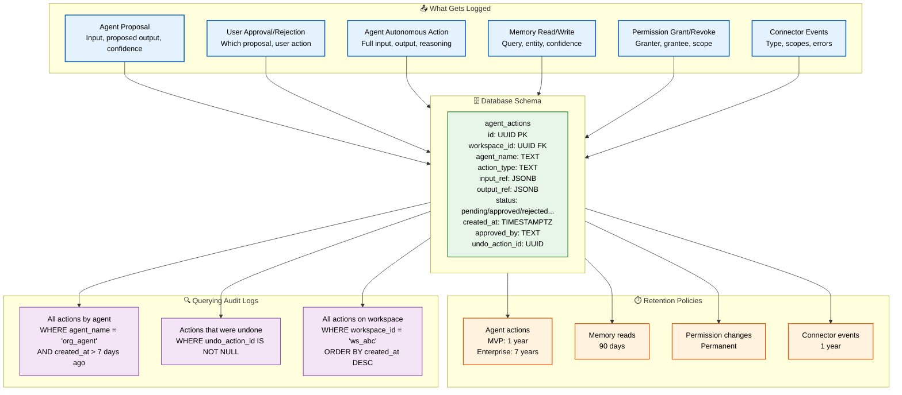
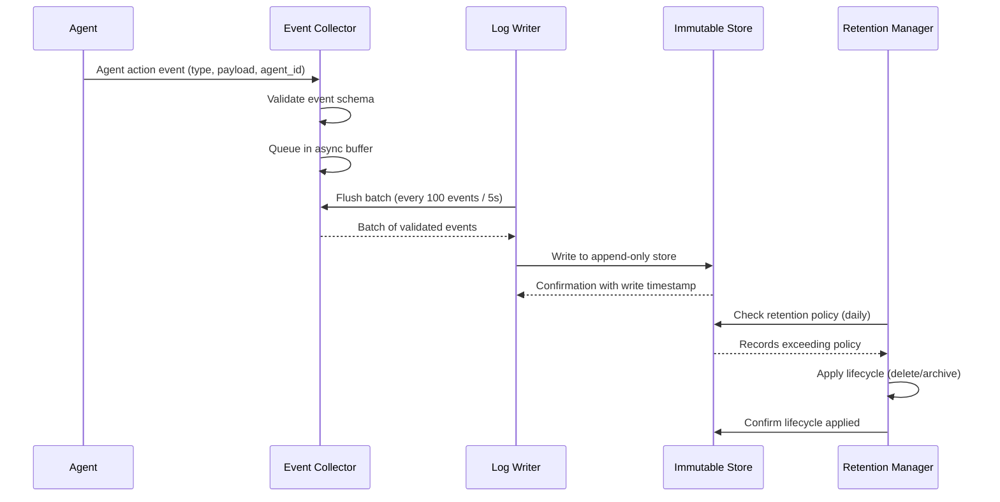

# Audit Logs

> **Purpose:** Define the audit logging system for Meridian
> **Status:** ✅ Upgraded to enterprise quality
> **Owner:** Security Team
> **Last Updated:** 2026-07-13
> **Canonical source:** [`/Docs/06-Meridian-Enterprise-Paper.md#197-audit-logging`](../../Docs/06-Meridian-Enterprise-Paper.md#197-audit-logging)

## Audit Log Architecture



> **Diagram:** Audit log architecture showing **6 event sources** → single `agent_actions` table with full schema → **4 retention tiers** (90 days to permanent) → **query patterns** for investigation. The append-only design prevents tampering, and every action is traceable to its source agent.

---

Every read and write to memory, every agent action, and every permission grant or revocation is logged in an append-only audit trail.

## Audit Log Schema

```sql
CREATE TABLE agent_actions (
  id UUID PRIMARY KEY DEFAULT gen_random_uuid(),
  workspace_id UUID NOT NULL REFERENCES workspaces(id),
  agent_name TEXT NOT NULL,
  action_type TEXT NOT NULL,
  input_ref JSONB,
  output_ref JSONB,
  status TEXT NOT NULL CHECK (status IN ('pending', 'approved', 'rejected', 'completed', 'failed')),
  created_at TIMESTAMPTZ NOT NULL DEFAULT now(),
  approved_by TEXT, -- NULL if autonomous
  undo_action_id UUID -- pointer to reverse action, if applicable
);
```

## What Gets Logged

| Action | Logged? | Detail Level |
|--------|---------|-------------|
| Agent proposal | ✅ | Input, proposed output, confidence |
| User approval/rejection | ✅ | Which proposal, user action |
| Agent autonomous action | ✅ | Full input, output, reasoning |
| Memory read | ✅ | Query, result count, agent identity |
| Memory write | ✅ | Entity, relationship, confidence |
| Permission grant/revoke | ✅ | Granter, grantee, scope |
| Connector connection | ✅ | Connector type, scopes |
| Connector failure | ✅ | Connector, error, timestamp |

## Log Retention

| Log Type | Retention | Access |
|----------|-----------|--------|
| Agent actions | 1 year (MVP), 7 years (enterprise) | History page |
| Memory reads | 90 days | Internal debugging |
| Permission changes | Permanent | Compliance export |
| Connector events | 1 year | Connector health page |

## Querying Audit Logs

```sql
-- Find all actions by a specific agent
SELECT * FROM agent_actions
WHERE agent_name = 'organization_agent'
  AND workspace_id = 'ws_abc'
  AND created_at > now() - interval '7 days'
ORDER BY created_at DESC;

-- Find actions that were undone
SELECT * FROM agent_actions
WHERE undo_action_id IS NOT NULL;
```

## Common Mistakes

| Mistake | Consequence |
|---------|-------------|
| Logging too little (missing critical events) | If agent proposals aren't logged before execution, there's no way to trace what an agent actually did — log the full input and proposed output, not just the action type |
| Logging too much (PII in audit logs) | Audit logs that contain personal data (email bodies, document content) become a compliance liability — log references and metadata, not the full content |
| Audit logs without an immutable storage layer | An attacker who compromises the database can tamper with audit logs to cover their tracks — use append-only storage (immutable S3 buckets, WORM storage) for audit records |

## Best Practices

| Practice | Why |
|----------|-----|
| Log all agent actions with full input and output context | Agent behavior is non-deterministic — without full context, debugging what an agent did is impossible. Log the prompt, the proposed action, and the final output |
| Store audit logs in append-only immutable storage | Traditional databases can be tampered with after a breach — use WORM (Write Once, Read Many) storage or S3 Object Lock for audit trail immutability |
| Implement automated anomaly detection on audit logs | Audit logs are most valuable when analyzed — set up alerts for unusual patterns (mass permission changes, off-hours agent activity, repeated access denials) |

## Security

| Concern | Mitigation |
|---------|------------|
| Audit log tampering after a breach | An attacker with database access can modify or delete audit records — use immutable storage with cryptographic signing of log entries to detect tampering |
| Cross-tenant visibility in audit queries | A tenant should not be able to query another tenant's audit logs — scope audit queries by workspace_id from the auth token, not user-supplied parameters |
| Audit log data extraction by unauthorized parties | Audit logs contain sensitive metadata (who did what, when) — encrypt audit records at rest and restrict query access to admin roles only |

## Performance

| Concern | Mitigation |
|---------|------------|
| Synchronous audit logging blocking request processing | Writing an audit log entry on every request adds latency — use async logging with a queue buffer and batch writes to avoid blocking the response path |
| Audit log table growth slowing queries | The agent_actions table grows by millions of rows in production — partition by month and implement a retention-based archival policy to keep the active working set small |
| Indexing overhead on high-volume audit tables | Every index on the audit log table slows write throughput — index only the most common query patterns (workspace_id, agent_name, created_at) and use full-text search for ad-hoc queries |

## Security Considerations

| Concern | Mitigation |
|---------|------------|
| Audit log tampering after a breach | An attacker with database access can modify or delete audit records — use immutable storage with cryptographic signing of log entries to detect tampering |
| Cross-tenant visibility in audit queries | A tenant should not be able to query another tenant's audit logs — scope audit queries by workspace_id from the auth token, not user-supplied parameters |
| Audit log data extraction by unauthorized parties | Audit logs contain sensitive metadata (who did what, when) — encrypt audit records at rest and restrict query access to admin roles only |

## Performance Considerations

| Concern | Approach |
|---------|----------|
| Synchronous audit logging blocking request processing | Writing an audit log entry on every request adds latency — use async logging with a queue buffer and batch writes to avoid blocking the response path |
| Audit log table growth slowing queries | The agent_actions table grows by millions of rows in production — partition by month and implement a retention-based archival policy to keep the active working set small |
| Indexing overhead on high-volume audit tables | Every index on the audit log table slows write throughput — index only the most common query patterns (workspace_id, agent_name, created_at) and use full-text search for ad-hoc queries |

## Overview

Meridian's audit logging system provides immutable, append-only tracking of all agent actions, memory operations, permission changes, and connector events. Every action is recorded with full input/output context, agent identity, and workspace scope, enabling complete traceability for debugging, compliance, and security investigation.

---

## Goals

- Capture every agent action, memory access, permission change, and connector event in an immutable audit trail
- Support tenant-scoped audit queries with workspace_id isolation for multi-tenant deployments
- Implement tiered retention policies (90 days to permanent) with automated lifecycle management
- Ensure audit log integrity through cryptographic signing and WORM storage
- Maintain sub-50ms async write latency without blocking the request path

---

## Scope

This document defines the audit logging system for Meridian — covering what gets logged, the agent_actions schema, retention policies, query patterns, and immutable storage requirements. Applies to all agent actions, memory reads/writes, permission changes, and connector events across all environments. Out of scope: compliance-specific audit requirements (see [Compliance.md](./Compliance.md)), anomaly detection on audit data (see [Threat-Model.md](./Threat-Model.md)).

---

## Functional Requirements

| ID | Requirement | Priority | Notes |
|----|-------------|----------|-------|
| AL-FR-01 | All agent actions must be logged with full input and output context | P0 | Append-only; immutable after write |
| AL-FR-02 | Audit log must include workspace_id for tenant-scoped queries | P0 | Enables cross-tenant isolation |
| AL-FR-03 | Permission grants/revocations must be permanently retained | P0 | Compliance requirement |
| AL-FR-04 | Audit logs must support retention policies per log type | P1 | 90d to permanent depending on type |
| AL-FR-05 | Audit queries must be scopeable by agent, user, and time range | P1 | Common investigation patterns |

---

## Non-Functional Requirements

| ID | Requirement | Target | Measurement |
|----|-------------|--------|-------------|
| AL-NFR-01 | Audit write latency | <50ms (async) | p99 from event to log storage |
| AL-NFR-02 | Audit query response time | <1s for 30-day range | p95 query performance |
| AL-NFR-03 | Storage growth rate | <1GB/day for 1000 agents | Daily storage monitoring |
| AL-NFR-04 | Audit log availability | 99.99% | Uptime of audit storage |
| AL-NFR-05 | Log immutability | 100% tamper-proof | Cryptographic verification |

---

## Components

| Component | Responsibility | Technology | Scale Strategy |
|-----------|---------------|------------|----------------|
| Event Collector | Receive and buffer audit events from all sources | Async event bus (Redis/NSQ) | Partitioned by source type |
| Log Writer | Write events to append-only storage | Batch writer to immutable store (S3/DB) | Configurable batch size and flush interval |
| Immutable Store | Store audit records with tamper protection | S3 Object Lock / WORM storage | Lifecycle policies for archival |
| Query Engine | Provide search/filter over audit logs | PostgreSQL with partitioned tables | Partitioned by month; retention-based archival |
| Retention Manager | Apply lifecycle policies per log type | Scheduled cron job | Checks daily; deletes/archives based on policy |

---

## Workflows

### 1. Audit Log Write Workflow

1. Agent/permission/connector event occurs
2. Event Collector receives structured event data
3. Event validated against audit schema (required fields present)
4. Event queued in async buffer
5. Log Writer flushes buffer in batches (configurable size)
6. Records written to immutable append-only store
7. Retention Manager schedules lifecycle policy (per type)

### 2. Audit Investigation Workflow

1. Security/admin initiates audit query
2. Query Engine filters by workspace_id, agent_name, time range
3. Results returned with full event context
4. Investigator reviews and can export findings
5. Any tampering detected → alert security team

---

## Sequence Diagrams



> **Diagram:** Audit log flow — events collected asynchronously, batched, written to immutable store, then lifecycle policies applied based on log type and retention schedule.

---

## Data Flow

```text
Agent Event → Event Collector (validate schema)
    → Async Queue (buffer for batching)
    → Log Writer (flush batch every 100 events / 5s)
    → Immutable Store (S3 Object Lock / WORM)
    → Retention Manager (daily check: 90d / 1yr / 7yr / permanent)
    → Archive / Delete based on policy
```

---

## APIs

| Endpoint | Method | Purpose | Auth |
|----------|--------|---------|------|
| `/api/v1/audit/query` | POST | Search audit logs by filters | Admin token |
| `/api/v1/audit/export` | POST | Export audit results for compliance | Admin token |
| `/api/v1/audit/retention` | GET | Get current retention configuration | Admin token |
| `/api/v1/audit/verify` | POST | Verify audit log integrity (tamper check) | Security token |

---

## Database

| Table | Purpose | Key Columns | Indexes |
|-------|---------|-------------|---------|
| `agent_actions` | Core audit log table | `id`, `workspace_id`, `agent_name`, `action_type`, `status`, `input_ref`, `output_ref`, `created_at` | `(workspace_id, created_at)`, `(agent_name, created_at)`, `(status)` |
| `audit_partitions` | Monthly partition tracking | `partition_name`, `table_name`, `start_date`, `end_date`, `archived` | `(start_date)` |
| `retention_policy` | Per-log-type retention rules | `log_type`, `retention_days`, `archive_enabled`, `archive_location` | `(log_type)` UNIQUE |

---

## Scalability

| Dimension | Current Limit | 10x Strategy | 100x Strategy |
|-----------|--------------|--------------|---------------|
| Audit events per day | 100K | 1M (sharded by workspace_id) | 10M (regional audit stores) |
| Storage growth | 100MB/day | 1GB/day (compress after 90d) | 10GB/day (sampling + compression) |
| Query range | 30 days hot | 3 months hot + archive | 12 months hot + archive + glacier |
| Retention management | Daily cron | Continuous lifecycle check | Event-driven retention |

---

## Error Handling

| Scenario | Detection | Mitigation | Recovery |
|----------|-----------|------------|----------|
| Immutable store write fails | Write returns error | Buffer in memory queue; retry with backoff | Switch to secondary store; alert on-call |
| Event schema validation fails | Missing required field | Drop event; log error with event source | Alert event source about schema mismatch |
| Query performance degrades | Query > 5 seconds | Suggest restricted time range; use archive for old data | Optimize partitions; rebuild indexes |
| Retention policy drift | Policy not applied within 24h | Re-trigger retention cron | Alert; manual policy application |

---

## Monitoring

| Metric | Alert Threshold | Severity | Dashboard |
|--------|----------------|----------|-----------|
| Audit write success rate | < 99.9% | Critical | Audit Pipeline |
| Audit write latency (p99) | > 100ms | Warning | Audit Performance |
| Immutable store availability | < 100% (any failure) | Critical | Audit Storage |
| Query response time (30d) | > 2s | Warning | Audit Queries |
| Retention policy lag | > 24h since last run | Warning | Retention Manager |

---

## Deployment

| Environment | Method | Trigger | Verification |
|-------------|--------|---------|-------------|
| Development | Docker Compose | Code push | Audit write + query tests |
| Staging | Helm chart | PR merge | Audit pipeline integration tests |
| Production | Progressive rollout | Manual approval | Immutable store verification |

---

## Configuration

| Variable | Purpose | Default | Required |
|----------|---------|---------|----------|
| `AUDIT_BATCH_SIZE` | Events per write batch | 100 | No |
| `AUDIT_FLUSH_INTERVAL_MS` | Max time between flushes | 5000 | Yes |
| `AUDIT_RETENTION_DAYS_ACTIONS` | Agent action retention | 365 | Yes |
| `AUDIT_RETENTION_DAYS_PERM_CHANGES` | Permission change retention | permanent | Yes |
| `AUDIT_IMMUTABLE_STORE_TYPE` | s3 or worm | s3 | Yes |

---

## Examples

### Example 1: Querying Audit Logs

```sql
-- Find all actions by organization_agent in the last 7 days
SELECT * FROM agent_actions
WHERE agent_name = 'organization_agent'
  AND workspace_id = 'ws_abc'
  AND created_at > now() - interval '7 days'
ORDER BY created_at DESC;

-- Find all permission changes in workspace
SELECT * FROM agent_actions
WHERE action_type LIKE 'permission_%'
  AND workspace_id = 'ws_abc'
ORDER BY created_at DESC;
```

---

## Best Practices (Refreshed)

| Practice | Rationale | Enforcement |
|----------|-----------|-------------|
| Log all agent actions with full input and output context | Non-deterministic behavior requires full context for debugging | Schema validation on every write |
| Store audit logs in append-only immutable storage | Prevents tampering after a breach | S3 Object Lock; WORM storage |
| Partition audit tables by month | Keeps active working set small; enables efficient archival | Automated partition creation |
| Index only common query patterns | Reduces write overhead on high-volume tables | workspace_id, agent_name, created_at indexes only |

---

## Risks

| Risk | Likelihood | Impact | Mitigation |
|------|------------|--------|------------|
| Audit log tampering after breach | Low | Critical | Immutable WORM storage; cryptographic signing of entries |
| Cross-tenant visibility in audit queries | Low | Critical | workspace_id derived from auth token, not query params |
| Storage cost outgrows budget | Medium | Low | Compression + tiered retention + archival policies |
| Write throughput limiting agent execution | Low | Medium | Async event buffer; write path does not block agent |

---

## Limitations

| Limitation | Impact | Workaround | Future Resolution |
|------------|--------|------------|-------------------|
| Write batching introduces latency window | Events may be lost if process crashes before flush | Buffer in Redis with persistence | Exactly-once event delivery (Phase 2) |
| Query performance degrades over large ranges | Full-text search across 1B+ records | Restricted date range queries | Elasticsearch-based audit search (Phase 3) |
| Retention is by log type, not by content | Cannot selectively retain specific events | Acceptable for current compliance needs | Content-based retention rules (Phase 4) |

---

## Future Improvements

| Improvement | Priority | Complexity | Timeline |
|-------------|----------|------------|----------|
| Exactly-once audit event delivery | High | Medium | Phase 2 (Q4 2026) |
| Elasticsearch-based audit search for large datasets | Medium | High | Phase 3 (Q1 2027) |
| Content-based retention rules | Low | High | Phase 4 (Q2 2027) |
| Automated anomaly detection on audit patterns | Medium | Medium | Phase 2 (Q4 2026) |

## Related Documents

- [Security Architecture.md](./Security-Architecture.md)
- [Compliance.md](./Compliance.md)
- [`/Docs/06-Meridian-Enterprise-Paper.md#197-audit-logging`](../../Docs/06-Meridian-Enterprise-Paper.md#197-audit-logging)
