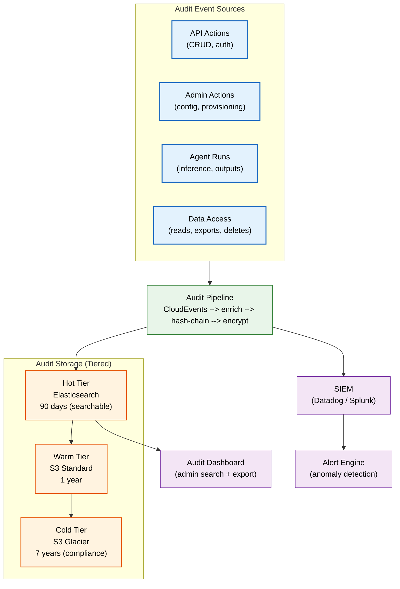

# Audit Policy

> **Purpose:** Define Vaeloom's comprehensive audit policy — what is audited, event priority levels, retention, access controls, review cadence, and SIEM integration
> **Status:** 🆕 New
> **Owner:** Security Team
> **Version:** 1.0
> **Last Updated:** 2026-07-16
> **Dependencies:** [`Audit-Logs.md`](./Audit-Logs.md), [`Compliance.md`](./Compliance.md), [`SOC2.md`](./SOC2.md), [`../Enterprise/Enterprise-Architecture.md`](../Enterprise/Enterprise-Architecture.md), [`../Architecture/Data-Flow.md`](../Architecture/Data-Flow.md)
> **Implementation Status:** 📋 Spec Only

## Overview

Auditing is the backbone of accountability. Every meaningful action in Vaeloom — every login, every document access, every agent run, every config change — is recorded as an immutable audit event. This policy defines *what* we audit, *how* we classify audit events by severity, *how long* we retain them, *who* can access them, and *how often* we review them. This is the policy document; the implementation lives in [`Audit-Logs.md`](./Audit-Logs.md) and the data schema in [`../Database/Data-Dictionary.md`](../Database/Data-Dictionary.md).

## Goals

- Define what actions and events are audited
- Establish audit event severity classification
- Define retention periods per event type
- Specify access controls and immutability guarantees
- Establish review cadence and SIEM integration

## Scope

### In Scope

- Auditable actions and events
- Severity classification
- Retention policy
- Access controls and immutability
- Review cadence (automated + manual)
- SIEM integration

### Out of Scope

- Audit log implementation details (see [`Audit-Logs.md`](./Audit-Logs.md))
- Compliance mapping (see [`SOC2.md`](./SOC2.md), [`Compliance.md`](./Compliance.md))

## Architecture



> **Diagram:** Audit pipeline. Events flow from all sources through enrichment, hash-chaining, and encryption into tiered storage. Hot tier is searchable; cold tier is for compliance retention. SIEM consumes events for anomaly detection.

## What We Audit

| Category | Audited Actions |
|----------|----------------|
| **Authentication** | Login (success + failure), logout, MFA enable/disable, password change, token refresh, session expiry |
| **Authorization** | Permission grant/revoke, role change, access denied (failed authz) |
| **Data Access** | Document read, document export, memory read (sensitive), search query (sampled) |
| **Data Mutation** | Document upload/update/delete, memory create/update/delete, connector connect/disconnect |
| **Admin Actions** | Tenant provision/suspend/offboard, user suspend/unsuspend, SSO config change, feature flag change, billing change |
| **Agent Runs** | Run start/complete/fail/cancel, tool calls, memory writes, guardrail blocks |
| **System Events** | Config changes, deployment, key rotation, backup, restore |

## Severity Classification

| Severity | Criteria | Examples | Alerting |
|----------|----------|----------|----------|
| **Critical** | Security incident; data breach risk | Cross-tenant access attempt, mass data export, admin account compromise | Immediate page (P1) |
| **High** | Significant security or compliance event | Failed login spike, permission escalation, guardrail block, data deletion | Alert within 5 min (P2) |
| **Medium** | Notable operational event | Agent failure, connector sync failure, config change | Daily summary (P3) |
| **Low** | Routine operational event | Document upload, agent run complete, notification sent | No alert; searchable |
| **Info** | System-level metadata | Deployment, backup, health check | No alert; retained |

## Retention Policy

| Tier | Storage | Retention | Purpose |
|------|---------|-----------|---------|
| **Hot** | Elasticsearch | 90 days | Real-time search; anomaly detection; incident investigation |
| **Warm** | S3 Standard | 1 year | Operational analysis; audit trail for support |
| **Cold** | S3 Glacier (immutable) | 7 years | Regulatory compliance (SOC 2, GDPR); legal hold |

After 7 years, events are permanently deleted unless under legal hold.

## Access Controls

| Role | Read Access | Export Access | Notes |
|------|-------------|---------------|-------|
| **Platform Admin** | All tenants | All tenants | Full audit visibility |
| **Tenant Admin** | Own tenant only | Own tenant only | Cannot read other tenants' events |
| **Org Admin** | Own org only | Own org only | Scoped to organization |
| **Security Analyst** | All tenants (read-only) | All tenants | Dedicated security role; no write access |
| **Member** | Own actions only | None | Can see their own activity log |

**Immutability guarantee:** Audit events are append-only and hash-chained. No role — not even Platform Admin — can modify or delete an event. Tampering is detected via hash-chain verification.

## Review Cadence

| Review Type | Cadence | Owner | Scope |
|-------------|---------|-------|-------|
| **Automated anomaly detection** | Real-time | SIEM | All critical/high events |
| **Daily review** | Daily | Security on-call | Critical + high events from previous 24h |
| **Weekly review** | Weekly | Security Team | Trends; recurring medium events |
| **Monthly review** | Monthly | Security + Compliance | Summary report; compliance verification |
| **Quarterly executive review** | Quarterly | CTO + Security Lead | Strategic risks; audit findings |

## Audit Event Schema

See [`../Backend/Event-Catalog.md`](../Backend/Event-Catalog.md) and [`../Database/Data-Dictionary.md`](../Database/Data-Dictionary.md) (`audit_events` table). Every audit event conforms to CloudEvents 1.0 format with hash-chaining for integrity.

## SIEM Integration

```text
SIEM integration (Datadog / Splunk):
  1. Audit pipeline forwards all events to SIEM via HTTP log intake.
  2. SIEM applies detection rules (anomaly, threshold, correlation).
  3. Alerts route to PagerDuty / Slack based on severity.
  4. SIEM retains events per its own retention (aligned with our tiers).
  5. Quarterly: verify SIEM ingestion matches audit pipeline output (no dropped events).
```

## Best Practices

| # | Practice | Rationale |
|---|----------|-----------|
| 1 | Audit every data access, not just mutations | Read access logging is required for SOC 2 (CC6.1) and GDPR |
| 2 | Hash-chain audit events | Detects tampering; proves integrity to auditors |
| 3 | Never allow audit log deletion, even by admins | Immutability is the core trust property of audit logs |
| 4 | Test audit pipeline integrity quarterly | Hash-chain verification confirms no gaps or tampering |

## Risks

| Risk | Likelihood | Impact | Mitigation |
|------|-----------|--------|------------|
| Audit log volume overwhelms storage | Medium | Medium | Tiered storage; sampling for low-severity events |
| SIEM drops events silently | Low | High | Quarterly ingestion verification; alert on volume drop |
| Legal hold prevents required deletion | Low | Medium | Legal hold tracked separately; GC exception documented |

## Future Improvements

| Improvement | Priority | Complexity | Timeline |
|-------------|----------|------------|----------|
| AI-powered audit anomaly detection | Medium | High | Q2 2027 |
| Self-service audit export for enterprise customers | Medium | Medium | Q1 2027 |
| Real-time audit streaming via webhook | Low | Medium | Q3 2027 |

## Related Documents

- [`Audit-Logs.md`](./Audit-Logs.md) — audit log implementation
- [`Compliance.md`](./Compliance.md) · [`SOC2.md`](./SOC2.md) — compliance frameworks
- [`../Enterprise/Enterprise-Architecture.md`](../Enterprise/Enterprise-Architecture.md) — enterprise audit requirements
- [`../Database/Data-Dictionary.md`](../Database/Data-Dictionary.md) — `audit_events` schema
- [`../Backend/Event-Catalog.md`](../Backend/Event-Catalog.md) — event catalog
