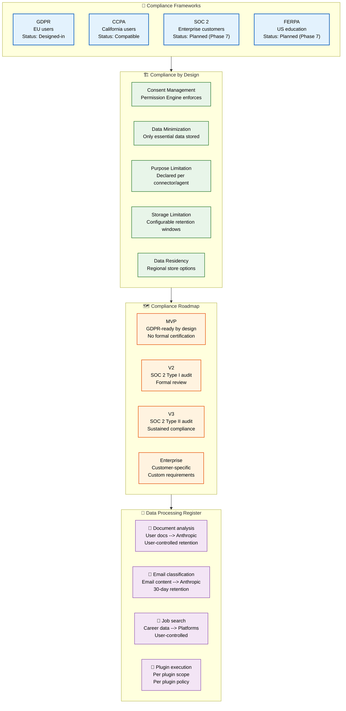
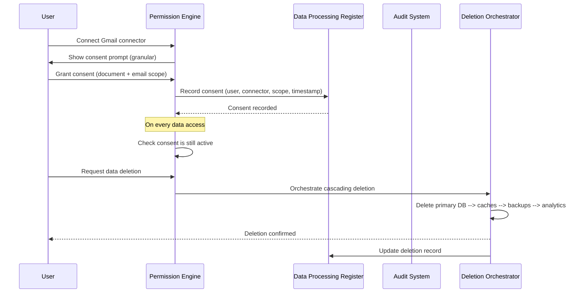

# Compliance

> **Purpose:** Define compliance requirements and posture for Vaeloom
> **Status:** ✅ Upgraded to enterprise quality
> **Owner:** Security Team
> **Last Updated:** 2026-07-13

## Compliance Architecture



> **Diagram:** Compliance architecture organized by **frameworks** (GDPR/CCPA/SOC 2/FERPA with status), **by-design principles** (consent, minimization, purpose, storage, residency), **roadmap** (MVP → V2 → V3 → Enterprise), and **data processing register** showing data categories, third-party processors, and retention periods.

---

## Compliance Frameworks

| Framework | Applicability | Status |
|-----------|---------------|--------|
| GDPR | EU users (all users by design) | Designed-in |
| CCPA | California users | Compatible with GDPR posture |
| SOC 2 | Enterprise customers | Planned for Phase 7 |
| FERPA | US education customers | Planned for Phase 7 |

## Compliance by Design

Vaeloom's architecture is designed with compliance as a core constraint, not an afterthought:

| Requirement | Design Decision |
|-------------|----------------|
| Consent management | Permission Engine enforces granular consent |
| Data minimization | Only essential data stored; extraction is purposeful |
| Purpose limitation | Each connector and agent has declared purpose |
| Storage limitation | Configurable retention windows per data type |
| Data residency | Regional data store options (EU, US, India) |

## Compliance Roadmap

| Phase | Milestone |
|-------|-----------|
| MVP | GDPR-ready by design; no formal certification |
| V2 | SOC 2 Type I audit |
| V3 | SOC 2 Type II audit |
| Enterprise | Customer-specific compliance requirements |

## Data Processing Register

| Processing | Data Categories | Legal Basis | Retention | Third-party |
|------------|----------------|-------------|-----------|-------------|
| Document analysis | User documents | Consent | User-controlled | Anthropic (AI) |
| Email classification | Email content | Consent | 30 days | Anthropic (AI) |
| Job search | Career data | Legitimate interest | User-controlled | Job platforms |
| Plugin execution | Varies by plugin | Plugin consent | Per plugin policy | Plugin providers |

## Common Mistakes

| Mistake | Consequence |
|---------|-------------|
| Treating compliance as a single milestone | SOC 2 Type I is a point-in-time assessment — teams that stop improving after certification fail Type II audits. Build a continuous compliance program, not a checkbox exercise |
| Compliance documentation that doesn't match the actual system | The data processing register lists what the system should do, not what it actually does — conduct regular gap analyses between documented compliance posture and deployed infrastructure |
| Ignoring regional compliance differences | GDPR readiness doesn't automatically mean CCPA or FERPA compliance — each framework has unique requirements (CCPA's right to opt-out, FERPA's parent rights) that need separate handling |

## Best Practices

| Practice | Why |
|----------|-----|
| Build compliance into the design phase, not as a retrofit | Compliance requirements that surface after implementation are expensive to fix — include compliance review in the architecture decision process for every new feature |
| Maintain a living data processing register | The register must be updated whenever a new data type, processor, or processing purpose is added — tie register updates to the feature rollout process |
| Automate compliance evidence collection | Manual evidence gathering for SOC 2 is time-consuming and error-prone — use continuous compliance tools that collect evidence from infrastructure-as-code, logs, and configurations automatically |

## Security

| Concern | Mitigation |
|---------|------------|
| Compliance frameworks that conflict with each other | GDPR requires data minimization while SOC 2 requires comprehensive logging — reconcile conflicting requirements by logging metadata (not content) and applying retention limits |
| Third-party processor compliance gaps | An AI model provider or cloud host may have a data breach that affects your compliance posture — conduct annual third-party security reviews and maintain DPA agreements |
| Compliance drift during rapid development | Fast feature development can introduce data handling practices that don't match compliance docs — include a compliance review gate in the CI/CD pipeline for data-related changes |

## Performance

| Concern | Mitigation |
|---------|------------|
| Compliance logging overhead on every transaction | SOC 2 and GDPR both require detailed audit trails — each transaction generates multiple log entries. Batch compliance log writes and use async ingestion to avoid impacting transaction latency |
| Data retention policies increasing storage costs | GDPR's "right to erasure" requires deletion, while SOC 2 requires 7-year retention — tier data by sensitivity: logs in cold storage, user data in hot storage with deletion scheduling |
| Regional data residency adding network latency | Data that must stay in EU regions while AI processing is in US regions adds 50-100ms — colocate processing and storage within the same region and replicate only aggregated/encrypted data across regions |

## Security Considerations

| Concern | Mitigation |
|---------|------------|
| Compliance frameworks that conflict with each other | GDPR requires data minimization while SOC 2 requires comprehensive logging — reconcile conflicting requirements by logging metadata (not content) and applying retention limits |
| Third-party processor compliance gaps | An AI model provider or cloud host may have a data breach that affects your compliance posture — conduct annual third-party security reviews and maintain DPA agreements |
| Compliance drift during rapid development | Fast feature development can introduce data handling practices that don't match compliance docs — include a compliance review gate in the CI/CD pipeline for data-related changes |

## Performance Considerations

| Concern | Approach |
|---------|----------|
| Compliance logging overhead on every transaction | SOC 2 and GDPR both require detailed audit trails — each transaction generates multiple log entries. Batch compliance log writes and use async ingestion to avoid impacting transaction latency |
| Data retention policies increasing storage costs | GDPR's "right to erasure" requires deletion, while SOC 2 requires 7-year retention — tier data by sensitivity: logs in cold storage, user data in hot storage with deletion scheduling |
| Regional data residency adding network latency | Data that must stay in EU regions while AI processing is in US regions adds 50-100ms — colocate processing and storage within the same region and replicate only aggregated/encrypted data across regions |

## Overview

Vaeloom maintains compliance with multiple regulatory frameworks (GDPR, CCPA, SOC 2, FERPA) through a privacy-by-design architecture that embeds consent management, data minimization, purpose limitation, and storage limitation into every layer. A living data processing register maps all data flows to their legal bases, retention periods, and third-party processors.

---

## Goals

- Achieve and maintain compliance with GDPR, CCPA, SOC 2 Type II, and FERPA across all processing activities
- Implement granular consent management with per-connector, per-purpose toggles and auditable consent records
- Maintain an always-current data processing register that accurately reflects deployed infrastructure
- Automate compliance evidence collection to eliminate manual audit preparation
- Enforce regional data residency with region-locked infrastructure across EU, US, and India

---

## Scope

This document defines the compliance requirements and posture for Vaeloom — covering applicable frameworks (GDPR, CCPA, SOC 2, FERPA), compliance-by-design principles, roadmap, and data processing register. Applies to all data processing activities for all users across all regions. Out of scope: specific GDPR implementation details (see [GDPR.md](./GDPR.md)), privacy principles (see [Privacy.md](./Privacy.md)), audit logging implementation (see [Audit-Logs.md](./Audit-Logs.md)).

---

## Functional Requirements

| ID | Requirement | Priority | Notes |
|----|-------------|----------|-------|
| CM-FR-01 | Consent management must be granular per processing activity | P0 | Per-connector, per-purpose consent toggles |
| CM-FR-02 | Data processing register must be maintained and auditable | P0 | Map all data categories, purposes, processors, retention |
| CM-FR-03 | Deletion must cascade across all storage tiers | P0 | Primary DB, caches, backups, analytics |
| CM-FR-04 | Regional data residency must be enforceable at infrastructure level | P1 | Region-locked resources across EU/US/India |
| CM-FR-05 | Compliance evidence collection must be automated | P1 | Infrastructure-as-code for SOC 2 evidence |

---

## Non-Functional Requirements

| ID | Requirement | Target | Measurement |
|----|-------------|--------|-------------|
| CM-NFR-01 | Consent check latency | <10ms per request | p99 consent lookup |
| CM-NFR-02 | Data export generation | <5min for full export | Time from request to archive ready |
| CM-NFR-03 | Deletion completion (cascade) | <1hr for full deletion | Time from request to all tiers confirmed deleted |
| CM-NFR-04 | Compliance report generation | <1hr automated report | Report generation time |

---

## Workflows

### 1. Consent Management Workflow

1. User connects new connector (e.g., Gmail)
2. Consent prompt shows: purpose, data categories, retention, third-party processors
3. User can toggle: document analysis / email classification / job matching each independently
4. Consent recorded with timestamp and version
5. Permission Engine enforces consent on every data access
6. User can revoke consent at any time (future data stop, not retroactive)

### 2. Compliance Audit Workflow

1. Scheduled compliance audit triggered (quarterly)
2. Automated evidence collection from IAC, logs, configs
3. Data processing register compared against actual deployed infrastructure
4. Gap analysis identifies discrepancies between documented and actual posture
5. Remediation items assigned with SLA deadlines
6. Audit report generated and stored for compliance records

---

## Sequence Diagrams



> **Diagram:** Consent management and deletion flows — granular consent recorded in register; deletion cascades across all storage tiers with confirmation.

---

## Data Flow

```text
User → Connect Connector → Granular Consent Prompt
    → Consent Recorded (register with timestamp + version)
    → Permission Engine enforces on every access
    → Revocation → Future data stop (not retroactive)
    → Deletion Request → Cascading Delete (DB → caches → backups → analytics)
    → Confirmation → Update Register
```

---

## APIs

| Endpoint | Method | Purpose | Auth |
|----------|--------|---------|------|
| `/api/v1/compliance/register` | GET | Export data processing register | Admin token |
| `/api/v1/compliance/audit/run` | POST | Trigger automated compliance audit | Security token |
| `/api/v1/compliance/audit/report/{audit_id}` | GET | Get audit report | Admin token |
| `/api/v1/compliance/consent/{user_id}` | GET | Get user consent records | User token |
| `/api/v1/compliance/gap-analysis` | GET | Current gap between documented vs actual posture | Security token |

---

## Database

| Table | Purpose | Key Columns | Indexes |
|-------|---------|-------------|---------|
| `consent_records` | User consent per connector/scope | `id`, `user_id`, `connector`, `scope`, `granted_at`, `revoked_at`, `consent_version` | `(user_id, connector)`, `(granted_at)` |
| `compliance_audits` | Compliance audit history | `id`, `audit_type`, `status`, `findings_json`, `remediation_items`, `audited_at` | `(status, audited_at)` |
| `data_processing_register` | Current register entries | `processing_activity`, `data_categories`, `legal_basis`, `retention`, `third_parties`, `last_reviewed` | `(processing_activity)` UNIQUE |

---

## Error Handling

| Scenario | Detection | Mitigation | Recovery |
|----------|-----------|------------|----------|
| Consent check fails on data access | Permission Engine denies | Block data access; log denial for audit | User must re-grant consent |
| Deletion cascade fails at one tier | Timeout / error from specific store | Mark deletion as partially complete; retry failed tier | Alert; manual intervention if retry fails |
| Compliance drift detected | Gap analysis finds discrepancy | Flag as remediation item with severity | Assign to team with SLA deadline |
| Third-party processor breach | External notification | Invoke incident response plan; notify affected users | Conduct third-party security review |

---

## Monitoring

| Metric | Alert Threshold | Severity | Dashboard |
|--------|----------------|----------|-----------|
| Consent revocation rate | > 10% of users/quarter | Info | Consent Health |
| Deletion SLA breach rate | > 0 (any breach) | Critical | Compliance SLAs |
| Register staleness | > 90 days since last review | Warning | Register Health |
| Gap analysis severity | Any critical gap | Critical | Compliance Posture |
| Consent version drift | > 2 versions behind current | Info | Consent Freshness |

---

## Deployment

| Environment | Method | Trigger | Verification |
|-------------|--------|---------|-------------|
| Development | Docker Compose | Code push | Consent + deletion unit tests |
| Staging | Helm chart | PR merge | Compliance scenario tests |
| Production | Progressive rollout | Manual approval | Shadow mode consent flow validation |

---

## Configuration

| Variable | Purpose | Default | Required |
|----------|---------|---------|----------|
| `COMPLIANCE_DELETION_RETRY_MAX` | Max retries for deletion cascade | 3 | Yes |
| `COMPLIANCE_CONSENT_MIN_VERSION` | Minimum consent version accepted | 1 | Yes |
| `COMPLIANCE_AUDIT_AUTO_SCHEDULE` | Enable automated compliance audits | true | No |
| `COMPLIANCE_REGION_LOCK_ENABLED` | Enforce data residency | true | Yes |

---

## Examples

### Example 1: Consent Recording

```python
# User connects Gmail with document + email consent
consent = await compliance.record_consent(
    user_id="user_abc",
    connector="gmail",
    scopes=["document_analysis", "email_classification"],
    consent_version=2,
    granted_at=datetime.utcnow()
)

# Each access checks:
allowed = await compliance.check_consent(
    user_id="user_abc",
    connector="gmail",
    scope="email_classification"
)
# Returns True if consent still active
```

---

## Risks

| Risk | Likelihood | Impact | Mitigation |
|------|------------|--------|------------|
| Compliance framework conflicts (GDPR vs SOC 2) | Medium | High | Log metadata not content; tiered retention |
| Third-party processor compliance gap | Medium | Critical | Annual third-party security reviews; DPA agreements |
| Compliance drift during rapid development | High | Medium | Include compliance review gates in CI/CD |
| Regional data residency violation | Low | Critical | Region-locked infrastructure; automated violation detection |

---

## Limitations

| Limitation | Impact | Workaround | Future Resolution |
|------------|--------|------------|-------------------|
| Compliance evidence partially manual | Some evidence collected by hand | Automated collection for infrastructure-as-code | Full automated evidence pipeline (Phase 2) |
| SOC 2 Type II not yet achieved | Enterprise customers may require it | Type I report available; Type II in progress | Type II audit (Phase 3, V3) |
| FERPA compliance not yet verified | Cannot serve US education market | Manual assessment but not certified | FERPA certification (Phase 7) |
| No cross-border data transfer framework (SCCs not yet formalized) | EU-US transfers at risk | Standard Contractual Clauses included in DPA | Formal SCCs with all processors (Phase 2) |

---

## Future Improvements

| Improvement | Priority | Complexity | Timeline |
|-------------|----------|------------|----------|
| Full automated compliance evidence pipeline | High | High | Phase 2 (Q4 2026) |
| SOC 2 Type II audit completion | High | High | Phase 3 (Q1 2027) |
| FERPA certification for education market | Medium | High | Phase 7 |
| Continuous compliance monitoring dashboard | Medium | Medium | Phase 2 (Q4 2026) |

## Related Documents

- [GDPR.md](./GDPR.md)
- [Privacy.md](./Privacy.md)
- [Audit Logs.md](./Audit-Logs.md)
- [`/docs/06-Vaeloom-Enterprise-Paper.md#19-security--compliance`](../../docs/06-Vaeloom-Enterprise-Paper.md#19-security--compliance)
