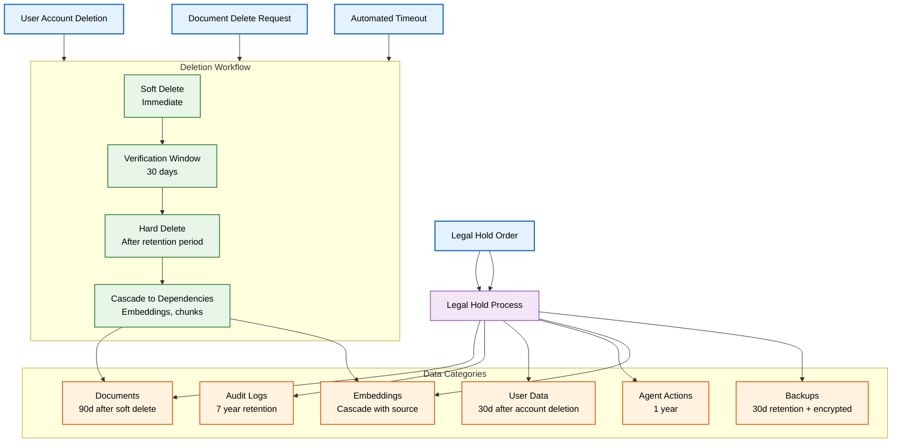
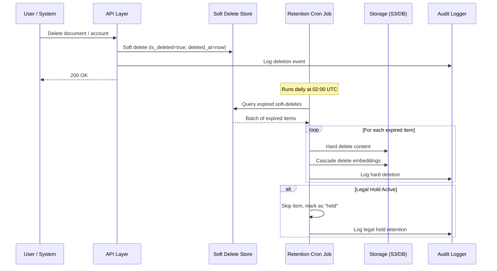
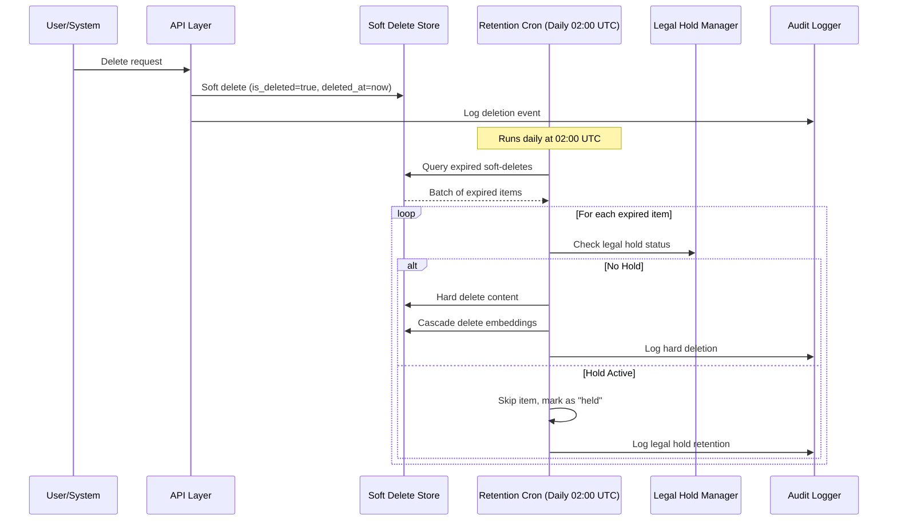

# Data Retention Policy

> **Purpose:** Define retention schedules, deletion workflows, and legal hold procedures for all data types in Vaeloom
> **Status:** 🆕 New
> **Owner:** Security Team
> **Last Updated:** 2026-07-13

## Overview

Vaeloom maintains a comprehensive data retention policy that balances operational requirements, regulatory compliance (GDPR, SOC 2, HIPAA readiness), and storage cost optimization. Every data category has a defined retention schedule, deletion workflow, and legal hold mechanism.

This policy applies to all production, staging, and backup environments. Retention periods are measured from the triggering event (account deletion, document deletion, log generation) unless otherwise specified.

## Retention Architecture



## Retention Schedules

| Data Category | Retention Period | Trigger | Cascade Effect |
|--------------|-----------------|---------|----------------|
| **Documents** | 90 days | Soft delete by user | Embeddings deleted in same cascade |
| **Audit Logs** | 7 years | Log generation | No cascade — independent retention |
| **User Data** | 30 days | Account deletion request | All user-owned documents, agents, preferences deleted after 30d |
| **Agent Actions** | 1 year | Action completion | Execution logs, inputs, outputs tied to action |
| **Embeddings** | Cascaded | Deletion of source document | Immediately deleted when source document is hard-deleted |
| **Backups** | 30 days | Snapshot creation | Full encrypted backup; point-in-time recovery |
| **Session Data** | 24 hours | Session end (logout/expire) | No cascade |
| **Billing Records** | 7 years (tax) | Invoice generation | Retained for tax compliance; anonymized after user deletion |

## Deletion Workflow



## Legal Hold Procedures

When a legal hold is issued, affected data is exempt from all automated deletion:

```typescript
interface LegalHold {
  id: string;
  issued_by: string;          // Legal team member
  case_reference: string;     // External case number
  scope: {
    user_ids?: string[];      // All data owned by these users
    workspace_ids?: string[]; // All data in these workspaces
    date_range?: {            // Data created in this window
      start: string;
      end: string;
    };
  };
  issued_at: string;
  expires_at: string | null;  // null = indefinite until lifted
  status: 'active' | 'lifted';
}
```

**Legal hold process:**

1. Legal team submits hold order via admin console
2. Hold is applied at database level — soft-deleted records remain in `deleted_` tables
3. Backup rotation excludes held backups from the 30-day deletion cycle
4. Weekly compliance report lists all active legal holds
5. Hold is lifted via admin console with audit trail

## Best Practices

| Practice | Rationale |
|----------|----------|
| Always soft delete first | Provides a recovery window (30 days) for accidental deletions; hard delete only after retention period expires |
| Cascade embeddings with source documents | Orphaned embeddings consume storage and may leak information from deleted documents |
| Log every deletion event | Immutable audit trail for compliance; includes who deleted what, when, and via which context |
| Encrypt backups at rest and in transit | Backups contain all user data; AES-256 encryption with separate key from production keys |

## Common Mistakes

| Mistake | Consequence | Fix |
|---------|-------------|-----|
| Hard deleting immediately | No recovery window for accidental deletions; user data permanently lost | Implement soft delete with configurable grace period; hard delete only via cron |
| Forgetting cascade deletes | Orphan embeddings, agent runs, and audit associations left behind after source deletion | Define cascade rules in the data model; test cascade behavior in CI |
| Inconsistent retention across envs | Staging data retained indefinitely; dev environments leak PII | Apply same retention policy to staging; dev environments use synthetic data only |
| No legal hold override | Automated deletion destroys evidence during litigation | Legal hold flag checked before every hard deletion; held items logged and preserved |

## Security Considerations

| Concern | Mitigation |
|---------|-----------|
| Deleted data recovery | Soft-deleted data stored in separate `deleted_` tables with restricted access; full hard delete zeros out storage blocks |
| Legal hold bypass | Hold checked in the same transaction as deletion; bypass requires admin console with MFA + audit approval |
| Backup encryption | Backups encrypted with AES-256-GCM; keys stored in cloud KMS with automatic rotation; separate from production keys |
| Cross-border deletion | Data deleted in accordance with GDPR right-to-erasure; deletion confirmed within 30 days; cross-region replication pauses during deletion |
| Retention compliance audit | Monthly automated scan compares actual retention against policy; violations alert security team |

## Performance Considerations

| Concern | Mitigation |
|---------|-----------|
| Hard delete of large workspaces | Deletion batched (1000 records / batch) and queued; user-facing delete returns immediately; processing runs async |
| Cascade delete latency | Foreign key cascades indexed; embeddings deletion runs in parallel via background workers |
| Soft delete table growth | Soft-deleted records moved to archive tables with same schema; retention cron processes oldest first |
| Legal hold scan overhead | Legal hold index on `deleted_at` + `hold_active`; typical scan <100ms even with millions of records |
| Backup restore with retention | Backup restored to isolated environment; retention enforcement applies upon promotion to production |

## Scope

This document defines the data retention schedules, deletion workflows, legal hold procedures, and backup lifecycle for all data types in Vaeloom. It applies to all production, staging, and backup environments across all regions. Out of scope: encryption of retained data (see [Encryption.md](./Encryption.md)), audit log retention specifics (see [Audit-Logs.md](./Audit-Logs.md)), privacy principles (see [Privacy.md](./Privacy.md)).

---

## Functional Requirements

| ID | Requirement | Priority | Notes |
|----|-------------|----------|-------|
| DR-FR-01 | Every data category must have a defined retention schedule | P0 | Trigger event + period + cascade effect |
| DR-FR-02 | Soft delete must precede hard delete with configurable grace period | P0 | 30-day recovery window default |
| DR-FR-03 | Embeddings must cascade-delete with source documents | P0 | No orphaned embeddings |
| DR-FR-04 | Legal hold must override all automated deletion | P0 | Hold checked in same transaction as deletion |
| DR-FR-05 | Deletion must be logged with full audit trail | P1 | Who, what, when, via which context |

---

## Non-Functional Requirements

| ID | Requirement | Target | Measurement |
|----|-------------|--------|-------------|
| DR-NFR-01 | Soft-to-hard-delete transition lag | <24h | Time from grace period expiry to hard delete |
| DR-NFR-02 | Cascading deletion completion | <1hr for 100K records | Time from trigger to all tiers confirmed |
| DR-NFR-03 | Legal hold check latency | <5ms per check | p99 lookup with hold-active flag |
| DR-NFR-04 | Backup restoration with retention | <4hr | Time to restore from encrypted backup |

---

## Components

| Component | Responsibility | Technology | Scale Strategy |
|-----------|---------------|------------|----------------|
| Soft Delete Store | Mark records as deleted without removing them | Same DB with is_deleted flag | Partitioned deleted_ tables per source table |
| Retention Cron Job | Check for expired soft-deletes and perform hard delete | Scheduled job (daily, 02:00 UTC) | Batch processing with 1000 records/batch |
| Legal Hold Manager | Apply and track legal holds across all data categories | Admin console + DB flag | Indexed on deleted_at + hold_active |
| Cascade Controller | Coordinate deletion across dependent stores | Orchestrator with retry logic | Parallel background workers per store |
| Backup Encryptor | Encrypt and rotate backup snapshots | Cloud KMS + AES-256-GCM | Separate key from production keys |

---

## Workflows

### 1. Standard Deletion Workflow

1. User deletes document or account
2. Record marked as soft-deleted (`is_deleted=true`, `deleted_at=now()`)
3. Deletion event logged to audit
4. Retention cron (daily) queries expired soft-deletes
5. For each expired item: check legal hold status
6. If no hold: hard delete content + cascade delete embeddings
7. Hard deletion logged to audit

### 2. Legal Hold Workflow

1. Legal team submits hold order via admin console
2. Hold scope defined: user_ids, workspace_ids, date_range
3. Hold applied at database level
4. Weekly compliance report lists all active holds
5. All automated deletion checks hold status before proceeding
6. Hold lifted via admin console with audit trail

---

## Sequence Diagrams



> **Diagram:** Deletion workflow — soft delete immediately, retention cron processes expired items daily, legal hold check before each hard delete. Held items are preserved with audit logging.

---

## Data Flow

```text
Delete Request → Soft Delete (is_deleted=true, deleted_at=now)
    → Audit Log: deletion event
    → Daily Retention Cron: Query expired soft-deletes
    → Legal Hold Check (hold_active?)
    → [No Hold] → Hard Delete + Cascade (embeddings, dependencies)
    → [Hold Active] → Skip, mark "held", log
    → Audit Log: hard deletion / hold retention
```

---

## APIs

| Endpoint | Method | Purpose | Auth |
|----------|--------|---------|------|
| `/api/v1/retention/delete` | POST | Trigger soft/hard delete for data | User token (soft) / Admin token (hard) |
| `/api/v1/retention/cascade` | POST | Trigger cascading deletion | Admin token |
| `/api/v1/retention/legal-hold` | POST | Apply or lift legal hold | Security token |
| `/api/v1/retention/status/{data_id}` | GET | Get retention status for specific data | Admin token |
| `/api/v1/retention/report` | GET | Get retention compliance report | Admin token |

---

## Database

| Table | Purpose | Key Columns | Indexes |
|-------|---------|-------------|---------|
| `deletion_queue` | Records pending hard deletion | `id`, `source_table`, `source_id`, `soft_deleted_at`, `hard_delete_at`, `legal_hold_active`, `status` | `(hard_delete_at, status)`, `(legal_hold_active)` |
| `legal_holds` | Active and historical legal holds | `id`, `case_reference`, `scope_json`, `issued_by`, `issued_at`, `expires_at`, `status` | `(status, expires_at)` |
| `deletion_audit` | Audit trail of all deletions | `id`, `source_id`, `deletion_type` (soft/hard/cascade), `triggered_by`, `created_at` | `(source_id)`, `(created_at)` |

---

## Scalability

| Dimension | Current Limit | 10x Strategy | 100x Strategy |
|-----------|--------------|--------------|---------------|
| Soft-deleted records | 1M concurrent | 10M (archive tables) | 100M (partitioned by month) |
| Deletion batch size | 1000 records/batch | 10K records/batch | 100K records/batch (parallel workers) |
| Legal holds active | 10 concurrent | 100 (scoped per workspace) | 1000 (regional hold management) |
| Retention cron runtime | 10 min | 60 min | 4 hours (parallel processing) |

---

## Error Handling

| Scenario | Detection | Mitigation | Recovery |
|----------|-----------|------------|----------|
| Cascade delete fails on one store | Timeout/error from store | Retry failed store (3 attempts); log failure | Alert; manual intervention if persistent |
| Legal hold conflicts with deletion | Hold flag prevents delete | Skip item, mark as "held", log | Hold lifted by legal team; item re-processed |
| Retention cron fails mid-batch | Batch processing error | Roll back current batch; resume from last successful | Alert; manual restart or next cron cycle |
| Backup restore includes deleted data | Data restored from pre-deletion snapshot | Restore to isolated environment; apply retention on promotion | Re-run deletion cascade after promotion |

---

## Monitoring

| Metric | Alert Threshold | Severity | Dashboard |
|--------|----------------|----------|-----------|
| Soft delete backlog | > 1M pending | Warning | Retention Pipeline |
| Hard delete latency | > 48h past due | Critical | Retention Pipeline |
| Legal hold count | > 20 active | Info | Legal Holds |
| Cascade failure rate | > 1% of deletions | Critical | Deletion Health |
| Retention cron runtime | > 2 hours | Warning | Cron Performance |

---

## Deployment

| Environment | Method | Trigger | Verification |
|-------------|--------|---------|-------------|
| Development | Docker Compose | Code push | Deletion unit tests |
| Staging | Helm chart | PR merge | Retention scenario tests |
| Production | Progressive rollout | Manual approval | Legal hold + cascade verification |

---

## Configuration

| Variable | Purpose | Default | Required |
|----------|---------|---------|----------|
| `RETENTION_SOFT_DELETE_DAYS` | Grace period before hard delete | 30 | Yes |
| `RETENTION_CRON_SCHEDULE` | Cron schedule for retention job | 0 2 ** * | Yes |
| `RETENTION_BATCH_SIZE` | Records per deletion batch | 1000 | No |
| `RETENTION_LEGAL_HOLD_ENABLED` | Enable legal hold feature | true | No |
| `RETENTION_BACKUP_ENCRYPTION` | Enable backup at-rest encryption | true | Yes |

---

## Examples

### Example 1: Soft Delete Flow

```python
# User deletes a document
await retention.soft_delete(
    source_table="documents",
    source_id="doc_abc123",
    deleted_by="user_456"
)
# Result: is_deleted=true, deleted_at=2026-07-13T10:00:00Z

# Retention cron processes after 30 days
job = await retention.process_expired(batch_size=1000)
# Checks legal hold → No hold → Hard delete + cascade embeddings
# Logs: hard_deletion completed for doc_abc123
```

---

## Risks

| Risk | Likelihood | Impact | Mitigation |
|------|------------|--------|------------|
| Accidental hard delete before grace period | Low | Critical | Soft delete always first; hard delete only via cron |
| Legal hold not checked before deletion | Low | Critical | Hold check in same transaction as deletion |
| Orphaned embeddings after source deletion | Medium | Medium | Cascade delete enforced at data model level |
| Backup contains data that should be deleted | Medium | High | Deletion ledger covers all storage tiers including backups |

---

## Limitations

| Limitation | Impact | Workaround | Future Resolution |
|------------|--------|------------|-------------------|
| Retention cron runs once daily | Up to 24h delay between expiry and hard delete | Acceptable for data lifecycle | Continuous expiration check (Phase 2) |
| Legal hold is manual (admin console) | Legal time-sensitive holds may be delayed | Pre-approval for common hold patterns | API-based legal hold with automated case integration (Phase 3) |
| Cascade delete is synchronous within batch | Slows batch processing | Each batch is independent | Async cascade with progress tracking (Phase 2) |
| No deletion preview before hard delete | Cannot see what will be deleted in next batch | Manual review of pending queue | Deletion preview report (Phase 3) |

---

## Goals

- Define precise retention schedules for every data category with clear trigger events and cascade effects
- Implement a two-phase deletion workflow (soft delete → verified grace period → hard delete) with legal hold override
- Ensure cascading deletion of dependent data (embeddings, agent actions, audit records) when source data is deleted
- Maintain legal hold capabilities that override all automated deletion with full audit trail
- Apply consistent retention policies across production, staging, and backup environments

---

## Future Improvements

| Improvement | Priority | Complexity | Timeline |
|-------------|----------|------------|----------|
| Continuous expiration check (near real-time) | High | Medium | Phase 2 (Q4 2026) |
| Async cascade deletion with progress tracking | Medium | Medium | Phase 2 (Q4 2026) |
| API-based legal hold management | Medium | Medium | Phase 3 (Q1 2027) |
| Deletion preview report for admin review | Low | Low | Phase 3 (Q1 2027) |

## Related Documents

- [Security Architecture.md](./Security-Architecture.md)
- [GDPR Compliance.md](./GDPR.md)
- [Compliance.md](./Compliance.md)
- [Audit Logs.md](./Audit-Logs.md)
- [Encryption.md](./Encryption.md)
