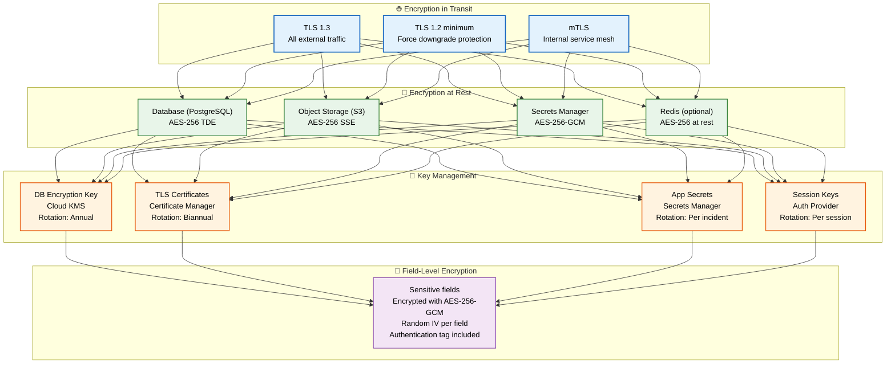
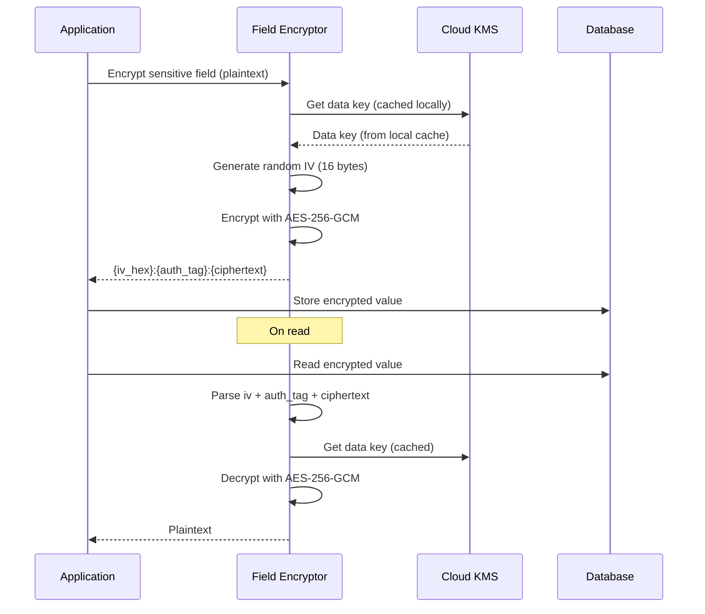

# Encryption

> **Purpose:** Define encryption standards for Meridian
> **Status:** ✅ Upgraded to enterprise quality
> **Owner:** Security Team
> **Last Updated:** 2026-07-13

## Encryption Architecture



> **Diagram:** Encryption spans three layers — **transit** (TLS 1.3 external, mTLS internal), **at rest** (AES-256 for DB, S3, secrets, Redis), and **key management** with rotation policies. Field-level encryption protects the most sensitive data with per-field IVs and authentication tags.

---

## Encryption Standards

| Data State | Standard | Algorithm |
|------------|----------|-----------|
| In transit | TLS 1.3 | AES-256-GCM |
| At rest (database) | Transparent Data Encryption | AES-256 |
| At rest (object storage) | Server-side encryption | AES-256 |
| At rest (secrets) | Secrets manager encryption | AES-256 |

## Key Management

| Key Type | Storage | Rotation |
|----------|---------|----------|
| Database encryption key | Cloud KMS | Annual |
| TLS certificates | Certificate manager | Biannual |
| Application secrets | Secrets manager | Per incident |
| User session keys | Auth provider | Per session |

## TLS Configuration

```nginx
# Minimum TLS version
ssl_protocols TLSv1.3 TLSv1.2;
ssl_ciphers HIGH:!aNULL:!MD5;
ssl_prefer_server_ciphers on;
ssl_session_cache shared:SSL:10m;
ssl_session_timeout 10m;
```

## Encryption at Rest Implementation

```typescript
// For sensitive fields that need field-level encryption
import { createCipheriv, createDecipheriv } from 'node:crypto';

function encryptField(plaintext: string, key: Buffer): string {
  const iv = crypto.randomBytes(16);
  const cipher = createCipheriv('aes-256-gcm', key, iv);
  const encrypted = cipher.update(plaintext, 'utf8', 'hex') + cipher.final('hex');
  const authTag = cipher.getAuthTag().toString('hex');
  return `${iv.toString('hex')}:${authTag}:${encrypted}`;
}
```

## Common Mistakes

| Mistake | Consequence |
|---------|-------------|
| Using the same encryption key for everything | A single compromised key exposes all data — use a key hierarchy: a master key encrypts data keys, which encrypt individual records or fields. Rotate data keys frequently, master key annually |
| Encrypting everything without considering performance | Full-database encryption (TDE) adds 5-15% CPU overhead — use field-level encryption for sensitive fields only (PII, tokens) and TDE for the rest to balance security and performance |
| Not handling key rotation for existing encrypted data | Rotating the encryption key doesn't re-encrypt existing data unless a key-wrapping scheme is used — use an envelope encryption pattern where the data key is wrapped by the master key, allowing key rotation without re-encrypting |

## Best Practices

| Practice | Why |
|----------|-----|
| Use envelope encryption with a key hierarchy | A master key (cloud KMS) encrypts data keys, which encrypt individual records — rotating the master key doesn't require re-encrypting all data, and data key rotation is low-cost |
| Encrypt sensitive fields at the application layer, not just at rest | Database-level TDE protects against disk theft but not against compromised database queries — field-level encryption ensures that even a SQL injection attack can't read encrypted columns |
| Automate key rotation with a rotation schedule | Manual key rotation is unreliable — use cloud KMS automatic rotation for master keys (annual) and implement scheduled rotation jobs for data keys (90 days) |

## Security

| Concern | Mitigation |
|---------|------------|
| Key material exposure through application logs | Encryption keys loaded into memory can be dumped via debug endpoints or core dumps — never log key material, zero out memory after use, and isolate encryption operations to a dedicated service |
| Downgrade attack on TLS version | An attacker can force a connection to TLS 1.0 if the server supports it — configure the server to reject TLS versions below 1.2 and use HTTP Strict-Transport-Security headers to prevent downgrade at the client |
| Encrypted data that can be brute-forced | Weak algorithms (DES, RC4) or short key lengths (128-bit) can be brute-forced — enforce a minimum of AES-256 for all encryption operations and use authenticated encryption (GCM) to prevent tampering |

## Performance

| Concern | Mitigation |
|---------|------------|
| Application-layer encryption overhead on reads | Every encrypted field must be decrypted on read — each decryption adds 1-5ms per field. Encrypt only the most sensitive fields (tokens, PII) and leave non-sensitive data unencrypted at the application layer |
| TLS handshake latency for frequent connections | Each new TLS connection adds a 1-3 round trip handshake — use connection pooling with keep-alive and TLS session resumption to eliminate handshake overhead on repeated connections |
| Key management API latency on every encryption operation | Calling cloud KMS for every encryption/decryption adds 10-50ms per call — cache the data key locally and only call KMS for master key operations (key rotation, initial unwrapping) |

## Security Considerations

| Concern | Mitigation |
|---------|------------|
| Key material exposure through application logs | Encryption keys loaded into memory can be dumped via debug endpoints or core dumps — never log key material, zero out memory after use, and isolate encryption operations to a dedicated service |
| Downgrade attack on TLS version | An attacker can force a connection to TLS 1.0 if the server supports it — configure the server to reject TLS versions below 1.2 and use HTTP Strict-Transport-Security headers to prevent downgrade at the client |
| Encrypted data that can be brute-forced | Weak algorithms (DES, RC4) or short key lengths (128-bit) can be brute-forced — enforce a minimum of AES-256 for all encryption operations and use authenticated encryption (GCM) to prevent tampering |

## Performance Considerations

| Concern | Approach |
|---------|----------|
| Application-layer encryption overhead on reads | Every encrypted field must be decrypted on read — each decryption adds 1-5ms per field. Encrypt only the most sensitive fields (tokens, PII) and leave non-sensitive data unencrypted at the application layer |
| TLS handshake latency for frequent connections | Each new TLS connection adds a 1-3 round trip handshake — use connection pooling with keep-alive and TLS session resumption to eliminate handshake overhead on repeated connections |
| Key management API latency on every encryption operation | Calling cloud KMS for every encryption/decryption adds 10-50ms per call — cache the data key locally and only call KMS for master key operations (key rotation, initial unwrapping) |

## Overview

Meridian's encryption strategy covers three data states — in transit (TLS 1.3), at rest (AES-256 TDE/SSE), and in use (field-level AES-256-GCM with per-record IVs). Key management follows an envelope encryption pattern where a master key in cloud KMS wraps data keys, enabling zero-downtime rotation without re-encrypting all stored data.

---

## Goals

- Encrypt all data in transit with TLS 1.3 and enforce mTLS for internal service-to-service communication
- Apply AES-256 encryption at rest across database, object storage, secrets, and cache layers
- Protect sensitive fields (tokens, PII) with application-layer AES-256-GCM encryption using per-field random IVs
- Implement automated key rotation with zero downtime using envelope encryption pattern
- Maintain key hierarchy with master keys in cloud KMS and data keys cached locally for performance

---

## Scope

---

## Functional Requirements

| ID | Requirement | Priority | Notes |
|----|-------------|----------|-------|
| EN-FR-01 | All external traffic must use TLS 1.3 | P0 | TLS 1.2 minimum; downgrade protection |
| EN-FR-02 | Service-to-service communication must use mTLS | P0 | Internal service mesh |
| EN-FR-03 | All data at rest must be encrypted with AES-256 | P0 | DB, object storage, secrets, Redis |
| EN-FR-04 | Sensitive fields must be encryptable at application layer | P1 | AES-256-GCM with per-field IV |
| EN-FR-05 | Key rotation must be automated with defined schedule | P1 | Envelope encryption pattern |

---

## Non-Functional Requirements

| ID | Requirement | Target | Measurement |
|----|-------------|--------|-------------|
| EN-NFR-01 | TLS handshake latency | <100ms (with session resumption) | p99 handshake time |
| EN-NFR-02 | Field encryption/decryption overhead | <5ms per field | p99 encryption + decryption time |
| EN-NFR-03 | TDE CPU overhead | <15% additional CPU | CPU utilization vs unencrypted baseline |
| EN-NFR-04 | Key rotation downtime | Zero (envelope pattern) | Service uptime during rotation |

---

## Components

| Component | Responsibility | Technology | Scale Strategy |
|-----------|---------------|------------|----------------|
| TLS Terminator | Terminate and enforce TLS for all external connections | Load balancer / reverse proxy | Regional termination points |
| mTLS Service Mesh | Authenticate and encrypt internal service calls | Service mesh (Istio/Linkerd) | Per-service certificates with distinct CNs |
| TDE Engine | Transparent encryption of database at rest | Cloud provider TDE (AWS/GCP) | Automatic; no application changes needed |
| Field Encryptor | Application-layer encryption of sensitive fields | Custom library (AES-256-GCM) | Encrypt only sensitive fields; cache keys locally |
| Key Manager | Rotate and store all encryption keys | Cloud KMS | Automatic rotation; master key annually |

---

## Workflows

### 1. Field-Level Encryption Workflow

1. Application identifies sensitive field (e.g., OAuth token, PII)
2. Data key retrieved from local cache (loaded from KMS at startup)
3. Random IV generated (16 bytes) per field
4. Field encrypted with AES-256-GCM using data key + IV
5. Encrypted value stored as `{iv_hex}:{auth_tag_hex}:{ciphertext_hex}`
6. On read: decrypt using same IV + data key
7. Data key rotated: old key kept for decryption, new key for encryption

### 2. Key Rotation Workflow

1. Cloud KMS automatic rotation generates new master key version
2. New data key wrapped with new master key version
3. Old data key retained for decrypting existing records
4. New writes use new data key
5. Old data key retired after all records re-encrypted (optional)

---

## Sequence Diagrams



> **Diagram:** Field-level encryption — data key loaded once from KMS, cached locally, used to encrypt/decrypt fields with random IV per field. Envelope pattern allows key rotation without re-encrypting all data.

---

## Data Flow

```text
Plaintext → Field Encryptor → Generate IV (16 bytes random)
    → AES-256-GCM Encrypt (with data key + IV)
    → Auth Tag (16 bytes)
    → Store: {iv_hex}:{auth_tag_hex}:{ciphertext_hex}
    → On Read: Parse → Decrypt (with same data key + IV)
    → Plaintext
```

---

## APIs

| Endpoint | Method | Purpose | Auth |
|----------|--------|---------|------|
| `/api/v1/encryption/encrypt` | POST | Encrypt a sensitive field value | Service token |
| `/api/v1/encryption/decrypt` | POST | Decrypt a sensitive field value | Service token |
| `/api/v1/encryption/key-status` | GET | Check key rotation status and age | Admin token |
| `/api/v1/encryption/rotate` | POST | Trigger manual key rotation | Security token |

---

## Database

| Table | Purpose | Key Columns | Indexes |
|-------|---------|-------------|---------|
| `encryption_keys` | Data key versions and metadata | `key_id`, `algorithm`, `created_at`, `status` (active/retired), `wrapped_by` | `(status)` |
| `encryption_audit` | Log all encryption/decryption operations | `id`, `operation`, `field_type`, `key_id`, `initiated_by`, `created_at` | `(created_at)`, `(operation)` |

---

## Scalability

| Dimension | Current Limit | 10x Strategy | 100x Strategy |
|-----------|--------------|--------------|---------------|
| Encryption operations/sec | 1000/sec per instance | 10K/sec (cached data keys) | 100K/sec (dedicated encryption service) |
| Key cache size | 10 keys | 100 keys (per-service key pools) | 1000 keys (sharded cache) |
| TLS connections | 1000 concurrent | 10K concurrent (pooling + resumption) | 100K concurrent (regional termination) |

---

## Error Handling

| Scenario | Detection | Mitigation | Recovery |
|----------|-----------|------------|----------|
| KMS unavailable for key retrieval | Timeout connecting to KMS | Use cached data key (warn if >24h old) | Retry KMS; if still down, alert |
| Decryption fails (wrong key/tampered data) | Auth tag verification fails | Return error; log potential tampering | Investigate data integrity; restore from backup if needed |
| TLS certificate expired | Certificate validation fails | Auto-renew via certificate manager; alert if renewal fails | Manual certificate replacement |
| Key rotation fails mid-process | Rotation job error | Keep old key active; retry rotation | Manual intervention if auto-retry fails |

---

## Monitoring

| Metric | Alert Threshold | Severity | Dashboard |
|--------|----------------|----------|-----------|
| Encryption latency (p95) | > 10ms per field | Warning | Encryption Performance |
| Key age (master key) | > 13 months without rotation | Critical | Key Rotation |
| Certificate expiry | < 30 days before expiry | Warning | Certificate Health |
| KMS availability | < 99.99% | Critical | KMS Health |
| Decryption failure rate | > 0.1% | Critical | Encryption Errors |

---

## Deployment

| Environment | Method | Trigger | Verification |
|-------------|--------|---------|-------------|
| Development | Local TLS + AES mock | Code push | Encryption unit tests |
| Staging | TLS cert from staging CA | PR merge | Encryption integration tests |
| Production | KMS + managed TLS certs | Manual approval | TLS scan + encryption verification |

---

## Configuration

| Variable | Purpose | Default | Required |
|----------|---------|---------|----------|
| `ENCRYPTION_ALGORITHM` | Encryption algorithm | AES-256-GCM | Yes |
| `ENCRYPTION_KEY_ROTATION_DAYS` | Key rotation interval | 365 | Yes |
| `ENCRYPTION_TLS_MIN_VERSION` | Minimum TLS version | TLSv1.2 | Yes |
| `ENCRYPTION_FIELD_LIST` | Comma-separated field paths to encrypt | tokens,secrets,pii | Yes |
| `ENCRYPTION_KMS_KEY_ID` | KMS master key identifier | (from env) | Yes |

---

## Examples

### Example 1: Field-Level Encryption

```typescript
// Encrypt a sensitive field
const encrypted = encryptField(
  "sk-ant-abc123def456",
  encryptionKey
);
// Result: "a1b2c3d4e5f6:7g8h9i0j:encrypted_hex_string"

// Decrypt
const decrypted = decryptField(encrypted, encryptionKey);
// Result: "sk-ant-abc123def456"
```

---

## Risks

| Risk | Likelihood | Impact | Mitigation |
|------|------------|--------|------------|
| Key material exposed via application logs | Low | Critical | Never log key material; zero memory after use; isolated encryption service |
| TLS downgrade attack | Low | High | Reject TLS versions below 1.2; HSTS headers |
| Weak algorithm used for legacy compatibility | Low | High | Enforce minimum AES-256; block weak ciphers at load balancer |
| KMS downtime blocks all encrypt/decrypt operations | Low | Medium | Cache data keys locally; only call KMS for master key operations |

---

## Limitations

| Limitation | Impact | Workaround | Future Resolution |
|------------|--------|------------|-------------------|
| TDE adds 5-15% CPU overhead | Performance impact on database | Use field-level encryption only for sensitive fields | Hardware-backed encryption (Phase 3) |
| Field-level encryption prevents DB indexing | Cannot search encrypted fields | Encrypt only fields that don't need indexing | Searchable encryption schemes (Phase 4) |
| Key rotation requires old key retention | Key storage grows with each rotation | Retain only last 2 key versions | Ephemeral key scheme (Phase 4) |

---

## Future Improvements

| Improvement | Priority | Complexity | Timeline |
|-------------|----------|------------|----------|
| Hardware-backed encryption for reduced CPU overhead | Medium | High | Phase 3 (Q1 2027) |
| Searchable encryption for indexed encrypted fields | Low | High | Phase 4 (Q2 2027) |
| Ephemeral key scheme for reduced key storage | Low | High | Phase 4 (Q2 2027) |
| Automated re-encryption on key rotation | Medium | Medium | Phase 2 (Q4 2026) |

## Related Documents

- [Security Architecture.md](./Security-Architecture.md)
- [Secrets.md](./Secrets.md)
- [Compliance.md](./Compliance.md)
