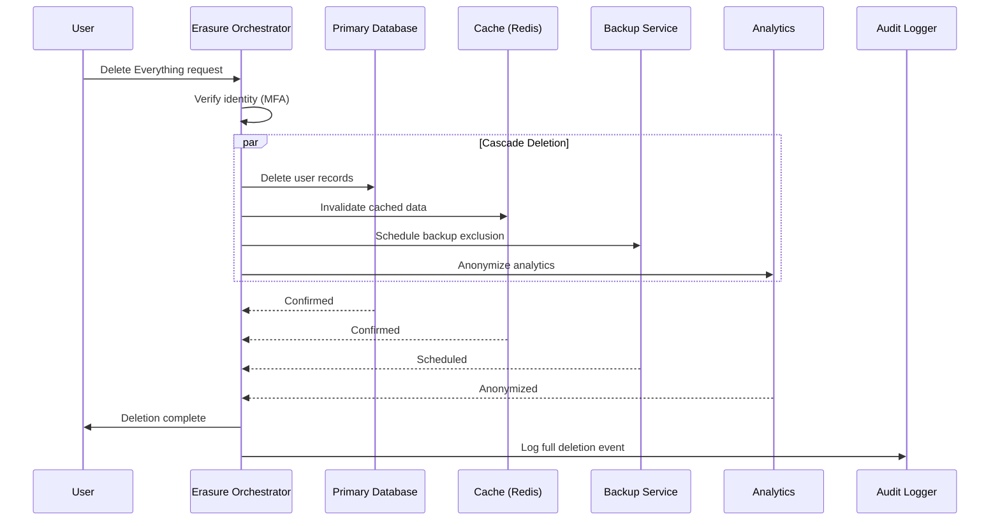

# GDPR Compliance

> **Purpose:** Define GDPR compliance posture for Vaeloom
> **Status:** ✅ Upgraded to enterprise quality
> **Owner:** Security Team
> **Last Updated:** 2026-07-13

## GDPR Compliance Architecture

```mermaid
graph TD
    classDef req fill:#e3f2fd,stroke:#1565c0,color:#000,stroke-width:2px
    classDef right fill:#e8f5e9,stroke:#2e7d32,color:#000,stroke-width:1.5px
    classDef process fill:#fff3e0,stroke:#e65100,color:#000,stroke-width:1.5px
    classDef register fill:#f3e5f5,stroke:#6a1b9a,color:#000,stroke-width:1px

    subgraph Requirements["📋 Key GDPR Requirements"]
        direction TB
        R1["Explicit Consent<br/>Granular per-data-access"]
        R2["Right to Access<br/>Export everything action"]
        R3["Right to Erasure<br/>Delete everything action"]
        R4["Data Portability<br/>Full memory export (JSON)"]
        R5["Data Residency<br/>EU / US / India options"]
        R6["Consent Revocation<br/>Future data stop, not retroactive"]
    end

    subgraph Rights["🛡️ Data Subject Rights"]
        S1["Right to be informed<br/>Privacy policy + in-app prompts"]
        S2["Right of access<br/>Settings → Export Everything"]
        S3["Right to rectification<br/>Memory Graph editor"]
        S4["Right to erasure<br/>Settings → Delete Everything"]
        S5["Right to restrict<br/>Per-agent autonomy controls"]
        S6["Right to portability<br/>Export in structured format"]
        S7["Right to object<br/>Opt-out of processing"]
    end

    subgraph Register["📝 Data Processing Register"]
        D1["📄 Document storage<br/>Consent → Until deletion"]
        D2["🧠 Memory extraction<br/>Consent → Until deletion"]
        D3["💼 Job matching<br/>Legitimate interest → Until withdrawn"]
        D4["📧 Gmail scanning<br/>Consent → 30 days"]
    end

    Requirements --> Rights
    Rights --> Register

    class R1,R2,R3,R4,R5,R6 req
    class S1,S2,S3,S4,S5,S6,S7 right
    class D1,D2,D3,D4 register
```



> **Diagram:** GDPR compliance architecture covering **6 key requirements** (consent, access, erasure, portability, residency, revocation), **7 data subject rights** mapped to UI actions, and **4 processing activities** with legal bases and retention periods.

---

## Compliance Posture

Vaeloom is designed around GDPR as the strictest applicable regime, applied universally.

## Key GDPR Requirements

| Requirement | Implementation |
|-------------|---------------|
| Explicit consent | Every data access requires explicit, granular consent |
| Right to access | "Export everything" action produces complete, portable archive |
| Right to erasure | "Delete everything" action, immediate and verifiable |
| Data portability | Full memory export in structured format |
| Data residency | Options for EU, US, India data regions |
| Consent revocation | Organization access reduces going forward (not retroactive) |

## Data Processing Register

| Processing Activity | Data Categories | Legal Basis | Retention |
|-------------------|----------------|-------------|-----------|
| Document storage | Personal documents | Consent | Until deletion |
| Memory extraction | Skills, education, career | Consent | Until deletion |
| Job matching | Career preferences | Legitimate interest | Until consent withdrawn |
| Gmail scanning | Email content | Consent | 30 days (metadata permanent) |

## Data Subject Rights

| Right | How It's Fulfilled |
|-------|-------------------|
| Right to be informed | Privacy policy, in-app consent prompts |
| Right of access | Settings → Export Everything |
| Right to rectification | Memory Graph editor |
| Right to erasure | Settings → Delete Everything |
| Right to restrict processing | Per-agent autonomy controls |
| Right to data portability | Export in structured format |
| Right to object | Opt-out of specific processing |

## Common Mistakes

| Mistake | Consequence |
|---------|-------------|
| Treating "consent" as a single binary setting | GDPR requires granular, informed consent per processing activity — a single "I agree" checkbox for all data uses violates the purpose limitation principle. Implement per-connector, per-purpose consent prompts |
| Right to erasure requests that don't cascade to backups | Deleting user data from the primary database but leaving it in backups violates the right to erasure — implement a deletion ledger that covers all storage tiers including backups and caches |
| Data residency promises without technical enforcement | Promising EU data residency but routing through US-based AI inference violates GDPR — enforce data residency at the storage AND processing layer with region-locked infrastructure |

## Best Practices

| Practice | Why |
|----------|-----|
| Implement granular, per-processing-activity consent with a clear record | Each connector and agent should have its own consent toggle with a timestamped record — this provides auditable evidence of consent for each processing activity |
| Design deletion as a cascading operation across all storage layers | A user's right to erasure must delete data from primary DB, caches, backups, and analytics — implement a deletion orchestration service that coordinates across all data stores |
| Enforce data residency at infrastructure level, not just application level | Use region-locked cloud resources, VPC endpoints, and data classification tags to ensure data never leaves the designated region — don't rely on application code alone |

## Security

| Concern | Mitigation |
|---------|------------|
| Data subject rights requests used for reconnaissance | An attacker can use "right of access" requests to enumerate user data — verify identity through multiple factors before fulfilling access or erasure requests |
| Cross-border data transfer violations | Transferring EU user data to US-based AI providers without Standard Contractual Clauses (SCCs) violates GDPR — ensure all third-party processors have SCCs or Binding Corporate Rules in place |
| Incomplete data mapping making deletion impossible | If you don't know where all user data lives, you can't delete it on request — maintain an automated data mapping system that tracks data lineage across all services and storage systems |

## Performance

| Concern | Mitigation |
|---------|------------|
| Cascading deletion operations at scale | A "delete everything" request that must cascade across 10+ services can take minutes — implement deletion as an async background job with progress tracking, not a synchronous operation |
| Data portability export generating large payloads | A full memory export for a power user with years of data can produce 500MB+ archives — generate exports as background jobs with notification upon completion, and set a maximum export size with pagination |
| Consent check latency on every data access | Checking consent status on every read/write operation adds latency — cache consent decisions per (user, connector) with a 5-minute TTL and invalidate on consent changes |

## Security Considerations

| Concern | Mitigation |
|---------|------------|
| Data subject rights requests used for reconnaissance | An attacker can use "right of access" requests to enumerate user data — verify identity through multiple factors before fulfilling access or erasure requests |
| Cross-border data transfer violations | Transferring EU user data to US-based AI providers without Standard Contractual Clauses (SCCs) violates GDPR — ensure all third-party processors have SCCs or Binding Corporate Rules in place |
| Incomplete data mapping making deletion impossible | If you don't know where all user data lives, you can't delete it on request — maintain an automated data mapping system that tracks data lineage across all services and storage systems |

## Performance Considerations

| Concern | Approach |
|---------|----------|
| Cascading deletion operations at scale | A "delete everything" request that must cascade across 10+ services can take minutes — implement deletion as an async background job with progress tracking, not a synchronous operation |
| Data portability export generating large payloads | A full memory export for a power user with years of data can produce 500MB+ archives — generate exports as background jobs with notification upon completion, and set a maximum export size with pagination |
| Consent check latency on every data access | Checking consent status on every read/write operation adds latency — cache consent decisions per (user, connector) with a 5-minute TTL and invalidate on consent changes |

## Overview

Vaeloom is designed around GDPR as the strictest applicable data protection regime, applied universally to all users. The platform implements all seven data subject rights — from informed consent and access through erasure and portability — with per-connector consent management, cascading deletion across all storage tiers, and region-locked data residency options.

---

## Goals

- Implement explicit granular consent per processing activity with auditable timestamped records
- Fulfill all seven GDPR data subject rights through self-service UI controls
- Ensure right to erasure cascades across all storage tiers including backups and analytics
- Enforce data residency at the infrastructure level with region-locked cloud resources
- Maintain Standard Contractual Clauses with all third-party processors handling EU user data

---

## Scope

This document defines the GDPR compliance posture for Vaeloom — covering key requirements, data processing register, data subject rights, and regional compliance enforcement. Applies to all processing of personal data for users in the European Union and, by design, all users globally. Out of scope: broader compliance strategy (see [Compliance.md](./Compliance.md)), privacy principles (see [Privacy.md](./Privacy.md)), data retention schedules (see [Data-Retention-Policy.md](./Data-Retention-Policy.md)).

---

## Functional Requirements

| ID | Requirement | Priority | Notes |
|----|-------------|----------|-------|
| GP-FR-01 | Explicit, granular consent per processing activity | P0 | Per-connector, per-purpose independent toggles |
| GP-FR-02 | Right to erasure must cascade across all storage tiers | P0 | DB, caches, backups, analytics |
| GP-FR-03 | Right to access must produce complete portable archive | P0 | JSON export with all user data |
| GP-FR-04 | Data residency must be enforceable at infrastructure level | P1 | Region-locked resources across EU/US/India |
| GP-FR-05 | Consent revocation must stop future data processing | P0 | Not retroactive for past data |

---

## Non-Functional Requirements

| ID | Requirement | Target | Measurement |
|----|-------------|--------|-------------|
| GP-NFR-01 | Data export generation time | <5 min | Time from request to archive available |
| GP-NFR-02 | Cascading deletion completion | <1 hr | Time from request to all tiers confirmed deleted |
| GP-NFR-03 | Consent check latency | <10ms | p99 consent lookup time |
| GP-NFR-04 | Cross-border transfer verification | Per processor | Annual SCC review compliance |

---

## Components

| Component | Responsibility | Technology | Scale Strategy |
|-----------|---------------|------------|----------------|
| Consent Manager | Granular consent collection and recording | Permission Engine + Consent DB | Cached (5min TTL); invalidated on change |
| Export Service | Generate full user data export | Async job with archive generation | Background job with notification |
| Erasure Orchestrator | Coordinate cascading deletion across all services | Distributed saga with retry | Retry per store; alert on complete failure |
| Residency Enforcer | Ensure data stays in designated region | Region-locked cloud infrastructure | Automated violation detection |
| Data Mapping Service | Track data lineage across all services | Automated discovery + manual register | Quarterly scan vs production |

---

## Workflows

### 1. Right to Erasure Workflow

1. User requests deletion via Settings → Delete Everything
2. Identity verified (multiple factors for sensitive requests)
3. Erasure Orchestrator begins cascading deletion
4. Stage 1: Delete from primary database
5. Stage 2: Invalidate caches (Redis, CDN)
6. Stage 3: Queue backup rotation (exclude deleted data)
7. Stage 4: Anonymize analytics data
8. Deletion confirmation sent to user
9. Audit log records full deletion event

### 2. Right to Access Workflow

1. User requests data export via Settings → Export Everything
2. Export Service begins async job
3. Data collected from all storage tiers (DB, vector store, graph, cache)
4. Archive generated in portable JSON format
5. User notified when export is ready
6. Download link available for 7 days (expires automatically)

---

## Sequence Diagrams



> **Diagram:** Right to erasure — parallel cascading deletion across database, cache, backups, and analytics. All confirmed before user notification; full audit log recorded.

---

## Data Flow

```text
Erasure Request → Identity Verification (MFA)
    → Cascading Deletion:
        1. Primary Database (delete user records)
        2. Cache (invalidate all cached user data)
        3. Backups (schedule exclusion from next rotation)
        4. Analytics (anonymize user data)
    → All Confirmed → User Notification → Audit Log

Access Request → Identity Verification
    → Export Service (async job)
    → Collect data from all stores
    → Generate portable JSON archive
    → Notify user → Download link (7-day expiry)
```

---

## APIs

| Endpoint | Method | Purpose | Auth |
|----------|--------|---------|------|
| `/api/v1/gdpr/erase` | POST | Initiate right to erasure | User token (MFA required) |
| `/api/v1/gdpr/export` | POST | Initiate data export | User token |
| `/api/v1/gdpr/export/download/{export_id}` | GET | Download generated export | User token (time-limited) |
| `/api/v1/gdpr/consent` | GET | Get current consent status | User token |
| `/api/v1/gdpr/consent` | PUT | Update consent preferences | User token |

---

## Database

| Table | Purpose | Key Columns | Indexes |
|-------|---------|-------------|---------|
| `gdpr_consent` | Granular consent records per user | `user_id`, `processing_activity`, `granted`, `consent_version`, `granted_at`, `revoked_at` | `(user_id, processing_activity)` UNIQUE |
| `gdpr_erasure_requests` | Deletion request tracking | `id`, `user_id`, `status`, `stages_completed`, `requested_at`, `completed_at` | `(user_id)`, `(status)` |
| `gdpr_exports` | Data export generation records | `id`, `user_id`, `status`, `archive_path`, `generated_at`, `expires_at` | `(user_id)`, `(expires_at)` |

---

## Scalability

| Dimension | Current Limit | 10x Strategy | 100x Strategy |
|-----------|--------------|--------------|---------------|
| Erasure requests/day | 100 | 1000 (parallel orchestrators) | 10K (regional erasure services) |
| Export size per user | 100MB | 500MB (chunked archives) | 5GB (streaming export) |
| Consent check requests/sec | 1000 | 10K (cached consent) | 100K (distributed consent cache) |
| Data mapping coverage | Manual + automated | Full automated discovery | Real-time data lineage tracking |

---

## Error Handling

| Scenario | Detection | Mitigation | Recovery |
|----------|-----------|------------|----------|
| Erasure fails at one storage tier | Timeout/error from specific store | Log failure; mark deletion as partial; retry | Alert; manual intervention if retry exhausted |
| Export job exceeds time limit | Job runtime > 30 min | Notify user of delay; continue in background | Scale up export worker capacity |
| Consent check inconsistent across stores | Cache vs DB mismatch | DB source of truth; invalidate cache on mismatch | Audit log inconsistency; investigate root cause |
| SCC with processor expires | Contract management alert | Block new data transfers until renewed | Notify legal team; initiate renewal process |

---

## Monitoring

| Metric | Alert Threshold | Severity | Dashboard |
|--------|----------------|----------|-----------|
| Erasure SLA breach rate | > 0 (any breach) | Critical | GDPR Compliance |
| Export generation time | > 10 min | Warning | Export Performance |
| Consent version drift | > 1 version behind | Info | Consent Freshness |
| SCC expiry count | > 0 upcoming expiry | Warning | Processor Compliance |
| Data mapping coverage | < 90% of services | Critical | Data Mapping |

---

## Deployment

| Environment | Method | Trigger | Verification |
|-------------|--------|---------|-------------|
| Development | Docker Compose | Code push | Consent + erasure unit tests |
| Staging | Helm chart | PR merge | GDPR scenario tests |
| Production | Progressive rollout | Manual approval | Erasure + export verification |

---

## Configuration

| Variable | Purpose | Default | Required |
|----------|---------|---------|----------|
| `GDPR_CONSENT_MIN_VERSION` | Minimum acceptable consent version | 1 | Yes |
| `GDPR_EXPORT_MAX_SIZE_MB` | Max export size before chunking | 500 | Yes |
| `GDPR_EXPORT_EXPIRY_HOURS` | Export download link lifetime | 168 | Yes |
| `GDPR_ERASURE_RETRY_MAX` | Max retries per storage tier | 3 | Yes |
| `GDPR_DATA_RESIDENCY_REGIONS` | Allowed data regions | eu,us,in | Yes |

---

## Examples

### Example 1: Handling Right to Erasure

```python
# User initiates deletion
request = await gdpr.initiate_erasure(
    user_id="user_abc",
    verification_method="mfa"
)

# Track progress
status = await gdpr.get_erasure_status(request.id)
# {
#   "status": "in_progress",
#   "stages": {
#     "primary_db": "completed",
#     "cache": "completed",
#     "backups": "scheduled",
#     "analytics": "in_progress"
#   }
# }

# Final confirmation
assert status.status == "completed"
assert all(stage == "completed" for stage in status.stages.values())
```

---

## Risks

| Risk | Likelihood | Impact | Mitigation |
|------|------------|--------|------------|
| Data subject rights requests used for reconnaissance | Low | High | Verify identity through multiple factors before fulfilling requests |
| Cross-border data transfer violation | Low | Critical | SCCs with all processors; region-locked infrastructure |
| Incomplete data mapping making deletion impossible | Medium | High | Automated data mapping service; quarterly scans |
| Erasure fails to cascade to all backups | Medium | High | Deletion ledger covers all storage tiers including backups |

---

## Limitations

| Limitation | Impact | Workaround | Future Resolution |
|------------|--------|------------|-------------------|
| Export size limited to 500MB | Power users with years of data may exceed limit | Chunked archives; notify user of multiple parts | Streaming export with no size limit (Phase 3) |
| Erasure is synchronous per tier | May take minutes for full cascade | Async with progress tracking | Fully parallel erasure (Phase 2) |
| Data mapping partially manual | Some data flows not automatically discovered | Quarterly manual review | Full automated data lineage (Phase 3) |
| No automated SCC renewal | Contracts may expire before renewal | Manual tracking + calendar reminders | Automated contract management (Phase 4) |

---

## Future Improvements

| Improvement | Priority | Complexity | Timeline |
|-------------|----------|------------|----------|
| Fully parallel erasure across all storage tiers | High | Medium | Phase 2 (Q4 2026) |
| Full automated data lineage discovery | Medium | High | Phase 3 (Q1 2027) |
| Streaming export with no size limit | Medium | Medium | Phase 3 (Q1 2027) |
| Automated contract/SCC management | Low | Medium | Phase 4 (Q2 2027) |

## Related Documents

- [Privacy.md](./Privacy.md)
- [Compliance.md](./Compliance.md)
- [`/Docs/06-Vaeloom-Enterprise-Paper.md#198-regional-compliance`](../../Docs/06-Vaeloom-Enterprise-Paper.md#198-regional-compliance)
