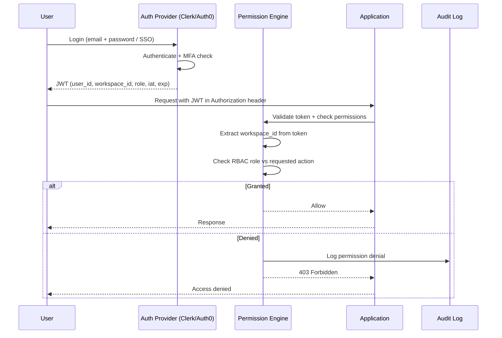
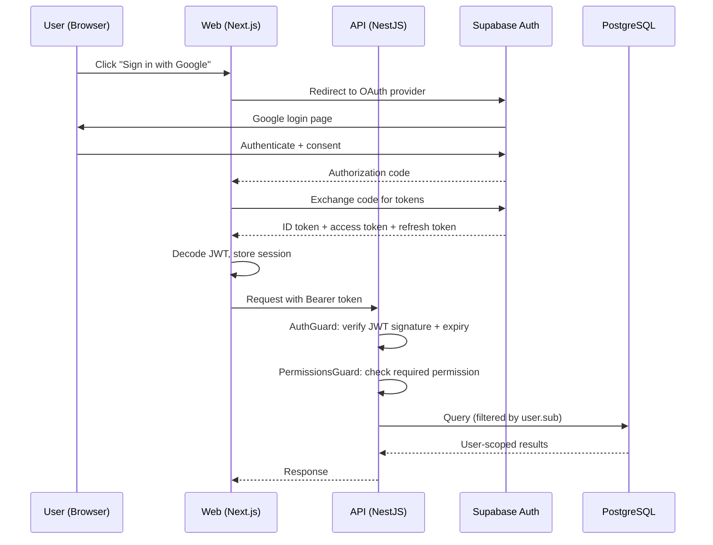

# Identity & Access Management (IAM)

> **Purpose:** Define IAM strategy for Vaeloom
> **Status:** ✅ Upgraded to enterprise quality
> **Owner:** Security Team
> **Last Updated:** 2026-07-13

## IAM Model

```mermaid
graph LR
    classDef identity fill:#e3f2fd,stroke:#1565c0,color:#000,stroke-width:2px
    classDef authn fill:#e8f5e9,stroke:#2e7d32,color:#000,stroke-width:1.5px
    classDef authz fill:#fff3e0,stroke:#e65100,color:#000,stroke-width:1.5px
    classDef audit fill:#f3e5f5,stroke:#6a1b9a,color:#000,stroke-width:1px

    subgraph Identities["👤 Identity Types"]
        direction TB
        I1["👤 User<br/>Auth Provider"]
        I2["🤖 Agent<br/>Agent Registry"]
        I3["🔧 Service<br/>Service Mesh"]
        I4["🔗 Integration<br/>Plugin Manifest"]
    end

    subgraph AuthN["🔑 Authentication<br/>Who are you?"]
        A1["User: JWT from Clerk/Auth0"]
        A2["Agent: Internal registry ID"]
        A3["Service: mTLS certificate"]
        A4["Integration: Manifest signature"]
    end

    subgraph AuthZ["🛡️ Authorization<br/>What can you do?"]
        Z1["Level: User<br/>MVP: Workspace scope<br/>Enterprise: RBAC roles"]
        Z2["Level: Agent<br/>Per-agent permissions<br/>Action-type scoping"]
        Z3["Level: Service<br/>MVP: Internal tokens<br/>Enterprise: mTLS"]
        Z4["Level: Integration<br/>Manifest scopes<br/>Sandbox enforcement"]
    end

    subgraph Audit["📝 Audit<br/>What did you do?"]
        D1["User access audit<br/>Quarterly"]
        D2["Agent permission audit<br/>Monthly"]
        D3["Integration audit<br/>Semi-annual"]
        D4["Service account audit<br/>Quarterly"]
    end

    I1 --> A1 --> Z1 --> D1
    I2 --> A2 --> Z2 --> D2
    I3 --> A3 --> Z3 --> D3
    I4 --> A4 --> Z4 --> D4

    class I1,I2,I3,I4 identity
    class A1,A2,A3,A4 authn
    class Z1,Z2,Z3,Z4 authz
    class D1,D2,D3,D4 audit
```



> **Diagram:** IAM model flows through 4 stages — **Identity Types** (User, Agent, Service, Integration) → **Authentication** (JWT/mTLS/manifest) → **Authorization** (MVP vs Enterprise levels) → **Audit** (quarterly/monthly reviews). Each identity type has its own authentication mechanism, authorization scope, and audit cadence.

## Identity Types

| Identity | Source | Purpose |
|----------|--------|---------|
| User | Auth provider (Clerk/Auth0) | End-user identity |
| Agent | Agent registry | AI agent identity |
| Service | Internal service mesh | Service-to-service auth |
| Integration | Plugin manifest | Third-party integration identity |

## Access Control Levels

| Level | MVP | Enterprise |
|-------|-----|------------|
| User-level | Per-workspace scoping | + RBAC roles |
| Agent-level | Per-agent permissions | + Action-type scoping |
| Service-level | Internal tokens | + mTLS |
| Integration-level | Plugin manifest scopes | + Sandbox enforcement |

## RBAC Roles (Enterprise)

| Role | Permissions | Scope |
|------|-------------|-------|
| Owner | Full workspace control | Own workspace |
| Admin | User management, settings | Enterprise tenant |
| Member | Standard feature access | Assigned workspace |
| Viewer | Read-only access | Assigned workspace |
| Support | Audit log, connector status | Tenant-scoped |

## Access Review Schedule

| Review | Frequency | Scope |
|--------|-----------|-------|
| User access audit | Quarterly | All active sessions |
| Agent permission audit | Monthly | Agent permission grants |
| Integration audit | Semi-annual | Plugin manifest compliance |
| Service account audit | Quarterly | Internal tokens |

## Common Mistakes

| Mistake | Consequence |
|---------|-------------|
| Treating service accounts the same as user accounts | Service accounts (agents, integrations) don't have interactive login — applying password rotation policies to them creates unnecessary complexity. Use API keys with automatic rotation for service accounts |
| Not distinguishing between human and machine identities | A revoked human user's JWT is different from a rotated machine token — mixing the two identity types in the same access review process causes either too-frequent machine token changes or missed human revocations |
| IAM documentation that only covers users | Agents, services, and integrations each have different authentication mechanisms and lifecycle requirements — an IAM doc that only covers user authentication is incomplete |

## Best Practices

| Practice | Why |
|----------|-----|
| Separate identity types (User, Agent, Service, Integration) with distinct authentication mechanisms | Each identity type has different security requirements — users need MFA, services need mTLS, agents need scoped tokens, integrations need manifest signing |
| Automate access review reminders | Manual quarterly audits miss deadlines — automate access review notifications and track completion in the compliance dashboard |
| Use short-lived credentials for all identity types | JWTs (15m), mTLS certificates (24h), and session tokens should all have short TTLs — long-lived credentials increase the blast radius of a leak |

## Security

| Concern | Mitigation |
|---------|------------|
| Identity confusion between agents and users | A compromised agent registry could return a user identity — always include an identity type claim in tokens and verify it before applying authorization rules |
| Integration manifest forgery | A malicious plugin could forge a manifest to gain elevated permissions — verify manifest signatures against a registry of known publisher keys |
| Service-to-service identity replay | An mTLS certificate stolen from one service could authenticate as another — use per-service certificates with distinct Common Names and verify them at the target service |

## Performance

| Concern | Mitigation |
|---------|------------|
| Identity resolution latency for 4 identity types | Each identity type has a different resolution path (auth provider, registry, certificate store, plugin manifest) — cache resolved identities with a per-type TTL |
| Certificate validation overhead for mTLS | Verifying client certificates on every request adds 5-15ms — use session resumption and online certificate status protocol stapling to reduce the overhead of repeated certificate validation |
| Access review queries that scan all identity types | A quarterly audit listing all users, agents, services, and integrations creates a heavy query — pre-materialize the identity inventory and diff against the last review snapshot |

## Security Considerations

| Concern | Mitigation |
|---------|------------|
| Identity provider compromise affecting all tenants | A breached auth provider could mint valid tokens for any workspace — monitor provider status, implement token revocation lists, and support rapid provider failover |
| Agent identity spoofing | If an agent's identity isn't validated, a compromised agent could impersonate another agent — sign agent requests with per-agent keys and verify before processing |
| Identity resolution caching of stale data | Cached resolved identities may include revoked permissions or deactivated users — set cache TTLs based on the volatility of each identity type (user roles: 5 min, service accounts: 30 min) |

## Performance Considerations

| Concern | Approach |
|---------|----------|
| Identity resolution latency for 4 identity types | Each identity type has a different resolution path (auth provider, registry, certificate store, plugin manifest) — cache resolved identities with a per-type TTL |
| Certificate validation overhead for mTLS | Verifying client certificates on every request adds 5-15ms — use session resumption and online certificate status protocol stapling to reduce the overhead of repeated certificate validation |
| Access review queries that scan all identity types | A quarterly audit listing all users, agents, services, and integrations creates a heavy query — pre-materialize the identity inventory and diff against the last review snapshot |

## Scope

This document defines the Identity and Access Management (IAM) strategy for Vaeloom — covering identity types (User, Agent, Service, Integration), authentication mechanisms, authorization levels (MVP and Enterprise), RBAC roles, and access review schedules. Applies to all four identity types across all environments. Out of scope: encryption (see [Encryption.md](./Encryption.md)), secrets management (see [Secrets.md](./Secrets.md)), compliance (see [Compliance.md](./Compliance.md)).

---

## Functional Requirements

| ID | Requirement | Priority | Notes |
|----|-------------|----------|-------|
| IAM-FR-01 | Four distinct identity types with separate auth mechanisms | P0 | User (JWT), Agent (registry ID), Service (mTLS), Integration (manifest) |
| IAM-FR-02 | Permission Engine must evaluate every request | P0 | Global middleware; no endpoint bypasses it |
| IAM-FR-03 | RBAC roles for enterprise with granular scoping | P1 | Owner, Admin, Member, Viewer, Support |
| IAM-FR-04 | Access reviews must be automated with reminders | P1 | Quarterly/monthly/semi-annual per identity type |
| IAM-FR-05 | Short-lived credentials for all identity types | P0 | JWTs (15m), mTLS (24h), session tokens (short TTL) |

---

## Non-Functional Requirements

| ID | Requirement | Target | Measurement |
|----|-------------|--------|-------------|
| IAM-NFR-01 | Identity resolution latency | <50ms | p99 resolve from token to identity |
| IAM-NFR-02 | Auth check latency | <10ms | p99 permission check time |
| IAM-NFR-03 | Access review completion rate | 100% on schedule | Reviews completed within window |
| IAM-NFR-04 | Token revocation propagation | <5min | Time from revocation to effective denial |

---

## Workflows

### 1. User Authentication Workflow

1. User navigates to login page
2. Auth provider (Clerk/Auth0) handles authentication (email+password, SSO, MFA)
3. JWT issued with claims: user_id, workspace_id, role, identity type
4. JWT signed, short TTL (15 min)
5. All subsequent requests include JWT in Authorization header
6. Permission Engine extracts workspace_id from JWT (not request body)
7. Every request checked against RBAC permissions

### 2. Agent Identity Workflow

1. Agent registered in Agent Registry with declared permissions
2. Agent instance assigned internal agent_id and token
3. Agent signs all requests with per-agent key
4. Permission Engine validates agent identity + checks permission scope
5. Agent cannot modify its own permissions
6. Agent permissions audited monthly

---

## Sequence Diagrams



> **Diagram:** User authentication flow — Auth provider issues JWT with identity claims. Permission Engine validates and checks RBAC. Workspace_id is extracted from the token (not request body) to prevent tenant spoofing.

---

## Data Flow

```text
Identity Types:
    User → Auth Provider → JWT (user_id, workspace_id, role)
    Agent → Agent Registry → Agent Token (agent_id, permissions)
    Service → Service Mesh → mTLS Certificate (service_name)
    Integration → Plugin Manifest → Manifest Signature (scopes)

Auth Check:
    Request → Extract Identity from Token/Cert
    → Permission Engine: Check RBAC / Scope
    → [Allow] → Process Request
    → [Deny] → Log + 403 Forbidden
    → Audit Log (all decisions)
```

---

## APIs

| Endpoint | Method | Purpose | Auth |
|----------|--------|---------|------|
| `/api/v1/auth/login` | POST | Initiate user authentication | None (public) |
| `/api/v1/auth/token/refresh` | POST | Refresh JWT | Valid JWT |
| `/api/v1/auth/revoke` | POST | Revoke user/agent token | Admin token |
| `/api/v1/iam/permissions` | GET | Get current user/agent permissions | User/Agent token |
| `/api/v1/iam/roles` | GET | List RBAC roles and their permissions | Admin token |
| `/api/v1/iam/audit` | GET | Access review report | Admin token |

---

## Database

| Table | Purpose | Key Columns | Indexes |
|-------|---------|-------------|---------|
| `identities` | All identity records (user, agent, service, integration) | `id`, `identity_type`, `auth_method`, `permissions_json`, `status`, `last_accessed`, `created_at` | `(identity_type, status)`, `(last_accessed)` |
| `rbac_roles` | Role definitions and permission mappings | `id`, `role_name`, `permissions_json`, `scope` (workspace/tenant/global) | `(role_name)` UNIQUE |
| `access_reviews` | Access review schedule and completion | `id`, `review_type`, `identity_type`, `status`, `scheduled_date`, `completed_date`, `findings_json` | `(review_type, scheduled_date)` |

---

## Scalability

| Dimension | Current Limit | 10x Strategy | 100x Strategy |
|-----------|--------------|--------------|---------------|
| Identity resolutions/sec | 1000 RPS | 10K RPS (cached resolutions) | 100K RPS (distributed identity cache) |
| RBAC roles | 5 roles | 20 roles (custom roles) | 100+ roles with role hierarchy |
| Access reviews/year | 12 reviews | 24 reviews (increased frequency) | 48+ reviews (automated continuous review) |
| Agent identities | 8 agents | 28 agents | 1000+ agents (group-based permissions) |

---

## Error Handling

| Scenario | Detection | Mitigation | Recovery |
|----------|-----------|------------|----------|
| Auth provider unavailable | Login returns error | Show cached login page; allow existing session continue | Retry; switch to secondary provider if available |
| Token validates but user role changed | Mid-session permission change | Next request uses old token; force re-login | User must refresh token to get new role |
| Agent identity spoofed | Signature verification fails | Deny request; log security event | Alert security team; investigate |
| mTLS certificate expired | TLS handshake fails | Do not allow connection; request new certificate | Auto-renew via certificate manager |

---

## Monitoring

| Metric | Alert Threshold | Severity | Dashboard |
|--------|----------------|----------|-----------|
| Auth failure rate | > 5% of login attempts | Warning | Auth Health |
| Permission denial rate | > 10% of requests | Warning | Permission Denials |
| Token expiry rate (near-expiry) | > 1000 tokens expiring < 5min | Info | Token Health |
| Access review overdue count | > 0 overdue | Critical | Access Reviews |
| Identity resolution latency (p99) | > 100ms | Warning | IAM Performance |

---

## Deployment

| Environment | Method | Trigger | Verification |
|-------------|--------|---------|-------------|
| Development | Local auth mock | Code push | Auth + permission unit tests |
| Staging | Managed auth provider | PR merge | IAM integration tests |
| Production | Auth provider + RBAC | Manual approval | Auth flow + permission boundary verification |

---

## Configuration

| Variable | Purpose | Default | Required |
|----------|---------|---------|----------|
| `IAM_TOKEN_TTL_MINUTES` | JWT expiration | 15 | Yes |
| `IAM_REFRESH_TOKEN_TTL_DAYS` | Refresh token expiration | 7 | Yes |
| `IAM_MFA_REQUIRED` | Require MFA for all users | true | No |
| `IAM_SESSION_CACHE_TTL` | Identity cache TTL | 300 | Yes |
| `IAM_MAX_LOGIN_ATTEMPTS` | Lockout threshold | 5 | Yes |

---

## Examples

### Example 1: Permission Check Implementation

```typescript
// Middleware that checks permissions on every request
@Injectable()
export class PermissionGuard implements CanActivate {
  async canActivate(context: ExecutionContext): Promise<boolean> {
    const request = context.switchToHttp().getRequest();
    const identity = await this.identityResolver.resolve(request);
    
    const requiredPermissions = this.reflector.get(
      'permissions', context.getHandler()
    );
    
    const allowed = await this.permissionEngine.check(
      identity, requiredPermissions
    );
    
    if (!allowed) {
      this.auditLogger.log({
        event: 'permission_denied',
        identity: identity.id,
        identityType: identity.type,
        requiredPermissions,
        timestamp: new Date()
      });
    }
    
    return allowed;
  }
}
```

---

## Risks

| Risk | Likelihood | Impact | Mitigation |
|------|------------|--------|------------|
| Identity provider compromise affecting all tenants | Low | Critical | Monitor provider status; token revocation lists; rapid failover plan |
| Agent identity spoofing leading to unauthorized actions | Low | Critical | Per-agent request signing; signature verification on every call |
| Identity type confusion (user vs agent) | Low | High | Identity type claim always included; verified before authorization |
| Role escalation via self-modification | Low | Critical | Permission Engine immutable by agents; RBAC enforced at API layer |

---

## Limitations

| Limitation | Impact | Workaround | Future Resolution |
|------------|--------|------------|-------------------|
| RBAC hardcoded (5 roles) | Cannot adapt to custom enterprise structures | Use workspace-specific permission overrides | Custom role builder (Enterprise Phase) |
| Agent permissions are per-agent, not per-action-type | Coarse granularity | Split agents for finer control | Action-type permission scoping (Phase 2) |
| Access reviews are semi-automated (reminders sent, completion tracked) | Manual completion still required | Assign review owners in advance | Fully automated access certification (Phase 3) |
| No federation support (SAML/SSO) | Limited enterprise adoption | Auth provider supports SAML; direct config in provider | Native SAML integration (Enterprise Phase) |

---

## Overview

Vaeloom's Identity and Access Management (IAM) system governs user authentication and authorization across the entire platform. The system uses OAuth 2.0 + OIDC for authentication with Google/GitHub social providers and email/password authentication via Supabase Auth. Authorization follows Attribute-Based Access Control (ABAC) using JWTs containing role and permission claims.

This document defines the authentication flow, role hierarchy, permission model, API authorization patterns, and session management. The primary audience is full-stack engineers implementing auth features and security engineers auditing access control.

Within the Vaeloom platform, IAM ensures that every request — whether from a web user, API client, or AI agent — is properly authenticated and authorized before accessing any resource. The authorization model is resource-scoped: users can access only their own documents and memories unless granted explicit cross-resource permissions.

Enterprise-grade IAM requires a layered approach: authentication (who you are + MFA), authorization (what you can do), and audit (what you did). Every access decision must be logged with the actor, action, resource, and outcome for forensic analysis during security incidents.

---

## Goals

- Authenticate all users via OAuth 2.0/OIDC with at least one social provider (Google/GitHub)
- Implement ABAC authorization using JWTs with role and permission claims
- Enforce resource-scoped access: users see only their own data by default
- Require MFA for all production accounts with admin roles
- Log every authorization decision with actor, action, resource, and outcome for audit trail

---

## Scope

### In Scope
- User authentication: OAuth 2.0 + OIDC (Google, GitHub), email/password (Supabase Auth)
- Authorization model: ABAC with roles (user, admin, owner) and permissions (read, write, delete, admin)
- JWT structure and claims: sub, role, email, org_id, permissions array, session_id
- Permission enforcement in API middleware (NestJS guards) and AI service (internal API key)
- Session management: refresh tokens, session revocation, secure cookie vs Bearer token strategy
- MFA enforcement for admin roles and high-value operations

### Out of Scope
- OAuth scope-based delegation for third-party API access (planned for future)
- Fine-grained row-level security in PostgreSQL (covered in [Security-Architecture.md](./Security-Architecture.md))
- Audit log storage and querying (covered in [Audit-Logs.md](./Audit-Logs.md))
- API key management for external integrations (covered in [Secrets.md](./Secrets.md))
- Federation with enterprise IdP (SAML/SCIM — planned for enterprise)

---

## Examples

### Example 1: JWT Payload Structure

```json
{
  "sub": "user_2aK3bF9cJ8",
  "role": "admin",
  "email": "alice@vaeloom.dev",
  "org_id": "org_5fM8nQ2vP1",
  "permissions": [
    "documents:read",
    "documents:write",
    "documents:delete",
    "memories:read",
    "memories:write",
    "admin:users",
    "admin:audit"
  ],
  "session_id": "sess_9xR7tH3wL5",
  "iat": 1710000000,
  "exp": 1710003600
}
```

### Example 2: API Guard Implementation (TypeScript)

```typescript
// NestJS guard for permission check
@Injectable()
export class PermissionsGuard implements CanActivate {
  constructor(private requiredPermission: string) {}

  canActivate(context: ExecutionContext): boolean {
    const request = context.switchToHttp().getRequest();
    const user = request.user; // Populated by AuthGuard

    if (!user || !user.permissions) {
      return false;
    }

    return user.permissions.includes(this.requiredPermission);
  }
}

// Usage
@Post('documents')
@UseGuards(new PermissionsGuard('documents:write'))
async createDocument(@Body() body: CreateDocumentDto) {
  return this.documentsService.create(body);
}
```

---

## Sequence Diagrams



> **Diagram:** IAM flow — user authenticates via OAuth, receives JWT, every API request is verified (signature + expiry) and authorized (permission check), database queries scoped to authenticated user.

---

## Future Improvements

| Improvement | Priority | Complexity | Timeline |
|-------------|----------|------------|----------|
| Action-type permission scoping for agents | High | Medium | Phase 2 (Q4 2026) |
| Fully automated access certification | Medium | High | Phase 3 (Q1 2027) |
| Custom RBAC role builder | Medium | Medium | Enterprise Phase |
| Native SAML/SSO federation | High | Medium | Enterprise Phase |

## Related Documents

- [Authentication.md](../Backend/Authentication.md)
- [Authorization.md](../Backend/Authorization.md)
- [Security Architecture.md](./Security-Architecture.md)
