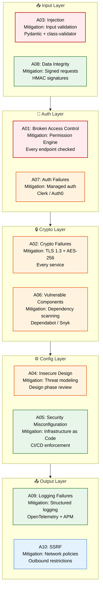
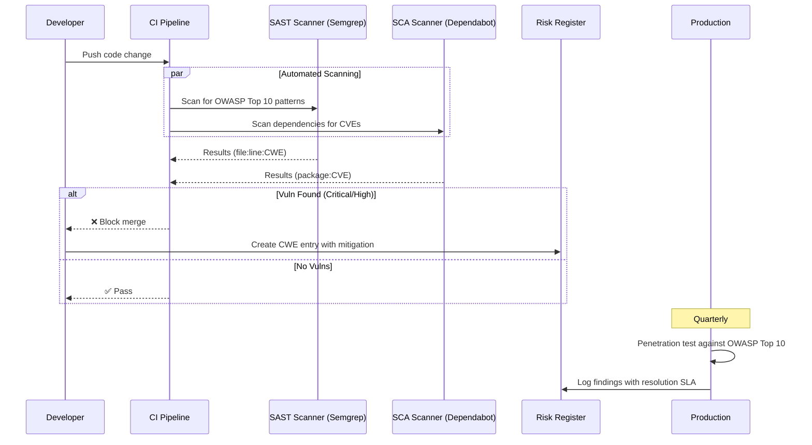

# OWASP Top 10 Mitigations

> **Purpose:** Define OWASP Top 10 mitigations for Meridian
> **Status:** ✅ Upgraded to enterprise quality
> **Owner:** Security Team
> **Last Updated:** 2026-07-13

## OWASP Mitigation Flow



> **Diagram:** OWASP Top 10 mitigations organized by security layer — **Input** (injection, integrity), **Auth** (access control, auth failures), **Crypto** (crypto failures, vulnerable components), **Config** (insecure design, misconfiguration), **Output** (logging, SSRF). Severity color-coded: red = critical, orange = high, green = medium, blue = low.

---

## OWASP Mitigation Map

| # | Vulnerability | Mitigation | Implementation |
|---|--------------|------------|----------------|
| 1 | Broken Access Control | Permission Engine on every request | All API endpoints checked |
| 2 | Cryptographic Failures | TLS 1.3, AES-256 encryption | Every service |
| 3 | Injection | Input validation on all inputs | Pydantic, class-validator |
| 4 | Insecure Design | Threat modeling in design phase | Architecture review process |
| 5 | Security Misconfiguration | Infrastructure as Code | CI/CD pipeline enforcement |
| 6 | Vulnerable Components | Dependency scanning | Dependabot / Snyk in CI |
| 7 | Auth Failures | Delegated to managed auth provider | Clerk/Auth0 |
| 8 | Data Integrity Failures | Signed API requests | Internal HMAC signatures |
| 9 | Logging Failures | Structured logging, alerting | OpenTelemetry + APM |
| 10 | SSRF | Outbound traffic restrictions | Network policies |

## Specific Mitigations

### SQL Injection

```typescript
// ❌ Never: String concatenation
db.query(`SELECT * FROM users WHERE id = '${userId}'`);

// ✅ Always: Parameterized queries
db.query('SELECT * FROM users WHERE id = $1', [userId]);
```

### XSS Prevention

```tsx
// React auto-escapes by default — don't use dangerouslySetInnerHTML
// If needed, sanitize with DOMPurify
import DOMPurify from 'dompurify';
<div dangerouslySetInnerHTML={{ __html: DOMPurify.sanitize(userContent) }} />
```

### CSRF Protection

- SameSite cookies (Lax/Strict)
- CSRF tokens for state-changing requests
- CORS configured per-environment

## Common Mistakes

| Mistake | Consequence |
|---------|-------------|
| Only addressing OWASP Top 10 once at launch | OWASP Top 10 changes every few years (2021→2024), and new vulnerabilities emerge — treat OWASP as a living threat list, not a one-time audit. Update the mitigation map each year |
| Mitigations documented but not tested in CI | A mitigation like "parameterized queries prevent SQL injection" is useless if the actual codebase has raw query builders — add SAST scanning (CodeQL, custom linters) to CI to detect OWASP violations automatically |
| Dependency scanning without remediation SLAs | Dependabot alerts that are never acted on accumulate — set an SLA: critical vulnerabilities patched within 48 hours, high within 7 days, medium within 30 days |

## Best Practices

| Practice | Why |
|----------|-----|
| Integrate SAST and dependency scanning into CI/CD | OWASP vulnerabilities found in production are expensive to fix — catch injection flaws, insecure deserialization, and known vulnerable dependencies before they reach production |
| Prioritize mitigations by exploitation likelihood and impact | Not all OWASP items carry equal risk for your architecture — SSRF is lower risk behind a VPC, while broken access control is critical in a multi-tenant SaaS. Risk-rank each item for your specific deployment |
| Run OWASP-focused penetration tests annually | Automated scanning catches known patterns but misses logic flaws in custom authorization — supplement with manual pen testing focused on OWASP categories relevant to your architecture |

## Security

| Concern | Mitigation |
|---------|------------|
| SAST false positives causing alert fatigue | Too many false positives from automated scanning cause teams to ignore alerts — tune SAST rules to your tech stack and establish a triage process that distinguishes true vulnerabilities from noise |
| Dependency chain attacks via transitive dependencies | A vulnerability in a transitive dependency (a library's library) can be invisible to direct scanning — use software composition analysis (SCA) that resolves the full dependency tree and flags transitive CVEs |
| OWASP mitigation coverage gap during rapid prototyping | Fast-moving features may skip security review — apply a lightweight security review checklist for prototypes (auth check, input validation, output encoding) that takes 15 minutes, not days |

## Performance

| Concern | Mitigation |
|---------|------------|
| SAST scanning time slowing CI pipelines | Full SAST scans on every commit can take 10-30 minutes — run incremental scans on changed files for PRs and full scans nightly. Use diff-aware scanning for faster CI feedback |
| Dependency scanning frequency vs. compute cost | Scanning every dependency on every commit is wasteful for pinned package versions — cache dependency scan results and only re-scan when dependencies change, or run weekly full scans with daily CVE diff checks |
| Input sanitization overhead on every request | Running input sanitization (XSS, SQL injection checks) on every field adds latency — apply the most expensive sanitization (HTML encoding, SQL escaping) only to fields that could contain untrusted content, not all fields |

## Security Considerations

| Concern | Mitigation |
|---------|------------|
| SAST false positives causing alert fatigue | Too many false positives from automated scanning cause teams to ignore alerts — tune SAST rules to your tech stack and establish a triage process that distinguishes true vulnerabilities from noise |
| Dependency chain attacks via transitive dependencies | A vulnerability in a transitive dependency (a library's library) can be invisible to direct scanning — use software composition analysis (SCA) that resolves the full dependency tree and flags transitive CVEs |
| OWASP mitigation coverage gap during rapid prototyping | Fast-moving features may skip security review — apply a lightweight security review checklist for prototypes (auth check, input validation, output encoding) that takes 15 minutes, not days |

## Performance Considerations

| Concern | Approach |
|---------|----------|
| SAST scanning time slowing CI pipelines | Full SAST scans on every commit can take 10-30 minutes — run incremental scans on changed files for PRs and full scans nightly. Use diff-aware scanning for faster CI feedback |
| Dependency scanning frequency vs. compute cost | Scanning every dependency on every commit is wasteful for pinned package versions — cache dependency scan results and only re-scan when dependencies change, or run weekly full scans with daily CVE diff checks |
| Input sanitization overhead on every request | Running input sanitization (XSS, SQL injection checks) on every field adds latency — apply the most expensive sanitization (HTML encoding, SQL escaping) only to fields that could contain untrusted content, not all fields |

## Scope

This document defines the OWASP Top 10 mitigation strategies for Meridian — covering the 10 vulnerability categories, specific mitigations (SQL injection, XSS, CSRF), and testing tools. Applies to all application code, APIs, and infrastructure across all environments. Out of scope: penetration testing procedures (see [Penetration-Test-Procedure.md](./Penetration-Test-Procedure.md)), broader threat model (see [Threat-Model.md](./Threat-Model.md)), SAST/DAST tool configuration.

---

## Functional Requirements

| ID | Requirement | Priority | Notes |
|----|-------------|----------|-------|
| OW-FR-01 | All API endpoints must have permission checks (A01) | P0 | Global PermissionGuard middleware |
| OW-FR-02 | All database queries must use parameterized inputs (A03) | P0 | No string concatenation for queries |
| OW-FR-03 | TLS 1.3 minimum for all external traffic (A02) | P0 | Reject TLS < 1.2 |
| OW-FR-04 | All user-generated content rendered in React must be auto-escaped (A03) | P0 | No dangerouslySetInnerHTML without DOMPurify |
| OW-FR-05 | Dependency scanning must run in CI/CD (A06) | P1 | Dependabot / Snyk with SLA-based remediation |

---

## Non-Functional Requirements

| ID | Requirement | Target | Measurement |
|----|-------------|--------|-------------|
| OW-NFR-01 | SAST scan time in CI | <10 min incremental | CI pipeline duration |
| OW-NFR-02 | Critical vuln remediation SLA | <48 hours | Time from detection to fix deployed |
| OW-NFR-03 | High vuln remediation SLA | <7 days | Time from detection to fix deployed |
| OW-NFR-04 | False positive rate for SAST | <15% | Triage accuracy |

---

## Workflows

### 1. Vulnerability Detection and Remediation Workflow

1. SAST scan runs on every commit (incremental on changed files)
2. Dependency scan runs daily (full scan) and on dependency changes
3. Findings auto-tagged by severity (Critical/High/Medium/Low)
4. Critical findings: auto-create incident; page security team
5. High findings: added to sprint backlog with SLA
6. Fix deployed; retested in CI
7. Finding closed only after retest passes

### 2. Penetration Test Follow-up Workflow

1. Annual pen test identifies OWASP-related findings
2. Findings mapped to specific OWASP categories
3. Remediation items added with severity-based SLA
4. Fix implemented and verified in staging
5. Retest scheduled within SLA window
6. Finding closed only after retest confirms resolution

---

## Sequence Diagrams

```mermaid
sequenceDiagram
    participant DEV as Developer
    participant CI as CI Pipeline
    participant SAST as SAST Scanner (CodeQL)
    participant SCA as SCA Scanner (Snyk)
    participant SEC as Security Team
    participant PROD as Production

    DEV->>CI: Push code
    CI->>SAST: Run incremental scan (changed files)
    CI->>SCA: Check dependencies (if changed)
    
    SAST-->>CI: Findings (tagged: critical/high/med/low)
    SCA-->>CI: Findings (tagged by CVSS)
    
    alt Critical Finding
        CI->>SEC: Auto-create incident; page on-call
        SEC->>DEV: Assign with 48h SLA
        DEV->>CI: Fix + retest
        CI-->>SEC: Retest passes → close finding
    else High Finding
        CI->>DEV: Add to sprint backlog (7d SLA)
        DEV->>CI: Fix + retest
        CI-->>SEC: Retest passes → close finding
    else Low/Medium
        CI->>DEV: Add to backlog
    end
```

> **Diagram:** Vulnerability detection flow — SAST and SCA scans on every commit, findings auto-tagged by severity, critical findings page security team with 48h SLA, high findings have 7d SLA, low/medium added to backlog.

---

## Data Flow

```text
Code Commit → CI Pipeline
    → SAST (incremental scan on changed files)
    → SCA (dependency scan if changed)
    → Findings auto-tagged: Critical / High / Medium / Low
    → [Critical] → Auto-incident → Page Security → 48h Fix → Retest → Close
    → [High] → Sprint Backlog → 7d Fix → Retest → Close
    → [Low/Med] → Backlog → Next Release → Retest → Close
```

---

## APIs

| Endpoint | Method | Purpose | Auth |
|----------|--------|---------|------|
| `/api/v1/owasp/scan` | POST | Trigger manual OWASP scan | Security token |
| `/api/v1/owasp/findings` | GET | List current open findings | Security token |
| `/api/v1/owasp/findings/{id}` | PUT | Update finding status | Security token |
| `/api/v1/owasp/report` | GET | Generate OWASP compliance report | Admin token |

---

## Database

| Table | Purpose | Key Columns | Indexes |
|-------|---------|-------------|---------|
| `owasp_findings` | Track OWASP-related vulnerabilities | `id`, `owasp_category`, `severity`, `status`, `cve_id`, `detected_at`, `fixed_at`, `remediation_sla` | `(severity, status)`, `(detected_at)` |
| `dependency_scan_results` | Dependency vulnerability records | `id`, `package_name`, `version`, `cve_id`, `severity`, `patched_version`, `status` | `(package_name, version)`, `(severity)` |
| `owasp_mitigations` | Current mitigation status per category | `owasp_category`, `mitigation_description`, `implemented_at`, `verified_at`, `status` | `(owasp_category)` UNIQUE |

---

## Scalability

| Dimension | Current Limit | 10x Strategy | 100x Strategy |
|-----------|--------------|--------------|---------------|
| SAST scan throughput | Full scan: 30 min | Incremental: 5 min; Full: 30 min (nightly) | Distributed scanning (parallel per module) |
| Dependency scan frequency | Per commit (changed) + daily (full) | Continuous monitoring | Event-driven re-scan on CVE publish |
| Finding triage rate | 10 findings/day | 100 findings/day (auto-triage rules) | 1000 findings/day (ML-based triage) |

---

## Error Handling

| Scenario | Detection | Mitigation | Recovery |
|----------|-----------|------------|----------|
| SAST scan fails mid-execution | CI job failure | Re-run on next commit; log failure | Manual retry if persistent |
| Dependency scan finds critical CVE | Scanner reports CVE | Auto-create incident; page security | Patch within SLA window |
| False positive rate too high | >15% false positives | Adjust SAST rules to reduce noise | Periodic rule tuning |
| Remediation SLA missed | Deadline passed without fix | Escalate to engineering manager | Reprioritize in next sprint |

---

## Monitoring

| Metric | Alert Threshold | Severity | Dashboard |
|--------|----------------|----------|-----------|
| Open critical findings | > 0 | Critical | OWASP Dashboard |
| Open high findings (age > 7d) | Any high finding > 7 days | Warning | Remediation SLAs |
| SAST scan failure rate | > 5% of scans | Warning | Scan Health |
| Dependency scan age | > 48h since last scan | Warning | Scan Coverage |
| False positive rate | > 15% | Info | Scan Quality |

---

## Deployment

| Environment | Method | Trigger | Verification |
|-------------|--------|---------|-------------|
| Development | Pre-commit hook + IDE plugin | Code save | Local SAST scan |
| Staging | CI pipeline | PR merge | Full SAST + SCA pass with no critical |
| Production | CI/CD gate | Deploy to prod | Zero critical + high findings; low/medium waived |

---

## Configuration

| Variable | Purpose | Default | Required |
|----------|---------|---------|----------|
| `OWASP_CRITICAL_SLA_HOURS` | Critical finding SLA | 48 | Yes |
| `OWASP_HIGH_SLA_DAYS` | High finding SLA | 7 | Yes |
| `OWASP_SAST_ENABLED` | Enable SAST scanning | true | No |
| `OWASP_SCA_ENABLED` | Enable dependency scanning | true | No |
| `OWASP_BLOCK_CRITICAL_ON_DEPLOY` | Block deploy on critical findings | true | Yes |

---

## Examples

### Example 1: SQL Injection Prevention

```typescript
// ❌ Never: String concatenation
db.query(`SELECT * FROM users WHERE id = '${userId}'`);

// ✅ Always: Parameterized queries
db.query('SELECT * FROM users WHERE id = $1', [userId]);
```

### Example 2: XSS Prevention in React

```tsx
// React auto-escapes by default
function UserProfile({ bio }: { bio: string }) {
  return <div>{bio}</div>;  // Auto-escaped
}

// If you MUST use dangerouslySetInnerHTML
import DOMPurify from 'dompurify';
function SafeHTML({ html }: { html: string }) {
  return <div dangerouslySetInnerHTML={{ __html: DOMPurify.sanitize(html) }} />;
}
```

---

## Risks

| Risk | Likelihood | Impact | Mitigation |
|------|------------|--------|------------|
| SAST false positives cause alert fatigue | Medium | Medium | Tune SAST rules; triage process for distinguishing true vs false positives |
| Dependency chain attack via transitive dependency | Low | High | SCA that resolves full dependency tree and flags transitive CVEs |
| OWASP coverage gap during rapid prototyping | High | Medium | Lightweight security review checklist for prototypes (15 min) |
| SAST misses business logic flaws | Medium | High | Supplement SAST with manual penetration testing focused on logic flaws |

---

## Limitations

| Limitation | Impact | Workaround | Future Resolution |
|------------|--------|------------|-------------------|
| SAST limited to known patterns | Misses novel vulnerability classes | Supplement with manual pen testing | AI-assisted vulnerability discovery (Phase 3) |
| Dependency scan only covers direct + transitive dependencies | Cannot detect runtime vulnerabilities | Runtime SCA agent for production | Full runtime application self-protection (RASP) (Phase 4) |
| No DAST (dynamic scanning) in CI | Runtime vulnerabilities missed | Manual pen testing covers DAST scenarios | Integrate DAST into CI pipeline (Phase 2) |
| OWASP Top 10 only — not full CWE coverage | Some less common CWEs not addressed | Pen test covers broader attack surface | Extended CWE coverage (Phase 3) |

---

## Overview

Meridian follows the OWASP Application Security Verification Standard (ASVS) as the primary framework for identifying, classifying, and mitigating security vulnerabilities across the platform. The OWASP Top 10 serves as the baseline threat assessment, with additional focus areas from ASVS Level 2 (standard) for API security, authentication, and access control.

This document maps each OWASP Top 10 category to Meridian-specific risks, mitigation strategies, and verification methods. The primary audience is security engineers, developers, and QA engineers involved in security reviews and penetration testing.

Within the Meridian platform, OWASP practices are embedded in the development lifecycle — automated SAST/SCA scanning in CI, mandatory manual security review for authentication and authorization code, and quarterly penetration testing against the OWASP Top 10. The risk register tracks CWEs found during scans and assessments.

Enterprise-grade security requires defense in depth: no single control is relied upon for any risk. Input validation, parameterized queries, output encoding, CSP headers, rate limiting, and audit logging work together to provide overlapping protection layers.

---

## Goals

- Achieve OWASP ASVS Level 2 compliance across all Meridian services
- Zero critical/high OWASP Top 10 vulnerabilities in production at any time
- Automate SAST and SCA scanning in CI pipeline with mandatory pass before deployment
- Maintain a risk register mapping every identified CWE to mitigation, status, and verification evidence
- Conduct quarterly penetration testing against OWASP Top 10 with defined resolution SLAs

---

## Scope

### In Scope
- OWASP Top 10 (2021) risk assessment and mitigation per category
- OWASP ASVS Level 2 verification requirements for authentication, session management, access control, and API security
- Automated SAST scanning (Semgrep) and SCA scanning (Dependabot, Trivy) in CI
- Manual security review for auth, access control, and payment-related code changes
- Input validation and output encoding standards (HTML escaping, SQL parameterization, CSP)
- Risk register management with CWE mapping and resolution tracking

### Out of Scope
- OWASP ASVS Level 3 (advanced) verification (planned for enterprise Phase 2)
- Mobile application security (no mobile client in scope)
- IoT or embedded system security (not applicable)
- Third-party vendor security assessment (covered in vendor risk management process)
- Physical security and data center security (cloud-managed)

---

## Examples

### Example 1: SQL Injection Prevention via Parameterized Queries

```typescript
// ❌ Vulnerable: string concatenation
const result = await db.query(`SELECT * FROM documents WHERE id = '${docId}'`);

// ✅ Safe: parameterized query
const result = await db.query(
  'SELECT * FROM documents WHERE id = $1',
  [docId]
);
```

### Example 2: XSS Prevention via CSP Headers

```typescript
// NestJS Helmet CSP configuration
app.use(
  helmet.contentSecurityPolicy({
    directives: {
      defaultSrc: ["'self'"],
      scriptSrc: ["'self'", "https://cdn.meridian.ai"],
      styleSrc: ["'self'", "https://fonts.googleapis.com"],
      imgSrc: ["'self'", "data:", "https://storage.meridian.dev"],
      connectSrc: ["'self'", "https://api.meridian.dev"],
      fontSrc: ["'self'", "https://fonts.gstatic.com"],
      objectSrc: ["'none'"],
      frameSrc: ["'none'"],
      reportUri: '/api/security/csp-violation',
    },
  })
);
```

---

## Sequence Diagrams



> **Diagram:** OWASP security scanning — code push triggers SAST (static analysis) and SCA (dependency) scans, critical/high findings block the merge, all findings tracked in risk register with quarterly penetration testing.

---

## Future Improvements

| Improvement | Priority | Complexity | Timeline |
|-------------|----------|------------|----------|
| Integrate DAST scanning into CI pipeline | High | Medium | Phase 2 (Q4 2026) |
| AI-assisted vulnerability discovery | Medium | High | Phase 3 (Q1 2027) |
| Extended CWE coverage beyond OWASP Top 10 | Medium | Medium | Phase 3 (Q1 2027) |
| RASP (runtime application self-protection) | Low | High | Phase 4 (Q2 2027) |

## Related Documents

- [Security Architecture.md](./Security-Architecture.md)
- [Threat Model.md](./Threat-Model.md)
- [`DevOps/CI-CD.md`](../DevOps/CI-CD.md)
