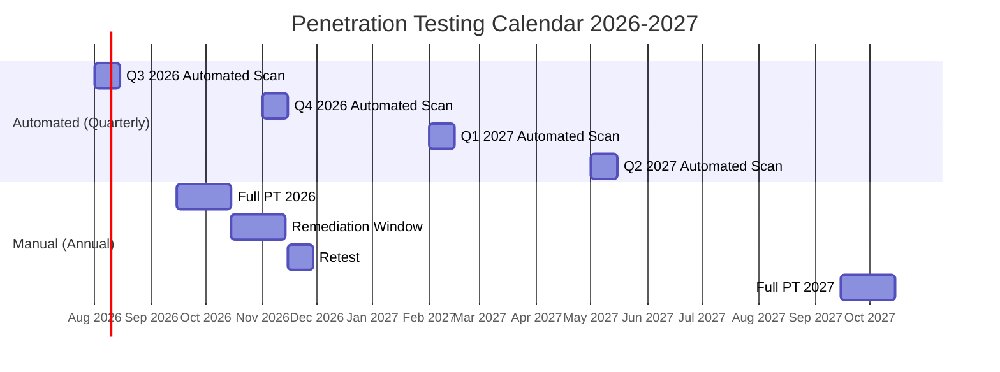
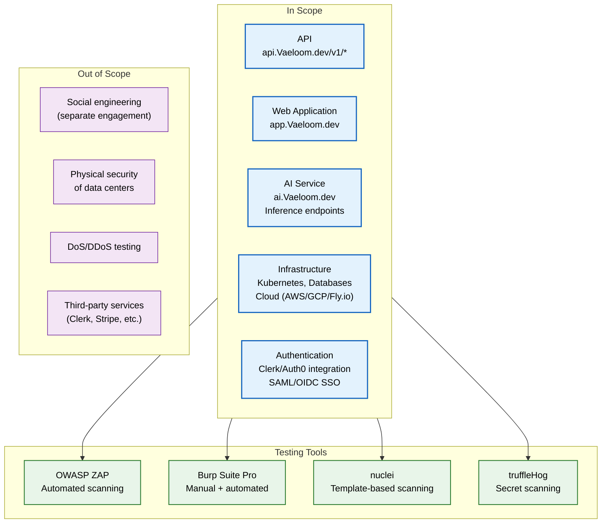
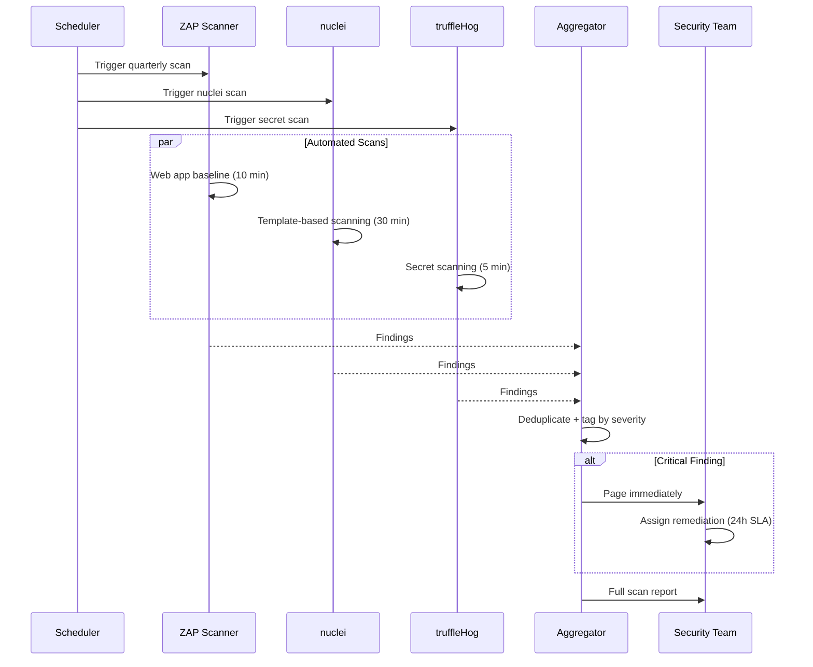
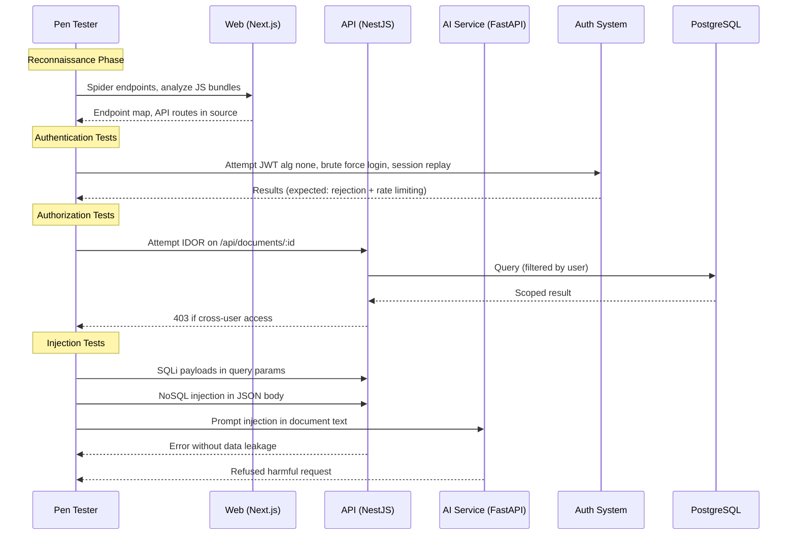

# Penetration Test Procedure

> **Purpose:** Define the methodology, scope, schedule, and reporting requirements for Vaeloom penetration testing
> **Status:** 🆕 New
> **Owner:** Security Team
> **Last Updated:** 2026-07-13

## Overview

Vaeloom maintains a formal penetration testing program consisting of quarterly automated scans and annual full-scope manual penetration tests conducted by an independent third-party firm. Testing covers the API, web application, AI service infrastructure, and cloud environment.

This document defines the testing methodology (OWASP WSTG, NIST SP 800-115), tooling, scope boundaries, reporting template, and remediation SLAs. All findings are tracked in a shared register with severity-based deadlines.

## Testing Schedule



## Scope



## Methodology

### OWASP Web Security Testing Guide (WSTG)

| Phase | Activities | Tools | Deliverable |
|-------|-----------|-------|-------------|
| Information Gathering | DNS enumeration, technology fingerprinting, directory discovery | nuclei, whatweb, gobuster | Technology inventory |
| Configuration Management | Default credentials, admin interfaces, config file exposure | Burp Scanner, ZAP | Config assessment |
| Identity Management | User enumeration, credential strength, account provisioning | Manual testing | Auth assessment |
| Authentication | Session management, token handling, MFA bypass | Burp, custom scripts | AuthN report |
| Authorization | IDOR, privilege escalation, role bypass | Burp, manual | AuthZ report |
| Input Validation | XSS, SQLi, SSTI, command injection | ZAP, Burp, fuzzing | Injection report |
| Business Logic | Workflow bypass, race conditions, abuse cases | Manual | Logic report |
| Cryptography | TLS configuration, weak algorithms, key exposure | testssl, SSLyze | Crypto report |

### NIST SP 800-115 Phases

```text
Phase 1: Planning            → Define scope, rules of engagement, contacts
Phase 2: Discovery           → Reconnaissance, port scanning, service enumeration
Phase 3: Vulnerability Scan  → Automated + manual vulnerability assessment
Phase 4: Exploitation        → Proof-of-concept exploitation (authorized targets)
Phase 5: Post-Exploitation   → Privilege escalation, lateral movement assessment
Phase 6: Reporting           → Findings, evidence, remediation recommendations
```

## Reporting Template

Each penetration test produces a structured report with the following sections:

```markdown
1. EXECUTIVE SUMMARY
   - Engagement overview
   - Critical risk score
   - Key findings (top 3)
   - Overall risk rating

2. SCOPE & METHODOLOGY
   - In-scope targets
   - Testing dates
   - Methodology references (OWASP WSTG, NIST SP 800-115)

3. FINDINGS REGISTER
   | ID | Severity | Title | Affected Asset | CVSS Score | Status |
   |----|----------|-------|---------------|-----------|--------|
   | PT-001 | Critical | ... | ... | 9.8 | Open |

4. DETAILED FINDINGS
   For each finding:
   - Title & ID
   - Description
   - Steps to reproduce (with evidence/screenshots)
   - Impact analysis
   - CVSS v3.1 vector
   - Recommended remediation
   - References (CWE, OWASP)

5. REMEDIATION TRACKING
   | Severity | Remediation SLA | Status |
   |----------|-----------------|--------|
   | Critical | Immediate (24 hours) | Fixed in commit abc123 |
   | High | 7 days | In progress |
   | Medium | 30 days | Triage |
   | Low | Next release | Accepted risk |

6. APPENDIX
   - Tool versions
   - Raw scan output (appended)
   - Glossary
```

## Remediation SLAs

| Severity | CVSS Range | SLA | Retest Required |
|----------|-----------|-----|-----------------|
| Critical | 9.0–10.0 | 24 hours to mitigate | Yes |
| High | 7.0–8.9 | 7 days | Yes |
| Medium | 4.0–6.9 | 30 days | Yes |
| Low | 0.1–3.9 | Next release | No |

## Best Practices

| Practice | Rationale |
|----------|----------|
| Run automated scans before every major release | Catches regressions before they reach production; ZAP baseline scan takes <10 minutes |
| Use a dedicated penetration test environment | Test environment mirrors production but contains synthetic data; avoids data corruption and service disruption |
| Include third-party integration endpoints | OAuth callbacks, webhooks, and SSO assertion consumers are common vulnerability points |
| Retest after remediation | Fix verification prevents regression; findings are not closed until retest confirms resolution |

## Common Mistakes

| Mistake | Consequence | Fix |
|---------|-------------|-----|
| Testing only in staging with weak config | Production-only issues (WAF bypass, real auth provider config) missed | Include a production-identical pre-prod environment; test against it with synthetic data |
| Ignoring business logic flaws | Automated scanners miss logic issues; attackers exploit workflow bypasses | Include manual testing phase specifically for business logic; hire experienced testers |
| No post-remediation retest | Fixes may be incomplete or introduce new vulnerabilities | Schedule retest within SLA window; close finding only after retest passes |
| Outdated vulnerability scanner definitions | Scanners miss recent CVEs; false sense of security | Update scanner plugins before every scan; subscribe to vendor advisory feeds |

## Security Considerations

| Concern | Mitigation |
|---------|-----------|
| Test credentials exposure | Dedicated test accounts created per engagement; credentials provisioned with same security as production |
| Data leakage during testing | Test data generated (no production data); screenshots sanitized; report stored in encrypted document store |
| Service disruption from scans | Scans run against isolated test environment; automated scans have rate limiting; no DoS testing |
| Tool vulnerabilities | Pen test tools run in isolated VMs; outbound network restricted; tools updated to latest versions |
| Third-party access | Penetration testers sign NDA + RoE; access revoked within 24 hours of engagement completion |

## Performance Considerations

| Concern | Mitigation |
|---------|-----------|
| Scan impact on CI pipeline | Automated scans run in parallel with staging deployment; non-blocking for PRs |
| Large finding volume triage | Findings auto-tagged by severity and category; dashboard groups duplicates; critical alerts paged |
| False positive management | All automated findings manually verified before inclusion in report; false positives documented separately |
| Scan duration | ZAP baseline: ~10 min; Full automated suite: ~4 hours; Manual engagement: 2-3 weeks |
| Remediation tracking | Findings imported to Jira via API; SLA breach notifications automated (PagerDuty for critical) |

## Scope

This document defines the penetration testing methodology, schedule, scope, reporting template, and remediation SLAs for Vaeloom. It covers automated quarterly scans and annual full-scope manual penetration tests conducted by independent third-party firms. Applies to the API, web application, AI service infrastructure, and cloud environment. Out of scope: social engineering (separate engagement), physical security of data centers, DoS/DDoS testing, third-party services.

---

## Functional Requirements

| ID | Requirement | Priority | Notes |
|----|-------------|----------|-------|
| PT-FR-01 | Automated vulnerability scans must run quarterly | P0 | ZAP baseline + nuclei + truffleHog |
| PT-FR-02 | Full-scope manual penetration test must run annually | P0 | Independent third-party firm |
| PT-FR-03 | All findings must be tracked in a shared register | P0 | Severity-based SLA with retest |
| PT-FR-04 | Critical findings must be remediated within 24 hours | P0 | Immediate mitigation required |
| PT-FR-05 | Pen test environment must mirror production | P1 | Same config with synthetic data |

---

## Non-Functional Requirements

| ID | Requirement | Target | Measurement |
|----|-------------|--------|-------------|
| PT-NFR-01 | Scan duration (automated) | <4 hours full suite | Time from start to report generation |
| PT-NFR-02 | Finding triage time | <24h for critical | Time from scan finish to finding assignment |
| PT-NFR-03 | Retest turnaround | <7 days post-fix | Time from fix deployed to retest completed |
| PT-NFR-04 | False positive rate (automated) | <20% | Manually verified findings vs total reported |

---

## Workflows

### 1. Automated Quarterly Scan Workflow

1. Scheduled scan triggered (calendar-based)
2. ZAP baseline scans web application (10 min)
3. nuclei runs template-based scanning (30 min)
4. truffleHog scans for secrets in code (5 min)
5. All results aggregated and de-duplicated
6. Findings auto-tagged by severity (CVSS)
7. Critical findings page security team immediately
8. Report generated and stored in compliance records

### 2. Annual Manual Penetration Test Workflow

1. Scope defined with pen test firm (in-scope targets, rules of engagement)
2. Test environment prepared (production-mirror with synthetic data)
3. Pen test firm conducts testing over 2-3 weeks
4. Weekly status updates during engagement
5. Draft report received and reviewed
6. Findings entered into shared register with CVSS scores
7. Remediation assigned with severity-based SLA
8. Retest scheduled within SLA window
9. Final report accepted and stored

---

## Sequence Diagrams



> **Diagram:** Automated quarterly scan workflow — three scanners run in parallel (ZAP, nuclei, truffleHog), results aggregated and de-duplicated, critical findings immediately page security team with 24h SLA.

---

## Data Flow

```text
Quarterly Scan Trigger → Parallel: ZAP (10m) + nuclei (30m) + truffleHog (5m)
    → Aggregator: Dedup + CVSS scoring + severity tagging
    → [Critical] → Page Security Team (24h SLA)
    → [High] → Assign remediation (7d SLA)
    → [Medium] → Assign remediation (30d SLA)
    → [Low] → Next release
    → Report → Compliance Records
    
Annual Manual PT → Firm selection → Scope definition
    → 2-3 week engagement → Draft report → Review
    → Enter findings → Assign remediation → Retest
    → Final report → Compliance Records
```

---

## APIs

| Endpoint | Method | Purpose | Auth |
|----------|--------|---------|------|
| `/api/v1/pentest/trigger` | POST | Trigger automated scan | Security token |
| `/api/v1/pentest/findings` | GET | List current open findings | Security token |
| `/api/v1/pentest/findings/{id}` | PUT | Update finding status | Security token |
| `/api/v1/pentest/report` | POST | Upload penetration test report | Admin token |
| `/api/v1/pentest/schedule` | GET | Get scan schedule and history | Security token |

---

## Database

| Table | Purpose | Key Columns | Indexes |
|-------|---------|-------------|---------|
| `pentest_findings` | Track all penetration test findings | `id`, `source` (automated/manual), `severity`, `cvss_score`, `status`, `cwe_id`, `detected_at`, `fixed_at` | `(severity, status)`, `(detected_at)` |
| `pentest_schedule` | Scan schedule and history | `id`, `scan_type`, `status`, `scheduled_date`, `completed_date`, `tool_version`, `report_path` | `(scan_type, scheduled_date)` |
| `pentest_remediation` | Remediation tracking per finding | `id`, `finding_id`, `assigned_to`, `sla_deadline`, `fix_commit`, `retest_date`, `retest_result` | `(finding_id)`, `(sla_deadline)` |

---

## Scalability

| Dimension | Current Limit | 10x Strategy | 100x Strategy |
|-----------|--------------|--------------|---------------|
| Scan coverage | API + Web + AI + Infra + Auth | Add mobile + desktop clients | Add all sub-services and micro-frontends |
| Finding volume per scan | 50 findings | 500 findings (auto-triage) | 5000 findings (ML prioritization) |
| Remediation tracking | Jira integration | Automated SLA breach notifications | Full automated remediation pipeline |
| Pen test environments | 1 pre-prod environment | 2 environments (pre-prod + staging) | Environment-per-team with shared baseline |

---

## Error Handling

| Scenario | Detection | Mitigation | Recovery |
|----------|-----------|------------|----------|
| Scanner fails to complete (timeout) | Scanner process exceeds limit | Re-run failed scanner component | Log failure; retry with reduced scope |
| False positive reported | Manual verification reveals false positive | Mark finding as false positive; document reason | Track false positive rate for scanner tuning |
| Remediation SLA missed | Deadline passes without fix | Escalate to engineering manager | Reprioritize in next sprint; retest after fix |
| Pen test disclosure of sensitive data | Report contains production data | Sanitize report before distribution | Update data handling procedures for pen test firm |

---

## Monitoring

| Metric | Alert Threshold | Severity | Dashboard |
|--------|----------------|----------|-----------|
| Open critical findings | > 0 | Critical | Pentest Dashboard |
| Open high findings (age > 7d) | Any high > 7 days | Warning | Remediation SLAs |
| Scan overdue (quarterly) | > 105 days since last scan | Critical | Scan Schedule |
| Retest overdue | > 14 days since fix deployed | Warning | Retest Tracking |
| False positive rate | > 20% | Info | Scan Quality |

---

## Deployment

| Environment | Method | Trigger | Verification |
|-------------|--------|---------|-------------|
| Development | Pre-commit hooks | Code push | Local security checks |
| Staging | CI pipeline | PR merge | Automated scan gate (block on critical) |
| Production | Scheduled quarterly | Calendar trigger | Full automated suite |
| Pre-prod (annual) | Manual engagement | Annual schedule | Full-scope manual pen test |

---

## Configuration

| Variable | Purpose | Default | Required |
|----------|---------|---------|----------|
| `PENTEST_CRITICAL_SLA_HOURS` | Critical finding SLA | 24 | Yes |
| `PENTEST_HIGH_SLA_DAYS` | High finding SLA | 7 | Yes |
| `PENTEST_MEDIUM_SLA_DAYS` | Medium finding SLA | 30 | Yes |
| `PENTEST_AUTO_SCAN_INTERVAL_DAYS` | Automated scan interval | 90 | Yes |
| `PENTEST_BLOCK_DEPLOY_ON_CRITICAL` | Block deploy on critical findings | true | Yes |

---

## Examples

### Example 1: Finding Registration

```markdown
## Finding PT-2026-042
- **Severity:** Critical (CVSS 9.8)
- **Title:** SQL Injection in User Search Endpoint
- **Affected Asset:** api.Vaeloom.dev/v1/users/search
- **CWE:** CWE-89
- **Description:** The `q` parameter in `/v1/users/search` is directly concatenated into SQL queries without parameterization.
- **Steps to Reproduce:** `GET /v1/users/search?q=' OR 1=1--`
- **Impact:** Full database read access for unauthenticated attacker
- **Recommended Fix:** Replace string concatenation with parameterized query
- **Remediation SLA:** 24 hours
- **Status:** Fixed in commit a1b2c3d
- **Retest:** Confirmed resolved (retest date: 2026-08-20)
```

---

## Risks

| Risk | Likelihood | Impact | Mitigation |
|------|------------|--------|------------|
| Production-only vulnerabilities missed in pre-prod testing | Medium | High | Use production-identical pre-prod environment with synthetic data |
| Business logic flaws undetected by automated scans | High | Medium | Include manual testing phase specifically for business logic |
| Critical finding remediation SLA exceeded | Low | Critical | Automated escalation; engineering manager notified at 12h |
| Pen test tool vulnerabilities affecting test environment | Low | Medium | Pen test tools run in isolated VMs with restricted outbound network |

---

## Limitations

| Limitation | Impact | Workaround | Future Resolution |
|------------|--------|------------|-------------------|
| Automated scans miss business logic flaws | Logic vulnerabilities undetected | Manual pen testing covers logic scenarios | AI-assisted business logic fuzzing (Phase 3) |
| Quarterly frequency means 3-month exposure window | New vulnerabilities undiscovered for up to 3 months | Emergency scan after major architecture changes | Continuous automated scanning (Phase 2) |
| Manual pen test relies on third-party availability | Scheduling conflicts may cause delays | Book annual engagement 6 months in advance | Multi-vendor rotation for availability (Phase 3) |
| Scan coverage limited to defined scope | Out-of-scope areas untested | Define scope as broadly as practical | Dynamic scope expansion based on architecture (Phase 4) |

---

## Goals

- Conduct a systematic penetration test covering all Vaeloom services (web, API, AI service) twice per year
- Identify and classify vulnerabilities using the OWASP Top 10 (2021) and OWASP ASVS frameworks
- Achieve zero critical and zero high findings at the conclusion of each remediation cycle
- Test both authenticated (user + admin) and unauthenticated access scenarios
- Produce a standardized pen test report with finding details, risk ratings, and remediation guidance

---

## Scope

### In Scope
- Web application (Next.js): XSS, CSRF, authentication bypass, session management, CSP bypass
- API service (NestJS): IDOR, mass assignment, rate limiting bypass, SSRF, injection (SQL, NoSQL)
- AI service (FastAPI): prompt injection, SSRF via document URLs, data exfiltration via responses
- Authentication: OAuth flow manipulation, JWT tampering, session fixation, credential stuffing, MFA bypass
- Authorization: vertical privilege escalation (user to admin), horizontal privilege escalation (access other users' data)
- File upload / storage: path traversal, malicious file upload, unauthenticated access to uploaded files

### Out of Scope
- Social engineering attacks (phishing, vishing, pretexting)
- Physical security assessments (cloud-managed infrastructure)
- Denial-of-service testing requiring coordinated defense bypass
- Third-party infrastructure platform security (Supabase, Render, Fly.io)
- Client-side dependency confusion in build pipeline

---

## Examples

### Example 1: JWT Tampering Test

```bash
# Obtain a valid JWT
JWT="eyJhbGciOiJIUzI1NiIsInR5cCI6IkpXVCJ9..."

# Decode JWT payload
echo $JWT | cut -d'.' -f2 | base64 -d 2>/dev/null
# {"sub":"user_normal","role":"user","permissions":["documents:read"]}

# Attempt algorithm confusion (alg: none)
python3 -c "
import jwt
token = jwt.encode({'sub':'user_normal','role':'admin','permissions':['admin:*']}, '', algorithm='none')
print(token)
"

# Test with modified payload
curl -H "Authorization: Bearer $MODIFIED_JWT" https://api.Vaeloom.dev/admin/users
# Expected: 401 Unauthorized or 403 Forbidden
```

### Example 2: IDOR Test on Document API

```bash
# Authenticate as alice
ALICE_TOKEN=$(curl -s -X POST https://api.Vaeloom.dev/auth/login \
  -d '{"email":"alice@test.com","password":"test123"}' | jq -r '.token')

# Try to access bob's document
curl -H "Authorization: Bearer $ALICE_TOKEN" \
  https://api.Vaeloom.dev/api/documents/doc_bob123
# Expected: 404 Not Found or 403 Forbidden (not 200 with bob's data)
```

---

## Sequence Diagrams



> **Diagram:** Penetration test phases — reconnaissance, authentication testing, authorization testing (IDOR, privilege escalation), injection testing (SQL, NoSQL, prompt injection). Each test verifies the security control actually blocks the attack.

---

## Future Improvements

| Improvement | Priority | Complexity | Timeline |
|-------------|----------|------------|----------|
| Continuous automated scanning (weekly, not quarterly) | High | Medium | Phase 2 (Q4 2026) |
| AI-assisted business logic fuzzing | Medium | High | Phase 3 (Q1 2027) |
| Multi-vendor rotation for manual pen tests | Low | Low | Phase 3 (Q1 2027) |
| Dynamic scope expansion based on architecture changes | Medium | Medium | Phase 4 (Q2 2027) |

## Related Documents

- [Security Architecture.md](./Security-Architecture.md)
- [Threat Model.md](./Threat-Model.md)
- [OWASP Compliance.md](./OWASP.md)
- [CI/CD Pipeline.md](../DevOps/CI-CD.md)
- [Compliance.md](./Compliance.md)
