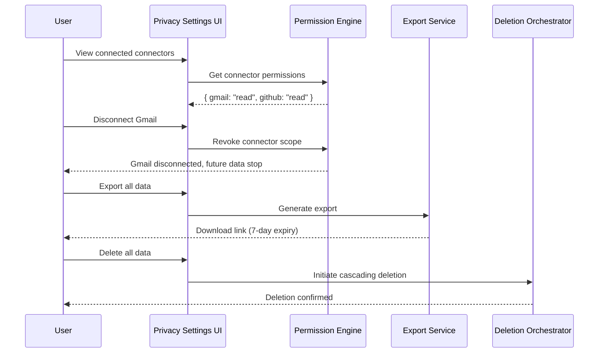
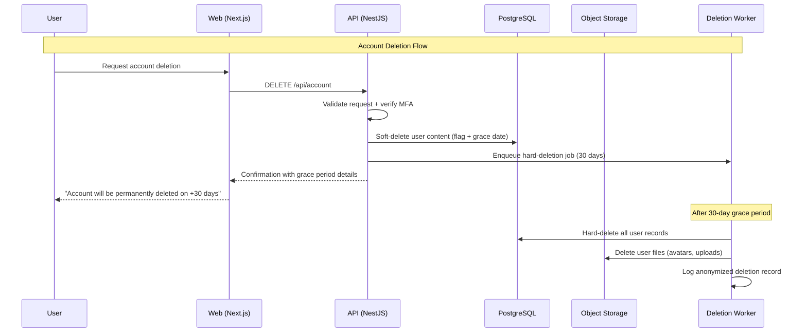

# Privacy

> **Purpose:** Define privacy principles and practices for Meridian
> **Status:** ✅ Upgraded to enterprise quality
> **Owner:** Security Team
> **Last Updated:** 2026-07-13

## Privacy Architecture

```mermaid
graph TD
    classDef principle fill:#e3f2fd,stroke:#1565c0,color:#000,stroke-width:2px
    classDef collected fill:#e8f5e9,stroke:#2e7d32,color:#000,stroke-width:1.5px
    classDef notCollected fill:#ffebee,stroke:#c62828,color:#000,stroke-width:1.5px
    classDef control fill:#fff3e0,stroke:#e65100,color:#000,stroke-width:1.5px
    classDef third fill:#f3e5f5,stroke:#6a1b9a,color:#000,stroke-width:1px

    subgraph Principles["🎯 Privacy Principles"]
        direction TB
        R1["Data Minimization<br/>Only essential data stored"]
        R2["Purpose Limitation<br/>Declared purpose per connector"]
        R3["User Control<br/>Granular consent + export + delete"]
        R4["Transparency<br/>Privacy policy + in-app prompts"]
        R5["Security by Design<br/>Encryption + access controls"]
    end

    subgraph Collected["✅ Data Collected"]
        C1["📄 Documents<br/>Retention: Until deleted"]
        C2["📧 Email metadata<br/>Retention: 30 days"]
        C3["💻 GitHub repos<br/>Retention: Until disconnected"]
        C4["📊 Usage analytics<br/>Retention: 90 days (anonymized)"]
    end

    subgraph NotCollected["❌ Data NOT Collected"]
        N1["Browsing history"]
        N2["Location data"]
        N3["Contact list"]
        N4["Payment info"]
        N5["Biometric data"]
    end

    subgraph Controls["🛂 User Privacy Controls"]
        U1["Connect/revoke connectors<br/>Immediate stop of data flow"]
        U2["Export all data<br/>Complete, portable archive"]
        U3["Delete all data<br/>Immediate, verifiable deletion"]
        U4["Autonomy settings<br/>Per-agent permission control"]
        U5["Account deletion<br/>Remove all data"]
    end

    subgraph ThirdParty["🔗 Third-Party Processing"]
        T1["Anthropic<br/>Document content → AI inference"]
        T2["Auth Provider<br/>Email + password hash → Auth"]
        T3["Cloud Provider<br/>Encrypted data → Storage"]
    end

    R1 & R2 & R3 & R4 & R5 --> C1 & C2 & C3 & C4
    R1 & R2 & R3 & R4 & R5 --> N1 & N2 & N3 & N4 & N5
    C1 & C2 & C3 & C4 --> U1 & U2 & U3 & U4 & U5
    C1 & C2 & C3 & C4 --> T1 & T2 & T3

    class R1,R2,R3,R4,R5 principle
    class C1,C2,C3,C4 collected
    class N1,N2,N3,N4,N5 notCollected
    class U1,U2,U3,U4,U5 control
    class T1,T2,T3 third
```



> **Diagram:** Privacy architecture showing the flow from **principles** → **data collected vs not collected** → **user controls** → **third-party processing**. Each data type has a defined retention policy, and users have granular controls to connect/export/delete at will.

---

## Privacy Principles

| Principle | Implementation |
|-----------|---------------|
| Data minimization | Only essential data stored; extraction is purposeful |
| Purpose limitation | Each connector and agent has declared purpose |
| User control | Granular consent, export, and deletion controls |
| Transparency | Clear privacy policy, in-app consent prompts |
| Security by design | Encryption, access controls, audit logging |

## Data Collected

| Data Type | Purpose | Retention | User Control |
|-----------|---------|-----------|-------------|
| Documents | Organization, memory building | Until deleted | Upload/delete any time |
| Email metadata | Deadline extraction | 30 days (metadata) | Disconnect Gmail |
| Email content | Classification | 30 days | Disconnect Gmail |
| GitHub repos | Skill extraction | Until disconnected | Disconnect GitHub |
| Usage analytics | Product improvement | Anonymized, 90 days | Opt-out in settings |

## Data Not Collected

- Browsing history outside connectors
- Location data
- Contact list (without explicit permission)
- Payment information (delegated to payment processor)
- Biometric data

## User Privacy Controls

| Control | Location | Effect |
|---------|----------|--------|
| Connect/revoke connectors | Connectors page | Immediate stop of data flow |
| Export all data | Settings page | Complete, portable archive |
| Delete all data | Settings page | Immediate, verifiable deletion |
| Autonomy settings | Settings page | Per-agent permission control |
| Account deletion | Settings page | Remove all data and account |

## Third-Party Data Processing

| Processor | Data Accessed | Purpose | Agreement |
|-----------|--------------|---------|-----------|
| Anthropic | Document content for agent processing | AI inference | DPA in place |
| Auth provider | Email, password hash | Authentication | DPA in place |
| Cloud provider | Encrypted data at rest | Storage | DPA in place |

## Common Mistakes

| Mistake | Consequence |
|---------|-------------|
| Privacy policies written in dense legalese | Users don't read privacy policies they can't understand — write privacy notices in plain language with specific examples of what data is collected and why |
| Promising data not collected without technical enforcement | A privacy policy that says "we don't collect location data" is violated if the application inadvertently captures IP geolocation — enforce data collection promises with technical controls, not just policy language |
| Consent that isn't granular enough | A single "I accept" for all data processing (documents, email, GitHub, analytics) doesn't meet the GDPR standard — implement per-connector, per-purpose consent with independent toggles |

## Best Practices

| Practice | Why |
|----------|-----|
| Design privacy controls as user-facing features, not backend policies | Users should be able to see what data is collected, export it, and delete it from the UI — privacy isn't just compliance, it's a product feature |
| Default to the most privacy-preserving option | New connectors start read-only, data retention defaults to the shortest reasonable window, analytics are opt-in — users can expand access, but privacy is the starting point |
| Conduct privacy impact assessments for new features | Before launching a feature that processes new data types, assess the privacy impact — document what data is collected, why, how long it's kept, and how users control it |

## Security

| Concern | Mitigation |
|---------|------------|
| Third-party processors accessing data beyond their scope | A cloud AI provider shouldn't train on user data — ensure all processor agreements prohibit model training on customer data and verify compliance through independent audits |
| Privacy data leakage through shared infrastructure | Multi-tenant databases could leak data between tenants — enforce row-level security and workspace-scoped queries at the database level, not just the application layer |
| Data retention policy violations at the storage layer | Application code may honor retention policies, but backups and caches may not — extend retention enforcement to all storage tiers including backups, snapshots, and warm caches |

## Performance

| Concern | Mitigation |
|---------|------------|
| Privacy control checks on every data access | Checking consent status, retention policy, and data classification on every read/write adds 10-30ms — cache privacy metadata (consent, classification) with request-scoped TTLs |
| Data export generating large archives | A "export everything" request for a long-time user can produce 1GB+ archives — generate exports in background with chunked output and notify the user when ready via email or in-app notification |
| Data deletion cascading across services | Deleting a user's data across 15 services and storage tiers must be coordinated — implement deletion as a distributed saga with retry logic and audit logging of each deletion step |

## Security Considerations

| Concern | Mitigation |
|---------|------------|
| Third-party processors accessing data beyond their scope | A cloud AI provider shouldn't train on user data — ensure all processor agreements prohibit model training on customer data and verify compliance through independent audits |
| Privacy data leakage through shared infrastructure | Multi-tenant databases could leak data between tenants — enforce row-level security and workspace-scoped queries at the database level, not just the application layer |
| Data retention policy violations at the storage layer | Application code may honor retention policies, but backups and caches may not — extend retention enforcement to all storage tiers including backups, snapshots, and warm caches |

## Performance Considerations

| Concern | Approach |
|---------|----------|
| Privacy control checks on every data access | Checking consent status, retention policy, and data classification on every read/write adds 10-30ms — cache privacy metadata (consent, classification) with request-scoped TTLs |
| Data export generating large archives | A "export everything" request for a long-time user can produce 1GB+ archives — generate exports in background with chunked output and notify the user when ready via email or in-app notification |
| Data deletion cascading across services | Deleting a user's data across 15 services and storage tiers must be coordinated — implement deletion as a distributed saga with retry logic and audit logging of each deletion step |

## Scope

This document defines the privacy principles and practices for Meridian — covering data minimization, purpose limitation, user controls, third-party processing, and privacy-by-design implementation. Applies to all data collected and processed across all Meridian services. Out of scope: GDPR-specific compliance (see [GDPR.md](./GDPR.md)), compliance posture (see [Compliance.md](./Compliance.md)), data retention schedules (see [Data-Retention-Policy.md](./Data-Retention-Policy.md)).

---

## Functional Requirements

| ID | Requirement | Priority | Notes |
|----|-------------|----------|-------|
| PV-FR-01 | Data collection must be minimized to essential information only | P0 | Purposeful extraction, not bulk collection |
| PV-FR-02 | Each connector and agent must have declared processing purpose | P0 | Purpose limitation principle |
| PV-FR-03 | Users must have granular controls to connect/export/delete data | P0 | Self-service UI controls |
| PV-FR-04 | New connectors default to read-only; write requires separate grant | P0 | Least privilege for data access |
| PV-FR-05 | Privacy impact assessments required for new data processing features | P1 | Documented before feature launch |

---

## Non-Functional Requirements

| ID | Requirement | Target | Measurement |
|----|-------------|--------|-------------|
| PV-NFR-01 | Privacy control check latency | <10ms per request | p99 consent + classification check |
| PV-NFR-02 | Data export generation | <5 min for full archive | Time from request to download ready |
| PV-NFR-03 | Data deletion cascade | <1 hr for full deletion | Time from request to all tiers confirmed |
| PV-NFR-04 | Consent UI load time | <2s | p95 settings page load |

---

## Workflows

### 1. Privacy Control Workflow

1. User navigates to Privacy Settings page
2. View all connected connectors and their data access scopes
3. Per-connector toggle: enable/disable data collection
4. Export button: triggers full data archive generation
5. Delete button: triggers cascading deletion
6. Account deletion: removes all data and account
7. All actions logged with timestamp for audit

### 2. Privacy Impact Assessment Workflow

1. New feature proposed that processes personal data
2. Product manager completes PIA template
3. PIA reviewed by security team
4. Questions answered: what data, why, retention, third-party access, user controls
5. If approved: feature proceeds with privacy controls implemented
6. If concerns: data collection scope reduced or additional controls added
7. PIA stored in compliance records

---

## Sequence Diagrams



> **Diagram:** Privacy control flows — user can view connector permissions, disconnect connectors (future data stop), export all data, and delete all data. Each action is independent and self-service from the Privacy Settings UI.

---

## Data Flow

```text
User → Privacy Settings
    → View Connectors and Permissions
    → [Disconnect] → Future Data Stop (not retroactive)
    → [Export] → Generate Portable Archive (background job)
    → [Delete] → Cascading Deletion (DB → caches → backups → analytics)
    → [Delete Account] → All Data + Account Removed
    → All actions logged to Audit Log
```

---

## APIs

| Endpoint | Method | Purpose | Auth |
|----------|--------|---------|------|
| `/api/v1/privacy/connectors` | GET | List connected connectors and scopes | User token |
| `/api/v1/privacy/connectors/{id}` | DELETE | Disconnect connector (future data stop) | User token |
| `/api/v1/privacy/export` | POST | Generate full data export | User token |
| `/api/v1/privacy/export/download/{id}` | GET | Download data export | User token (time-limited) |
| `/api/v1/privacy/delete` | POST | Delete all user data | User token (MFA required) |

---

## Database

| Table | Purpose | Key Columns | Indexes |
|-------|---------|-------------|---------|
| `privacy_consents` | User privacy consent records | `id`, `user_id`, `connector`, `scope`, `granted_at`, `revoked_at`, `consent_version` | `(user_id, connector)` |
| `privacy_exports` | Data export generation records | `id`, `user_id`, `status`, `archive_path`, `size_bytes`, `generated_at`, `expires_at` | `(user_id)`, `(expires_at)` |
| `privacy_deletion_requests` | Deletion request audit trail | `id`, `user_id`, `request_type`, `stages`, `status`, `requested_at`, `completed_at` | `(user_id)`, `(status)` |

---

## Scalability

| Dimension | Current Limit | 10x Strategy | 100x Strategy |
|-----------|--------------|--------------|---------------|
| Data export size | 500MB | 5GB (chunked archives) | 50GB (streaming + partial export) |
| Connector disconnect rate | 100/day | 1000/day | 10K/day (auto-scaling permission revocation) |
| Deletion requests | 50/day | 500/day | 5000/day (parallel deletion orchestrators) |

---

## Error Handling

| Scenario | Detection | Mitigation | Recovery |
|----------|-----------|------------|----------|
| Export job times out | Job runtime > 30 min | Notify user of delay; continue async | Scale up export worker; notify on completion |
| Deletion cascade fails at one tier | Tier timeout/error | Mark as partial; retry failed tier | Alert; manual intervention if retry exhausted |
| Connector disconnect race condition | Data accessed after disconnect | Permission Engine enforces consent; check on every access | Revocation applied immediately; stale cache will expire |
| Privacy audit log write fails | Write error | Buffer and retry; alert if persistent | Switch to secondary log store |

---

## Monitoring

| Metric | Alert Threshold | Severity | Dashboard |
|--------|----------------|----------|-----------|
| Export generation time | > 10 min | Warning | Privacy Exports |
| Deletion success rate | < 99% | Critical | Privacy Deletions |
| Connector disconnect rate | > 100/day | Info | Connector Health |
| Privacy control page latency (p95) | > 5s | Warning | UI Performance |

---

## Deployment

| Environment | Method | Trigger | Verification |
|-------------|--------|---------|-------------|
| Development | Docker Compose | Code push | Privacy control unit tests |
| Staging | Helm chart | PR merge | Privacy scenario tests |
| Production | Progressive rollout | Manual approval | Export + deletion verification |

---

## Configuration

| Variable | Purpose | Default | Required |
|----------|---------|---------|----------|
| `PRIVACY_EXPORT_MAX_SIZE_MB` | Max export size | 500 | Yes |
| `PRIVACY_EXPORT_EXPIRY_HOURS` | Export download link lifetime | 168 | Yes |
| `PRIVACY_DELETION_RETRY_MAX` | Max deletion cascade retries | 3 | Yes |
| `PRIVACY_DEFAULT_CONNECTOR_MODE` | Default connector access mode | read | Yes |

---

## Examples

### Example 1: User Initiates Data Export

```python
# User requests data export
export = await privacy.request_export(user_id="user_abc")
assert export.status == "pending"

# Check export status after generation
status = await privacy.get_export_status(export.id)
assert status.status == "ready"
assert status.size_bytes < 500 * 1024 * 1024  # Under 500MB

# Download link valid for 7 days
assert status.expires_at > datetime.utcnow()
```

---

## Risks

| Risk | Likelihood | Impact | Mitigation |
|------|------------|--------|------------|
| Third-party processor accesses data beyond scope | Medium | Critical | DPA agreements prohibit model training; independent audits |
| Privacy data leakage through shared infrastructure | Low | Critical | Row-level security + workspace-scoped queries at DB level |
| Data retention policy violated at backup/cache layer | Medium | High | Retention enforcement extends to all storage tiers (backups, caches, snapshots) |
| Privacy control UI lag causes accidental deletion | Low | Medium | Confirmation dialog required; deletion reversible within 30 days |

---

## Limitations

| Limitation | Impact | Workaround | Future Resolution |
|------------|--------|------------|-------------------|
| Export size limited to 500MB | Power users may have more data | Chunked archive with multiple parts | Streaming export with no size limit (Phase 3) |
| Deletion cascade synchronous per tier | May take minutes for full deletion | Async with progress tracking | Fully parallel deletion (Phase 2) |
| Connector disconnect not retroactive | Past data remains in system | Manual delete for past data | True "forget me" across all historical data (Phase 4) |
| No automatic PIA reminders | PIAs may be forgotten for new features | Manual checklist in feature process | Automated PIA trigger in feature pipeline (Phase 3) |

---

## Overview

Meridian collects, processes, and stores user-generated content — documents, memories, and AI agent interactions — to provide personal knowledge management and AI-assisted recall. Privacy by design is a core principle: the system is built to minimize data collection, maximize user control, and enable data portability and deletion on demand.

This document defines the data classification categories, data flow boundaries, user data rights, retention and deletion mechanisms, and the privacy review process for new features. The primary audience is product managers, engineers, and compliance officers responsible for privacy-conscious feature design.

Within the Meridian platform, user data is classified into three categories: user profile (name, email, avatar), user content (documents, memories, tags, annotations), and system metadata (logs, usage stats, performance metrics). Each category has distinct retention, access, and deletion policies.

Enterprise-grade privacy requires more than regulatory compliance — it requires transparent data practices, minimal data collection, and user-empowering controls. Users should be able to export all their data, delete their account permanently, and understand exactly what data Meridian stores and why.

---

## Goals

- Classify all user data into defined categories (profile, content, system metadata) with documented policies per category
- Implement user-facing data export (all user content in machine-readable format) with sub-24-hour delivery
- Enable permanent account deletion that removes all user content within 30 days
- Require privacy review for every new feature that collects, stores, or transmits user data
- Maintain data processing records (DPR) for all personal data flows within the platform

---

## Scope

### In Scope
- Data classification: user profile, user content, system metadata with distinct policies
- Data flow boundaries: what data crosses service boundaries (API → AI service, API → storage)
- User data rights: access, export (JSON/CSV), correction, deletion
- Data retention: profile (account lifetime), content (until deletion), metadata (90 days)
- Deletion mechanisms: soft delete (30-day grace), hard delete (after grace), propagation to integrations
- Privacy review process for new features

### Out of Scope
- GDPR-specific compliance requirements (covered in [GDPR.md](./GDPR.md))
- Data Retention Schedule with specific timelines (covered in [Data-Retention-Policy.md](./Data-Retention-Policy.md))
- Third-party data processing agreements (covered in vendor onboarding process)
- Cross-border data transfer mechanisms (SCCs, adequacy decisions)
- Marketing and analytics data collection (not applicable — no marketing analytics)

---

## Examples

### Example 1: Privacy Review Checklist (New Feature)

```markdown
## Feature: Document Sharing by Link

- [ ] What user data does this feature collect? Shared document IDs, access timestamps
- [ ] Where is this data stored? PostgreSQL `shared_links` table
- [ ] How long is it retained? Until link expires (configurable: 1–30 days)
- [ ] Can users delete this data? Yes — revoke link via UI
- [ ] Does this data cross a service boundary? Yes — link access goes through API
- [ ] Is the data encrypted at rest? Yes — AES-256
- [ ] Is the data encrypted in transit? Yes — TLS 1.3
- [ ] Privacy impact assessment: Low — users explicitly share content
```

### Example 2: Data Export API Response Structure

```json
{
  "export_id": "exp_8fK2mR4nL9",
  "status": "completed",
  "requested_at": "2026-03-15T10:30:00Z",
  "completed_at": "2026-03-15T10:45:00Z",
  "data": {
    "profile": {
      "email": "user@example.com",
      "name": "Alice User",
      "avatar_url": "https://storage.meridian.dev/avatars/user_123.png"
    },
    "content": {
      "documents": [
        {
          "id": "doc_abc123",
          "title": "Meeting Notes",
          "content": "...",
          "created_at": "2026-01-15T14:00:00Z",
          "updated_at": "2026-03-10T09:00:00Z"
        }
      ],
      "memories": [
        {
          "id": "mem_def456",
          "content": "Alice's birthday is June 15",
          "created_at": "2026-02-20T11:00:00Z"
        }
      ]
    }
  }
}
```

---

## Sequence Diagrams



> **Diagram:** Privacy flow — user requests account deletion, system soft-deletes with 30-day grace period, queues hard deletion, after grace period all user data is permanently removed from storage and databases.

---

## Future Improvements

| Improvement | Priority | Complexity | Timeline |
|-------------|----------|------------|----------|
| Fully parallel deletion across all storage tiers | High | Medium | Phase 2 (Q4 2026) |
| Automated PIA trigger in feature pipeline | Medium | Medium | Phase 3 (Q1 2027) |
| Streaming export with no size limit | Medium | Medium | Phase 3 (Q1 2027) |
| True "forget me" across all historical data | Low | High | Phase 4 (Q2 2027) |

## Related Documents

- [GDPR.md](./GDPR.md)
- [Compliance.md](./Compliance.md)
- [Security Architecture.md](./Security-Architecture.md)
