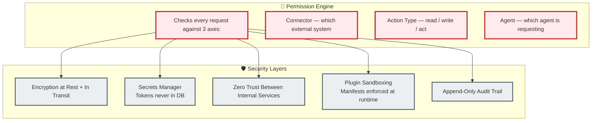
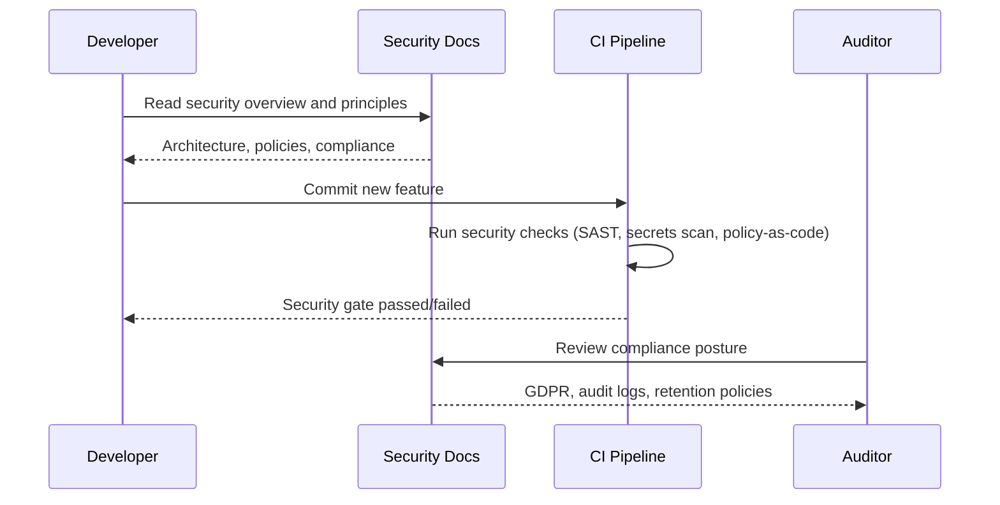

# Security

> **Purpose:** Security model, compliance, guardrails, and the Permission Engine
> **Status:** Active
> **Owner:** Security Team
> **Last Updated:** 2026-07-13

## Overview

The Security directory documents Meridian's security model, compliance posture, guardrails, and Permission Engine architecture. It covers both MVP and enterprise security requirements, ensuring the platform meets regulatory and operational security standards.

Key documents cover security and permissions for MVP, security and compliance for enterprise, guardrails and safety implementation, the Permission Engine, and security compliance implementation. The security architecture follows principles of least privilege, scoped access, suggest-mode, reversibility, and data control.

Compliance is designed around GDPR as the strictest applicable regime, with provisions for explicit consent, data export, erasure, data residency options, and revocable consent.

## What's here

| Document | Location | Status |
|----------|----------|--------|
| Security & Permissions (MVP) | [`/Docs/01-Meridian-MVP-Spec.md#11-security--permissions-v1-lean-but-non-negotiable`](../../Docs/01-Meridian-MVP-Spec.md#11-security--permissions-v1-lean-but-non-negotiable) | ✅ Good |
| Security & Compliance (Enterprise) | [`/Docs/06-Meridian-Enterprise-Paper.md#19-security--compliance`](../../Docs/06-Meridian-Enterprise-Paper.md#19-security--compliance) | ✅ Good |
| Guardrails & Safety | [`/Docs/Engineering/Implementation/11-guardrails-safety.md`](../../Docs/Engineering/Implementation/11-guardrails-safety.md) | ✅ Good |
| Permission Engine | [`/Docs/06-Meridian-Enterprise-Paper.md#193-permission-engine`](../../Docs/06-Meridian-Enterprise-Paper.md#193-permission-engine) | ✅ Good |
| Security Compliance (implementation) | [`/Docs/Engineering/Implementation/15-security-compliance.md`](../../Docs/Engineering/Implementation/15-security-compliance.md) | ✅ Good |

## Security architecture



## Key security principles

| Principle | Implementation |
|-----------|---------------|
| Least privilege | Every connector starts read-only; write requires separate grant |
| Scoped access | Local folder = one directory, never full disk |
| Suggest-mode | No destructive action without approval in v1 |
| Reversibility | Every action logged with enough detail to undo |
| Data control | "Export everything" and "delete everything" from day one |

## Compliance posture

Designed around GDPR as the strictest applicable regime:

- Explicit consent for every data use
- Right to access (export)
- Right to erasure (delete)
- Data residency options (EU, US, India)
- Consent is revocable (organization access not retroactive)

## Common Mistakes

| Mistake | Consequence |
|---------|-------------|
| Treating compliance as a one-time checkbox | Regulations evolve (GDPR updates, new frameworks) — a static compliance posture review misses changes. Schedule a compliance posture review every 6 months |
| Documenting security policies without enforcing them | A policy that says "all tokens are in Secrets Manager" is useless without automated validation — write policy-as-code checks that fail CI if secrets appear in code |
| Security docs that don't reference actual implementation files | Abstract security principles without concrete file paths create a gap between policy and practice — every security doc should link to the implementing module |

## Best Practices

| Practice | Why |
|----------|-----|
| Keep the Permission Engine as the single source of truth for authorization | All authorization decisions — user, agent, service, integration — must flow through the Permission Engine. No endpoint bypasses it |
| Automate compliance verification with policy-as-code | Use tools like Open Policy Agent or custom CI checks to verify that security policies are actually enforced in the codebase |
| Cross-reference security docs with implementation files | Every security doc should link to the actual source files that implement the controls — prevents docs from becoming stale |

## Scope

This document provides the security overview for Meridian — covering architecture, key principles, compliance posture, and guidance for navigating the Security docs directory. Applies to all security-related documentation and implementation across the entire platform. Out of scope: specific OWASP controls (see [OWASP.md](./OWASP.md)), encryption details (see [Encryption.md](./Encryption.md)), IAM roles (see [IAM.md](./IAM.md)).

---

## Workflows

### Security Onboarding Workflow

1. Review Security README for overall architecture and principles
2. Read Permission Engine docs for authorization model
3. Review Guardrails implementation for safety controls
4. Configure Secrets Manager per [Secrets.md](./Secrets.md)
5. Set up IAM roles and policies per [IAM.md](./IAM.md)
6. Enable Audit Logging per [Audit-Logs.md](./Audit-Logs.md)
7. Review Threat Model and OWASP controls
8. Configure Data Retention and Encryption policies

---

## Sequence Diagrams



> **Diagram:** Security onboarding flow — developer reads docs, CI enforces policies, auditor reviews compliance.

---

## Data Flow

```text
External Request → API Gateway (TLS)
    → Auth Provider (JWT verification)
    → Permission Engine (3-axis check: connector, action, agent)
    → [Allowed] → Process Request → Audit Log
    → [Denied] → 403 Forbidden → Audit Log
```

---

## APIs

| Endpoint | Method | Purpose | Auth |
|----------|--------|---------|------|
| `/api/v1/security/health` | GET | Security services health check | Service token |
| `/api/v1/security/audit/export` | GET | Export audit logs for compliance | Admin token |
| `/api/v1/security/compliance/status` | GET | Current compliance posture summary | Admin token |

---

## Scalability

| Dimension | Current Limit | 10x Strategy | 100x Strategy |
|-----------|--------------|--------------|---------------|
| Permission Engine checks | 1000/sec | 10K/sec (horizontal scaling) | 100K/sec (cached rules) |
| Audit log ingestion | 500 writes/sec | 5K writes/sec (async batching) | 50K writes/sec (sharded) |
| Security scan (CI) | 5 min | 10 min (parallel lint + SAST) | 30 min (parallel + DAST) |

---

## Error Handling

| Scenario | Detection | Mitigation | Recovery |
|----------|-----------|------------|----------|
| Permission Engine unavailable | Health check fails | Fail closed — deny all requests | Auto-restart + alert |
| Audit log write fails | Write error | Buffer and retry; switch to fallback store | Restore primary; replay buffered entries |
| Secrets Manager unreachable | Startup timeout | Use last cached value; warn in logs | Retry; if persistent, fail to start |

---

## Monitoring

| Metric | Alert Threshold | Severity | Dashboard |
|--------|----------------|----------|-----------|
| Permission Engine check latency (p99) | > 50ms | Warning | Security Performance |
| Audit log write error rate | > 0.1% | Critical | Security Health |
| Authentication failures per user | > 10/min | Warning | Auth Monitoring |
| Secrets access from unknown service | Any | Critical | Secrets Access |

---

## Configuration

| Variable | Purpose | Default | Required |
|----------|---------|---------|----------|
| `SECURITY_PERMISSION_ENGINE_ENABLED` | Enable Permission Engine | true | Yes |
| `SECURITY_AUDIT_LOG_ENABLED` | Enable audit logging | true | Yes |
| `SECURITY_RATE_LIMIT_PER_USER` | Max requests per user per minute | 100 | Yes |
| `SECURITY_CI_SCAN_ENABLED` | Enable CI security scanning | true | Yes |

---

## Goals

- Establish a comprehensive security posture covering all layers from perimeter defense to audit and compliance
- Implement the Permission Engine as the single authorization gateway for all identity types (User, Agent, Service, Integration)
- Achieve GDPR-ready compliance by design with SOC 2 and FERPA readiness in the roadmap
- Enforce least privilege with read-only defaults, scoped access, and revocable consent for all connectors
- Maintain append-only audit trails and encryption (TLS 1.3 + AES-256) across all data states

---

## Examples

```bash
# Security operations
meridian security audit log --since 24h
meridian security scan dependencies
meridian security rotate-keys --service api-gateway

# Compliance checks
meridian security compliance check --standard soc2
meridian security compliance check --standard gdpr
```

```yaml
# Security policy configuration
security:
  encryption:
    at_rest: aes-256
    in_transit: tls-1.3
  mfa:
    required: true
    providers: ["totp", "webAuthn"]
  session:
    timeout_minutes: 60
    max_concurrent: 3
```

```bash
# Security incident response
meridian security incident list --status open
meridian security incident report --id inc_42 --format pdf
```

## Future Improvements

| Improvement | Priority | Complexity | Timeline |
|-------------|----------|------------|----------|
| Automated compliance verification pipeline | High | Medium | Q1 2027 |
| Security incident response runbook automation | High | Medium | Q2 2027 |
| Penetration testing schedule and scope automation | Medium | Low | Q4 2026 |

## Related categories

- [`AI/`](../AI/) — QA Agent, agent permission scopes
- [`Engineering/`](../Engineering/) — Implementation files for guardrails and security
- [`Enterprise/`](../Enterprise/) — Enterprise consent model

## Related Documents

- [Security Architecture](./Security-Architecture.md) — Security architecture overview
- [Threat Model](./Threat-Model.md) — STRIDE threat model
- [Compliance](./Compliance.md) — Compliance frameworks and posture
- [Enterprise Consent Model](../Enterprise/README.md) — Enterprise security considerations
