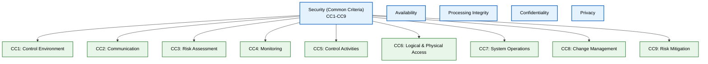
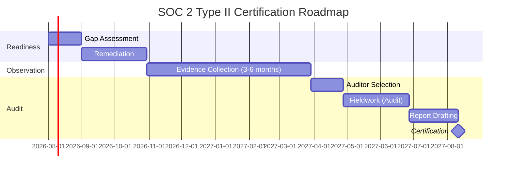

# SOC 2 Compliance

> **Purpose:** Define Vaeloom's SOC 2 Type II compliance roadmap — Trust Service Criteria mapping, control implementations, audit readiness, and certification timeline
> **Status:** 🆕 New
> **Owner:** Security Team
> **Version:** 1.0
> **Last Updated:** 2026-07-16
> **Dependencies:** [`Compliance.md`](./Compliance.md), [`Security-Architecture.md`](./Security-Architecture.md), [`Audit-Logs.md`](./Audit-Logs.md), [`IAM.md`](./IAM.md), [`../Enterprise/Enterprise-Architecture.md`](../Enterprise/Enterprise-Architecture.md)
> **Implementation Status:** 📋 Spec Only

## Overview

SOC 2 (System and Organization Controls 2) is an audit framework that verifies a service organization's controls meet the Trust Service Criteria (TSC) for security, availability, processing integrity, confidentiality, and privacy. SOC 2 Type II certification is a prerequisite for selling to most enterprise customers. This document defines Vaeloom's roadmap to certification, maps each TSC to implemented controls, and establishes the evidence-collection strategy.

## Goals

- Map all five Trust Service Criteria to Vaeloom's implemented controls
- Establish an audit-ready evidence collection process
- Define the gap between current state and certification requirements
- Provide a timeline from readiness assessment to certification

## Scope

### In Scope

- All five Trust Service Criteria (Security, Availability, Processing Integrity, Confidentiality, Privacy)
- Control implementations and evidence
- Audit readiness checklist
- Certification timeline

### Out of Scope

- General security architecture (see [`Security-Architecture.md`](./Security-Architecture.md))
- GDPR compliance (see [`GDPR.md`](./GDPR.md))

## Trust Service Criteria Mapping

> **Diagram:** SOC 2 Trust Service Criteria. Security (Common Criteria CC1-CC9) is required for all audits. Availability, Processing Integrity, Confidentiality, and Privacy are optional categories Vaeloom includes.

## Control Implementation Matrix

### Security (Common Criteria)

| Criteria | Control | Vaeloom Implementation | Evidence |
|----------|---------|------------------------|----------|
| CC1 (Control Environment) | Security governance | Security team; documented policies | Policy docs; org chart |
| CC2 (Communication) | Internal + external security comms | Security training; incident notification policy | Training records; policy docs |
| CC3 (Risk Assessment) | Annual risk assessment | Threat model ([`Threat-Model.md`](./Threat-Model.md)); risk register | Risk register; assessment reports |
| CC4 (Monitoring) | Continuous control monitoring | Audit log monitoring; anomaly detection | Audit logs; alerting configs |
| CC5 (Control Activities) | Documented control procedures | Runbooks; change management process | Runbooks; PR review logs |
| CC6.1 (Logical Access) | RBAC + ABAC + MFA | IAM system; MFA enforced for admins | IAM config; access review logs |
| CC6.6 (Logical Access) | Access revocation | SCIM deprovisioning; quarterly access review | Access review reports |
| CC6.7 (Data Protection) | Encryption at rest + in transit | AES-256 at rest; TLS 1.3 in transit | Encryption configs; key rotation logs |
| CC6.8 (Component Inventory) | Asset inventory | Infrastructure inventory; SBOM | SBOM ([`../DevOps/SBOM-Policy.md`](../DevOps/SBOM-Policy.md)) |
| CC7.1 (Detection) | Vulnerability detection | SAST (Semgrep); dependency scanning; pen testing | Scan reports; pen test report |
| CC7.2 (Monitoring) | Anomaly detection | SIEM integration; alerting | Alert configs; incident logs |
| CC7.3 (Incident Response) | Documented IR plan | [`../Operations/02-incident-response.md`](../Operations/02-incident-response.md) | IR plan; post-mortems |
| CC7.4 (Recovery) | Backup + DR | RPO <1h; RTO <4h; annual DR drill | Backup logs; DR test report |
| CC7.5 (BCP) | Business continuity plan | [`../Operations/Business-Continuity-Plan.md`](../Operations/Business-Continuity-Plan.md) | BCP doc; test results |
| CC8.1 (Change Management) | Documented change process | PR review; CI/CD; approval workflow | PR logs; deployment records |
| CC9.1 (Vendor Risk) | Vendor assessments | Annual vendor risk assessment | Vendor assessments; DPAs |

### Availability

| Criteria | Control | Implementation | Evidence |
|----------|---------|----------------|----------|
| A1.1 (Capacity) | Capacity planning | [`../Operations/Capacity-Planning.md`](../Operations/Capacity-Planning.md) | Capacity reports |
| A1.2 (Environmental Protection) | Redundant infrastructure | Multi-AZ; RDS Multi-AZ; Redis cluster | Infra configs |
| A1.3 (Recovery Infrastructure) | Backup + replication | RDS automated backups; cross-region replica | Backup configs |

### Confidentiality

| Criteria | Control | Implementation | Evidence |
|----------|---------|----------------|----------|
| C1.1 (Confidentiality Commitments) | Data classification + handling | Data classification policy ([`../Architecture/Data-Flow.md`](../Architecture/Data-Flow.md)) | Classification policy |
| C1.2 (Encryption) | Data encryption | AES-256 at rest; field-level for PII | Encryption configs |

### Privacy

| Criteria | Control | Implementation | Evidence |
|----------|---------|----------------|----------|
| P2.1 (Notice) | Privacy policy | [`Privacy.md`](./Privacy.md) | Privacy policy; version history |
| P3.1 (Choice/Consent) | Consent management | Opt-in for data usage; configurable | Consent records |
| P4.1 (Collection) | Data minimization | Only collect what's needed | Data dictionary; collection audit |
| P5.1 (Use/Retention) | Retention policy | [`Data-Retention-Policy.md`](./Data-Retention-Policy.md) | Retention configs; deletion logs |
| P6.1 (Disclosure) | DPA with vendors | Signed DPAs with all processors | DPA repository |
| P7.1 (Quality/Monitoring) | Privacy monitoring | Annual privacy review | Review reports |
| P8.1 (Deletion) | Data deletion | GDPR-compliant deletion flow ([`GDPR.md`](./GDPR.md)) | Deletion logs; verification scans |

## Audit Readiness Checklist

- [ ] All Common Criteria (CC1-CC9) controls implemented and documented
- [ ] Evidence collection automated (logs, configs, reports)
- [ ] At least 3-6 months of operating evidence (SOC 2 Type II requires observation period)
- - [ ] Access reviews conducted quarterly
- [ ] Penetration test completed in last 12 months
- [ ] Vulnerability scans current (no critical/high unresolved)
- [ ] Incident response plan tested (tabletop exercise)
- [ ] Disaster recovery drill completed
- [ ] Vendor risk assessments completed for all critical vendors
- [ ] Security training completed by all employees
- [ ] Change management process documented and followed
- [ ] Privacy policy current and published
- [ ] Data retention policy enforced (automated deletion)

## Certification Timeline

> **Diagram:** SOC 2 certification timeline. ~12 months from gap assessment to certified report. The observation period (3-6 months of evidence) is the longest phase.

## Gap Analysis

| Area | Current State | Required for SOC 2 | Gap |
|------|---------------|-------------------|-----|
| Access reviews | Manual, ad-hoc | Quarterly, documented | Process + tooling |
| Vendor risk assessments | None | Annual for all vendors | Process + templates |
| Security training | None | Annual for all employees | LMS + content |
| Penetration testing | None planned | Annual by qualified firm | Engage firm |
| DR drill | None | Annual test with evidence | Schedule + execute |
| Change management | PR review (informal) | Formal approval + audit trail | Workflow tooling |

## Best Practices

| # | Practice | Rationale |
|---|----------|-----------|
| 1 | Automate evidence collection | Manual evidence collection is error-prone and expensive |
| 2 | Start the observation period early | Type II requires months of evidence; late starts delay certification |
| 3 | Treat SOC 2 as continuous, not a one-time project | Controls must be operating continuously, not just during audit |

## Related Documents

- [`Compliance.md`](./Compliance.md) — overall compliance
- [`Security-Architecture.md`](./Security-Architecture.md) — security architecture
- [`Audit-Logs.md`](./Audit-Logs.md) · [`Audit-Policy.md`](./Audit-Policy.md) — audit logging
- [`IAM.md`](./IAM.md) — identity and access management
- [`GDPR.md`](./GDPR.md) — GDPR (privacy category)
- [`../Enterprise/Enterprise-Architecture.md`](../Enterprise/Enterprise-Architecture.md) — enterprise audit requirements
