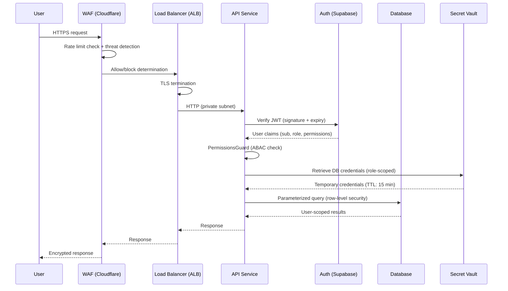

# Security Architecture

> **Purpose:** Define the security architecture for Vaeloom
> **Status:** ✅ Upgraded to enterprise quality
> **Owner:** Security Team
> **Last Updated:** 2026-07-13
> **Canonical source:** [`/Docs/06-Vaeloom-Enterprise-Paper.md#19-security--compliance`](../../Docs/06-Vaeloom-Enterprise-Paper.md#19-security--compliance)

## Security Architecture Overview

```mermaid
graph TD
    classDef layer fill:#e3f2fd,stroke:#1565c0,color:#000,stroke-width:2px
    classDef control fill:#e8f5e9,stroke:#2e7d32,color:#000,stroke-width:1.5px
    classDef principle fill:#fff3e0,stroke:#e65100,color:#000,stroke-width:1.5px
    classDef audit fill:#f3e5f5,stroke:#6a1b9a,color:#000,stroke-width:1px

    subgraph Perimeter["🔒 Perimeter Security"]
        direction TB
        P1["TLS 1.3<br/>Encryption in transit"]
        P2["WAF / Rate Limiting<br/>DDoS protection"]
        P3["CORS + CSP headers<br/>Web security"]
    end

    subgraph AuthN["🔑 Authentication Layer"]
        direction TB
        A1["Auth Provider<br/>(Clerk / Auth0)"]
        A2["JWT + Session Mgmt<br/>Short-lived tokens (15m)"]
        A3["MFA<br/>Enterprise only"]
    end

    subgraph AuthZ["🛡️ Authorization Layer — Permission Engine"]
        direction TB
        Z1["Connector<br/>Which external system"]
        Z2["Action Type<br/>read / write / act"]
        Z3["Agent<br/>Which agent is requesting"]
        Z4["Workspace<br/>Tenant isolation"]
    end

    subgraph Controls["🔐 Security Controls"]
        C1["Encryption at rest<br/>AES-256 (DB + S3)"]
        C2["Secrets Manager<br/>Tokens never in DB"]
        C3["Zero Trust<br/>Internal mTLS"]
        C4["Plugin Sandbox<br/>Manifest enforcement"]
    end

    subgraph Audit["📝 Audit & Compliance"]
        D1["Append-only Audit Trail<br/>Every action logged"]
        D2["Compliance Reporting<br/>GDPR / SOC 2 ready"]
        D3["Threat Detection<br/>Anomaly alerts"]
    end

    subgraph Principles["🎯 Security Principles"]
        R1["Least Privilege<br/>Read-only by default"]
        R2["Defense in Depth<br/>No single point of failure"]
        R3["Secure by Default<br/>Conservative defaults"]
    end

    Perimeter --> AuthN --> AuthZ --> Controls --> Audit
    AuthZ -.-> R1 & R2 & R3
    Audit -.-> R1 & R2 & R3

    class P1,P2,P3 layer
    class A1,A2,A3 layer
    class Z1,Z2,Z3,Z4 layer
    class C1,C2,C3,C4 control
    class D1,D2,D3 audit
    class R1,R2,R3 principle

```



> **Diagram:** Security architecture layered from perimeter defense → authentication → authorization (Permission Engine with 4 axes) → security controls → audit/compliance. **Security principles** (least privilege, defense in depth, secure by default) are enforced at every layer.

## Security Principles

| Principle | Implementation |
|-----------|---------------|
| Least privilege | Every connector starts read-only; write requires separate grant |
| Defense in depth | Multiple security layers — no single point of failure |
| Zero trust | Every internal call authenticated and scoped |
| Secure by default | Conservative defaults — suggest-mode, read-only connectors |
| Auditability | Every action logged, queryable, reversible |

## Common Mistakes

| Mistake | Consequence |
|---------|-------------|
| Security controls that are implemented but not tested | A WAF rule or encryption policy that isn't tested in CI creates a false sense of security — every control should have an automated test that verifies it's active and effective |
| Defense-in-depth layers that share the same vulnerability | If all security layers depend on the same auth provider being available, a single outage disables all controls — ensure that each layer of defense has independent failure modes |
| Security architecture that scales poorly with user growth | A permission engine that checks every attribute for every request works at 100 users but may not at 100K — validate the architecture with load testing that simulates peak tenant count |

## Best Practices

| Practice | Why |
|----------|-----|
| Layer security controls with independent failure modes | Each layer (perimeter, auth, authorization, encryption, audit) should fail independently — if the permission engine is down, encryption and audit logging still protect data |
| Test security controls in CI with automated assertions | Write integration tests that verify WAF rules are enforced, TLS is active, rate limits are applied, and permissions are checked — don't rely on manual verification |
| Document the blast radius of each security control failure | For every control, document what happens if it fails — a rate limiter failure means degraded performance, but an auth failure means a data breach. Prioritize accordingly |

## Performance

| Concern | Mitigation |
|---------|------------|
| Multi-layer security check latency | Each request passes through perimeter, auth, permission, encryption, and audit layers — cumulative latency can exceed 100ms. Profile and optimize the slowest layers first |
| Encryption overhead on database queries | TDE adds 5-15% CPU overhead on database operations — monitor encryption CPU usage and consider hardware-accelerated encryption (Intel AES-NI, cloud HSM) for production clusters |
| Permission Engine becoming a bottleneck at scale | Checking every request against multiple attribute sources (auth provider, resource service, context) creates network waterfalls — cache resolved permissions per (user, resource type) for 5-15 minutes |

## Security Considerations

| Concern | Mitigation |
|---------|------------|
| Single layer of security failing catastrophically | If the permission engine goes down and there's no fallback, all requests succeed or fail — layer independent controls so no single failure compromises the entire system |
| Security testing gaps in CI | Security controls that aren't tested in CI will regress — add automated tests that verify WAF rules, auth, permissions, encryption, and audit on every PR |
| Undocumented blast radius of control failures | If a rate limiter fails, what happens? Without documented blast radius, engineers make wrong assumptions during incidents — document what each control protects and what fails open vs. closed |

## Performance Considerations

| Concern | Approach |
|---------|----------|
| Multi-layer security check latency | Each request passes through perimeter, auth, permission, encryption, and audit layers — cumulative latency can exceed 100ms. Profile and optimize the slowest layers first |
| Encryption overhead on database queries | TDE adds 5-15% CPU overhead on database operations — monitor encryption CPU usage and consider hardware-accelerated encryption (Intel AES-NI, cloud HSM) for production clusters |
| Permission Engine becoming a bottleneck at scale | Checking every request against multiple attribute sources (auth provider, resource service, context) creates network waterfalls — cache resolved permissions per (user, resource type) for 5-15 minutes |

## Goals

- Enforce least privilege by granting read-only access by default requiring explicit write grants
- Maintain zero-trust architecture where every internal call is authenticated and scoped
- Ensure every action is logged in an append-only audit trail for compliance
- Prevent cross-tenant data access through mandatory workspace_id scoping
- Achieve SOC 2 and GDPR compliance readiness by design

## Scope

**In Scope:**
- Perimeter security: TLS 1.3, WAF, CORS, CSP headers
- Authentication: Auth provider (Clerk/Auth0), JWT with short-lived tokens (15min), MFA for enterprise
- Authorization: 4-axis Permission Engine (connector, action type, agent, workspace)
- Encryption: AES-256 at rest for database and object storage, TLS 1.3 in transit
- Secrets management: All tokens in secrets manager, never in database
- Audit: Append-only audit trail with tamper detection
- Plugin sandbox with manifest enforcement

**Out of Scope:**
- On-premise hardware security modules (HSM)
- Network-level segmentation (VPC peering, private subnets — managed by cloud provider)
- Physical security of data centers (managed by cloud provider)
- Third-party vendor security assessments
- Bug bounty program management

## Functional Requirements

| ID | Requirement | Priority |
|----|-------------|----------|
| FR-001 | All API communication shall be encrypted with TLS 1.3 | Critical |
| FR-002 | All internal service calls shall be authenticated via mTLS or short-lived tokens | Critical |
| FR-003 | Every request shall pass through the 4-axis Permission Engine | Critical |
| FR-004 | All secrets shall be stored in a secrets manager, never in code or environment variables | Critical |
| FR-005 | All user actions shall be recorded in an append-only audit log | Critical |
| FR-006 | Connectors shall start in read-only mode; write access requires explicit grant | High |
| FR-007 | MFA shall be enforced for all enterprise workspace members | High |
| FR-008 | CORS and CSP headers shall be applied to all web responses | High |

## Non-Functional Requirements

| ID | Requirement | Target | Measurement |
|----|-------------|--------|-------------|
| NFR-001 | Permission Engine decision shall complete within 20ms | p95 < 20ms | Permission check duration |
| NFR-002 | TLS handshake shall complete within 200ms | p95 < 200ms | TLS negotiation time |
| NFR-003 | Audit log writes shall complete within 50ms | p95 < 50ms | Audit write latency |
| NFR-004 | Security layer cumulative latency shall not exceed 100ms | < 100ms total | End-to-end security overhead |
| NFR-005 | Secrets rotation shall complete within 5 minutes | < 5 min | Time from trigger to rotated secret active |
| NFR-006 | Security incident detection shall alert within 1 minute | < 1 min | Detection-to-alert time |

## Components

| Component | Responsibility | Technology | Scale Strategy |
|-----------|---------------|------------|----------------|
| Auth Provider | Identity management, MFA, session handling | Clerk / Auth0 | Managed service, auto-scales |
| Permission Engine | 4-axis scope checking at runtime | NestJS Guard / FastAPI middleware | Cached permission resolution, horizontal |
| Secrets Manager | Encrypted storage and rotation of secrets | AWS Secrets Manager / GCP Secret Manager | Managed service, auto-scaled |
| Encryption Service | AES-256 encryption/decryption at rest | PostgreSQL TDE + S3 SSE-S3 | Hardware-accelerated (AES-NI) |
| Audit Logger | Append-only audit trail | PostgreSQL (agent_actions table) | Batch writes, partitioned monthly |
| WAF | DDoS protection, web attack filtering | Cloudflare / AWS WAF | Managed edge service |

## Data Flow

1. **Request Arrival** — External request hits edge layer; WAF inspects for common attack patterns, TLS 1.3 terminates at the load balancer, CORS and CSP headers are validated
2. **Authentication** — Request reaches auth layer; Clerk/Auth0 validates JWT (signature, expiry, issuer), checks MFA status for enterprise users, and extracts user_id and workspace_id claims
3. **Authorization** — Permission Engine evaluates the 4-axis check: which connector is targeted, what action type (read/write/act), which agent is requesting, and which workspace is accessed; resolves against stored permission grants
4. **Encryption and Storage** — Data at rest is AES-256 encrypted; database uses TDE with automatic key rotation; object storage uses server-side encryption (S3 SSE-S3 or R2)
5. **Audit Logging** — Every permission decision and action is written to the append-only audit log with timestamp, actor_id, action_type, resource_id, workspace_id, and outcome; log is tamper-evident through hash chaining

## Scalability

| Dimension | Current Limit | 10x Strategy | 100x Strategy |
|-----------|---------------|--------------|---------------|
| Permission Engine checks | 1000 checks/s | 10000 checks/s with cached permissions | 100000 checks/s with distributed cache |
| Audit log writes | 500 writes/s | 5000 writes/s with batch inserts | 50000 writes/s with partitioned tables + streaming |
| Secrets rotation | 10 secrets rotated/hour | 100 secrets rotated/hour | 1000 secrets rotated/hour with automation |
| WAF throughput | 1 Gbps | 10 Gbps | 100 Gbps (cloud edge auto-scaling) |
| Encryption throughput | 100 MB/s per instance | 1 GB/s with hardware AES-NI | 10 GB/s with dedicated HSM |

## Error Handling

| Error Scenario | Detection | Mitigation | Recovery |
|----------------|-----------|------------|----------|
| Auth provider unreachable | Connection timeout to Clerk/Auth0 | Cache last-known valid sessions, deny new auth requests | Failover to secondary auth provider |
| Permission Engine failure | Exception during scope check | Deny request by default (fail closed) | Restart Permission Engine, verify cache integrity |
| Secrets manager outage | API error from secrets manager | Use cached secrets (24-hour cache), deny new secret creation | Pager duty alert, switch to backup region |
| Encryption key rotation failure | Key rotation job error | Continue with current key, alert | Manual key rotation with operator oversight |
| Audit log write failure | PostgreSQL write error | Queue audit entries in memory, flush on recovery | Increase audit log partition size, retry writes |

## Monitoring

| Metric | Alert Threshold | Severity | Dashboard |
|--------|----------------|----------|-----------|
| Auth provider error rate | > 1% of auth requests in 5 minutes | Critical | Auth Health Dashboard |
| Permission Engine latency | > 100ms for 5 minutes | Critical | Permission Engine Dashboard |
| Audit log write success rate | < 99.9% for 5 minutes | Critical | Audit Log Dashboard |
| Secrets rotation overdue | > 30 days since last rotation | Warning | Secrets Management Dashboard |
| Failed login attempts per user | > 5 in 5 minutes | Warning | Threat Detection Dashboard |
| CORS/CSP violation rate | > 10 violations in 5 minutes | Info | Security Headers Dashboard |

## Configuration

| Variable | Purpose | Default | Required |
|----------|---------|---------|----------|
| AUTH_PROVIDER_URL | Auth service endpoint | https://auth.Vaeloom.dev | Yes |
| JWT_ISSUER | Expected JWT issuer | https://auth.Vaeloom.dev | Yes |
| JWT_AUDIENCE | Expected JWT audience | api.Vaeloom.dev | Yes |
| MFA_REQUIRED | Force MFA for all users | false | No |
| SECRETS_CACHE_TTL | Secrets cache duration in seconds | 86400 | No |
| AUDIT_LOG_RETENTION_DAYS | Audit log retention period | 365 | No |
| PERMISSION_CACHE_TTL | Permission cache duration in seconds | 300 | No |
| ENCRYPTION_ALGORITHM | Encryption algorithm for at-rest | AES-256-GCM | No |
| CORS_ORIGINS | Allowed CORS origins | https://app.Vaeloom.dev | Yes |

## Risks

| Risk | Likelihood | Impact | Mitigation |
|------|------------|--------|------------|
| Auth provider single point of failure | Low | Critical | Secondary auth provider, session caching, offline fallback |
| Permission Engine caching stale permissions | Medium | High | Short cache TTL (5 min), forced invalidation on permission change |
| Secrets leak through CI/CD pipeline | Low | Critical | Temporary credentials, never store secrets in CI variables |
| Encryption key loss making data unrecoverable | Low | Critical | Key backup in secondary region, HSM key escrow |
| Audit log tampering going undetected | Medium | High | Hash chain linking, periodic log integrity verification |

## Limitations

| Limitation | Impact | Workaround | Future Resolution |
|------------|--------|------------|-------------------|
| No IP-based access control lists | Cannot restrict by corporate network | Use VPN/auth-based access only | Add IP allowlisting at WAF layer |
| Permission Engine not hierarchical | All permissions flat, no inheritance | Define per-connector permission sets | Hierarchical permission model with inheritance |
| Audit log stored in same database | Single point of failure for compliance data | Regular off-site backup | Separate time-series audit database |
| No automated security regression testing | Manual verification of security controls | Document control inventory | Automated security regression suite in CI |

## Goals

- Enforce least-privilege access at every layer: network, application, and data
- Encrypt all data in transit (TLS 1.3) and at rest (AES-256) with no plaintext data paths
- Implement defense in depth with overlapping controls across all deployment tiers
- Achieve all OWASP ASVS Level 2 controls with documented verification for each control
- Maintain a complete threat model and risk register that is reviewed quarterly

---

## Scope

### In Scope
- Network security architecture: VPN, private subnets, security groups, and network ACLs
- Application security architecture: API gateway, WAF, rate limiting, input validation, CSP
- Data security architecture: encryption at rest (AES-256), encryption in transit (TLS 1.3), key management
- Authentication and authorization architecture: OAuth 2.0/OIDC, JWT, RBAC, MFA
- Security monitoring architecture: IDS/IPS, anomaly detection, centralized audit logging
- Container security architecture: image scanning, non-root execution, read-only root filesystem
- Secrets management architecture: vault tier with RBAC + audit

### Out of Scope
- Physical data center security (cloud-managed)
- Endpoint security (developer workstation security)
- Third-party vendor security architecture (covered in vendor risk assessment)
- Incident response procedures (covered in incident response plan)
- Disaster recovery architecture (covered in business continuity plan)

---

## Examples

### Example 1: Layered Security Controls (Defense in Depth)

```yaml
# Conceptual layered security for an API request
Layers:
  - Layer 1: WAF (Cloudflare/AWS WAF)
    Controls:
      - Rate limiting: 100 req/min per IP
      - IP blocklist: known malicious ranges
      - SQL injection pattern blocking
      - XSS pattern blocking

  - Layer 2: API Gateway (Kong/AWS API Gateway)
    Controls:
      - Request authentication (JWT verification)
      - Request validation (schema, size limits)
      - TLS termination

  - Layer 3: Application Framework (NestJS)
    Controls:
      - AuthGuard: JWT signature + expiry check
      - PermissionsGuard: ABAC check
      - Rate limiter: per-route, per-user
      - Input validation (class-validator DTOs)
      - Output sanitization (Helmet.js)

  - Layer 4: Database Layer
    Controls:
      - Parameterized queries (no SQL injection)
      - Row-level security (user-scoped access)
      - Encryption at rest (AES-256)
      - Audit triggers
```

### Example 2: Security Group Rules

```hcl
# TLS termination → service communication only
resource "aws_security_group" "api_service" {
  name        = "Vaeloom-api-${var.environment}"
  description = "Security group for Vaeloom API service"

  ingress {
    description     = "API traffic from ALB only"
    from_port       = 3000
    to_port         = 3000
    protocol        = "tcp"
    security_groups = [aws_security_group.alb.id]
  }

  ingress {
    description     = "Metrics from monitoring"
    from_port       = 9464
    to_port         = 9464
    protocol        = "tcp"
    security_groups = [aws_security_group.monitoring.id]
  }

  egress {
    description = "All outbound traffic"
    from_port   = 0
    to_port     = 0
    protocol    = "-1"
    cidr_blocks = ["0.0.0.0/0"]
  }
}
```

---

## Sequence Diagrams



> **Diagram:** Defense in depth — every request passes through WAF (rate limiting + threat detection), ALB (TLS termination), API (JWT verification + ABAC + parameterized queries), database (row-level security). Each layer provides overlapping protection.

---

## Future Improvements

| Improvement | Priority | Complexity | Timeline |
|-------------|----------|------------|----------|
| Hierarchical permission model with inheritance | High | High | Q4 2026 |
| Automated security regression testing in CI | High | Medium | Q3 2026 |
| Separate immutable audit database (immudb) | Medium | High | Q1 2027 |
| IP allowlisting at WAF layer | Medium | Low | Q2 2026 |
| Security information and event management (SIEM) integration | Low | High | Q1 2027 |

## Related Documents

- [Encryption.md](./Encryption.md)
- [Secrets.md](./Secrets.md)
- [IAM.md](./IAM.md)
- [`/Docs/06-Vaeloom-Enterprise-Paper.md#19-security--compliance`](../../Docs/06-Vaeloom-Enterprise-Paper.md#19-security--compliance)
