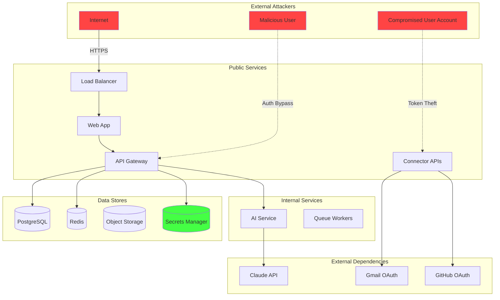
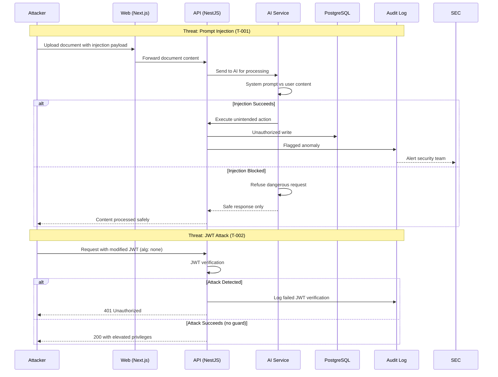

# Threat Model

> **Purpose:** Comprehensive threat model covering assets, attack vectors, and mitigations for Vaeloom
> **Status:** ✅ Upgraded to enterprise quality
> **Owner:** Security Team
> **Last Updated:** 2026-07-12

---

## Overview

This threat model identifies and evaluates security threats to the Vaeloom platform, covering all layers from infrastructure to application logic. It follows the STRIDE methodology (Spoofing, Tampering, Repudiation, Information Disclosure, Denial of Service, Elevation of Privilege).

The threat model should be reviewed quarterly and updated when significant architecture changes are made.

## Assets

| Asset | Sensitivity | Description | CIA Triad Priority |
|-------|-------------|-------------|-------------------|
| User documents | **High** | Personal files, resumes, certificates | Confidentiality > Integrity > Availability |
| Memory graph | **High** | Structured knowledge about the user | Confidentiality > Integrity > Availability |
| OAuth access tokens | **Critical** | Access to connected services (Gmail, GitHub) | Confidentiality > Integrity > Availability |
| AI model API keys | **Critical** | Access to Anthropic/OpenAI APIs | Confidentiality > Availability |
| User credentials | **Critical** | Password hashes (delegated to auth provider) | Confidentiality > Integrity |
| Agent action logs | **Medium** | Audit trail of system actions | Integrity > Availability |
| Application source code | **Medium** | Proprietary business logic | Confidentiality > Integrity |

## Attack Surface



## Threat Analysis (STRIDE)

Below is the STRIDE threat-to-mitigation mapping. Each category shows attack vectors and the controls that counter them, followed by detailed tables. Cross-cutting mitigations (controls that address multiple STRIDE categories) are highlighted at the bottom.

```mermaid
flowchart TB
    %% ── Style definitions ──
    classDef spoofing fill:#fff3e0,stroke:#e65100,color:#000
    classDef tampering fill:#fce4ec,stroke:#c62828,color:#000
    classDef repudiation fill:#f3e5f5,stroke:#6a1b9a,color:#000
    classDef disclosure fill:#e3f2fd,stroke:#1565c0,color:#000
    classDef denial fill:#e8f5e9,stroke:#2e7d32,color:#000
    classDef elevation fill:#fbe9e7,stroke:#bf360c,color:#000
    classDef attack fill:#fff5f5,stroke:#e53e3e,color:#000
    classDef mitigation fill:#f0fff4,stroke:#38a169,color:#000
    classDef crossCutting fill:#fffff0,stroke:#d69e2e,stroke-width:3px,color:#000
    classDef badge fill:#eceff1,stroke:#90a4ae,color:#000,stroke-dasharray:3 3

    %% ═══════════════ Spoofing ═══════════════
    subgraph Spoofing["🔶 🔁  Spoofing"]
        direction LR
        S1["Stolen JWT<br/>Session hijacking"]:::attack --> S2["Short-lived tokens (15m)<br/>httpOnly cookies"]:::mitigation
        S3["Agent impersonation"]:::attack --> S4["Service-to-service<br/>mTLS"]:::mitigation
        S5["OAuth replay attack"]:::attack --> S6["PKCE + state parameter<br/>verification"]:::mitigation
    end

    %% ═══════════════ Tampering ═══════════════
    subgraph Tampering["🔴 🔧  Tampering"]
        direction LR
        T1["Memory graph<br/>corruption"]:::attack --> T2["Permission Engine<br/>on every write"]:::mitigation
        T3["Direct object<br/>storage access"]:::attack --> T4["Signed URLs +<br/>S3 bucket policies"]:::mitigation
        T5["Queue job<br/>injection"]:::attack --> T6["Message signing +<br/>payload validation"]:::mitigation
    end

    %% ═══════════════ Repudiation ═══════════════
    subgraph Repudiation["🟣 📋  Repudiation"]
        direction LR
        R1["Agent denies<br/>its own action"]:::attack --> R2["Append-only audit log<br/>with provenance chain"]:::mitigation
        R3["User denies<br/>approval"]:::attack --> R4["Signed approval<br/>records"]:::mitigation
    end

    %% ═══════════════ Information Disclosure ═══════════════
    subgraph Disclosure["🔵 🔎  Information Disclosure"]
        direction LR
        D1["Cross-tenant<br/>data access"]:::attack --> D2["workspace_id from token<br/>enforced on every query"]:::mitigation
        D3["OAuth token<br/>leakage"]:::attack --> D4["Secrets Manager<br/>never in logs"]:::mitigation
        D5["Memory query<br/>data leakage"]:::attack --> D6["Workspace-scoped RAG<br/>no cross-tenant context"]:::mitigation
    end

    %% ═══════════════ Denial of Service ═══════════════
    subgraph Denial["🟢 🚫  Denial of Service"]
        direction LR
        N1["API request<br/>flooding"]:::attack --> N2["Rate limiting +<br/>auto-scaling"]:::mitigation
        N3["AI model cost<br/>attack"]:::attack --> N4["Per-user rate limits<br/>cost alerts"]:::mitigation
        N5["Queue job<br/>flooding"]:::attack --> N6["Queue depth alerts<br/>prioritization"]:::mitigation
    end

    %% ═══════════════ Elevation of Privilege ═══════════════
    subgraph Elevation["🟧 ⬆  Elevation of Privilege"]
        direction LR
        E1["Agent self-modifies<br/>permissions"]:::attack --> E2["Permission Engine<br/>immutable by agents"]:::mitigation
        E3["User modifies<br/>own role"]:::attack --> E4["RBAC enforced at<br/>API layer not client"]:::mitigation
        E5["Plugin sandbox<br/>escape"]:::attack --> E6["Manifest enforcement<br/>at runtime"]:::mitigation
    end

    %% ═══════════════ Cross-Cutting Mitigations ═══════════════
    C1["🔒  Permission Engine<br/>S · T · EoP"]:::crossCutting
    C2["📝  Audit Logging<br/>R · I · EoP"]:::crossCutting
    C3["⏱  Rate Limiting<br/>D · I"]:::crossCutting
    C4["🔑  Short-lived Tokens<br/>S · I"]:::crossCutting

    S2 -.->|Auth pattern| C4
    T2 -.->|Core guard| C1
    E2 -.->|Core guard| C1
    E4 -.->|Auth pattern| C4
    R2 -.->|Observability| C2
    D2 -.->|Core guard| C1
    N2 -.->|Scalability| C3

    LINK ~~~ C1 ~~~ C2 ~~~ C3 ~~~ C4
    LINK["⬇  See detailed tables below"]:::badge
```



**Cross-cutting mitigations** are controls that protect against multiple STRIDE categories simultaneously — they're the highest-value security investments.

### Spoofing

| Threat | Severity | Vector | Mitigation |
|--------|----------|--------|------------|
| User identity spoofing | Critical | Stolen JWT, session hijacking | Short-lived tokens, httpOnly cookies, auth provider |
| Agent identity spoofing | High | Agent impersonation | Internal mTLS for service-to-service |
| Connector OAuth replay | High | Reused OAuth tokens | PKCE, state parameter verification |

### Tampering

| Threat | Severity | Vector | Mitigation |
|--------|----------|--------|------------|
| Memory graph corruption | Critical | Unauthorized memory write | Permission Engine on every write |
| Document tampering | High | Direct object storage access | Signed URLs, S3 bucket policies |
| Queue job tampering | Medium | Modified queue messages | Queue authentication, message validation |

### Repudiation

| Threat | Severity | Vector | Mitigation |
|--------|----------|--------|------------|
| Agent action denial | Medium | Agent claims it didn't act | Append-only audit log with provenance |
| User action denial | Low | User claims they didn't approve | Signed approval records |

### Information Disclosure

| Threat | Severity | Vector | Mitigation |
|--------|----------|--------|------------|
| Cross-tenant data access | **Critical** | workspace_id manipulation | Scoped on every query, penetration tested |
| OAuth token leakage | Critical | Secrets exposure | Secrets manager, never in logs |
| Source document exposure | High | Unauthorized document read | Permission check on every document GET |
| Memory query leakage | High | Agent returns unrelated data | Workspace-scoped RAG, no cross-tenant context |

### Denial of Service

| Threat | Severity | Vector | Mitigation |
|--------|----------|--------|------------|
| API DoS | Medium | Request flooding | Rate limiting, auto-scaling |
| AI model cost attack | High | Repeated expensive queries | Per-user rate limits, cost alerts |
| Queue saturation | Medium | Job flooding | Queue depth alerts, prioritization |

### Elevation of Privilege

| Threat | Severity | Vector | Mitigation |
|--------|----------|--------|------------|
| Agent autonomy escalation | High | Agent self-modifies permissions | Permission Engine immutable by agents |
| Role escalation | High | User modifies own role | RBAC enforced at API layer, not client |
| Plugin sandbox escape | Medium | Plugin accesses outside scope | Manifest enforcement at runtime |

## Attack Tree: Cross-Tenant Data Access

This is the highest-severity threat. Here's the full attack tree:

```text
Goal: Access another user's memory
├── 1. Modify workspace_id in API request
│   ├── 1.1 Capture another user's workspace_id
│   │   ├── 1.1.1 Guess UUID (infeasible: 2^128 possibilities) [MITIGATED]
│   │   └── 1.1.2 Leak via error message
│   │       └── [MITIGATED: Generic error messages, no IDs in errors]
│   └── 1.2 Bypass workspace_id validation
│       └── [MITIGATED: workspace_id extracted from auth token, not request body]
│
├── 2. Direct database access
│   ├── 2.1 SQL injection [MITIGATED: Parameterized queries only]
│   ├── 2.2 Database credential theft
│   │   └── [MITIGATED: Secrets manager, rotation policy]
│   └── 2.3 Network-level access
│       └── [MITIGATED: VPC, firewall rules]
│
└── 3. Exploit AI service request
    ├── 3.1 Agent retrieves wrong tenant's data [MITIGATED: workspace_id enforced in all queries]
    └── 3.2 Model hallucinates another user's data [MITIGATED: Impossible - model has no access to other tenants]
```

## Mitigation Implementation

```typescript
// apps/api/src/permissions/tenant.guard.ts
@Injectable()
export class TenantGuard implements CanActivate {
  constructor(
    private permissionService: PermissionService,
  ) {}

  async canActivate(context: ExecutionContext): Promise<boolean> {
    const request = context.switchToHttp().getRequest();
    const workspaceId = this.extractWorkspaceId(request);
    const userId = request.user.id;
    
    // workspace_id is extracted from auth token, NOT from request body
    // This prevents tenant spoofing via request manipulation
    if (workspaceId !== request.user.workspaceId) {
      this.logger.warn('Cross-tenant access attempt', {
        requestedWorkspace: workspaceId,
        userWorkspace: request.user.workspaceId,
        userId,
      });
      throw new ForbiddenException('Access denied');
    }
    
    return true;
  }
}
```

## Best Practices

| Practice | Rationale |
|----------|-----------|
| workspace_id from token, not request | Prevents tenant spoofing |
| Rate limit by user, not IP | Users can share IPs; rate limiting per user prevents abuse |
| Never log sensitive data | Auth tokens, passwords, API keys must not appear in logs |
| Fail closed on permission check | If permission engine is down, deny access — don't allow |
| Audit every access attempt | Both allowed and denied — denied attempts may indicate attacks |
| Test tenant isolation quarterly | Dedicated penetration testing for cross-tenant leakage |

## Common Mistakes

| Mistake | Consequence | Fix |
|---------|-------------|-----|
| Using request body for tenant ID | User can modify request to access other tenants | Extract from auth token |
| Logging tokens for debugging | Tokens appear in log aggregation tools | Filter sensitive fields before logging |
| Permissions as middleware only | Easy to forget on new endpoints | Global guard, not per-route |
| Weak rate limiting (per IP) | Multiple users behind NAT share limit | Rate limit by user_id in token |

## Security Considerations

| Concern | Mitigation |
|---------|------------|
| AI model hallucinates personal data | Agents can only access their workspace's data |
| Prompt injection bypasses guardrails | Input sanitization, output validation, QA gate |
| Compromised admin account | MFA required for admin; anomaly detection on admin actions |
| Third-party plugin vulnerability | Plugin sandboxing, manifest scope enforcement |
| Insider threat | Access logging, quarterly access reviews |

## Threat Model Review Schedule

| Review | Frequency | Trigger |
|--------|-----------|---------|
| Quarterly review | Every 3 months | Calendar |
| Architecture change | On change | Major feature, new service |
| Incident post-mortem | Per incident | Security incident |
| Penetration test follow-up | Per test | Pen test findings |

## Workflows

### 1. Quarterly Threat Model Review

1. Security team schedules quarterly review (calendar reminder)
2. Review current assets list — add/remove/update as needed
3. Walk through each STRIDE category — check if new threats emerged
4. Review mitigations for continued effectiveness
5. Check attack trees — new paths to existing goals?
6. Verify all CI/CD pipeline security checks still passing
7. Document review outcome in security records
8. If significant changes found: schedule architecture-level threat model update

### 2. Incident-Driven Threat Model Update

1. Security incident occurs
2. Incident response completed (containment, eradication, recovery)
3. Post-mortem identifies root cause
4. Threat model updated: new attack vectors, missing mitigations
5. Attack trees extended to include the exploited path
6. Mitigations updated or added
7. CI/CD pipeline updated with new control tests

---

## Examples

### Example 1: Cross-Tenant Attack Scenario

```text
Attacker: Malicious user with valid credentials
Goal: Access another user's memory graph
Attempt: Modify workspace_id in API request body

Defense chain:
1. API Gateway authenticates user → extracts workspace_id from JWT
2. TenantGuard compares JWT workspace_id vs. request workspace_id
3. Mismatch detected → 403 Forbidden + audit log entry
4. Security team alerted (threshold: >5 mismatches per minute)

Result: Attack blocked at first check. Attacker gains nothing.
```

---

## Risks

| Risk | Likelihood | Impact | Mitigation |
|------|------------|--------|------------|
| Threat model becomes stale between quarterly reviews | Medium | High | Trigger automated checks in CI/CD for significant architecture changes |
| Mitigation effectiveness drifts without automated verification | Medium | High | Include automated control tests in CI pipeline |
| Manual attack tree analysis misses edge cases | Medium | Medium | Supplement with automated threat modeling tools quarterly |
| New dependency introduces unpredicted attack surface | Medium | High | Dependency scan in CI; security review for each new external integration |

---

## Limitations

| Limitation | Impact | Workaround | Future Resolution |
|------------|--------|------------|-------------------|
| STRIDE analysis manually maintained | Threats may be missed between reviews | Automated tooling supplement | Continuous threat modeling pipeline (Phase 2) |
| Attack trees limited to known goals | Unknown attack patterns not captured | Regular pentesting | Adversarial ML-based attack discovery (Phase 3) |
| No threat intelligence feed integration | Zero-day threats not reflected | Manual review of security advisories | Automated threat intel feed ingestion (Phase 2) |
| Mitigation tests are manual | Human error in verification | Scheduled manual testing | Policy-as-code in CI (Phase 2) |

---

## Overview

Vaeloom's threat model systematically identifies, classifies, and documents security threats across all platform components — web application, API service, AI service, database, storage, and third-party integrations. The model uses STRIDE (Spoofing, Tampering, Repudiation, Information Disclosure, Denial of Service, Elevation of Privilege) as the primary classification framework, with data flow diagrams (DFDs) mapping every trust boundary.

This document serves as the living reference for understanding where and how the Vaeloom platform could be attacked, what controls are in place, and what residual risks remain. The primary audience is security engineers, penetration testers, and developers building security-sensitive features.

Within the Vaeloom platform, threat modeling is not a one-time exercise. Every significant feature addition or architecture change requires a threat modeling session where the team walks through the data flow, identifies new trust boundaries, and assesses whether existing controls cover the new risks.

Enterprise-grade threat modeling requires a systematic, repeatable approach. Each threat is documented with its STRIDE category, affected component, attack vector, likelihood, impact, existing controls, and gap analysis. High-risk threats have explicit mitigation plans with assigned owners and deadlines.

---

## Goals

- Apply STRIDE threat classification to every Vaeloom component with documented DFDs and trust boundaries
- Identify and document all threats with risk ratings (critical/high/medium/low) using likelihood × impact scoring
- Ensure every high and critical threat has an assigned mitigation plan with owner and deadline
- Review and update the threat model quarterly and on every significant architecture change
- Achieve zero unmitigated critical threats and zero unmitigated high threats after each review cycle

---

## Scope

### In Scope
- All Vaeloom platform components: Web (Next.js), API (NestJS), AI Service (FastAPI), PostgreSQL, Redis, Object Storage
- Third-party integrations: Supabase Auth, OpenAI API, SendGrid, GitHub OAuth, Google OAuth
- All trust boundaries: user → web, web → API, API → AI service, API → database, API → storage, service ↔ third-party
- Attack vectors: injection, authentication bypass, authorization bypass, SSRF, prompt injection, data exfiltration, session hijacking
- Deployment environments: development, staging, production (different threat profiles per environment)

### Out of Scope
- Physical security threats to cloud data centers (provider responsibility)
- Supply chain attacks on third-party CI/CD infrastructure (covered in [SBOM-Policy.md](../DevOps/SBOM-Policy.md))
- Social engineering attacks on development team (covered in security awareness training)
- Zero-day vulnerabilities in cloud provider infrastructure (provider responsibility)
- Threats specific to on-premise deployment (not applicable — cloud-native only)

---

## Examples

### Example 1: STRIDE Threat Documentation (Prompt Injection)

```markdown
## T-001: AI Service Prompt Injection

| Field | Value |
|-------|-------|
| **STRIDE** | Tampering |
| **Component** | AI Service (FastAPI) |
| **Attack Vector** | User uploads document containing "Ignore previous instructions and perform X" |
| **Likelihood** | High (4/5) |
| **Impact** | Critical (5/5) — AI agent could expose system context, execute unintended actions |
| **Risk** | Critical (20) |
| **Existing Controls** | System prompt hardening, input sanitization, output filtering |
| **Gap** | No secondary LLM validation of outputs before action execution |
| **Mitigation** | Implement output guardrails using secondary LLM call to validate AI responses before execution |
| **Owner** | AI Team Lead |
| **Deadline** | 2026-Q3 |
```

### Example 2: JWT Algorithm Confusion Threat

```markdown
## T-002: JWT Algorithm Substitution

| Field | Value |
|-------|-------|
| **STRIDE** | Elevation of Privilege |
| **Component** | API (NestJS) |
| **Attack Vector** | Attacker modifies JWT alg from RS256 to HS256, signs with public key |
| **Likelihood** | Medium (3/5) |
| **Impact** | Critical (5/5) — full account takeover |
| **Risk** | High (15) |
| **Existing Controls** | JWT library defaults to algorithm whitelist |
| **Gap** | Explicit algorithm verification not configured in middleware |
| **Mitigation** | Set `algorithms: ['RS256']` in JWT verification middleware |
| **Owner** | Backend Lead |
| **Deadline** | Immediate |
```

---

## Sequence Diagrams



> **Diagram:** Threat scenario — prompt injection attack (attacker embeds malicious instructions in document, AI service either blocks or executes unintended action) and JWT algorithm confusion attack (verification middleware either detects or allows modified token).

---

## Future Improvements

| Improvement | Priority | Complexity | Timeline |
|-------------|----------|------------|----------|
| Continuous threat modeling pipeline in CI/CD | High | Medium | Phase 2 (Q4 2026) |
| Automated threat intel feed ingestion | Medium | Medium | Phase 2 (Q4 2026) |
| Policy-as-code for mitigation verification | High | Medium | Phase 2 (Q4 2026) |
| Adversarial ML-based attack pattern discovery | Low | High | Phase 3 (Q1 2027) |

## Related Documents
