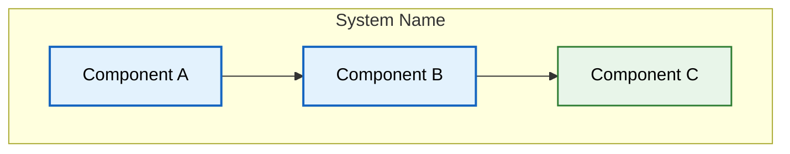

# Enterprise Documentation Template

> **Purpose:** This template defines the full 25-section enterprise quality standard for all Vaeloom documentation — target: 100/100
> **Status:** 🆕 Template — apply to all docs
> **Owner:** Architecture Team
> **Last Updated:** 2026-07-13

Every document in the Vaeloom documentation system MUST follow this structure. Apply sections **where applicable** — not every section fits every doc, but every applicable section must be present for 100/100 quality.

---

## Complete 25-Section Template

### 1. Header Metadata

```markdown
# Document Title

> **Purpose:** One-sentence description of what this document covers
> **Status:** 🆕 New | ✅ Upgraded to enterprise quality | 🔄 Needs Update
> **Owner:** [Team Name]
> **Last Updated:** YYYY-MM-DD
> **Canonical source:** [`relative/path/to/source.md`](./path/to/source.md)
```

### 2. Overview

3-4 paragraphs covering:
- What this document covers
- Who the audience is
- How it fits into the larger Vaeloom system
- Why this topic matters

```markdown
## Overview

Vaeloom is a second brain for education and career...

This document covers [topic] — including [scope].

Readers should understand [prerequisites] before reading.

[Topic] is critical because [reason].
```

### 3. Goals

3-5 bullet points of what this document achieves:

```markdown
## Goals

- Define the [topic] architecture and design decisions
- Establish standards for [specific area]
- Provide implementation guidance for engineering teams
- Document security and performance considerations
- Enable operational excellence through runbooks and monitoring
```

### 4. Scope

```markdown
## Scope

### In Scope
- [What this document covers]
- [Specific components, workflows, decisions]

### Out of Scope
- [What this document explicitly does NOT cover]
- [Cross-cutting concerns documented elsewhere]
```

### 5. Functional Requirements

For design/architecture docs only:

```markdown
## Functional Requirements

| ID | Requirement | Priority | Notes |
|----|-------------|----------|-------|
| FR-001 | [Requirement description] | P0/P1/P2 | [Context] |
| FR-002 | [Requirement description] | P0/P1/P2 | [Context] |
```

### 6. Non-Functional Requirements

```markdown
## Non-Functional Requirements

| ID | Requirement | Target | Measurement |
|----|-------------|--------|-------------|
| NFR-001 | Availability | 99.9% | Uptime monitoring |
| NFR-002 | Latency (p99) | <500ms | Request tracing |
| NFR-003 | Scalability | 10x current load | Load testing |
| NFR-004 | Security | OWASP Top 10 + | Pen testing |
| NFR-005 | Durability | 99.999999% | Backup verification |
```

### 7. Architecture

Mermaid diagram showing the architecture:

````markdown
## Architecture



> **Diagram:** Brief description of the architecture shown.
````

### 8. Components

```markdown
## Components

| Component | Responsibility | Technology | Scale Strategy |
|-----------|---------------|------------|----------------|
| [Name] | [What it does] | [Stack] | [Horizontal/Vertical] |
```

### 9. Workflows

Step-by-step process:

```text
Step 1: Description of the first step
Step 2: Description of the second step
Step 3: Description of the third step
```

### 10. Sequence Diagrams

For workflows with multiple actors:

````mermaid
sequenceDiagram
    participant User
    participant System
    participant External
    
    User->>System: Request
    System->>External: API Call
    External-->>System: Response
    System-->>User: Result
````

### 11. Data Flow

```markdown
## Data Flow

1. **Ingestion**: [Data enters the system through...]
2. **Processing**: [Data is transformed by...]
3. **Storage**: [Data is persisted in...]
4. **Retrieval**: [Data is accessed by...]
5. **Deletion**: [Data is removed when...]
```

### 12. APIs

```markdown
## APIs

| Endpoint | Method | Purpose | Auth |
|----------|--------|---------|------|
| `/v1/resource` | GET | List resources | Bearer token |
| `/v1/resource/:id` | GET | Get resource | Bearer token |
| `/v1/resource/:id` | PATCH | Update resource | Bearer token |
```

### 13. Database

```markdown
## Database

| Table/Collection | Purpose | Key Columns | Indexes |
|------------------|---------|-------------|---------|
| [name] | [purpose] | [columns] | [indexes] |
```

### 14. Security

```markdown
## Security

| Concern | Mitigation | Verification |
|---------|------------|--------------|
| [Risk] | [Control] | [Test/audit] |
```

### 15. Performance

```markdown
## Performance

| Concern | Budget | Measurement | Optimization |
|---------|--------|-------------|--------------|
| [Area] | [Target] | [Tool] | [Strategy] |
```

### 16. Scalability

```markdown
## Scalability

| Dimension | Current Limit | 10x Strategy | 100x Strategy |
|-----------|--------------|--------------|---------------|
| Users | [number] | [approach] | [approach] |
| Data | [size] | [approach] | [approach] |
| Throughput | [qps] | [approach] | [approach] |
```

### 17. Error Handling

```markdown
## Error Handling

| Error Scenario | Detection | Mitigation | Recovery |
|----------------|-----------|------------|----------|
| [What fails] | [How we know] | [Immediate action] | [Long-term fix] |
```

### 18. Monitoring

```markdown
## Monitoring

| Metric | Alert Threshold | Severity | Dashboard |
|--------|-----------------|----------|-----------|
| [Metric] | [threshold] | P1/P2/P3 | [Link] |
```

### 19. Deployment

```markdown
## Deployment

| Environment | Method | Trigger | Verification |
|-------------|--------|---------|--------------|
| Development | Docker Compose | Manual | Health check |
| Staging | Rolling | Push to main | Smoke tests |
| Production | Blue-green | Manual approval | Canary analysis |
```

### 20. Configuration

```markdown
## Configuration

| Variable | Purpose | Default | Required |
|----------|---------|---------|----------|
| [VAR_NAME] | [What it controls] | [value] | Yes/No |
```

### 21. Examples

Code examples:

```typescript
// TypeScript example
export function example(): Result {
  // implementation
}
```

```python
# Python example
async def example() -> Result:
    # implementation
    pass
```

```bash
# CLI example
curl -X GET https://api.Vaeloom.dev/v1/resource \
  -H "Authorization: Bearer $TOKEN"
```

### 22. Best Practices

| # | Practice | Rationale |
|---|----------|-----------|
| 1 | [Practice] | [Why it matters] |
| 2 | [Practice] | [Why it matters] |
| 3 | [Practice] | [Why it matters] |

**Minimum:** 3 rows | **Good:** 5-7 rows

### 23. Risks

```markdown
## Risks

| Risk | Likelihood | Impact | Mitigation |
|------|-----------|--------|------------|
| [Description] | High/Med/Low | High/Med/Low | [Plan] |
```

### 24. Limitations

```markdown
## Limitations

| Limitation | Impact | Workaround | Future Resolution |
|------------|--------|------------|-------------------|
| [Current limit] | [Effect] | [Available workaround] | [Planned fix] |
```

### 25. Future Improvements

```markdown
## Future Improvements

| Improvement | Priority | Complexity | Timeline |
|-------------|----------|------------|----------|
| [Description] | High/Med/Low | High/Med/Low | [Target] |
```

---

## Required Minimum Sections Per Document Type

| Doc Type | Minimum Sections |
|----------|-----------------|
| **Architecture/Design** | 1-20, 22-25 (full template) |
| **Product/Strategy** | 1-4, 7, 9, 22, 24, 25 |
| **Security** | 1-2, 7, 14, 15, 17, 18, 22, 23, 24 |
| **DevOps/Infrastructure** | 1-2, 7, 8, 15, 16, 17, 18, 19, 20, 22, 23, 24, 25 |
| **Testing/QA** | 1-2, 7, 9, 15, 16, 17, 18, 22, 23, 24, 25 |
| **Developer Experience** | 1-2, 9, 12, 17, 21, 22, 23, 24, 25 |
| **AI** | 1-2, 7, 8, 9, 10, 11, 14, 15, 16, 17, 18, 22, 23, 24, 25 |
| **Operations/Runbooks** | 1-2, 7, 9, 15, 16, 17, 18, 19, 22, 23, 24, 25 |

---

## Cross-Cutting Rules

1. **Mermaid diagrams** required in sections: Architecture (7), Workflows (9), Sequence Diagrams (10), Data Flow (11)
2. **Tables** required in sections: Components (8), APIs (12), Database (13), Security (14), Performance (15), Scalability (16), Error Handling (17), Monitoring (18)
3. **Code examples** required in sections: APIs (12), Examples (21)
4. **Every doc MUST have** a Mermaid diagram
5. **Every doc MUST have** at least: Overview, Goals, Scope, Best Practices, Related Documents
6. **References** to existing Vaeloom docs use relative paths

---

## Quality Scoring Matrix

| Dimension | Weight | Score (1-10) | Criteria |
|-----------|--------|--------------|----------|
| Section Completeness | 15% | — | All applicable sections present |
| Clarity & Readability | 10% | — | Clear language, scannable |
| Technical Accuracy | 15% | — | Facts, diagrams match system |
| Architecture Diagrams | 10% | — | Mermaid diagrams with captions |
| Security Coverage | 10% | — | Security table with mitigations |
| Performance/Scalability | 10% | — | Budgets, limits, strategies |
| Error Handling/Monitoring | 5% | — | Error scenarios, alerting |
| Practical Examples | 10% | — | Code examples, API calls |
| Cross-References | 5% | — | 3+ related docs |
| Risks, Limitations, Future | 5% | — | Honest assessment of gaps |
| Consistency & Formatting | 5% | — | Tables align, paths resolve |
| **Total** | **100%** | **/10** | Multiply by 10 for 0-100 |

---

## Review Checklist

- [ ] Header: Purpose, Status, Owner, Last Updated
- [ ] Overview (3-4 paragraphs)
- [ ] Goals (3-5 bullet points)
- [ ] Scope (in/out)
- [ ] Mermaid diagram with caption
- [ ] Components table (if applicable)
- [ ] Workflows / sequence diagrams
- [ ] Data flow documented
- [ ] APIs table (if applicable)
- [ ] Database table (if applicable)
- [ ] Security table (3+ rows)
- [ ] Performance table (3+ rows)
- [ ] Scalability table (3+ rows)
- [ ] Error Handling table (3+ rows)
- [ ] Monitoring table (3+ rows)
- [ ] Examples section
- [ ] Best Practices table (3+ rows)
- [ ] Risks table (3+ rows)
- [ ] Limitations table (3+ rows)
- [ ] Future Improvements table (3+ rows)
- [ ] Related Documents (3+ links)
- [ ] All relative links resolve
- [ ] Consistent with existing docs

---

## Related Documents

- [`README.md`](./README.md) — Documentation master index
- [`AUDIT-REPORT.md`](./AUDIT-REPORT.md) — Quality audit report
- [`.markdownlint.json`](../.markdownlint.json) — Linting rules
- [`.github/workflows/docs-validate.yml`](../.github/workflows/docs-validate.yml) — CI validation workflow
- [`Architecture/System-Design.md`](./Architecture/System-Design.md) — Full system architecture
