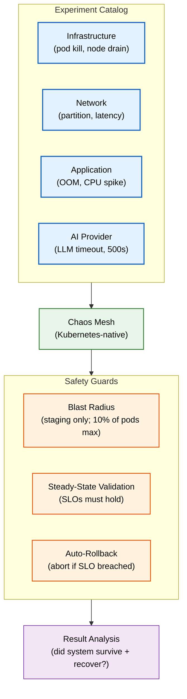
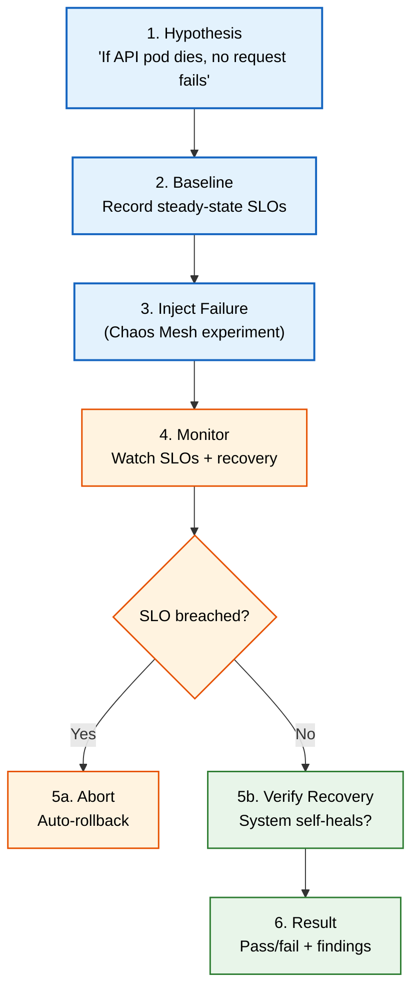

# Chaos Testing

> **Purpose:** Define Vaeloom's chaos testing strategy — experiments that intentionally inject failures to verify the system's resilience, recovery, and graceful degradation
> **Status:** 🆕 New
> **Owner:** SRE Team
> **Version:** 1.0
> **Last Updated:** 2026-07-16
> **Dependencies:** [`../Operations/02-incident-response.md`](../Operations/02-incident-response.md), [`../Architecture/Disaster-Recovery.md`](../Architecture/Disaster-Recovery.md), [`../Testing/Testing-Strategy.md`](./Testing-Strategy.md), [`../DevOps/Kubernetes.md`](../DevOps/Kubernetes.md)
> **Implementation Status:** 📋 Spec Only

## Overview

Chaos testing (chaos engineering) is the discipline of experimenting on a system by injecting failures — network partitions, pod kills, resource exhaustion — to build confidence that the system survives real-world disruptions. Vaeloom runs chaos experiments in staging (and occasionally production) to verify that failures are detected, isolated, and recovered from automatically. This document defines the experiment catalog, safety guards, cadence, and integration with CI/CD.

## Goals

- Define the chaos experiment catalog
- Establish safety guards (blast radius, auto-rollback, steady-state validation)
- Define experiment cadence (weekly automated, monthly game days)
- Integrate chaos testing with CI/CD and incident response

## Scope

### In Scope

- Chaos experiment catalog (infrastructure, network, application, AI-provider)
- Experiment framework (Chaos Mesh / Litmus)
- Safety guards and auto-rollback
- Cadence and game days

### Out of Scope

- General testing strategy (see [`Testing-Strategy.md`](./Testing-Strategy.md))
- Disaster recovery planning (see [`../Architecture/Disaster-Recovery.md`](../Architecture/Disaster-Recovery.md))

## Architecture



> **Diagram:** Chaos testing framework. Experiments run via Chaos Mesh in staging with strict safety guards. If steady-state SLOs are breached, the experiment auto-aborts.

## Experiment Catalog

### Infrastructure Experiments

| Experiment | What it Simulates | Expected System Behavior |
|------------|-------------------|--------------------------|
| **Pod kill (API)** | API pod crash | HPA replaces pod; no request fails (retry succeeds) |
| **Pod kill (AI service)** | AI service pod crash | HPA replaces; in-flight agent runs fail gracefully |
| **Node drain** | Kubernetes node failure | Pods reschedule; no downtime |
| **Database failover** | RDS primary failure | Read replica promoted; <4 min RTO |

### Network Experiments

| Experiment | What it Simulates | Expected System Behavior |
|------------|-------------------|--------------------------|
| **Network partition (API ↔ AI)** | Service-to-service communication failure | Circuit breaker opens; fallback response returned |
| **Network latency (API ↔ DB)** | Database slowness | Queries slow but succeed; no timeouts under 5s |
| **DNS failure** | DNS resolution failure | Cached DNS used; graceful degradation |

### Application Experiments

| Experiment | What it Simulates | Expected System Behavior |
|------------|-------------------|--------------------------|
| **Memory exhaustion (OOM)** | Memory leak | Pod OOM-killed; HPA replaces; alert fired |
| **CPU spike** | CPU-bound workload | Pod throttled; HPA scales; latency degrades gracefully |
| **Disk full** | Storage exhaustion | Writes fail; alert fired; no data corruption |

### AI Provider Experiments

| Experiment | What it Simulates | Expected System Behavior |
|------------|-------------------|--------------------------|
| **LLM provider timeout** | OpenAI/Anthropic slow | Model router falls back to alternate provider |
| **LLM provider 500** | Provider error | Retry with backoff; fallback model; user notified |
| **LLM provider down** | Total provider outage | All inference fails gracefully; agent returns "try later" |

## Safety Guards

| Guard | Rule |
|-------|------|
| **Blast radius** | Staging only (never production without explicit approval); max 10% of pods affected |
| **Steady-state validation** | Before experiment: record baseline SLOs. During: monitor continuously. If breached >5%, abort. |
| **Auto-rollback** | If SLO breach detected, experiment auto-aborts; system must self-heal |
| **Time-bounded** | Every experiment has max duration (default: 5 min); auto-stops after |
| **Pre-conditions** | System must be healthy (green) before experiment starts |

## Experiment Flow



> **Diagram:** Chaos experiment lifecycle. Hypothesis → baseline → inject → monitor → (abort if breached) → verify recovery → result.

## Cadence

| Type | Frequency | Scope | Environment |
|------|-----------|-------|-------------|
| **Automated experiments** | Weekly (CI) | Low-risk experiments (pod kill, latency) | Staging |
| **Game day** | Monthly | Full scenario (multi-failure) | Staging |
| **Production chaos** | Quarterly (with approval) | Single low-risk experiment | Production (canary) |

## Integration with CI/CD

```yaml
# Conceptual: chaos experiment in CI (staging deploy gate)
chaos_validation:
  trigger: after staging deploy
  experiments:
    - name: api-pod-kill
      duration: 60s
      steady_state_slo: api_error_rate < 1%
    - name: ai-service-latency
      duration: 120s
      steady_state_slo: agent_run_success_rate > 90%
  on_failure: block_production_deploy
```

| Rule | Detail |
|------|--------|
| Chaos runs automatically after every staging deploy | Validates resilience before production |
| Blocking: if experiment fails, production deploy is blocked | Forces teams to fix resilience gaps |
| Non-blocking for hotfixes | Emergency fixes can bypass (with justification) |

## Monitoring

| Metric | Alert Threshold | Severity | Dashboard |
|--------|-----------------|----------|-----------|
| `chaos_experiment_failures` | Any unexpected failure | P2 | Chaos |
| `chaos_slo_breach_count` | >3 per week | P3 | Chaos |
| `system_recovery_time_seconds` | >300s (5 min) | P2 | Resilience |

## Best Practices

| # | Practice | Rationale |
|---|----------|-----------|
| 1 | Start small (one experiment, staging) | Build confidence before scaling up |
| 2 | Always define a hypothesis | "Inject failure and see what happens" is not chaos engineering |
| 3 | Blast radius limits are non-negotiable | Chaos in production without limits = self-inflicted outage |
| 4 | Fix findings before adding new experiments | Accumulating known weaknesses is worse than not testing |

## Risks

| Risk | Likelihood | Impact | Mitigation |
|------|-----------|--------|------------|
| Chaos experiment causes real outage | Low (guards in place) | High | Blast radius limits; auto-rollback; staging-first |
| Findings ignored (no remediation) | Medium | Medium | Track findings as bugs; block new experiments if backlog grows |

## Future Improvements

| Improvement | Priority | Complexity | Timeline |
|-------------|----------|------------|----------|
| Production chaos (gameday cadence) | High | Medium | Q1 2027 |
| Automated finding-to-bug pipeline | Medium | Low | Q4 2026 |
| Multi-failure scenario library | Medium | Medium | Q2 2027 |

## Related Documents

- [`Testing-Strategy.md`](./Testing-Strategy.md) — overall testing strategy
- [`../Operations/02-incident-response.md`](../Operations/02-incident-response.md) — incident response (chaos validates IR readiness)
- [`../Architecture/Disaster-Recovery.md`](../Architecture/Disaster-Recovery.md) — DR plan (chaos validates DR)
- [`../DevOps/Kubernetes.md`](../DevOps/Kubernetes.md) — Kubernetes (Chaos Mesh platform)
