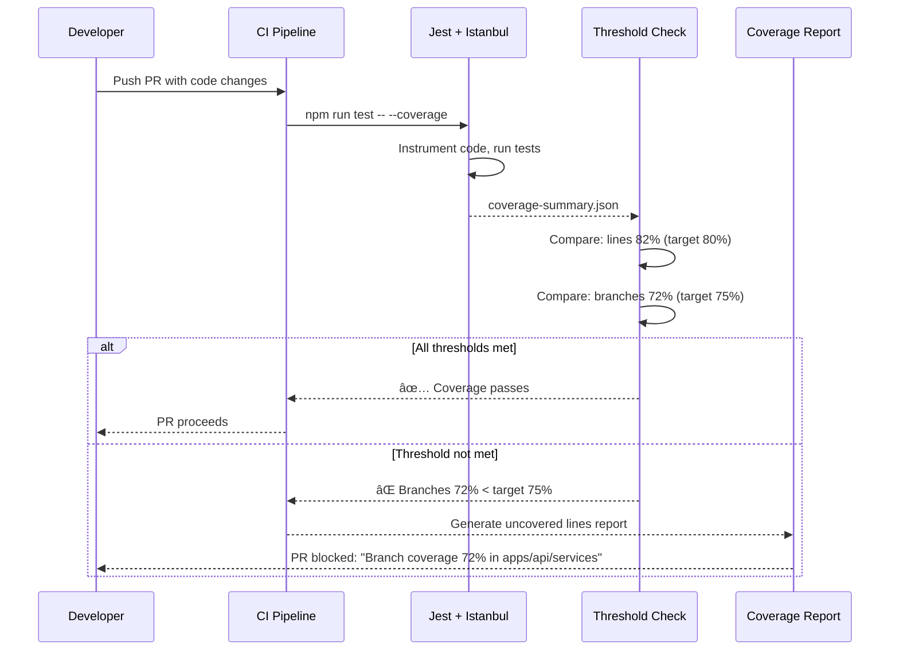

# Test Coverage

> **Purpose:** Define test coverage targets and measurement for Vaeloom
> **Status:** 🆕 New

## Coverage Architecture

```mermaid
graph TD
    classDef target fill:#e3f2fd,stroke:#1565c0,color:#000,stroke-width:2px
    classDef tool fill:#e8f5e9,stroke:#2e7d32,color:#000,stroke-width:1.5px
    classDef ci fill:#fff3e0,stroke:#e65100,color:#000,stroke-width:1.5px
    classDef exclude fill:#f3e5f5,stroke:#6a1b9a,color:#000,stroke-width:1px

    subgraph Targets["🎯 Coverage Targets"]
        direction TB
        T1["apps/web (components)<br/>Line: 80% | Branch: 70%"]
        T2["apps/web (pages)<br/>Line: 70% | Branch: 60%"]
        T3["apps/api (services)<br/>Line: 90% | Branch: 80%"]
        T4["apps/api (controllers)<br/>Line: 85% | Branch: 75%"]
        T5["ai-service (agents)<br/>Line: 90% | Branch: 80%"]
        T6["ai-service (retrieval)<br/>Line: 85% | Branch: 75%"]
    end

    subgraph Tools["🔧 Coverage Tools"]
        U1["Frontend: Jest + Istanbul<br/>npm test -- --coverage"]
        U2["API: Jest + Istanbul<br/>npm test -- --coverage"]
        U3["AI Service: pytest-cov<br/>--cov=apps/ai-service"]
    end

    subgraph CI["⚙️ CI Enforcement"]
        C1["GitHub Action:<br/>npm run test -- --coverage"]
        C2["Threshold check:<br/>npx jest-coverage-thresholds<br/>--branches 70 --lines 80"]
    end

    subgraph Exclusions["❌ What NOT to Measure"]
        E1["Configuration files<br/>Logic-less"]
        E2["Migration files<br/>One-time execution"]
        E3["Type definitions<br/>No runtime behavior"]
        E4["Seed data<br/>Data, not logic"]
        E5["AI golden datasets<br/>Test data, not code"]
    end

    Targets --> Tools --> CI
    Tools -.-> Exclusions

    class T1,T2,T3,T4,T5,T6 target
    class U1,U2,U3 tool
    class C1,C2 ci
    class E1,E2,E3,E4,E5 exclude
```



> **Diagram:** Coverage targets vary by module (70-90% line, 60-80% branch). **Tools** (Jest + Istanbul for JS, pytest-cov for Python) measure coverage, **CI** enforces minimums. **Exclusions** list areas where coverage doesn't apply (config, migrations, types, seeds, golden datasets).

---

## Coverage Targets

| Module | Line Coverage | Branch Coverage | Rationale |
|--------|--------------|----------------|-----------|
| apps/web (components) | 80% | 70% | UI components |
| apps/web (pages) | 70% | 60% | Integration heavy |
| apps/api (services) | 90% | 80% | Core business logic |
| apps/api (controllers) | 85% | 75% | Request handling |
| ai-service (agents) | 90% | 80% | Critical AI logic |
| ai-service (retrieval) | 85% | 75% | RAG pipeline |

## Coverage Tools

| Service | Tool | Configuration |
|---------|------|---------------|
| Frontend | Jest + Istanbul | `--coverage` flag |
| API | Jest + Istanbul | `--coverage` flag |
| AI Service | pytest-cov | `--cov=apps/ai-service` |

## Coverage in CI

```yaml
# .github/workflows/ci.yml
- name: Run tests with coverage
  run: npm run test -- --coverage

- name: Check coverage
  run: |
    # Enforce minimum coverage
    npx jest-coverage-thresholds \
      --branches 70 \
      --functions 80 \
      --lines 80 \
      --statements 80
```

## What NOT to Measure

| Area | Why Coverage Doesn't Apply |
|------|---------------------------|
| Configuration files | Logic-less |
| Migration files | One-time execution |
| Type definitions | No runtime behavior |
| Seed data | Data, not logic |
| AI golden datasets | Test data, not code |

## Coverage Exclusions

```javascript
// jest.config.js
module.exports = {
  coveragePathIgnorePatterns: [
    '/node_modules/',
    '/migrations/',
    '/seeds/',
    '/__fixtures__/',
    '/types/',
  ],
};
```

## Common Mistakes

| Mistake | Consequence |
|---------|-------------|
| Treating 100% coverage as the goal | Team writes shallow tests to hit targets, missing real bugs |
| Measuring coverage only at the end of a sprint | Too late to improve — coverage debt accumulates |
| Ignoring branch coverage in favor of line coverage | Misses untested conditional logic paths |

## Best Practices

| Practice | Rationale |
|----------|-----------|
| Set different coverage targets per module | Business logic needs higher coverage than UI |
| Enforce coverage thresholds in CI | Prevent coverage regressions automatically |
| Exclude generated code and configuration | Focus measurement on code that needs testing |

## Security Considerations

| Concern | Mitigation |
|---------|------------|
| Coverage tools instrument code at runtime | Ensure coverage tooling is not deployed to production |
| Coverage reports may expose internal module structure | Keep reports internal, avoid publishing |
| Security-critical code should have 90%+ coverage | Enforce higher thresholds for auth and encryption modules |

## Performance Considerations

| Concern | Mitigation |
|---------|------------|
| Instrumented code runs slower than production | Run coverage in CI, not in production |
| Full coverage runs take longer than test-only runs | Use incremental coverage for PRs, full run nightly |
| Istanbul and similar tools add overhead | Disable coverage in watch mode for faster dev feedback |

## Workflows

1. **Developer runs tests with coverage**: `npm test -- --coverage` → Jest instruments code with Istanbul → tests execute → coverage report generated → thresholds checked → if below targets, CI fails with line/branch numbers → developer adds missing tests
2. **Coverage threshold enforcement in CI**: PR pushed → `npm run test -- --coverage` runs → Jest outputs JSON summary → custom script parses `coverage-summary.json` → compares line/branch coverage per module against thresholds → if below, PR blocked with detailed report
3. **Coverage gap analysis**: Quarterly coverage review → script identifies modules below threshold → sorts by gap severity → generates report with specific uncovered lines → tickets created for critical gaps → team assigns to sprints
4. **Incremental coverage on PR**: CI runs tests on only changed files (`--changedSince`) → coverage measured only on diff → incremental coverage must meet module target → prevents new code from reducing overall coverage

## Scalability

| Dimension | Current Limit | 10x Strategy | 100x Strategy |
|-----------|---------------|--------------|---------------|
| Tests with coverage instrumentation | 2,000 | 10,000 with parallel test sharding (4 workers) | 100,000+ with distributed test execution |
| Coverage report generation time | < 30s | Incremental coverage for PRs; full run nightly | Stream-based coverage collection without instrumentation pause |
| Coverage storage (history) | 100 runs | 1,000 runs with rollup by release | Trend dashboard with ML anomaly detection on coverage changes |
| Modules with different thresholds | 6 | 20 modules with per-module config | Dynamic thresholds adjusted by module complexity score |

## Error Handling

| Scenario | Detection | Mitigation | Recovery |
|----------|-----------|------------|----------|
| Coverage threshold not met | CI script compares against target and fails | PR blocked with explicit error: "Coverage 72% (target 80%) in apps/api/services" | Developer adds tests to uncovered code; re-pushes |
| Coverage tool fails to instrument | Istanbul throws during test | Retry without coverage flag; warn but allow merge | Fix instrumentation config in follow-up PR |
| Coverage report corrupt | JSON parse fails on output | Regenerate report; if persistent, clear coverage cache | File bug against Jest/Istanbul version |
| Threshold config references non-existent module | Script fails to match module path | Validate threshold config at CI setup time | Fix module path in jest.config.js |

## Monitoring

| Metric | Alert Threshold | Severity | Dashboard |
|--------|----------------|----------|-----------|
| Overall line coverage | < 80% | Warning | Grafana — Code Quality Dashboard |
| Branch coverage in critical modules (auth, encryption) | < 90% | Critical | Grafana — Security Dashboard |
| Coverage delta per PR | < -1% | Warning | GitHub Checks — Coverage Report |
| Modules below threshold | > 3 modules | Warning | Code Quality — Quarterly Review |
| Time since last full coverage run | > 7 days | Info | CI Pipeline — Coverage Schedule |

## Risks

| Risk | Likelihood | Impact | Mitigation |
|------|------------|--------|------------|
| Team optimizes for coverage percentage instead of test quality | High | Medium | Emphasize meaningful tests in code review; measure assertion count per test |
| Coverage drops during rapid feature development | High | Medium | Enforce incremental coverage on PR; allocate 20% capacity to test improvement |
| Branch coverage ignored in favor of line coverage | Medium | Medium | Set separate branch coverage thresholds; report both in CI |
| Generated code or config inflates coverage artificially | Medium | Low | Maintain exclusion list for auto-generated files, config, and types |

## Limitations

| Limitation | Impact | Workaround | Future Resolution |
|------------|--------|------------|-------------------|
| Line coverage doesn't measure test quality | 100% coverage can still miss bugs | Enforce branch coverage thresholds; use mutation testing | Mutation testing integration (Stryker) for test quality measurement |
| Istanbul adds ~15% overhead to test runtime | CI takes longer with coverage enabled | Run coverage only on PR merge and nightly; skip for fast dev loops | Native V8 coverage via `--experimental-vm-modules` |
| Coverage cannot measure untested feature paths | New features may have zero coverage until tests written | Use feature flag to track coverage of new vs existing code | Test Impact Analysis to identify untested code paths per feature |

## Overview

Test coverage at Vaeloom is measured and enforced per module with differentiated targets that reflect each module's criticality and testing complexity. Business logic modules (API services, AI agents) require 90% line coverage, while UI components target 80%. Branch coverage thresholds ensure that conditional logic paths are tested, not just happy-path line execution.

Coverage is measured using Istanbul (Jest) for TypeScript/JavaScript code and pytest-cov for Python code. These tools instrument the code during test execution and report line, branch, function, and statement coverage. CI enforces minimum thresholds per module through a custom `jest-coverage-thresholds` check that blocks PRs failing to meet targets.

For Vaeloom's AI service, coverage measurement excludes golden datasets (test data, not code), configuration files, database migrations, type definitions, and seed data. These exclusions ensure that the coverage percentage reflects actual business logic coverage rather than being inflated by non-executable files. The AI agent prompt code itself counts toward coverage targets, ensuring that prompt handling logic is tested.

Coverage is monitored as a trend over time, not a static snapshot. Quarterly gap analyses identify modules falling below threshold, generate reports of specific uncovered lines, and create tickets for critical gaps. This systematic approach prevents coverage debt from accumulating during rapid feature development.

## Goals

- Maintain 90% line and 80% branch coverage for all API service modules (apps/api/services)
- Maintain 90% line and 80% branch coverage for all AI agent modules (ai-service/agents)
- Maintain 80% line and 70% branch coverage for frontend components
- Enforce zero coverage regression per PR through incremental coverage checking
- Generate quarterly coverage gap analysis with actionable remediation tickets

## Scope

### In Scope
- Per-module coverage targets: apps/web (80% line, 70% branch), apps/api (85-90% line, 75-80% branch), ai-service (85-90% line, 75-80% branch)
- Jest + Istanbul for TypeScript/JavaScript coverage measurement
- pytest-cov for Python coverage measurement
- CI enforcement via jest-coverage-thresholds with per-module configuration
- Coverage exclusion list: config, migrations, types, seeds, fixtures, golden datasets
- Quarterly coverage gap analysis with automated uncovered-line reporting

### Out of Scope
- Mutation testing integration (Stryker) for test quality measurement (future improvement)
- Test Impact Analysis for selective test execution (future improvement)
- Automatic test generation for uncovered code paths (future improvement)
- Coverage trend dashboard with ML anomaly detection (future improvement)

## Examples

### Jest Configuration with Coverage Thresholds

```javascript
// jest.config.js
module.exports = {
  collectCoverage: true,
  coverageThreshold: {
    './apps/api/src/services/': {
      lines: 90,
      branches: 80,
      functions: 85,
      statements: 90,
    },
    './apps/web/src/components/': {
      lines: 80,
      branches: 70,
      functions: 80,
      statements: 80,
    },
  },
  coveragePathIgnorePatterns: [
    '/node_modules/',
    '/migrations/',
    '/seeds/',
    '/__fixtures__/',
    '/types/',
  ],
};
```

### Python Coverage Configuration

```ini
# .coveragerc
[run]
source = apps/ai-service
omit = */migrations/*,*/tests/*,*/seeds/*,*/config/*

[report]
exclude_lines =
    pragma: no cover
    def __repr__
    raise NotImplementedError
    if __name__ == .__main__.:
```

### CI Coverage Check

```yaml
# .github/workflows/coverage.yml
- name: Run tests with coverage
  run: npm run test -- --coverage

- name: Check coverage thresholds
  run: |
    npx jest-coverage-thresholds \
      --branches 70 \
      --functions 80 \
      --lines 80 \
      --statements 80
```

## Sequence Diagrams



---

| Improvement | Priority | Complexity | Timeline |
|-------------|----------|------------|----------|
| Mutation testing integration (Stryker) for test quality | Medium | High | Q3 2027 |
| Test Impact Analysis — run only tests affected by code change | High | High | Q2 2027 |
| Automatic test generation for uncovered code paths | Low | High | Q4 2027 |
| Coverage trend dashboard with ML anomaly detection | Medium | Medium | Q2 2027 |

## Related Documents

- [Testing Strategy.md](./Testing-Strategy.md)
- [Unit Testing.md](./Unit-Testing.md)
- [`Engineering/Coding-Standards.md`](../Engineering/Coding-Standards.md)
