# E2E Testing

> **Purpose:** Define end-to-end testing strategy for Vaeloom
> **Status:** 🆕 New

## Test Runner Flow

```mermaid
sequenceDiagram
    participant DEV as 👨‍💻 Developer / CI
    participant PW as 🎭 Playwright CLI
    participant DIS as 📋 Test Discovery
    participant W1 as ⚙️ Worker 1<br/>(Chromium)
    participant W2 as ⚙️ Worker 2<br/>(Chromium)
    participant B1 as 🌐 Browser Context<br/>Chromium
    participant B2 as 🌐 Browser Context<br/>Firefox
    participant REP as 📊 Reporter
    participant ART as 📦 Artifacts<br/>(Screenshots / Traces)

    Note over DEV,ART: ── 1. Test Discovery & Sharding ──

    DEV->>PW: npx playwright test --workers=2
    PW->>DIS: Discover spec files matching<br/>*.spec.ts pattern
    DIS-->>PW: Return file list (e.g. 8 specs)
    PW->>PW: Shard specs across workers<br/>Worker 1: specs 1-4<br/>Worker 2: specs 5-8

    Note over DEV,ART: ── 2. Test Execution (Worker 1) ──

    PW->>W1: Assign spec 1: login.spec.ts
    W1->>B1: Launch browser context<br/>viewport, storageState, permissions
    B1-->>W1: Browser ready
    W1->>B1: page.goto('/login')
    B1-->>W1: Page loaded
    W1->>B1: page.fill('[data-testid=email]', '...')
    W1->>B1: page.fill('[data-testid=password]', '...')
    W1->>B1: page.click('[data-testid=login]')
    B1-->>W1: Navigation to /workspace
    W1->>B1: expect(page.locator(...)).toContainText(...)
    B1-->>W1: ✅ Assertion passed

    alt ✅ Test Passed
        W1->>REP: Report: login.spec.ts PASSED<br/>duration: 4.2s, steps: 6
    else ❌ Assertion Failed
        B1-->>W1: ❌ expect.toContainText failed<br/>Expected "Dashboard" not found
        W1->>B1: page.screenshot()
        B1-->>ART: Capture screenshot<br/>test-results/login-failed.png
        W1->>B1: page.trace().stop()
        B1-->>ART: Save trace.zip
        W1->>REP: Report: login.spec.ts FAILED<br/>error: TimeoutError, line 42
    end

    W1->>B1: Close browser context
    B1-->>W1: Context closed

    Note over DEV,ART: ── 3. Parallel Execution (Worker 2) ──

    PW->>W2: Assign spec 5: upload.spec.ts
    W2->>B2: Launch Firefox context
    B2-->>W2: Browser ready
    W2->>B2: Execute test steps...
    B2-->>W2: Test complete (concurrent with W1)
    W2->>REP: Report: upload.spec.ts PASSED<br/>duration: 6.1s, steps: 8
    W2->>B2: Close context

    Note over DEV,ART: ── 4. Retry & Report ──

    PW->>W1: Re-run failed spec (retry 1/2)
    W1->>B1: Launch new browser context
    alt Retry passes
        W1->>REP: Report: login.spec.ts PASSED (retry 1)<br/>Flaky test detected
    else Retry fails (2/2)
        W1->>REP: Report: login.spec.ts FAILED (retry 2/2)<br/>Permanent failure
    end

    Note over DEV,ART: ── 5. Report Generation ──

    PW->>REP: All workers finished<br/>8 of 8 specs completed
    REP->>REP: Generate reports:<br/>- HTML report (playwright-report/)<br/>- JSON report (test-results.json)<br/>- JUnit XML (junit.xml)
    REP-->>PW: Report ready
    PW-->>DEV: ✅ Exit code 0 (all passed)<br/>❌ Exit code 1 (failures)

    alt CI Pipeline
        DEV->>ART: Upload test artifacts
        DEV->>DEV: Post summary to PR<br/>"8 passed, 1 flaky, 0 failed"
    end
```



> **Diagram:** The Playwright test runner flow from spec discovery through parallel execution, retries, and reporting. **Two parallel workers** run different specs concurrently — Worker 1 runs Chromium, Worker 2 runs Firefox. **Failures** trigger screenshots + trace capture, then up to 2 retries. **Reports** generate in HTML, JSON, and JUnit XML formats. CI posts a summary to the PR.

---

## E2E Test Scope

E2E tests cover full user flows across all services:

| Flow | Description | Critical? |
|------|-------------|-----------|
| Sign up → Workspace | New user creates account, sees dashboard | ✅ |
| Upload → Organize | Upload file, agent proposes name, user approves | ✅ |
| Resume → ATS | Generate resume, score against JD | ✅ |
| Job Search → Apply | Find jobs, rank, tailor, submit | ✅ |
| Gmail → Schedule | Email scanned, deadline extracted, shown on schedule | ✅ |
| Connector → Sync | Connect Gmail, initial sync completes | ✅ |
| Settings → Export | Export all data, verify completeness | ✅ |
| Settings → Delete | Delete all data, verify workspace is empty | ✅ |

## Test Implementation

```typescript
// Example E2E test with Playwright
test('user uploads resume and sees organization proposal', async ({ page }) => {
  await page.goto('/');
  await page.fill('[data-testid="email"]', 'test@example.com');
  await page.fill('[data-testid="password"]', 'password123');
  await page.click('[data-testid="login"]');

  await page.goto('/workspace');
  await page.setInputFiles('[data-testid="file-upload"]', 'test-data/resume.pdf');
  
  // Wait for agent proposal
  await page.waitForSelector('[data-testid="proposal-card"]');
  await expect(page.locator('[data-testid="proposal-name"]')).toContainText('Resume_2026.pdf');
  
  // Approve the proposal
  await page.click('[data-testid="approve-button"]');
  await expect(page.locator('[data-testid="file-name"]')).toContainText('Resume_2026.pdf');
});
```

## E2E Test Schedule

| Frequency | Tests |
|-----------|-------|
| Every PR | Critical path E2Es (3-5 tests) |
| Every staging deploy | Full E2E suite (10-15 tests) |
| Every production deploy | Full E2E suite + performance check |

## Common Mistakes

| Mistake | Consequence |
|---------|-------------|
| Writing E2E tests that depend on test order | Flaky tests that fail unpredictably in CI |
| Using production data in E2E tests | Tests modify real data or fail due to unexpected states |
| Running E2E tests on every single commit | Slow feedback loop, developers start ignoring test results |

## Best Practices

| Practice | Rationale |
|----------|-----------|
| Use data-testid attributes for selectors | CSS class changes don't break tests |
| Implement retry logic for flaky assertions | Handle transient UI timing issues gracefully |
| Run critical path E2Es on PR, full suite on staging | Balance speed and confidence |

## Security Considerations

| Concern | Mitigation |
|---------|------------|
| E2E tests run in browser with real-like sessions | Use dedicated test accounts with limited permissions |
| Screenshot artifacts may capture sensitive data | Configure screenshot redaction or restrict artifact retention |
| Test traces contain full request/response details | Store test artifacts in access-controlled storage |

## Performance Considerations

| Concern | Mitigation |
|---------|------------|
| E2E tests are slow (30-60s each) | Limit to critical user flows, parallelize across workers |
| Running full E2E suite blocks deploys | Use staged test execution: smoke → critical → extended |
| Parallel browser instances consume significant resources | Cap parallel workers based on CI runner capacity |

## Architecture

```mermaid
graph TD
    classDef infra fill:#e3f2fd,stroke:#1565c0,color:#000,stroke-width:2px
    classDef test fill:#e8f5e9,stroke:#2e7d32,color:#000,stroke-width:1.5px
    classDef report fill:#fff3e0,stroke:#e65100,color:#000,stroke-width:1.5px

    subgraph Infra["🧪 E2E Test Infrastructure"]
        I1["Playwright CLI<br/>npx playwright test"]
        I2["Browser Workers<br/>Chromium, Firefox, WebKit"]
        I3["Test Databases<br/>PostgreSQL test + Redis test"]
        I4["Auth Fixtures<br/>Test accounts per role"]
    end

    subgraph Tests["📋 E2E Test Suites"]
        T1["Smoke Suite<br/>3 critical flows<br/>Every PR"]
        T2["Critical Suite<br/>8 core user flows<br/>Every staging deploy"]
        T3["Full Suite<br/>20+ flows<br/>Every production deploy"]
    end

    subgraph Reports["📊 Test Reports"]
        R1["HTML Report<br/>playwright-report/"]
        R2["Trace Viewer<br/>trace.zip per failure"]
        R3["Screenshots<br/>test-results/"]
        R4["JUnit XML<br/>CI integration"]
    end

    Infra --> Tests --> Reports

    class I1,I2,I3,I4 infra
    class T1,T2,T3 test
    class R1,R2,R3,R4 report
```



> **Diagram:** E2E testing infrastructure — **Playwright CLI** with browser workers (Chromium, Firefox, WebKit) runs against **test databases** and **auth fixtures**. Three test suites (smoke, critical, full) run at different cadences. **Reports** include HTML, trace viewer, screenshots, and JUnit XML.

## Workflows

1. **PR smoke test execution**: Developer pushes PR → CI triggers Playwright smoke suite → 3 critical flows run (login, upload, approve) → each flow runs in parallel Chromium workers → results posted as GitHub Check → if all pass, PR proceeds; if any fail, screenshots + traces captured
2. **Full E2E suite before production deploy**: Release candidate deployed to staging → CI triggers full E2E suite (20+ flows) → tests run across Chromium + Firefox in parallel (4 workers) → each test isolates data via unique test accounts → results published to Grafana → deploy proceeds only if all critical flows pass
3. **Flaky test management**: E2E test fails → auto-retry (max 2 retries) → if retry passes, marked as flaky → flaky test report generated → team triages weekly → test fixed or quarantined
4. **Test data seeding**: E2E test starts → `beforeAll` hook seeds test database with fixtures → test account created with known credentials → test assertions run against seeded data → `afterAll` cleans up test data

## Scalability

| Dimension | Current Limit | 10x Strategy | 100x Strategy |
|-----------|---------------|--------------|---------------|
| Concurrent browser workers | 2 | 10 workers with sharding across CI runners | 100+ workers with distributed cloud execution |
| E2E test runtime (full suite) | 15 minutes | 30 minutes with parallel sharding (stays same wall time) | 60 minutes but 50 workers = 3 min wall time |
| Test data isolation | Per-test unique accounts | Randomized data per test execution with cleanup | Ephemeral test environments per PR |
| Visual regression baselines | 50 screenshots | 500 with per-component baselines | 5,000 with AI-driven baseline auto-acceptance |

## Error Handling

| Scenario | Detection | Mitigation | Recovery |
|----------|-----------|------------|----------|
| Browser launch fails | Playwright cannot start Chromium | Retry with different browser (Firefox); log startup error | Restart CI runner; if persistent, check infrastructure |
| Test assertion fails due to flaky selector | `waitForSelector` times out | Implement `auto-retrying` assertions (Playwright default); use `data-testid` attributes | Retry test (max 2); if persistent, fix selector |
| Test data conflict | Two tests use same test account | Generate unique test accounts per test run with prefix + timestamp | Clean up stale test accounts daily via cron job |
| API under test returns 500 | Test expects 200 but gets 500 | Fail fast; log request/response body; capture trace | Developer replays with trace viewer to debug |

## Monitoring

| Metric | Alert Threshold | Severity | Dashboard |
|--------|----------------|----------|-----------|
| E2E pass rate (critical suite) | < 100% | Critical | Grafana — E2E Dashboard |
| Flaky test rate | > 5% of test runs | Warning | Grafana — Test Quality Dashboard |
| E2E suite runtime | > 20 min | Warning | CI Pipeline — E2E Duration |
| Screenshot diff threshold exceeded | > 0.1% pixel diff | Warning | Chromatic — Visual Regression |
| Test data cleanup failure rate | > 1% | Info | Cron Job — Cleanup Logs |

## Risks

| Risk | Likelihood | Impact | Mitigation |
|------|------------|--------|------------|
| E2E tests become flaky due to timing dependencies | High | Medium | Use robust wait strategies (`waitForSelector`, `toHaveText`); retry flaky tests |
| Test maintenance cost grows with feature count | High | Medium | Prioritize critical path E2Es; rely on unit + integration for detailed coverage |
| CI runner resource contention causes false failures | Medium | Medium | Dedicated E2E runners with guaranteed resources |
| Visual regression tests produce false diffs from system fonts | Low | Medium | Use Docker-based consistent font rendering; ignore anti-aliasing diffs |

## Limitations

| Limitation | Impact | Workaround | Future Resolution |
|------------|--------|------------|-------------------|
| E2E tests cannot test AI agent non-deterministic output | Agent responses vary between runs | Test with mocked AI responses for E2E; test AI separately with golden datasets | AI-specific E2E pattern with tolerance-based assertions |
| Playwright mobile emulation is not real device testing | Touch behavior, performance, and rendering differ | Test on physical devices for release candidates; emulation for PRs | Device farm integration (BrowserStack/Sauce Labs) for every release |
| Test data setup adds significant test runtime | Fixture setup can take 30s per test | Use shared fixtures for read-only tests; isolate only write tests | Snapshot-based database restore for instant test isolation |

## Overview

End-to-end testing at Vaeloom validates complete user workflows across all services — from signup through workspace management, resume generation, job applications, and data export. E2E tests are the highest-confidence tests in the pyramid, verifying that the frontend, API, database, and AI agents all work together correctly for critical user journeys.

Tests are built with Playwright and run against dedicated test databases with isolated test accounts. The test suite is organized into three tiers: a smoke suite (3 critical flows) that runs on every PR for fast feedback, a critical suite (8 core flows) that runs on every staging deploy, and a full suite (20+ flows) that runs before every production deploy. This tiered approach balances speed with confidence.

For Vaeloom's AI-driven workflows, E2E tests cover the complete proposal lifecycle: upload a document, wait for the AI agent to process it and generate a proposal, review the proposal card with diff view, approve or reject, and verify the result appears in the workspace. These tests use mocked AI responses to ensure determinism — AI-specific output quality is tested separately through golden dataset evaluations.

Playwright's auto-retrying assertions, trace viewer for debugging failures, and parallel browser execution across Chromium and Firefox make the E2E suite reliable and maintainable. Test artifacts (screenshots, traces, video) are captured on any failure and stored for debugging.

## Goals

- Achieve 100% pass rate for critical path E2E tests on every deploy
- Complete the full E2E suite (20+ flows) in under 15 minutes through parallel execution
- Reduce flaky test rate below 5% through systematic detection and auto-quarantine
- Cover all 8 critical user flows: signup, upload→organize, resume→ATS, job search→apply, Gmail→schedule, connector→sync, export, delete
- Maintain test data isolation with zero cross-test contamination

## Scope

### In Scope

- Playwright-based E2E tests for 8 critical user flows and 20+ extended flows
- Three-tier test execution: smoke (every PR), critical (every staging deploy), full (every production deploy)
- Parallel browser execution across Chromium and Firefox with 2+ workers
- Auto-retry with exponential backoff for flaky tests (max 2 retries)
- Test data isolation via dedicated test accounts with unique per-run credentials
- Screenshot, trace, and video capture on test failure for debugging

### Out of Scope

- AI output quality validation in E2E (tested via golden datasets separately)
- Real mobile device testing (Playwright emulation used for PRs; physical devices for release candidates)
- Visual regression testing (future improvement with Chromatic/Percy)
- Self-healing selectors when UI changes (future improvement)

---

| Improvement | Priority | Complexity | Timeline |
|-------------|----------|------------|----------|
| AI-driven test flakiness detection and auto-quarantine | High | Medium | Q3 2027 |
| Device farm integration for real mobile E2E testing | Medium | High | Q4 2027 |
| Self-healing selectors when UI changes | Medium | High | Q4 2027 |
| Visual regression AI baseline auto-acceptance | Low | High | Q3 2027 |

## Examples

### Login flow E2E test

```typescript
import { test, expect } from '@playwright/test';

test('user signs in and sees dashboard', async ({ page }) => {
  await page.goto('/login');
  await page.fill('[data-testid="email"]', 'test@vaeloom.dev');
  await page.fill('[data-testid="password"]', 'test-password');
  await page.click('[data-testid="login-button"]');
  await page.waitForURL('/dashboard');
  await expect(page.locator('[data-testid="workspace-title"]')).toContainText('My Workspace');
});
```

### Upload and approve proposal

```typescript
test('user uploads resume and approves agent proposal', async ({ page }) => {
  await page.goto('/workspace');
  await page.setInputFiles('[data-testid="file-dropzone"]', 'fixtures/resume.pdf');
  await page.waitForSelector('[data-testid="proposal-card"]', { timeout: 30000 });
  await expect(page.locator('[data-testid="proposal-filename"]')).toContainText('Resume_2026');
  await page.click('[data-testid="approve-button"]');
  await expect(page.locator('[data-testid="file-list"]')).toContainText('Resume_2026.pdf');
});
```

### Visual regression test

```typescript
test('dashboard renders consistently', async ({ page }) => {
  await page.goto('/dashboard');
  await expect(page).toHaveScreenshot('dashboard.png', {
    maxDiffPixelRatio: 0.001,
  });
});
```

### Test isolation with fixtures

```typescript
test.describe('document flow', () => {
  test.use({ storageState: 'fixtures/auth-user.json' });

  test.beforeEach(async ({ page }) => {
    await page.goto('/workspace');
    await page.waitForSelector('[data-testid="workspace-ready"]');
  });

  test('uploads document', async ({ page }) => {
    await page.setInputFiles('[data-testid="file-input"]', 'fixtures/test.pdf');
    await expect(page.locator('[data-testid="upload-success"]')).toBeVisible();
  });
});
```

---

## Related Documents

- [Testing Strategy.md](./Testing-Strategy.md)
- [Integration Testing.md](./Integration-Testing.md)
- [`DevOps/CI-CD.md`](../DevOps/CI-CD.md)
