# Load Testing

> **Purpose:** Define load testing strategy for Vaeloom
> **Status:** 🆕 New

## Load Testing Architecture

```mermaid
graph TD
    classDef goals fill:#e3f2fd,stroke:#1565c0,color:#000,stroke-width:2px
    classDef scenario fill:#e8f5e9,stroke:#2e7d32,color:#000,stroke-width:1.5px
    classDef tool fill:#fff3e0,stroke:#e65100,color:#000,stroke-width:1.5px
    classDef success fill:#f3e5f5,stroke:#6a1b9a,color:#000,stroke-width:1px

    subgraph Goals["🎯 Load Testing Goals"]
        direction TB
        G1["API throughput<br/>1000 req/s"]
        G2["Concurrent users<br/>1000 active sessions"]
        G3["Document ingestion<br/>100 files/min"]
        G4["Agent response under load<br/>< 15s p99"]
    end

    subgraph Scenarios["📋 Test Scenarios"]
        direction TB
        S1["Normal Load<br/>100 concurrent users<br/>80/20 read/write mix<br/>Duration: 30 min"]
        S2["Peak Load<br/>1000 concurrent users<br/>Burst writes (exam season)<br/>Duration: 15 min"]
        S3["Stress Test<br/>Gradual increase to failure<br/>Identify breaking points<br/>2x normal load target"]
    end

    subgraph Tools["🔧 Load Testing Tools"]
        T1["k6<br/>API load testing<br/>k6 run scenarios/api-load.js"]
        T2["Locust<br/>User simulation<br/>locust -f scenarios/user-flow.py"]
        T3["Artillery<br/>Spike testing<br/>artillery run scenarios/spike.yml"]
    end

    subgraph Criteria["✅ Success Criteria"]
        C1["API latency p99<br/>Pass: < 1s | Warn: 1-3s | Fail: > 3s"]
        C2["Error rate<br/>Pass: < 0.1% | Warn: 0.1-1% | Fail: > 1%"]
        C3["Throughput<br/>Pass: > 80% | Warn: 50-80% | Fail: < 50%"]
        C4["DB connections<br/>Pass: < 70% | Warn: 70-85% | Fail: > 85%"]
    end

    Goals --> Scenarios --> Tools --> Criteria

    class G1,G2,G3,G4 goals
    class S1,S2,S3 scenario
    class T1,T2,T3 tool
    class C1,C2,C3,C4 success
```



> **Diagram:** Load testing strategy flows from **goals** (throughput, concurrency, ingestion, agent response) → **scenarios** (normal, peak, stress) → **tools** (k6, Locust, Artillery) → **success criteria** with pass/warn/fail thresholds.

---

## Load Testing Goals

| Goal | Target | Measurement |
|------|--------|-------------|
| API throughput | 1000 req/s | Requests per second |
| Concurrent users | 1000 active sessions | Active connections |
| Document ingestion | 100 files/min | Documents processed per minute |
| Agent response under load | < 15s p99 | Agent execution time |

## Load Testing Scenarios

### Scenario 1: Normal Load

- 100 concurrent users
- Mix of read/write operations (80/20 ratio)
- Duration: 30 minutes
- Expected: All metrics within targets

### Scenario 2: Peak Load

- 1000 concurrent users
- Burst of write operations (file uploads during exam season)
- Duration: 15 minutes
- Expected: Graceful degradation, no crashes

### Scenario 3: Stress Test

- Gradually increase users until failure
- Identify breaking points
- Expected: System should handle 2x normal load before degradation

## Load Testing Tools

| Tool | Use Case | Command |
|------|----------|---------|
| k6 | API load testing | `k6 run scenarios/api-load.js` |
| Locust | User simulation | `locust -f scenarios/user-flow.py` |
| Artillery | Spike testing | `artillery run scenarios/spike.yml` |

## Success Criteria

| Metric | Pass | Warn | Fail |
|--------|------|------|------|
| API latency p99 | < 1s | 1-3s | > 3s |
| Error rate | < 0.1% | 0.1-1% | > 1% |
| Throughput | > 80% target | 50-80% | < 50% |
| Database connections | < 70% pool | 70-85% | > 85% |

## Common Mistakes

| Mistake | Consequence |
|---------|-------------|
| Testing only happy path loads | System buckles under real traffic patterns like bursts or slow connections |
| Running load tests against under-powered environments | Results don't reflect production capacity |
| Not measuring resource usage during tests | Can't tell if bottleneck is CPU, memory, or I/O |

## Best Practices

| Practice | Rationale |
|----------|-----------|
| Gradually ramp load to identify breaking points | Understand degradation patterns, not just pass/fail |
| Monitor infrastructure metrics alongside application metrics | Identify the actual bottleneck during load |
| Run load tests against production-like hardware | Results are actionable and predictive of real behavior |

## Security Considerations

| Concern | Mitigation |
|---------|------------|
| Load tests can trigger DDoS alarms | Notify operations team before running large-scale tests |
| Test traffic may be mistaken for real attacks | Use dedicated test user agents and whitelist source IPs |
| Load test results reveal infrastructure capacity | Keep results in access-controlled dashboards |

## Performance Considerations

| Concern | Mitigation |
|---------|------------|
| Load tests consume significant infrastructure | Schedule during maintenance windows, clean up after |
| Repeated tests can skew baseline results | Allow cooldown periods between test runs |
| Distributed load generators add network latency | Collocate generators in the same region as the target |

## Workflows

1. **Normal load test execution**: QA engineer configures k6 script with 100 concurrent users → 80/20 read/write mix → 5m ramp-up → 20m steady state → 5m cooldown → monitors API latency, error rate, and resource usage → compares against success criteria → generates HTML report
2. **Peak load simulation (exam season)**: 1000 concurrent users with burst writes (file uploads, application submissions) → 2m ramp-up → 15m peak → monitors database connection pool utilization → verifies graceful degradation (no crashes, queued writes) → identifies bottleneck
3. **Stress test to find breaking point**: Gradual user increase from 100 to 2000 over 30m → system metrics monitored → breaking point identified (where latency exceeds 3s or error rate > 1%) → documented as "maximum sustainable load" → capacity planning adjusted
4. **Load test result analysis**: k6 outputs JSON results → parsed by reporting script → compared against baseline from previous run → trends plotted in Grafana → regression identified → root cause investigation opened

## Scalability

| Dimension | Current Limit | 10x Strategy | 100x Strategy |
|-----------|---------------|--------------|---------------|
| Concurrent virtual users | 1,000 | 10,000 with distributed k6 runners (10 instances × 1000 users) | 100,000+ with cloud-based load generation across 3 regions |
| Test scenario complexity | 3 scenarios (normal, peak, stress) | 10 scenarios including spike, soak, and chaos patterns | ML-generated load profiles from production traffic patterns |
| Metrics collected per run | 15 | 50+ with custom k6 metrics and application-level tracing | Full distributed tracing correlation during load tests |
| Concurrent test reports stored | 100 | 1,000 with automated trend analysis | Infinite with tiered storage (hot/cold/archive) |

## Error Handling

| Scenario | Detection | Mitigation | Recovery |
|----------|-----------|------------|----------|
| k6 script error (syntax/import) | k6 fails to parse/execute script | Show line-level error with context; prevent run | Fix script and re-run |
| Test target unavailable | k6 connection refused | Retry target health check; abort if down after 3 retries | Notify DevOps; re-schedule test |
| Resource exhaustion on load generator | CPU/memory on generator exceeds 90% | Scale horizontally by adding more k6 instances | Reduce concurrent users per instance; distribute load |
| Test data runs out (unique users exhausted) | k6 reports "no unique data available" | Switch to randomized data generation with seeded randomness | Increase data pool size; use parameterized templates |

## Monitoring

| Metric | Alert Threshold | Severity | Dashboard |
|--------|----------------|----------|-----------|
| API p99 latency under load | > 1s at 1000 users | Critical | Grafana — Load Test Dashboard |
| Error rate during peak | > 0.1% | Warning | Grafana — API Errors |
| Database connection pool utilization | > 80% | Warning | Grafana — Database Dashboard |
| Load generator resource usage | > 85% CPU | Warning | CI Pipeline — Load Test Infra |
| Throughput degradation from baseline | > 20% drop | Critical | Grafana — Performance Trends |

## Risks

| Risk | Likelihood | Impact | Mitigation |
|------|------------|--------|------------|
| Load test triggers production incident (DDoS) | Medium | Critical | Run against staging only; use isolated test environments; coordinate with SRE |
| Load test results not reproducible due to environment variance | High | Medium | Use dedicated load test environment with fixed capacity; baseline before every test |
| Tests measure the wrong bottleneck | Medium | High | Monitor all layers (app, DB, cache, network) simultaneously during tests |
| Synthetic load doesn't reflect real user behavior | High | Medium | Use recorded production traffic patterns for realistic load profiles |

## Limitations

| Limitation | Impact | Workaround | Future Resolution |
|------------|--------|------------|-------------------|
| k6 cannot execute JavaScript in browser context | Cannot measure client-side performance | Pair load tests with Lighthouse CI for client-side metrics | Use Playwright for browser-level load testing (Playwright + k6 hybrid) |
| Distributed k6 adds latency variance | Results may differ from single-region tests | Deploy load generators in same region as target | Use cloud-native load generation (AWS Distributed Load Testing) |
| Load tests only measure synchronous request patterns | Async agent actions not captured | Add dedicated agent latency monitoring from production traces | Instrument agent execution as k6 custom metrics via API |

## Overview

Load testing at Vaeloom validates that the platform can handle expected traffic patterns and identifies breaking points before they reach production. The system targets 1,000 requests per second API throughput, 1,000 concurrent active sessions, 100 documents ingested per minute, and sub-15-second p99 agent response times under load. These targets are validated through three load scenarios — normal, peak, and stress — run against production-like staging environments.

Three tools cover different load testing needs: k6 for API-level load testing with precise metrics, Locust for user-simulation scenarios with Python-based behavior modeling, and Artillery for spike testing with rapid traffic surges. Each scenario follows a structured ramp-up/hold/ramp-down pattern to observe how the system behaves under gradual load increases, sustained peak traffic, and recovery.

For Vaeloom's AI agents, load testing is particularly important. Agent response times under load (p99 < 15s) ensure that users aren't left waiting for proposals during peak usage periods like exam season or graduation application deadlines. Document ingestion throughput (100 files/min) validates that the pipeline from upload through AI processing to organized storage can keep pace with user demand.

Success criteria use a three-tier rating system per metric: Pass (green), Warn (yellow), and Fail (red). API p99 latency under 1 second passes, 1-3 seconds warns, and over 3 seconds fails. Error rates under 0.1% pass, 0.1-1% warn, and over 1% fail. Database connection pool utilization under 70% passes, 70-85% warns, and over 85% fails.

## Goals

- Validate API throughput of 1,000 req/s under normal load conditions
- Ensure 1,000 concurrent users can operate with sub-3s p99 API latency
- Maintain sub-15s p99 agent response times under peak load scenarios
- Identify system breaking point at 2x normal load through stress testing
- Achieve zero error rate under normal load and sub-1% under peak load

## Scope

### In Scope
- Three load scenarios: normal (100 users, 30min), peak (1000 users, 15min), stress (gradual ramp to failure)
- k6 for API load testing with structured ramp-up/hold/ramp-down patterns
- Locust for user-simulation with realistic behavior models
- Artillery for spike testing with sudden traffic surges
- Success criteria with pass/warn/fail thresholds for latency, error rate, throughput, and DB connections
- Pre-release load test gate with baseline comparison and regression detection

### Out of Scope
- ML-generated load profiles from production traffic patterns (future improvement)
- Distributed tracing correlation during load tests (future improvement)
- Automated capacity recommendation from load test results (future improvement)
- Chaos engineering integration with load tests (future improvement)

## Examples

### k6 Load Test Script

```javascript
// scenarios/api-load.js
import http from 'k6/http';
import { check, sleep } from 'k6';

export const options = {
  stages: [
    { duration: '5m', target: 100 },
    { duration: '20m', target: 100 },
    { duration: '5m', target: 0 },
  ],
  thresholds: {
    http_req_duration: ['p(95)<500', 'p(99)<2000'],
    http_req_failed: ['rate<0.01'],
  },
};

export default function () {
  const res = http.get('https://staging.Vaeloom.dev/v1/health');
  check(res, { 'status is 200': (r) => r.status === 200 });
  sleep(1);
}
```

### Peak Load with Burst Writes

```javascript
export const options = {
  stages: [
    { duration: '2m', target: 500 },
    { duration: '5m', target: 1000 },
    { duration: '2m', target: 0 },
  ],
  thresholds: {
    http_req_duration: ['p(95)<2000', 'p(99)<3000'],
    http_req_failed: ['rate<0.01'],
  },
};

export default function () {
  const payload = JSON.stringify({
    name: `upload-${__VU}-${Date.now()}.pdf`,
    content: 'fake-file-content',
  });
  const res = http.post('https://staging.Vaeloom.dev/v1/documents', payload, {
    headers: { 'Content-Type': 'application/json' },
  });
  check(res, { 'status is 201': (r) => r.status === 201 });
  sleep(2);
}
```

## Sequence Diagrams

```mermaid
sequenceDiagram
    participant QA as QA Engineer
    participant K6 as k6 Runner
    participant TARGET as Staging Environment
    participant MON as Monitoring

    QA->>K6: k6 run scenarios/api-load.js
    K6->>K6: Ramp up: 0→100 users (5min)
    K6->>TARGET: 100 concurrent req/s
    TARGET-->>K6: Responses
    K6->>MON: Collect metrics
    K6->>K6: Hold: 100 users (20min)
    K6->>TARGET: Steady load
    K6->>K6: Ramp down: 100→0 (5min)
    K6->>K6: Compute results
    K6-->>QA: HTML report
    alt Thresholds met
        QA->>QA: ✅ Load test passed
    else Thresholds exceeded
        QA->>QA: ❌ p99 latency 2.4s > 2s threshold
        QA->>QA: Investigate bottleneck
    end
```



---

| Improvement | Priority | Complexity | Timeline |
|-------------|----------|------------|----------|
| ML-generated load profiles from production traffic | High | High | Q3 2027 |
| Distributed tracing correlation during load tests | Medium | High | Q4 2027 |
| Automated capacity recommendation based on load test results | Medium | Medium | Q2 2027 |
| Chaos engineering integration with load tests | Low | High | Q4 2027 |

## Related Documents

- [Performance Testing.md](./Performance-Testing.md)
- [Testing Strategy.md](./Testing-Strategy.md)
- [`Architecture/Scalability.md`](../Architecture/Scalability.md)
