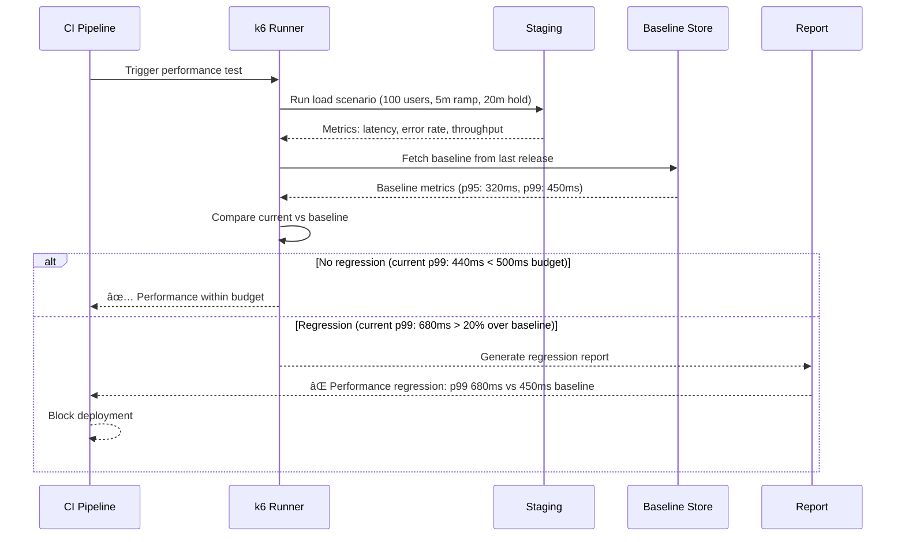

# Performance Testing

> **Purpose:** Define performance testing practices for Vaeloom
> **Status:** 🆕 New

## Performance Test Architecture

```mermaid
graph TD
    classDef type fill:#e3f2fd,stroke:#1565c0,color:#000,stroke-width:2px
    classDef scenario fill:#e8f5e9,stroke:#2e7d32,color:#000,stroke-width:1.5px
    classDef budget fill:#fff3e0,stroke:#e65100,color:#000,stroke-width:1.5px

    subgraph Types["📊 Performance Test Types"]
        direction TB
        T1["Load Test<br/>Behavior under expected load<br/>k6 scenarios/api-load.js"]
        T2["Stress Test<br/>Breaking point identification<br/>k6 scenarios/stress.js"]
        T3["Endurance Test<br/>Behavior over extended time<br/>k6 (extended, 1h+)"]
        T4["Spike Test<br/>Behavior under sudden load<br/>k6 scenarios/spike.js"]
        T5["Scalability Test<br/>Linear scaling verification<br/>k6 + cluster metrics"]
    end

    subgraph Scenarios["📋 Load Scenarios"]
        S1["Normal Load<br/>100 users --> 5m ramp --> 20m hold --> 5m cooldown<br/>Threshold: p95 < 500ms, p99 < 2s"]
        S2["Peak Load<br/>500 users --> 2m ramp --> 5m hold --> 2m cooldown<br/>Threshold: < 1% error rate"]
    end

    subgraph Budgets["🎯 Performance Budgets"]
        B1["API p99 latency<br/>< 500ms<br/>Measured by: k6"]
        B2["Agent p99 latency<br/>< 10s<br/>Measured by: AI tracing"]
        B3["Page load<br/>< 2s<br/>Measured by: Lighthouse CI"]
        B4["DB query p99<br/>< 100ms<br/>Measured by: pg_stat_statements"]
    end

    Types --> Scenarios --> Budgets

    class T1,T2,T3,T4,T5 type
    class S1,S2 scenario
    class B1,B2,B3,B4 budget
```



> **Diagram:** Five performance test types (load, stress, endurance, spike, scalability) feed into **load scenarios** with specific ramp-up patterns and thresholds. **Performance budgets** define concrete targets for API, Agent, Page, and Database latency.

---

## Performance Test Types

| Type | What It Measures | Tool |
|------|-----------------|------|
| Load test | Behavior under expected load | k6 |
| Stress test | Breaking point | k6 |
| Endurance test | Behavior over time | k6 (extended) |
| Spike test | Behavior under sudden load | k6 |
| Scalability test | Linear scaling verification | k6 |

## Load Test Scenarios

### Normal Load

```javascript
import http from 'k6/http';
import { check, sleep } from 'k6';

export const options = {
  stages: [
    { duration: '5m', target: 100 },  // Ramp up to 100 users
    { duration: '20m', target: 100 }, // Stay at 100 users
    { duration: '5m', target: 0 },    // Ramp down
  ],
  thresholds: {
    http_req_duration: ['p(95)<500', 'p(99)<2000'],
    http_req_failed: ['rate<0.01'],
  },
};

export default function () {
  const res = http.get('https://api.Vaeloom.dev/v1/health');
  check(res, { 'status is 200': (r) => r.status === 200 });
  sleep(1);
}
```

### Peak Load

```javascript
export const options = {
  stages: [
    { duration: '2m', target: 500 },  // Quick ramp
    { duration: '5m', target: 500 },  // Hold peak
    { duration: '2m', target: 0 },    // Ramp down
  ],
};
```

## Performance Budgets

| Operation | Budget | Measured By |
|-----------|--------|-------------|
| API p99 latency | < 500ms | k6 |
| Agent p99 latency | < 10s | AI tracing |
| Page load | < 2s | Lighthouse CI |
| DB query p99 | < 100ms | pg_stat_statements |

## Common Mistakes

| Mistake | Consequence |
|---------|-------------|
| Testing only average load, never peak | System fails under real traffic patterns |
| Ignoring cold-start latency | First request after deploy is much slower than measured |
| Running tests without baseline comparison | No way to tell if performance improved or regressed |

## Best Practices

| Practice | Rationale |
|----------|-----------|
| Always establish a performance baseline | Compare results against known-good numbers |
| Test with production-like data volumes | Small datasets hide slow queries and memory issues |
| Automate performance tests in CI | Catch regressions before they reach production |

## Security Considerations

| Concern | Mitigation |
|---------|------------|
| Performance tools expose internal endpoints | Restrict test endpoints with API keys or IP whitelisting |
| Load tests can trigger rate limiters | Coordinate with operations before running large-scale tests |
| Test data may contain sensitive information | Use anonymized or synthetic data in performance tests |

## Performance Considerations

| Concern | Approach |
|---------|----------|
| Test environment resource contention | Running performance tests alongside other workloads skews results — use dedicated or ephemeral environments for accurate benchmarking |
| Cold-start latency measurement | First request after deployment is significantly slower — measure both steady-state and cold-start latency separately and track both in dashboards |
| Baseline comparison drift over time | Performance baselines become outdated as infrastructure changes — regenerate baselines after every significant infrastructure or dependency update |

## Workflows

1. **Performance test baseline establishment**: Run normal load test against staging → collect all metrics (API latency, agent latency, page load, DB query time) → store as baseline v1.0 → label with git commit SHA → subsequent runs compared against this baseline
2. **Performance regression detection in CI**: PR merged → performance test suite triggered → k6 runs load test against staging → results compared against baseline → if any metric exceeds budget (e.g., API p99 > 500ms), CI fails → developer notified with regression report
3. **Agent performance profiling**: Memory Agent invoked with test document → OpenTelemetry trace captured → agent processing time measured separately from LLM API call time → breakdown: prompt building (50ms), LLM call (2s), response parsing (30ms) → bottleneck identified (LLM call) → optimization explored
4. **Performance budget enforcement**: Lighthouse CI runs on every PR → measures LCP, TBT, CLS → compares against budgets (`lcp: 2s, tbt: 200ms, cls: 0.1`) → if budget exceeded, PR check fails with detailed breakdown → developer optimizes and re-runs

## Scalability

| Dimension | Current Limit | 10x Strategy | 100x Strategy |
|-----------|---------------|--------------|---------------|
| Performance test types | 5 (load, stress, endurance, spike, scalability) | 10 types adding cold-start, steady-state, background-job, API gateway, CDN | 25+ types with AI-identified performance patterns |
| Performance baselines stored | 50 | 500 with automated regression detection | Trend dashboard with ML anomaly detection |
| Agent performance traces | 100 per day | 10,000 with sampling and aggregation | Continuous profiling with eBPF |
| Lighthouse CI runs per PR | 3 pages × 3 runs | 10 pages × 3 runs with per-component budgets | Full page inventory with dynamic budget generation |

## Error Handling

| Scenario | Detection | Mitigation | Recovery |
|----------|-----------|------------|----------|
| Performance budget exceeded | Lighthouse CI compares and fails | PR blocked with specific budget report (e.g., "LCP 2.4s, budget 2.0s") | Developer optimizes and re-runs; if impossible, budget renegotiation |
| Baseline not found for comparison | CI script checks for baseline file | Use previous release baseline; log warning | Generate new baseline from current run |
| k6 test flakiness (unexpected latency spike) | Single run exceeds threshold but retry passes | Report as "flaky" not "failed"; do not block deploy | Investigate flaky metric; add to known variance log |
| Agent trace incomplete | Span missing from OpenTelemetry | Log warning; skip agent breakdown for this run | Fix instrumentation; re-run profiling |

## Monitoring

| Metric | Alert Threshold | Severity | Dashboard |
|--------|----------------|----------|-----------|
| API p99 latency vs baseline | > 20% increase | Critical | Grafana — Performance Dashboard |
| Agent p99 latency | > 10s | Warning | Grafana — AI Performance |
| Lighthouse LCP | > 2.0s | Warning | Grafana — Web Vitals |
| DB query p99 | > 100ms | Warning | Grafana — Database Dashboard |
| Performance budget violation rate | > 1 per week | Info | Product — Performance Tracker |

## Risks

| Risk | Likelihood | Impact | Mitigation |
|------|------------|--------|------------|
| Performance tests measure staging, not production | Staging may not reflect production capacity | Use production-like hardware for staging; validate by comparing with production metrics | Deploy performance tests in production via canary analysis |
| Cold-start latency not captured in steady-state tests | First request latency after deploy is much higher | Add dedicated cold-start scenarios; measure deploy-to-ready time | Pre-warm agent containers; include cold-start in SLA |
| Baseline drift over time as infrastructure changes | Comparable baselines become meaningless | Regenerate baseline after every infrastructure change | Automated baseline recalibration on deployment events |

## Limitations

| Limitation | Impact | Workaround | Future Resolution |
|------------|--------|------------|-------------------|
| Performance budgets are static targets | Budgets that were reasonable 6 months ago may be too strict or too loose | Quarterly budget review and adjustment | AI-adaptive budgets that adjust based on feature complexity and device capability |
| Lighthouse CI measures synthetic performance, not real user | RUM data may show different performance characteristics | Complement with Real User Monitoring (RUM) via Web Vitals library | Unified synthetic + RUM performance dashboard |
| Agent performance depends on LLM provider latency | Cannot control external API response time | Budget LLM time separately; alert only if processing time degrades | Multi-provider LLM routing with latency-based selection |

## Overview

Performance testing at Vaeloom ensures that the platform meets latency, throughput, and responsiveness targets for every operation — from API requests and database queries to AI agent processing and page loads. Five test types (load, stress, endurance, spike, scalability) provide comprehensive coverage of different performance dimensions, each with specific ramp-up patterns and success thresholds.

Performance budgets define concrete targets for every critical operation: API p99 latency under 500ms, AI agent p99 processing under 10 seconds, page load under 2 seconds (Lighthouse LCP), and database query p99 under 100ms. These budgets are enforced in CI through automated performance test runs that compare results against stored baselines, blocking deployments on regression.

For Vaeloom's AI agents, performance measurement separates LLM API call time from internal processing time (prompt building, response parsing). This breakdown is critical for identifying where optimization effort should be focused — if the bottleneck is the LLM API call, the solution differs from a prompt construction bottleneck. OpenTelemetry traces capture this breakdown for every agent invocation.

Performance baselines are versioned alongside the codebase, labeled with git commit SHAs, and regenerated after every significant infrastructure or dependency update. This ensures that performance comparisons remain valid as the environment evolves. Quarterly budget reviews adjust targets based on feature complexity and device capability changes.

## Goals

- Maintain API p99 latency under 500ms for all endpoints under normal load
- Achieve page load LCP under 2 seconds for all SSR routes (Lighthouse CI)
- Keep AI agent p99 processing under 10 seconds including LLM API time
- Maintain database query p99 under 100ms for all production queries
- Detect and block 100% of performance regressions exceeding 20% baseline increase

## Scope

### In Scope

- Five performance test types: load, stress, endurance, spike, scalability
- Performance budgets: API p99 < 500ms, Agent p99 < 10s, Page load < 2s (LCP), DB query p99 < 100ms
- k6 for API-level performance testing with structured ramp-up patterns
- Lighthouse CI for frontend performance (LCP, TBT, CLS) on every PR
- OpenTelemetry-based agent performance tracing with LLM time vs processing time breakdown
- Baseline-relative regression detection with CI enforcement

### Out of Scope

- Real User Monitoring (RUM) integration with Web Vitals (future improvement)
- AI-adaptive performance budgets based on feature complexity (future improvement)
- Continuous profiling with eBPF for agent performance (future improvement)
- Unified synthetic + RUM performance dashboard (future improvement)

## Sequence Diagrams



---

| Improvement | Priority | Complexity | Timeline |
|-------------|----------|------------|----------|
| Real User Monitoring (RUM) integration with Web Vitals | High | Medium | Q2 2027 |
| AI-adaptive performance budgets | Medium | High | Q4 2027 |
| Continuous profiling with eBPF for agent performance | High | High | Q3 2027 |
| Unified synthetic + RUM performance dashboard | Medium | Medium | Q2 2027 |

## Examples

### Load test with k6

```javascript
import http from 'k6/http';
import { check, sleep } from 'k6';

export const options = {
  stages: [
    { duration: '5m', target: 100 },
    { duration: '20m', target: 100 },
    { duration: '5m', target: 0 },
  ],
  thresholds: {
    http_req_duration: ['p(95)<500', 'p(99)<2000'],
    http_req_failed: ['rate<0.01'],
  },
};

export default function () {
  const res = http.get('https://api.Vaeloom.dev/v1/health');
  check(res, { 'status is 200': (r) => r.status === 200 });
  sleep(1);
}
```

### Agent performance breakdown

```python
import time
from opentelemetry import trace

async def profile_agent(document: dict):
    tracer = trace.get_tracer(__name__)
    with tracer.start_as_current_span("agent_process") as span:
        t0 = time.time()
        prompt = build_prompt(document)
        span.add_event("prompt_built", {"duration_ms": (time.time() - t0) * 1000})

        t1 = time.time()
        llm_response = await call_llm(prompt)
        span.add_event("llm_call", {"duration_ms": (time.time() - t1) * 1000})

        t2 = time.time()
        result = parse_response(llm_response)
        span.add_event("parsed", {"duration_ms": (time.time() - t2) * 1000})
    return result
```

### Lighthouse CI budget config

```json
{
  "ci": {
    "collect": { "numberOfRuns": 3 },
    "assert": {
      "assertions": {
        "largest-contentful-paint": ["warn", { "maxNumericValue": 2000 }],
        "total-blocking-time": ["error", { "maxNumericValue": 200 }],
        "cumulative-layout-shift": ["error", { "maxNumericValue": 0.1 }]
      }
    }
  }
}
```

### DB query performance check

```sql
-- Find slow queries
SELECT query, mean_time, calls
FROM pg_stat_statements
ORDER BY mean_time DESC
LIMIT 10;

-- Check connection count
SELECT count(*) FROM pg_stat_activity;
```

---

## Related Documents

- [Load Testing.md](./Load-Testing.md)
- [`Architecture/Performance.md`](../Architecture/Performance.md)
- [`Architecture/Scalability.md`](../Architecture/Scalability.md)
