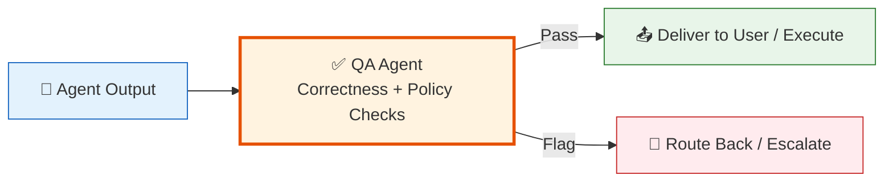

# Testing

> **Purpose:** Test strategy, evaluation framework, and quality assurance approach
> **Status:** Active
> **Owner:** QA Team
> **Last Updated:** 2026-07-13

## Overview

The Testing directory defines Meridian's test strategy, evaluation framework, and quality assurance approach across all implementation phases. It ensures that testing is integrated from day one rather than treated as an afterthought.

Key documents cover the evaluation framework for AI agents, the QA Agent architecture, and phased testing strategies from infrastructure through enterprise. Testing evolves with each implementation phase, starting with CI lint/test/build and culminating in tenant-isolation penetration testing.

The QA Agent serves as a gate between every consequential action-capable agent and end users, ensuring correctness and policy compliance before actions are executed.

## What's here

| Document | Location | Status |
|----------|----------|--------|
| Evaluation Framework | [`/Docs/Engineering/Implementation/10-evaluation-framework.md`](../../Docs/Engineering/Implementation/10-evaluation-framework.md) | ✅ Good |
| QA Agent Architecture | [`/Docs/Meridian-Complete-Documentation.md#53-flagship-agents`](../../Docs/Meridian-Complete-Documentation.md#53-flagship-agents) | ✅ Good |
| Testing Strategy (per phase) | [`/Docs/Meridian-Complete-Documentation.md#12-implementation-plan`](../../Docs/Meridian-Complete-Documentation.md#12-implementation-plan) | ✅ Good |

## Testing approach by phase

| Phase | Testing focus |
|-------|---------------|
| 0 — Infrastructure | CI runs lint/test/build on every PR; E2E "can sign up" test |
| 1 — Ingestion | Golden-file tests per parser type; extraction accuracy spot-checked |
| 2 — Organization Agent | Proposal-approval-rate tracked from day one |
| 3 — Resume & ATS | Resume-quality review against anonymized samples |
| 4 — Career Intelligence | Ranking quality reviewed; QA Agent false-positive/negative rate tracked |
| 5 — Communication | Classification accuracy per category; false-negative rate on urgent mail |
| 6 — Polish & Dashboard | Full E2E test suite across critical paths; "delete everything" verification |
| 7 — Enterprise | Tenant-isolation penetration testing (cross-tenant leakage) |

## QA Agent role

The Quality Assurance Agent sits structurally between every consequential action-capable agent and the user/world:



QA is deliberately conservative: a false flag costs a click; a false pass costs trust.

## Coverage gaps

| Area | Status | Priority |
|------|--------|----------|
| Unit test strategy | Adequate (in build prompts) | Medium |
| Integration test strategy | Adequate (in build prompts) | Medium |
| E2E test strategy | Partial (needs dedicated doc) | High |
| Accessibility audit | Not yet performed | High (pre-launch) |
| Performance/load testing | Not yet specified | Medium |
| Security/penetration testing | Planned for Phase 7 | Medium |

## Common Mistakes

| Mistake | Consequence |
|---------|-------------|
| Having testing docs but no enforced standards | Each team tests differently, quality is inconsistent |
| Documenting tests separately from development | Tests become stale and out of sync with code |
| Focusing only on unit test coverage | Integration and E2E gaps allow system-level bugs |

## Best Practices

| Practice | Rationale |
|----------|-----------|
| Keep testing docs co-located with code | Easier to update and find |
| Define test types per phase | Different phases need different testing focus |
| Use a testing README as a central index | New team members quickly understand the strategy |

## Security Considerations

| Concern | Mitigation |
|---------|------------|
| Testing docs may reveal attack surface | Avoid listing exact penetration test procedures in public docs |
| Test environments may mirror production | Use different credentials and data in test environments |
| CI test logs can leak secrets | Mask secrets in test output and CI logs |

## Performance Considerations

| Concern | Mitigation |
|---------|------------|
| Running full test suite on every commit | Use targeted test selection based on changed files |
| E2E tests slow down deploy pipelines | Run critical path E2Es on PR, full suite on staging deploy |
| Load tests consume infrastructure resources | Schedule load tests during off-peak hours |

## Goals

- Establish a comprehensive testing pyramid with the right balance of unit (75%), integration (20%), and E2E (5%) tests
- Ensure AI agent quality through golden dataset evaluations with >= 85% accuracy on every prompt change
- Block deployments on critical test failures, coverage regressions, or security scan findings
- Achieve CI pipeline completion under 15 minutes including all test stages
- Maintain flaky test rate below 1% through systematic detection and quarantine

## Scope

### In Scope
- Unit tests for all business logic, UI components, and service functions across frontend, API, and AI service
- Integration tests for service boundaries (API→DB, API→AI, API→Redis, AI→DB, Web→API contract)
- E2E tests for critical user flows covering the full proposal lifecycle
- AI golden dataset evaluations for all agent prompts with accuracy, hallucination, and adversarial testing
- Coverage measurement and enforcement with per-module thresholds (70-90% line, 60-80% branch)
- Performance and load testing against staging before production releases
- Security scanning (SAST, dependency, secret) on every PR

### Out of Scope
- Visual regression testing (manual review until tool integration)
- Manual exploratory testing (ad hoc, not automated in CI)
- Production performance monitoring (covered in Operations docs)
- Accessibility compliance testing (covered in Accessibility Audit)

---

| Improvement | Priority | Complexity | Timeline |
|-------------|----------|------------|----------|
| AI agent evaluation golden dataset expansion | High | Medium | Q1 2027 |
| Automated regression test suite generation | Medium | High | Q2 2027 |
| Performance testing CI integration | Medium | Medium | Q4 2026 |

## Related categories

- [`AI/`](../AI/) — AI evaluation framework
- [`Security/`](../Security/) — Security testing
- [`Operations/`](../Operations/) — Production monitoring for quality

## Examples

### Unit test example (Jest)

```typescript
describe('DocumentService', () => {
  it('should deduplicate by content hash', async () => {
    const docs = await service.deduplicateDocuments(['doc_1', 'doc_2'], 'ws_abc');
    expect(docs.duplicates).toHaveLength(0);
    expect(docs.original).toEqual(['doc_1', 'doc_2']);
  });
});
```

### AI golden dataset test

```python
@pytest.mark.golden
@pytest.mark.parametrize("document,expected_skills", [
    ({"content": "Python, React", "type": "resume"}, ["Python", "React"]),
    ({"content": "", "type": "resume"}, []),
])
async def test_entity_extraction(handler, document, expected_skills):
    result = await handler.extract_entities(document)
    for skill in expected_skills:
        assert skill in result["skills"]
```

### E2E smoke test

```typescript
test('critical path: sign up and upload', async ({ page }) => {
  await page.goto('/signup');
  await page.fill('[data-testid="email"]', `test-${Date.now()}@test.com`);
  await page.fill('[data-testid="password"]', 'TestPass123!');
  await page.click('[data-testid="signup-button"]');
  await expect(page.locator('[data-testid="dashboard"]')).toBeVisible();
});
```

### Integration test with Docker

```yaml
services:
  postgres-test:
    image: postgis/postgis:16
    tmpfs: /var/lib/postgresql/data
  api-test:
    build: ./apps/api
    depends_on: [postgres-test]
    command: npm run test:integration
```

---

## Related Documents

- [Testing Strategy](./Testing-Strategy.md) — Full testing strategy
- [AI Evaluation Framework](../AI/README.md) — AI agent testing
- [QA Agent Architecture](../Meridian-Complete-Documentation.md#53-flagship-agents) — QA Agent design
