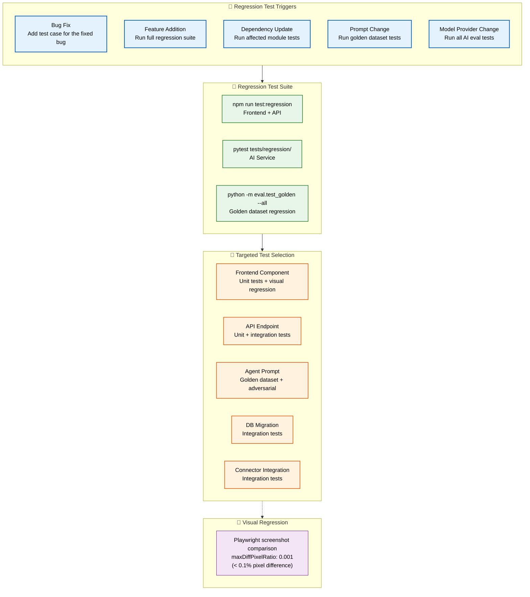
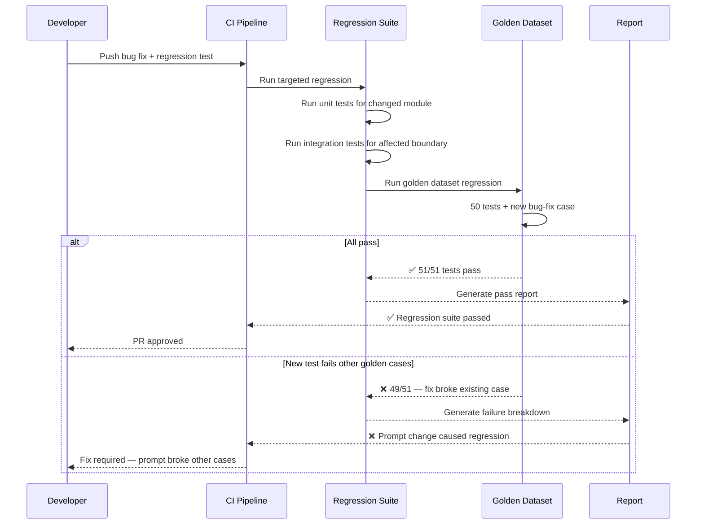

# Regression Testing

> **Purpose:** Define regression testing practices for Meridian
> **Status:** 🆕 New

## Regression Test Architecture



> **Diagram:** Regression testing is triggered by 5 events (bug fix, feature, dependency, prompt, model change). The **test suite** runs full or targeted based on the change type. **Visual regression** via Playwright screenshot comparison catches UI regressions with 0.1% pixel difference tolerance.

---

## Regression Test Scope

When a bug is found and fixed:

1. Add the failing case to the golden dataset
2. Verify the fix passes
3. Run all existing tests to ensure no regression

## Regression Test Triggers

| Trigger | Action |
|---------|--------|
| Bug fix | Add test case for the fixed bug |
| Feature addition | Run full regression suite |
| Dependency update | Run affected module tests |
| Prompt change | Run golden dataset tests |
| Model provider change | Run all AI eval tests |

## Regression Test Suite

```bash
# Full regression suite
npm run test:regression  # Frontend + API
pytest tests/regression/  # AI Service

# Targeted regression
npm run test -- --testPathPattern=DocumentService
python -m eval.run_single memory_agent

# Golden dataset regression
python -m eval.test_golden --all
```

## Regression Test Selection

| Change Type | Tests to Run |
|-------------|--------------|
| Frontend component | Unit tests for component + visual regression |
| API endpoint | Unit + integration tests for endpoint |
| Agent prompt | Golden dataset + adversarial tests |
| Database migration | Integration tests for affected tables |
| Connector integration | Integration tests for connector |

## Visual Regression

For frontend changes, visual regression tests capture screenshots and compare them:

```typescript
import { expect, test } from '@playwright/test';

test('dashboard renders consistently', async ({ page }) => {
  await page.goto('/dashboard');
  await expect(page).toHaveScreenshot('dashboard.png', {
    maxDiffPixelRatio: 0.001, // < 0.1% pixel difference allowed
  });
});
```

## Common Mistakes

| Mistake | Consequence |
|---------|-------------|
| Having no automated regression suite | Bugs silently reappear after fixes ship |
| Adding regression tests only for the exact bug case | Misses related paths that could also be broken |
| Running full regression suite on every trivial change | Long CI times, developers start skipping tests |

## Best Practices

| Practice | Rationale |
|----------|-----------|
| Add a regression test for every bug fix | Prevents the same bug from recurring |
| Use selective regression based on change impact | Fast feedback for small changes, full suite for risky ones |
| Version golden datasets alongside prompts | Reproducible AI regression testing |

## Security Considerations

| Concern | Mitigation |
|---------|------------|
| Regression test data may contain historical secrets | Scrub or rotate any credentials in regression fixtures |
| Visual regression screenshots capture internal UI | Limit access to screenshot artifact storage |
| Automated regression can't detect security regressions | Pair with security-specific regression tests (SAST replay) |

## Performance Considerations

| Concern | Mitigation |
|---------|------------|
| Full regression suites take significant time | Use test impact analysis to run only affected tests |
| Visual regression screenshot comparison is memory-intensive | Run visual tests on dedicated CI workers with sufficient RAM |
| Golden dataset regression requires LLM API calls | Batch golden tests, run during off-peak hours |

## Workflows

1. **Bug fix triggers regression test**: Bug reported → developer fixes code → adds test case reproducing the bug → `npm run test:regression` runs full suite → verifies fix passes → ensures no existing tests break → PR merged with all checks green
2. **Feature addition with selective regression**: New feature implemented → CI determines affected modules (Test Impact Analysis) → runs only affected module tests + critical integration tests → if pass, runs full regression suite in parallel → full results reported
3. **Visual regression on UI change**: Frontend component modified → Playwright screenshot comparison runs → `maxDiffPixelRatio: 0.001` threshold checked → if diffs found, screenshots uploaded to visual review dashboard → reviewer approves or rejects changes → approved changes become new baseline
4. **Prompt change regression**: AI agent prompt updated → golden dataset regression suite runs (`python -m eval.test_golden --all`) → all 50 golden tests must pass at > 90% tolerance → adversarial tests (20) must pass at 100% → if regression, prompt revision required

## Scalability

| Dimension | Current Limit | 10x Strategy | 100x Strategy |
|-----------|---------------|--------------|---------------|
| Regression test suite size | 500 tests | 5,000 with impact analysis to reduce per-PR runtime | 50,000+ with distributed execution and AI-based test selection |
| Visual regression baselines | 50 screenshots | 500 with per-component baselines and auto-maintenance | 10,000+ with AI-driven baseline rejection of irrelevant diffs |
| Golden dataset regression (AI) | 50 examples per agent | 500 with parallel eval across agents | 5,000 with continuous eval on production shadow traffic |
| Test impact analysis precision | Module-level | Function-level with call graph analysis | Statement-level with dynamic dependency tracking |

## Error Handling

| Scenario | Detection | Mitigation | Recovery |
|----------|-----------|------------|----------|
| Regression test fails after fix | npm run test:regression returns non-zero | CI fails; show failed test name + error message | Developer debuses failing test; fixes code or updates test expectation |
| Visual regression false positive | Screenshot diff is infrastructure-related (font rendering, anti-aliasing) | Use consistent Docker-based rendering; ignore diff < 0.05% | Update baseline with manual approval |
| Golden dataset regression not caught in PR | AI eval only runs on prompt changes | Developer ran eval before push but not after merge | Post-merge CI re-runs golden dataset against main branch |
| Test impact analysis miss (test not identified as affected) | Regression escapes to production | Alert from production monitoring; add to regression test gap analysis | Refine impact analysis with additional dependency metadata |

## Monitoring

| Metric | Alert Threshold | Severity | Dashboard |
|--------|----------------|----------|-----------|
| Regression test pass rate | < 99% | Critical | Grafana — Test Dashboard |
| Visual regression review queue | > 10 pending approvals | Warning | Chromatic — Review Dashboard |
| Golden dataset regression rate | > 5% of prompt changes | Warning | Grafana — AI Eval Dashboard |
| Regression escape to production | > 0 per release | Critical | Product — Bug Tracker |
| Regression suite runtime | > 30 min | Warning | CI Pipeline — Test Duration |

## Risks

| Risk | Likelihood | Impact | Mitigation |
|------|------------|--------|------------|
| Full regression suite takes too long, developers skip running it | High | Medium | Run selective regression on PR; full suite on staging deploy |
| Visual regression baselines become stale | Medium | Medium | Auto-accept baselines after 30 days with changelog; require review for significant diffs |
| Golden dataset regression tests give false confidence | Medium | High | Include adversarial tests alongside golden dataset; cross-validate with production sample |
| Regression test suite overlaps with E2E tests, doubling maintenance | Medium | Low | Define clear scope: unit+integration for regression, E2E for critical user flows |

## Limitations

| Limitation | Impact | Workaround | Future Resolution |
|------------|--------|------------|-------------------|
| Visual regression cannot detect DOM structure changes that don't affect pixels | Accessibility and semantic HTML changes invisible to screenshot comparison | Complement with axe-core a11y scans in regression suite | AI-driven visual regression that understands semantic DOM changes |
| Test Impact Analysis is only as good as its dependency map | Misses implicit dependencies (e.g., shared CSS variables) | Run full regression suite weekly regardless; addition to explicit dependency map | Dynamic impact analysis using production code coverage traces |
| Golden dataset regression doesn't cover all real-world inputs | Narrow test coverage for AI agents | Periodically sample production inputs to expand dataset | Continuous regression with traffic shadowing in production |

## Overview

Regression testing at Meridian ensures that code changes, dependency updates, and prompt modifications don't break existing functionality. Five triggers initiate regression tests: bug fixes (add the failing case and verify), feature additions (run full regression suite), dependency updates (run affected module tests), prompt changes (run golden dataset tests), and model provider changes (run all AI evaluation tests).

The regression test suite is organized by test type rather than by trigger — unit tests for frontend components and API endpoints, integration tests for service boundaries, golden dataset tests for AI agent prompts, and visual regression tests for UI changes. Targeted test selection based on change impact determines which tests run on each PR, balancing fast feedback with comprehensive coverage.

For Meridian's AI agents, regression testing is critical for maintaining prompt quality over time. Every bug fix that involves an AI agent prompt must add the failing case to the golden dataset, verify the fix passes, and then run all existing golden tests to ensure no regression. This "fix it, prove it, don't break anything else" cycle prevents the common AI anti-pattern of fixing one bug while introducing two new ones.

Visual regression testing via Playwright screenshot comparison catches unintended UI changes. With a `maxDiffPixelRatio` of 0.001 (0.1% pixel difference tolerance), the system flags even subtle visual regressions while tolerating anti-aliasing differences. Screenshots are captured on every frontend component change and reviewed through a visual review dashboard.

## Goals

- Add a regression test case for 100% of reported bugs to prevent recurrence
- Achieve 99%+ regression test pass rate on every CI run
- Complete targeted regression suite in under 5 minutes for PR-level feedback
- Maintain zero regression escapes to production (verified bugs that were previously fixed)
- Review and approve all visual regression diffs before baseline update

## Scope

### In Scope
- Five regression triggers: bug fix, feature addition, dependency update, prompt change, model provider change
- Selective regression test execution based on change impact analysis
- Golden dataset regression for all AI agent prompts on every prompt change
- Playwright visual regression with screenshot comparison (0.1% pixel diff tolerance)
- Bug-fix regression pattern: add case → verify fix → run full suite
- Test impact analysis to minimize per-PR regression test runtime

### Out of Scope
- AI-driven visual regression with semantic change understanding (future improvement)
- Dynamic impact analysis using production coverage traces (future improvement)
- Continuous regression with traffic shadowing (future improvement)
- Automated golden dataset expansion from production samples (future improvement)

## Sequence Diagrams



---

| Improvement | Priority | Complexity | Timeline |
|-------------|----------|------------|----------|
| AI-driven visual regression with semantic change understanding | High | High | Q4 2027 |
| Dynamic impact analysis using production coverage traces | Medium | High | Q3 2027 |
| Continuous regression with traffic shadowing | High | High | Q3 2027 |
| Automated golden dataset expansion from production samples | Medium | Medium | Q2 2027 |

## Examples

### Bug fix regression test

```typescript
describe('DocumentService regression', () => {
  it('should handle empty filename on upload', async () => {
    const response = await request(app)
      .post('/api/v1/documents')
      .attach('file', Buffer.from(''), '')
      .set('Authorization', `Bearer ${testToken}`);
    expect(response.status).toBe(400);
    expect(response.body.error).toContain('filename required');
  });
});
```

### Visual regression test

```typescript
import { expect, test } from '@playwright/test';

test('proposal card renders consistently', async ({ page }) => {
  await page.goto('/workspace');
  await page.waitForSelector('[data-testid="proposal-card"]');
  await expect(page.locator('[data-testid="proposal-card"]'))
    .toHaveScreenshot('proposal-card.png', { maxDiffPixelRatio: 0.001 });
});
```

### Golden dataset regression

```python
@pytest.mark.golden
@pytest.mark.parametrize("input,expected", [
    ({"text": "I know Python and React"}, {"skills": ["Python", "React"]}),
    ({"text": ""}, {"skills": []}),
])
async def test_skill_extraction(agent, input, expected):
    result = await agent.extract_skills(input["text"])
    assert set(result["skills"]) == set(expected["skills"])
```

### Targeted regression by module

```bash
# Run only document service tests
npm run test -- --testPathPattern=DocumentService

# Run AI golden regression
python -m eval.test_golden --agent=memory_agent --all
```

---

## Related Documents

- [Testing Strategy.md](./Testing-Strategy.md)
- [Coverage.md](./Coverage.md)
- [`DevOps/CI-CD.md`](../DevOps/CI-CD.md)
