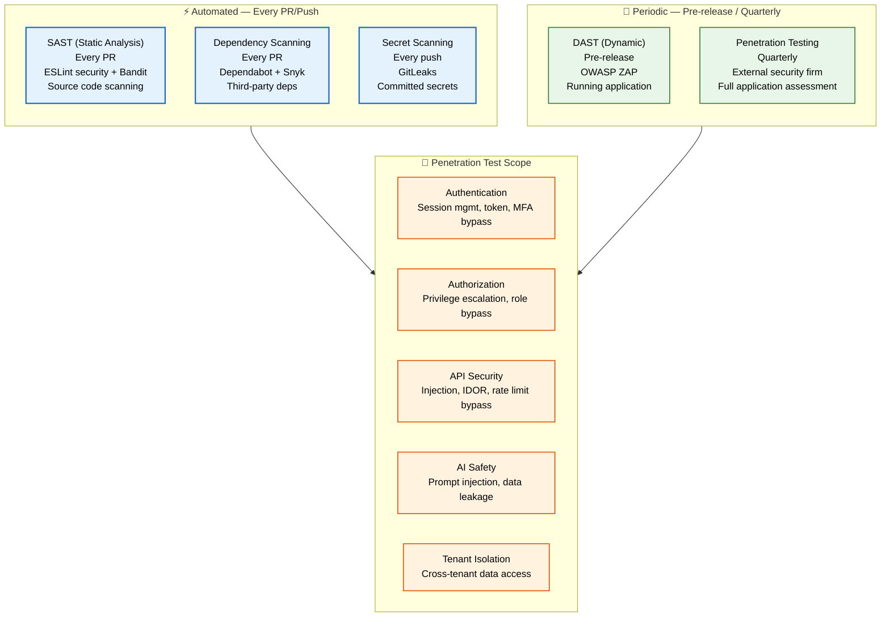
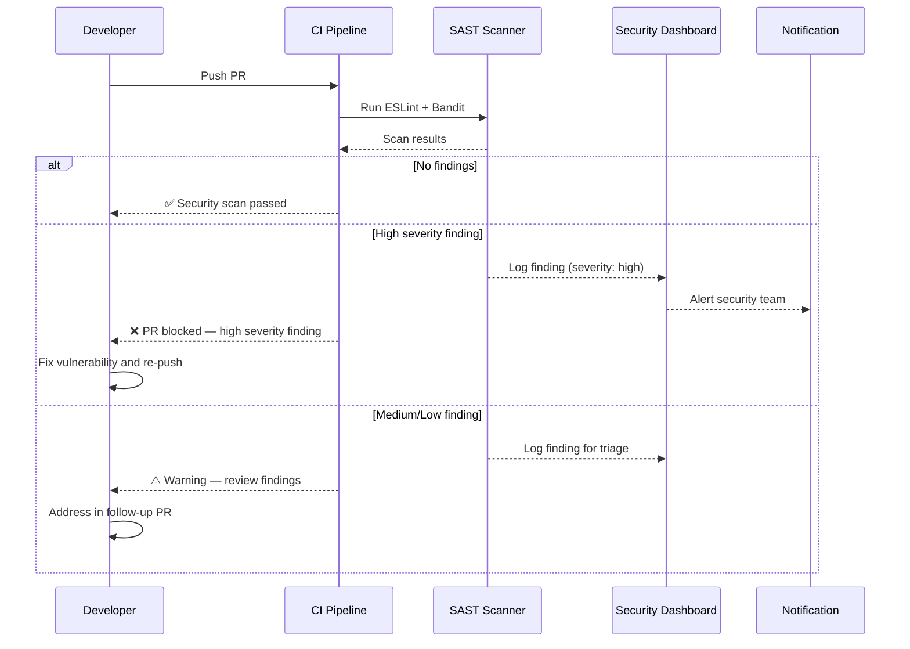

# Security Testing

> **Purpose:** Define security testing practices for Meridian
> **Status:** 🆕 New

## Security Test Architecture



> **Diagram:** Security testing runs at two cadences — **automated** (SAST, dependency scanning, secret scanning every PR/push) and **periodic** (DAST pre-release, penetration testing quarterly). **Penetration test scope** covers 5 critical areas: auth, authorization, API security, AI safety, and tenant isolation.

---

## Security Test Types

| Test Type | Frequency | Tool | Scope |
|-----------|-----------|------|-------|
| SAST (Static Analysis) | Every PR | ESLint security rules, Bandit | Source code |
| Dependency scanning | Every PR | Dependabot, Snyk | Third-party deps |
| Secret scanning | Every push | GitLeaks | Committed secrets |
| DAST (Dynamic) | Pre-release | OWASP ZAP | Running application |
| Penetration testing | Quarterly | External firm | Full application |

## SAST Rules

```bash
# TypeScript/JavaScript
eslint --rule 'security/detect-object-injection: error' apps/

# Python
bandit -r apps/ai-service/ -f json -o security-report.json
```

## Dependency Scanning

```yaml
# .github/dependabot.yml
version: 2
updates:
  - package-ecosystem: "npm"
    directory: "/"
    schedule:
      interval: "weekly"
    open-pull-requests-limit: 10
    
  - package-ecosystem: "pip"
    directory: "/apps/ai-service"
    schedule:
      interval: "weekly"
```

## Penetration Testing Scope

| Area | Test Cases |
|------|------------|
| Authentication | Session management, token handling, MFA bypass |
| Authorization | Privilege escalation, role bypass |
| API security | Injection, IDOR, rate limiting bypass |
| AI safety | Prompt injection, data leakage |
| Tenant isolation | Cross-tenant data access |

## Common Mistakes

| Mistake | Consequence |
|---------|-------------|
| Relying only on automated scanning | Misses business logic flaws and chained exploits |
| Treating security testing as a one-time event | New vulnerabilities emerge as code and dependencies change |
| Ignoring SAST false positives | Alerts get ignored, real issues slip through |

## Best Practices

| Practice | Rationale |
|----------|-----------|
| Shift left — run SAST on every PR | Catch vulnerabilities before they reach staging |
| Maintain a security test inventory | Track which tests cover which OWASP categories |
| Schedule quarterly penetration tests | Automated scans miss novel attack vectors |

## Performance Considerations

| Concern | Mitigation |
|---------|------------|
| SAST scans slow down CI pipelines | Run only on changed files in PRs, full scan nightly |
| Dependency auditing adds build time | Cache dependency scan results between runs |
| Penetration tests require dedicated environments | Use ephemeral staging environments to avoid conflicts |

## Security Considerations

| Concern | Mitigation |
|---------|------------|
| Relying only on automated scanning | Automated tools miss business logic flaws and chained exploits — supplement with manual penetration testing and threat modeling every quarter |
| Treating security testing as a one-time event | New vulnerabilities emerge as code and dependencies change — integrate SAST, DAST, and dependency scanning into CI with scheduled full-scope reviews |
| Ignoring SAST false positives | Too many false leads desensitize the team — triage findings with a severity matrix and tune rules to reduce noise without missing real vulnerabilities |

## Workflows

1. **SAST scan on every PR**: Developer pushes PR → GitHub Action triggers `eslint --rule 'security/detect-object-injection: error'` for JS/TS → Bandit scans Python AI service → results posted as annotations on PR diff → any high-severity finding blocks merge → developer fixes and re-pushes
2. **Dependency vulnerability scan**: Weekly Dependabot scan runs against all packages → npm/pip vulnerabilities identified → automated PR created with version bump → CI runs test suite on patched version → if tests pass, PR auto-merged → if breaking change, manual review
3. **Quarterly penetration test**: External security firm engages → 2-week testing window → 5 focus areas tested (auth, authorization, API, AI safety, tenant isolation) → findings documented with severity/PoC/remediation → 30-day SLA for critical findings → fix verified by re-test
4. **Secret scanning on every push**: GitLeaks scans every commit for secrets → if secret pattern detected (AWS key, token, password), push blocked → developer notified with commit hash and file path → secret rotated via vault → force push with cleaned history

## Scalability

| Dimension | Current Limit | 10x Strategy | 100x Strategy |
|-----------|---------------|--------------|---------------|
| SAST rules applied | 20 security rules | 100 rules with custom rule authoring for Meridian-specific patterns | 500+ rules with ML-augmented false positive reduction |
| Dependency scan scope | npm + pip | npm, pip, Docker, GitHub Actions, Terraform | Full SBOM generation with VEX document management |
| Penetration test frequency | Quarterly | Bi-monthly with automated DAST between engagements | Continuous security validation with bug bounty program |
| Secret scan patterns | 150 (GitLeaks default) | 500 custom patterns for Meridian-specific secret formats | Real-time secret detection with response automation |

## Error Handling

| Scenario | Detection | Mitigation | Recovery |
|----------|-----------|------------|----------|
| SAST false positive blocks PR | Rule triggers on non-vulnerable code | Developer adds `// eslint-disable-next-line` with justification in comment | If pattern is systemic, tune rule to reduce noise |
| Dependabot PR introduces breaking change | CI tests fail on patched dependency | Block auto-merge; notify team; create manual remediation ticket | Pin acceptable version range; test alternative library if needed |
| Penetration test finds critical vulnerability | External firm reports severity 9+ finding | 30-day SLA begins; security team leads remediation; hotfix deployed | Verify fix; re-test affected scope; update threat model |
| Secret leaked to public repository | GitHub secret scanning alerts | Rotate compromised secret immediately; revoke access; audit access logs | Remove secret from git history (BFG Repo-Cleaner); update git hooks |

## Monitoring

| Metric | Alert Threshold | Severity | Dashboard |
|--------|----------------|----------|-----------|
| SAST high-severity findings | > 0 per PR | Critical | GitHub Security Dashboard |
| Open dependency vulnerabilities | > 5 critical | Critical | Snyk/Dependabot Dashboard |
| Penetration test critical findings | > 0 per engagement | Critical | Security — Pentest Report |
| Secret scan violations | > 0 per push | Critical | GitLeaks Dashboard |
| Time to remediate critical findings | > 30 days | Critical | Security — SLA Tracker |
| DAST scan pass rate | < 95% | Warning | OWASP ZAP — Scan Dashboard |

## Risks

| Risk | Likelihood | Impact | Mitigation |
|------|------------|--------|------------|
| SAST tool misses business logic vulnerabilities | High | Medium | Supplement with DAST + manual penetration testing; threat model per feature |
| Dependency vulnerability discovered in production | Medium | Critical | Dependabot scans weekly; incident response plan for zero-day vulnerabilities |
| Penetration test findings not remediated within SLA | Medium | High | Track SLA compliance in security dashboard; escalate to leadership if at risk |
| AI prompt injection techniques evolve faster than guardrails | Medium | High | Continuous adversarial testing; follow AI safety research; participate in red team community |

## Limitations

| Limitation | Impact | Workaround | Future Resolution |
|------------|--------|------------|-------------------|
| SAST cannot detect runtime vulnerabilities (injection, IDOR) | Only covers static code patterns | Complement with DAST (OWASP ZAP) on staging; manual pentest for business logic flaws | IAST (Interactive Application Security Testing) at runtime |
| Automated dependency scanning can't prioritize exploitability | CVSS score may not reflect actual risk | Manual triage of critical findings by security team | AI-based exploitability prediction using CISA KEV and threat intelligence |
| Penetration tests are point-in-time snapshots | New vulnerabilities emerge between tests | Monthly DAST scans between quarterly pentests | Continuous bug bounty program with automated validation |

## Overview

Security testing at Meridian operates at two cadences. Automated testing runs on every PR and push — SAST (Static Application Security Testing) via ESLint security rules and Bandit scans source code for vulnerabilities, Dependabot + Snyk scan dependencies weekly for known CVEs, and GitLeaks scans every commit for secrets. Periodic testing — DAST via OWASP ZAP before releases and full penetration testing by an external firm quarterly — catches runtime and business logic vulnerabilities that automated tools miss.

The penetration test scope covers five critical areas: authentication (session management, token handling, MFA bypass), authorization (privilege escalation, role bypass), API security (injection, IDOR, rate limiting), AI safety (prompt injection, data leakage), and tenant isolation (cross-tenant data access). Each area has documented test cases that are verified every engagement, ensuring consistent coverage across quarters.

For Meridian's multi-tenant architecture, tenant isolation testing is unique and critical. Penetration tests specifically attempt cross-tenant data access — verifying that a user in Workspace A cannot access documents, memories, or proposals from Workspace B. This testing validates the workspace-scoped query key pattern in TanStack Query, the API gateway permission enforcement, and the database-level row-level security policies.

AI safety testing is another Meridian-specific focus. The penetration test evaluates prompt injection vulnerabilities across all agents, attempts to leak system prompts, tests for indirect injection through uploaded documents, and verifies that sensitive data (API keys, user PII) is not leaked in agent outputs. These tests are informed by the adversarial test cases defined in the Prompt Testing document.

## Goals

- Achieve zero critical or high-severity SAST findings on any PR merge
- Maintain zero critical dependency vulnerabilities open beyond 7 days from discovery
- Complete quarterly penetration tests with 30-day SLA for critical finding remediation
- Detect and block 100% of secrets committed to the repository before push
- Verify tenant isolation across all penetration test engagements with zero cross-tenant leaks

## Scope

### In Scope
- Automated SAST scanning: ESLint security rules (JS/TS) and Bandit (Python) on every PR
- Dependency scanning: Dependabot (npm) and Snyk (npm + pip) on a weekly cadence
- Secret scanning: GitLeaks on every push to detect committed credentials, tokens, keys
- DAST scanning: OWASP ZAP against staging before each production release
- Penetration testing: Quarterly external firm engagement covering auth, authorization, API, AI safety, and tenant isolation
- SAST findings: severity-classified with action (high-severity blocks merge, medium reviewed, low triaged)

### Out of Scope
- Bug bounty program (future improvement)
- IAST (Interactive Application Security Testing) integration (future improvement)
- AI-based exploitability prediction for dependency vulnerabilities (future improvement)
- Automated security regression test generation from pentest findings (future improvement)

## Examples

### SAST Configuration

```bash
# TypeScript/JavaScript — run ESLint security rules
npx eslint --rule 'security/detect-object-injection: error' \
           --rule 'security/detect-non-literal-fs-filename: warn' \
           apps/

# Python — run Bandit security scanner
bandit -r apps/ai-service/ -f json -o security-report.json \
       --skip B101,B311  # Skip assert statements and random
```

### Dependabot Configuration

```yaml
# .github/dependabot.yml
version: 2
updates:
  - package-ecosystem: "npm"
    directory: "/"
    schedule:
      interval: "weekly"
    open-pull-requests-limit: 10
    labels:
      - "security"
      - "dependencies"

  - package-ecosystem: "pip"
    directory: "/apps/ai-service"
    schedule:
      interval: "weekly"
```

### Secret Scanning Pre-Commit Hook

```yaml
# .gitleaks.toml
[allowlist]
description = "Allow known test tokens"

[[rules]]
id = "meridian-api-key"
description = "Meridian API Key"
regex = '''mr_sk_[a-zA-Z0-9]{32}'''
tags = ["meridian", "api-key"]
```

## Sequence Diagrams



---

| Improvement | Priority | Complexity | Timeline |
|-------------|----------|------------|----------|
| Bug bounty program with automated validation | High | High | Q3 2027 |
| IAST (Interactive Application Security Testing) integration | Medium | High | Q4 2027 |
| AI-based exploitability prediction for dependency vulns | Medium | Medium | Q2 2027 |
| Automated security regression test generation from pentest findings | Low | High | Q4 2027 |

## Related Documents

- [Security Architecture.md](../Security/Security-Architecture.md)
- [Threat Model.md](../Security/Threat-Model.md)
- [`DevOps/CI-CD.md`](../DevOps/CI-CD.md)
