# Unit Testing

> **Purpose:** Define unit testing standards for Vaeloom
> **Status:** 🆕 New

## Unit Test Architecture

```mermaid
graph TD
    classDef framework fill:#e3f2fd,stroke:#1565c0,color:#000,stroke-width:2px
    classDef rule fill:#e8f5e9,stroke:#2e7d32,color:#000,stroke-width:1.5px
    classDef pattern fill:#fff3e0,stroke:#e65100,color:#000,stroke-width:1.5px
    classDef scope fill:#f3e5f5,stroke:#6a1b9a,color:#000,stroke-width:1px

    subgraph Frameworks["🔧 Testing Frameworks"]
        direction TB
        F1["Frontend: Jest + RTL<br/>Assertions: Jest matchers"]
        F2["API: Jest<br/>Assertions: Jest matchers"]
        F3["AI Service: pytest<br/>Assertions: pytest assertions"]
    end

    subgraph Requirements["📋 Requirements"]
        R1["Coverage: ≥ 80% per module"]
        R2["Naming: {file}.test.ts / test_{file}.py"]
        R3["Isolation: Mock all external deps"]
        R4["Speed: < 100ms per test"]
    end

    subgraph Pattern["📐 AAA Pattern"]
        P1["Arrange<br/>Set up test data & mocks"]
        P2["Act<br/>Execute the function under test"]
        P3["Assert<br/>Verify expected behavior"]
    end

    subgraph Scope["✅ Test / ❌ Don't Test"]
        S1["✅ Business logic<br/>✅ Edge cases<br/>✅ Error handling<br/>✅ Input validation"]
        S2["❌ Framework internals<br/>❌ Third-party libs<br/>❌ Configuration<br/>❌ Database (integration)"]
    end

    Frameworks --> Requirements --> Pattern --> Scope

    class F1,F2,F3 framework
    class R1,R2,R3,R4 rule
    class P1,P2,P3 pattern
    class S1,S2 scope
```



> **Diagram:** Unit testing frameworks across services (Jest/RTL for frontend, Jest for API, pytest for AI) guide **requirements** (coverage, naming, isolation, speed) → **AAA test pattern** (Arrange/Act/Assert) → **scope** (what to test vs what to leave for integration tests).

---

## Testing Frameworks

| Service | Framework | Assertion Library |
|---------|-----------|-------------------|
| Frontend | Jest + React Testing Library | Jest matchers |
| API | Jest | Jest matchers |
| AI Service | pytest | pytest assertions |

## Unit Test Requirements

| Rule | Standard | Rationale |
|------|----------|-----------|
| Coverage | Minimum 80% per module | Catch regressions |
| Naming | `{file}.test.ts` or `test_{file}.py` | Auto-discovery |
| Isolation | Mock all external dependencies | No network calls in unit tests |
| Speed | < 100ms per test | Fast feedback loop |
| Readability | Descriptive test names | Self-documenting tests |

## Test Structure (AAA Pattern)

```typescript
// Arrange
const userId = 'user_abc';
const documentData = { name: 'resume.pdf', type: 'PDF' };

// Act
const result = await documentService.createDocument(userId, documentData);

// Assert
expect(result).toMatchObject({
  name: 'resume.pdf',
  type: 'PDF',
  workspaceId: expect.any(String),
});
expect(result.id).toMatch(/^doc_/);
```

## What to Test

| ✅ Test | ❌ Don't Test |
|---------|--------------|
| Business logic | Framework internals |
| Edge cases | Third-party library behavior |
| Error handling | Configuration |
| Input validation | Database (integration test) |

## Test Organization

```text
apps/api/src/
├── services/
│   ├── document.service.ts
│   └── document.service.test.ts  # Co-located
├── controllers/
│   ├── document.controller.ts
│   └── document.controller.test.ts
```

## Common Mistakes

| Mistake | Consequence |
|---------|-------------|
| Testing implementation details instead of behavior | Tests break on refactoring, giving false confidence |
| Writing tests that depend on other tests | Test order matters leads to flaky and unreliable suites |
| Ignoring edge cases like null, empty, or overflow inputs | Production bugs from unhandled boundary conditions |

## Best Practices

| Practice | Rationale |
|----------|-----------|
| Follow the AAA pattern (Arrange, Act, Assert) | Clear, readable, and maintainable tests |
| One logical assertion per test | Pinpoint failures without debugging |
| Mock external dependencies, not internals | Fast tests that verify behavior, not implementation |

## Security Considerations

| Concern | Mitigation |
|---------|------------|
| Test data with hardcoded secrets | Use environment variables or secret injection for test credentials |
| Mocked auth passes any token | Validate that real auth checks are enforced (integration tests) |
| Unit tests can't verify SQL injection | Complement with integration tests using malicious inputs |

## Performance Considerations

| Concern | Mitigation |
|---------|------------|
| Slow unit tests discourage running them | Keep individual tests under 100ms, parallelize suites |
| Tests that set up heavy fixtures | Use lightweight factories and transaction rollbacks |
| Over-mocking leads to false performance profiles | Verify performance boundaries in integration tests |

## Workflows

1. **Write unit test following AAA pattern**: Developer creates `document.service.test.ts` → writes Arrange block (set up test data and mocks) → writes Act block (call function under test) → writes Assert block (verify expected output) → runs `npm test -- --testPathPattern=document` → test passes in < 100ms
2. **Mock external dependencies**: Test uses `jest.mock('@vaeloom/api-client')` → mock returns controlled response → test verifies business logic without network calls → mock assertion verifies API was called with correct params → test completes in 50ms
3. **Edge case testing for document service**: Test null `userId` → test empty document name → test invalid file type → test document exceeding size limit → test concurrent uploads → each edge case in separate `it()` block → all pass within < 100ms each
4. **Coverage-driven test gap filling**: CI reports module `document.service.ts` at 65% coverage (below 80% threshold) → developer reviews uncovered lines via `coverage/lcov-report/index.html` → identifies untested error branch → writes test covering the branch → re-runs coverage → module now at 82%

## Scalability

| Dimension | Current Limit | 10x Strategy | 100x Strategy |
|-----------|---------------|--------------|---------------|
| Unit tests per module | 20 | 200 with property-based testing (fast-check) | 2,000+ with AI-generated test cases from API schemas |
| Test execution time (total) | 2 min (500 tests) | 10 min (5,000 tests with parallel sharding) | 20 min (50,000 tests with distributed execution) |
| Mock complexity | Simple jest.mock per file | Auto-mocked interfaces with contract verification | Service virtualization with recorded production responses |
| Edge case coverage | Manual enumeration | Property-based testing for exhaustive edge case discovery | AI-driven boundary analysis from API schemas and types |

## Error Handling

| Scenario | Detection | Mitigation | Recovery |
|----------|-----------|------------|----------|
| Test assertion fails | Jest shows diff between expected and actual | Test stops at first failed assertion (per `it()` block) | Developer reads diff, fixes code or updates expectation |
| Mock returns unexpected data | Mock setup error causes test to fail | Verify mock implementation matches production contract | Update mock to reflect current API response shape |
| Test timeout (exceeds 100ms) | Jest reports timeout | Review test for unnecessary async operations or network calls | Mock remaining dependencies; reduce setup overhead |
| Coverage threshold not met | CI script checks and fails | Print uncovered lines with link to coverage report | Add tests for uncovered branches |

## Monitoring

| Metric | Alert Threshold | Severity | Dashboard |
|--------|----------------|----------|-----------|
| Unit test pass rate | < 98% | Critical | Grafana — Test Dashboard |
| Average test execution time | > 100ms per test | Warning | CI Pipeline — Test Duration |
| Module coverage below threshold | > 3 modules | Warning | Grafana — Code Quality Dashboard |
| Mock mismatch incidents | > 1 per sprint | Warning | Sentry — Test Infrastructure |
| Flaky unit test rate | > 1% of runs | Warning | Grafana — Test Quality Dashboard |

## Risks

| Risk | Likelihood | Impact | Mitigation |
|------|------------|--------|------------|
| Tests become tightly coupled to implementation | High | Medium | Enforce behavior testing (output verification) over implementation testing (mock interaction counts) |
| Mock-heavy tests give false confidence | High | Medium | Complement with integration tests for critical service boundaries |
| Coverage targets encourage shallow testing | Medium | Medium | Review test quality in code review; enforce assertion count per test |
| Slow tests discourage running them locally | Medium | Medium | Keep per-test under 100ms; use jest --onlyChanged for local runs |

## Limitations

| Limitation | Impact | Workaround | Future Resolution |
|------------|--------|------------|-------------------|
| Unit tests cannot verify database interactions | SQL queries and data integrity untested | Use integration tests for database interactions | Unit-of-work pattern with in-memory database implementations |
| Mocked external services may drift from real behavior | Tests pass but production integration fails | Regular contract testing between services | Automatic mock generation from OpenAPI specs with validation |
| Property-based testing requires upfront invariant definition | Team may not know all invariants initially | Start with manual edge case tests; add property-based tests for stable modules | AI-assisted invariant discovery from production data patterns |

## Future Improvements

| Improvement | Priority | Complexity | Timeline |
|-------------|----------|------------|----------|
| AI-generated unit tests from function signatures and types | High | High | Q3 2027 |
| Property-based testing (fast-check) for critical business logic | Medium | Medium | Q2 2027 |
| Auto-mock generation from OpenAPI specs with contract validation | Medium | Medium | Q2 2027 |
| Distributed test execution for sub-1-minute feedback | Low | High | Q4 2027 |

## Examples

### AAA pattern with Jest

```typescript
describe('DocumentService', () => {
  let service: DocumentService;
  let mockRepo: jest.Mocked<DocumentRepository>;

  beforeEach(() => {
    mockRepo = { create: jest.fn(), findById: jest.fn() };
    service = new DocumentService(mockRepo);
  });

  it('should create a document', async () => {
    const data = { name: 'resume.pdf', type: 'PDF' };
    mockRepo.create.mockResolvedValue({ id: 'doc_1', ...data });
    const result = await service.createDocument('user_abc', data);
    expect(result.name).toBe('resume.pdf');
    expect(result.id).toMatch(/^doc_/);
  });

  it('should throw on duplicate content', async () => {
    mockRepo.findById.mockResolvedValue({ contentHash: 'abc' });
    await expect(
      service.createDocument('user_abc', { contentHash: 'abc' })
    ).rejects.toThrow('duplicate');
  });
});
```

### Python unit test with pytest

```python
import pytest
from services.document_service import DocumentService

class TestDocumentService:
    @pytest.fixture
    def service(self):
        return DocumentService()

    def test_deduplicate_empty_list(self, service):
        result = service.deduplicate([], "ws_abc")
        assert result.original == []
        assert result.duplicates == []

    def test_deduplicate_finds_match(self, service):
        result = service.deduplicate(["doc_1", "doc_2"], "ws_abc")
        assert len(result.duplicates) == 1
```

### Edge case coverage

```typescript
describe('edge cases', () => {
  it('should handle null userId', async () => {
    await expect(service.createDocument(null, { name: 'test' }))
      .rejects.toThrow('userId required');
  });
  it('should handle empty filename', async () => {
    await expect(service.createDocument('u1', { name: '' }))
      .rejects.toThrow('filename required');
  });
  it('should handle oversized file', async () => {
    const large = { name: 'big.pdf', size: 50 * 1024 * 1024 };
    await expect(service.createDocument('u1', large))
      .rejects.toThrow('file exceeds 10MB limit');
  });
});
```

### Mocking external API calls

```typescript
jest.mock('@vaeloom/api-client', () => ({
  getDocument: jest.fn().mockResolvedValue({ id: 'doc_1', name: 'test.pdf' }),
}));

it('should fetch document metadata', async () => {
  const result = await service.getDocumentMeta('doc_1');
  expect(result.name).toBe('test.pdf');
});
```

---

## Overview

Unit testing is a foundational practice in Vaeloom's quality assurance strategy. This document defines the standards, frameworks, and patterns for writing effective unit tests across the Vaeloom codebase — including backend services, frontend components, AI agent logic, and utility functions.

The unit testing strategy covers test structure (AAA pattern), mocking strategies, coverage thresholds, test naming conventions, and CI integration. Every module in Vaeloom must have corresponding unit tests that validate individual units of behavior in isolation.

Unit tests are the first line of defense against regressions in Vaeloom's rapidly evolving codebase. With multiple agents, services, and connectors being developed in parallel, comprehensive unit test coverage ensures that refactoring and feature additions don't break existing functionality.

## Goals

- Achieve and maintain >80% line coverage across all service modules
- Enforce AAA (Arrange-Act-Assert) pattern for all test cases
- Maintain test execution under 30 seconds for the full backend suite
- Automate test execution in CI pipeline on every pull request
- Establish clear mocking standards to avoid brittle tests

## Scope

### In Scope

- Backend service unit tests (TypeScript, Python)
- Frontend component and hook unit tests (TypeScript, React Testing Library)
- AI agent and utility function unit tests
- Shared library and helper function tests
- Test doubles (mocks, stubs, fakes) for external dependencies

### Out of Scope

- Integration tests across service boundaries (covered in Integration-Testing.md)
- End-to-end browser tests (covered in E2E-Testing.md)
- Performance and load tests (covered in Performance-Testing.md)
- AI model behavior validation (covered in AI-Testing.md)

---

## Future Improvements

| Improvement | Priority | Complexity | Timeline |
|-------------|----------|------------|----------|
| Property-based testing for data transformation modules | Medium | Medium | Q1 2027 |
| Test impact analysis to run only affected tests | Medium | High | Q2 2027 |
| Snapshot testing for AI agent output consistency | Low | Medium | Q3 2027 |
| Flaky test detection and auto-retry in CI | High | Low | Q4 2026 |

## Related Documents

- [Testing Strategy.md](./Testing-Strategy.md)
- [Integration Testing.md](./Integration-Testing.md)
- [`Engineering/Coding-Standards.md`](../Engineering/Coding-Standards.md)
