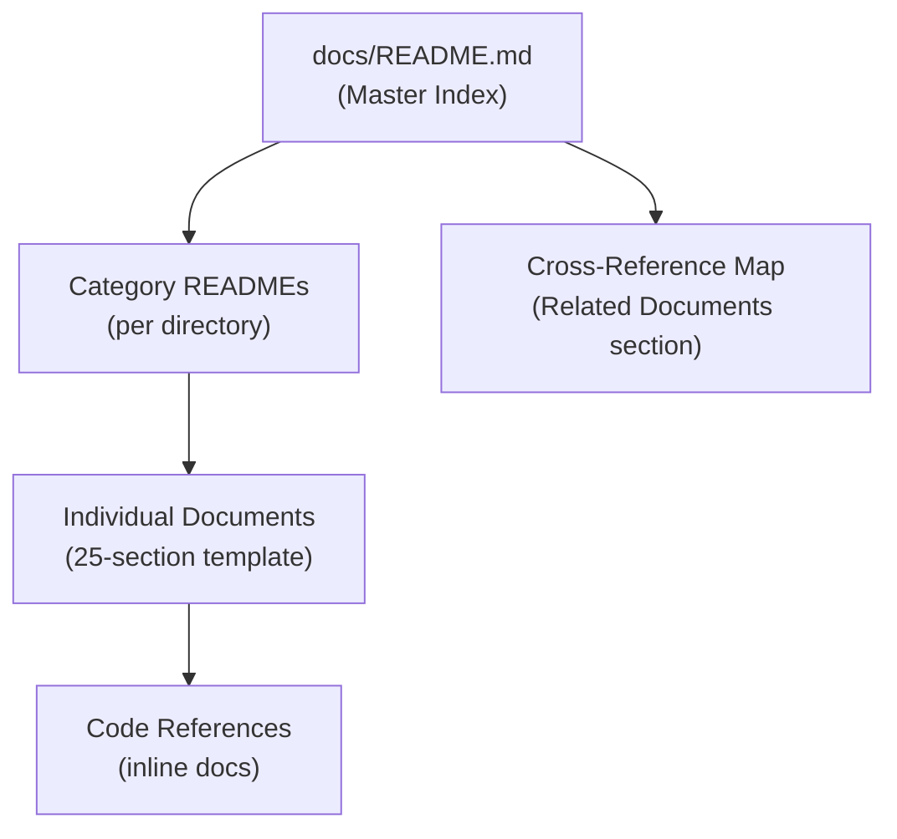
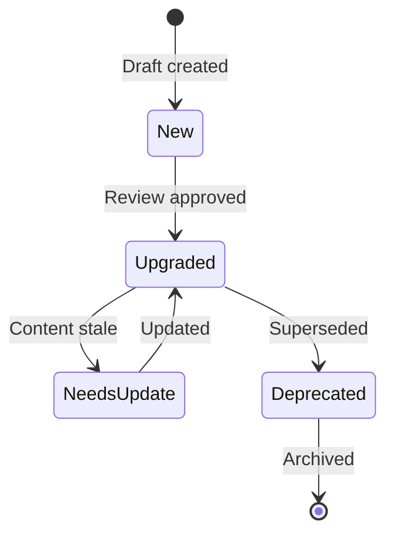

# Documentation Usage Guide

> **Purpose:** Guide for maintaining, extending, and using Vaeloom's documentation
> **Status:** ✅ Published
> **Owner:** Platform Team
> **Version:** 2.0
> **Last Updated:** 2026-07-17

## Documentation Architecture



## File Naming Convention

| Pattern | Example | Applies To |
|---|---|---|
| `Pascal-Case.md` | `System-Design.md` | All documentation files |
| `README.md` | `README.md` | Directory index files |
| `kebab-case.ext` | `prometheus.yml` | Configuration files |
| `snake_case.ext` | `openapi_spec.yaml` | API specification files |

## Header Metadata

Every document MUST have this header block:

```markdown
> **Purpose:** One-sentence description
> **Status:** 🆕 New | ✅ Upgraded | 🔄 Needs Update | 🗄️ Deprecated
> **Owner:** [Team Name]
> **Version:** 1.0
> **Last Updated:** YYYY-MM-DD
> **Dependencies:** [comma-separated related docs]
> **Implementation Status:** 📋 Spec Only | 🔨 In Progress | ✅ Shipped
> **Review Checklist:** Standard | Security | Compliance
> **Canonical source:** [relative path or N/A]
```

## Required Sections Per Document Type

| Doc Type | Minimum Sections |
|---|---|
| Architecture/Design | 1-20, 22-25 (full template) |
| Product/Strategy | 1-4, 7, 9, 22, 24, 25 |
| Security | 1-2, 7, 14, 15, 17, 18, 22, 23, 24 |
| DevOps/Infrastructure | 1-2, 7, 8, 15-20, 22-25 |
| Testing/QA | 1-2, 7, 9, 15-18, 22-25 |
| Developer Experience | 1-2, 9, 12, 17, 21-25 |
| AI | 1-2, 7-11, 14-18, 22-25 |
| Operations/Runbooks | 1-2, 7, 9, 15-19, 22-25 |

## Cross-Referencing Rules

1. Use relative paths: `../Architecture/System-Design.md`
2. All Related Documents sections must use bullet lists
3. Reference canonical docs, not duplicates
4. External references: use full URLs

## Document Lifecycle



## Maintenance Schedule

| Task | Frequency | Owner |
|---|---|---|
| Link check | Weekly | CI Pipeline |
| Stale content audit | Monthly | Doc Owners |
| Full review cycle | Quarterly | Platform Team |
| Template updates | As needed | Platform Team |
