[What Is It](#intro)
[How It Works](#how-it-works)
[Architecture](#architecture)
[Agent Orchestration](#orchestration)
[Memory](#memory)
[Implementation](#implementation)
[Roadmap](#roadmap)

Vaeloom · Visual Overview

| Metadata         | Value                                                                |
|------------------|----------------------------------------------------------------------|
| **Purpose**      | Visual overview of Vaeloom — what it is, how it works, and how we build it |
| **Status**       | Living document |
| **Owner**        | Product Team |
| **Last Updated** | 2026-07-13 |

## Overview

Vaeloom connects to the places you already keep your stuff — email, Drive, GitHub, a laptop folder — reads what's there, organizes it without being asked, and remembers it permanently. That memory powers agents that keep your resume current, track deadlines, and search for and apply to jobs with your approval. This is a visual-first walkthrough covering the problem, architecture, agent orchestration, memory system, implementation plan, and roadmap.

## Goals

- Provide a visual-first walkthrough of the Vaeloom system
- Explain the problem, architecture, agent orchestration, and memory system in an accessible way
- Communicate the implementation plan and roadmap visually
- Serve as a high-level overview for stakeholders, new team members, and investors

## Scope

### In Scope

- Visual walkthrough of the core problem and product solution
- Six-layer system architecture diagram and explanation
- Agent orchestration flow with permission boundaries
- Memory system overview (six types, knowledge graph, vector store)
- Implementation plan phases and roadmap timeline

### Out of Scope

- Detailed backend service specifications (in Backend/ docs)
- API reference and code-level documentation
- Security threat models and compliance documentation
- Per-component implementation details

# A second brain for your education and career {#intro}

Vaeloom connects to the places you already keep your stuff — email, Drive, GitHub, a laptop folder — reads what's there, organizes it without being asked, and remembers it permanently. That memory powers agents that keep your resume current, track deadlines, and search for and apply to jobs with your approval.

THE PROBLEM

## Everything's scattered {#architecture}

Resumes, certificates, emails, code — spread across a dozen tools, none of which know about the others. Rebuilding the picture by hand is work nobody has time for.

WHAT IT IS

### A memory system, not a chatbot {#orchestration}

Chat is one view into it. The real product is a continuously updated, structured memory of who you are and what you've done — everything else is built on top.

WHO IT'S FOR

### Students first, then anyone building a career {#implementation}

Students are the sharpest pain point — then job seekers, early-career professionals, researchers, developers, and eventually institutions.

WHAT'S DIFFERENT

### One brain, many views {#roadmap}

Resume, job matches, reminders — all generated from the same memory. Every feature makes every other feature smarter, because they all read and write the same brain.

How It Works

## One continuous loop, start to finish

Every one of these stages writes into the same memory — that's what makes stage 9 smarter every time stages 1–8 run again.

1

ONBOARDING

### Sign up → workspace provisioned

A clean, empty memory namespace is created. Nothing is pre-populated — Vaeloom builds understanding from what you actually connect and upload, not assumptions.

2

CONNECT

#### Connect accounts — each one scoped

Gmail, GitHub, Drive, a local folder, VS Code. Each connection is a separate, explicit, read-only-by-default grant — never one "connect everything" switch.

3

INGEST

#### Upload / sync files

Direct upload, connector sync, or a watched local folder. Every new or changed file enters the same ingestion pipeline.

4

AI PROCESSING

#### Parse → OCR → extract

Document parsing, OCR for scanned certificates, code understanding for repos, semantic extraction for everything — the raw file becomes structured, meaningful content.

5

MEMORY + KNOWLEDGE GRAPH

#### Entities extracted, linked, remembered

Skills, projects, organizations, dates — extracted, deduplicated, and connected into the knowledge graph. This is the moment a file stops being "a file" and becomes part of what Vaeloom knows about you.

6

AGENTS ACTIVATE

#### Specialist agents read the new memory

Organization, Resume, ATS, Job Search, Gmail, Scheduler — each reads what's relevant to it and proposes an update, a suggestion, or a match.

7

AUTOMATION + DASHBOARD

#### It runs without being asked {#how-it-works}

Scheduled Gmail passes, deadline extraction, proactive suggestions — all surfaced on one Dashboard, so your active time is spent approving, not maintaining.

8

CAREER INTELLIGENCE

#### Resume → job search → tailored applications

The always-current resume feeds ATS scoring, which feeds ranked job matches, which — after your approval — become tailored, submitted applications.

9

COMPOUNDING

#### The outcome feeds back into memory

An interview, a rejection, a correction you made — all of it is written back. The next loop through stages 1–8 starts from a slightly smarter memory than the last one.

System Architecture

## Eight layers, one spine of memory

Every layer exists to feed the one at the center. Interfaces and connectors bring data in; agents act on it; everything that happens gets written back to memory — which is what every layer above ultimately reads from.

01

### Interface

Where you actually touch the product.

Web AppPrimary surface, all screens

Desktop CompanionScoped local-folder access

VS Code ExtensionWorkspace + git activity

MobileNotifications, quick capture

02

### Connectors & Plugins

Scoped, OAuth-based — read-only until you grant more.

Gmail · GitHub · DriveOfficial OAuth, scoped tokens

Local FolderOne directory, not full disk

Plugin SDK / MCPThird-party tools, same shape

03

### Ingestion Engine

Turns raw files into something agents can reason about.

Document Parser + OCRPDF, DOCX, images, scans

Code UnderstandingRepo structure, README

Semantic ExtractorEntities, relationships

04

### Agent Orchestration

Specialized agents, each scoped to one job — full detail in the next section.

OrchestratorRoutes every request

7 specialist agentsOrganization, Resume, ATS, Job Search”¦

05

### Memory & Knowledge — CORE

Everything above reads from and writes to this layer. This is the actual product.

Knowledge GraphEntities + relationships

Vector StoreSemantic embeddings

Agentic RAGHybrid retrieval + re-ranking

06

### Events & Realtime

Decouples "something happened" from "who needs to know."

Event BusEvery agent action publishes an event

NotificationsDigests, reminders, alerts

07

### Data Infrastructure

Keeps interactive requests fast while bulk work happens in the background.

Queues + WorkersIngestion never blocks the app

CacheInvalidated on memory-write, never stale

08

### Storage & Security

The floor every other layer stands on.

Encrypted StorageDocuments & memory at rest

Permission EngineEvery request, checked

Audit LogEvery action, reversible

Agent Orchestration

## One router, eight specialists

Nothing calls another agent directly. Every request — from you or from a schedule — goes through the Orchestrator, which routes it to the right specialist and enforces permissions on the way.

```mermaid
graph TD
    O["🧠 Orchestrator<br/>Routes every request"]

    OA["📁 Organization Agent<br/>Names & files documents"]
    MA["🧬 Memory Agent<br/>Extracts & merges into the graph"]
    RA["📄 Resume Agent<br/>Maintains the master resume"]
    ATS["📊 ATS Agent<br/>Scores fit vs. job description"]
    JS["🔍 Job Search Agent<br/>Finds & ranks opportunities"]
    APP["📤 Application Agent<br/>Tailors & submits, with approval"]
    GA["✉️ Gmail Agent<br/>Classifies mail, deadlines"]
    SA["📅 Scheduler Agent<br/>Deadlines & conflict checks"]

    O --> OA
    O --> MA
    O --> RA
    O --> ATS
    O --> JS
    O --> APP
    O --> GA
    O --> SA

    OA -->|Write| MEM["💾 Memory Layer"]
    MA -->|Read/Write| MEM
    RA -->|Read| MEM
    JS -->|Read| MEM
    APP -->|Read/Write| MEM
    GA -->|Write| MEM
    SA -->|Read| MEM

    classDef orchestrator fill:#e3f2fd,stroke:#1565c0,stroke-width:3px,rx:10px
    classDef agent fill:#e8f5e9,stroke:#2e7d32,stroke-width:2px,rx:8px
    classDef memory fill:#fff3e0,stroke:#e65100,stroke-width:3px,rx:8px

    class O orchestrator
    class OA,MA,RA,ATS,JS,APP,GA,SA agent
    class MEM memory
```



Agent Workflow — A Real Sequence

## One file in, one application out

A student drags **Resume\_draft\_v3.pdf** into Vaeloom, then later asks: "find me backend internships." This is everything that happens between those two moments.

1

ORGANIZATION AGENT

### Reads, names, files it

Recognizes it as a resume, detects it's a newer version of an existing one, proposes a rename and a move — shown as a diff, nothing applied silently.

2

MEMORY AGENT

#### Extracts & merges into the graph

Pulls out skills, projects, education, dates. Merges "React" and "React.js" into one node. Links the new project to the skills it used.

3

RESUME AGENT

#### Updates the master resume

Folds new content in. Notices no GPA is recorded anywhere and asks one specific question instead of guessing.

4

JOB SEARCH AGENT

#### Searches, ranks, shortlists

Searches connected platforms, ranks against the skill graph, filters out roles already rejected before, returns a ranked shortlist of 8 with a fit reason for each.

5

ATS AGENT

#### Scores fit per role

78% match, missing keywords "Docker," "system design," two specific resume edits suggested — never applied automatically.

6

YOUR APPROVAL

#### You pick 3 of the 8

Nothing leaves the system until this point. You choose which roles to actually apply to.

7

APPLICATION AGENT

#### Tailors and submits — or hands off

Where the platform has an official API, applies directly. Where it doesn't, deep-links you to the listing with documents ready to attach.

8

MEMORY AGENT

#### The outcome feeds the next loop

Interview, rejection, silence — whatever happens gets logged. Next time roles are ranked, this outcome is part of what's read.

<a id="memory"></a>

Memory System

## One graph, six kinds of memory

Every agent reads from and writes to the same underlying graph — this is what makes the resume, the job search, and the chat all feel like they "know" the same person.

Knowledge
Graph

the second brain

Profile
Memory

education, skills, certifications

Document
Memory

per-file summary & embedding

Career
Memory

applications, outcomes

Episodic
Memory

timestamped events

Preference
Memory

inferred & stated patterns

Working
Memory

current session context

Read path

### Agentic RAG retrieval

When an agent needs context, it doesn't run one fixed search — it picks a strategy for the question in front of it.

Query from an agent

↓

Hybrid search — vector + keyword + graph traversal

↓

Re-rank by relevance, recency, confidence

↓

Assembled context returned to agent

Write path

### How memory gets updated

Every agent action is a potential memory update — no manual linking required, ever.

New info from any agent

↓

Extract entities & facts

↓

Dedup / merge against existing nodes

↓

Write to graph + vector store, consolidate over time

Creation

→

Retrieval

→

Evolution

→

Consolidation

→

Permanence

How We're Going To Build It

## Seven phases, nothing to enterprise until the core loop is proven

Each phase has one exit criterion before the next begins. Multi-tenancy and the plugin ecosystem are deliberately last — not first.

00

### Infrastructure & Scaffolding

Deployable skeleton — auth, empty services, CI pipeline — before any feature work begins.

Complexity: SMilestone: sign up → empty workspace

01

#### Ingestion & Memory Foundation

File upload → parse → extract → queryable memory record. The whole product depends on this being right.

Complexity: LMilestone: correct entities extracted from a real resume

02

#### Organization Agent & Workspace

The user-facing file organization experience — naming, foldering, approval flow, archive.

Complexity: MMilestone: >90% proposal approval rate

03

#### Resume & ATS

The first "wow" feature — a resume that writes itself, plus ATS scoring against a job description.

Complexity: MMilestone: tailored variant in under a minute

04

#### Career Intelligence

Job/internship search, ranking, and tailored, approval-gated applications.

Complexity: LMilestone: query to submitted application in one session

05

#### Communication & Time

Gmail Agent (scheduled + push hook) and Scheduler Agent — closing the loop on time-sensitive info.

Complexity: MMilestone: urgent mail surfaces within minutes

06

#### Polish, Autonomy, Dashboard, Settings

The trust-building layer — Dashboard, audit log, per-agent autonomy settings, data export/delete.

Complexity: MMilestone: public MVP launch

07

#### Enterprise — POST-MVP

Multi-tenancy, the consent model, SSO, Admin console, Plugin SDK + MCP ecosystem, Marketplace.

Complexity: LMilestone: verified tenant isolation

Deployment Architecture

## How the pieces actually run

Background workers (ingestion, scheduled agent passes) run as separate processes from the request-serving API — a large connector sync never competes with an interactive chat request.

CDN / Load Balancer

↓

Web App (Next.js)

Core API (NestJS)

↓

AI Service (FastAPI)

Redis (queue + cache)

Postgres (+ graph + vector)

↓

Model Provider (Claude API)

### Tech stack, by layer

FrontendReact · Next.js · Tailwind · TanStack Query

Core APINode.js · TypeScript · NestJS

AI / AgentsPython · FastAPI · Claude API

RelationalPostgreSQL

GraphApache AGE → Neo4j at scale

Vectorpgvector → Qdrant at scale

SearchMeilisearch → OpenSearch at scale

Queue / CacheRedis + BullMQ → Kafka at scale

DeployPaaS → Kubernetes at scale

ObservabilityOpenTelemetry + hosted APM

Roadmap

## Where this goes from here

Each stage's exit criterion is what earns the next one — nothing here is a fixed calendar date.

Now

### MVP

Ingestion, Organization Agent, 6-type memory, Resume + ATS, Job Search + Applications, Gmail + Scheduler. Suggest-mode everywhere.

Next

#### v1.5

Earned autonomy rollout per agent, feedback-loop learning from corrections, deep-link apply flow polish.

Then

#### V2

Full 20-type memory taxonomy, Reflection Agent, Memory Graph explorer, Global Search, in-app document chat.

Then

#### V3

Full 28-agent roster, Self-Improvement Agent, Analytics, a richer connector catalog.

Enterprise

#### Multi-tenant

The consent model, SSO/RBAC, Admin console, Plugin SDK + MCP ecosystem, Marketplace.

Future

#### The long game

Personal Digital Twin, Autonomous Career Manager, AI Mentor, Life Timeline Intelligence, Personal AI APIs.

Vaeloom · VISUAL OVERVIEW · WHAT IT IS, HOW IT WORKS, HOW WE BUILD IT

---

## Examples

### Launch the visual walkthrough

```bash
Vaeloom tutorial start
```

### View the architecture diagram

```bash
Vaeloom tutorial show --section architecture
```

### Step through the agent workflow

```bash
Vaeloom tutorial step --module "resume-to-application"
```

### Export visuals as a PDF

```bash
Vaeloom tutorial export --format pdf --output walkthrough.pdf
```

## Future Improvements

- **Animated flow diagrams** — convert static Mermaid diagrams to animated step-through walkthroughs
- **Interactive prototype links** — embed clickable prototype hotspots for each major screen
- **Video narration** — add narrated screencast for each visual section
- **PDF export** — generate a downloadable PDF version of the visual overview
- **Localized versions** — translate visual content for international student audiences

---

## Related Documents

| Document | Description |
|----------|-------------|
| [Complete Documentation](Vaeloom-Complete-Documentation.md) | Full linear product and engineering reference |
| [MVP Product Spec](01-Vaeloom-MVP-Spec.md) | v1/MVP product scope |
| [System Architecture](02-system-architecture.md) | Six-layer architecture diagram |
| [Memory & Knowledge Graph](04-memory-knowledge-graph.md) | Memory system visual breakdown |
