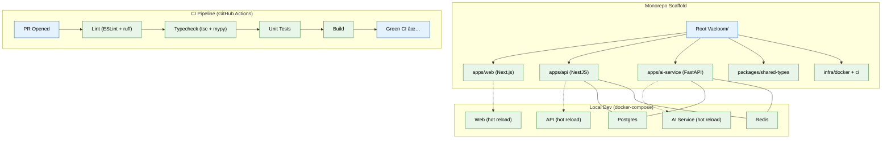

# 01 — Foundation & Infrastructure Scaffolding (MVP)



## Context
Read `00-master-build-order.md` first. This is the first build phase — the deployable skeleton every later phase builds on top of. No feature logic yet.

## Objective
Stand up a working, deployable, empty version of Vaeloom: three services that boot, talk to each other, pass CI, and let a user sign up and see a blank workspace.

## Requirements

**Monorepo structure** (create exactly this layout):
```
Vaeloom/
├── apps/
│   ├── web/            # Next.js 14+, TypeScript, App Router, Tailwind CSS
│   ├── api/             # NestJS, TypeScript
│   └── ai-service/      # FastAPI, Python 3.11+
├── packages/
│   └── shared-types/    # types shared between web and api
├── infra/
│   ├── docker/          # Dockerfiles per service
│   └── ci/
└── docker-compose.yml   # Postgres, Redis, all three services, for local dev
```

**apps/api (NestJS):**
- Health-check endpoint (`GET /health`) returning service status.
- Auth module: email/password signup + login to start (bcrypt-hashed passwords), structured so an OAuth/SSO provider can be swapped in later (file 15) without changing the interface.
- Auth middleware/guard usable by every future endpoint.
- `POST /workspaces` — provisions a new, empty workspace for the authenticated user (see file 02 for the table this writes to).

**apps/ai-service (FastAPI):**
- Health-check endpoint.
- Empty `orchestrator/` and `agents/` folders with a `README.md` stub explaining they're populated in file 05.

**apps/web (Next.js):**
- Signup and login pages, calling the api service.
- An empty, authenticated Dashboard route that renders "Workspace ready" once a workspace exists — this is the placeholder file 14 replaces.

**CI (`infra/ci/`, GitHub Actions):**
- On every PR: lint (ESLint + Python ruff/flake8), typecheck (`tsc --noEmit`, `mypy`), unit tests, build, for all three apps.
- Must be green before any later phase's PR merges.

**Local dev:**
- `docker-compose.yml` bringing up Postgres, Redis, and all three apps with hot reload.
- `.env.example` at the repo root documenting every required variable (DB URL, Redis URL, JWT secret, etc.) — no service should require an undocumented env var to boot.

## Out of scope
Real OAuth/SSO providers (file 15 stub only), any AI/agent logic (file 05+), any memory or ingestion logic (files 02–04), production deployment (file 16 — this phase is local + CI only).

## Acceptance criteria
- [ ] `docker-compose up` boots all services with no manual steps beyond copying `.env.example` to `.env`.
- [ ] A new user can sign up, log in, and see an empty, correctly-provisioned workspace.
- [ ] CI is green on a fresh PR with no changes.
- [ ] `packages/shared-types` is imported by both `web` and `api` with no type duplication between them.

## Common Mistakes

| Mistake | Consequence |
|---------|-------------|
| Hardcoding env vars instead of using `.env.example` | Production secrets leak or dev environment becomes non-portable |
| Skipping Dockerfile optimization | Slow cold starts and large images waste CI/dev time |
| Monorepo misconfiguration (workspace hoisting issues) | Broken imports and duplicate dependency versions across packages |

## Best Practices

| Practice | Why |
|----------|-----|
| Keep `.env.example` in sync with every new dependency | Prevents "works on my machine" issues across the team |
| Use `tsc --noEmit` in CI, not just in editor | Catches type errors that IDE extensions might miss |
| Test `docker-compose up --build` from clean checkout before merging | Ensures new dependencies are properly wired into the compose file |

## Security Considerations

| Concern | Mitigation |
|---------|------------|
| JWT secret stored in env without rotation guidance | Document rotation procedure in `.env.example`; use keystore in staging/prod |
| Auth scaffold could allow weak passwords | Enforce minimum password complexity from day one (not as a later patch) |
| Exposed health endpoints in production | Restrict `/health` to internal network or add auth for production deployments |

## Performance Considerations

| Concern | Approach |
|---------|----------|
| Monorepo build times grow with each new service | Use Turborepo or Nx for build caching from the start |
| Hot reload on three concurrent services consumes significant memory | Set explicit Node memory limits in docker-compose |
