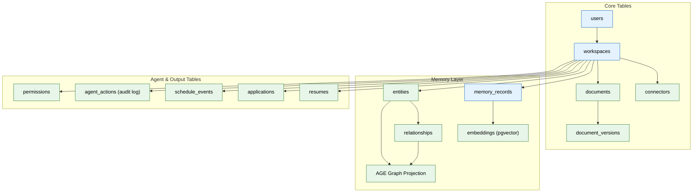

# 02 — Database & Schema Design (MVP)

## Context
Read `01-foundation-infra.md` first — this assumes Postgres is already running via docker-compose. This phase implements the full relational schema every later phase reads from and writes to.

## Objective
Implement the complete MVP relational schema in Postgres, with migrations, seed data, and indexes — the durable source of truth for every other system in this project.

## Requirements

**Migration tool:** use Prisma (TypeScript) for type-safe schema access from `apps/api`, with raw SQL migrations mirrored for `apps/ai-service` (Python) to consume via SQLAlchemy — pick whichever ORM pairing you're most confident keeping in sync; the requirement is that both services see an identical schema, never two drifted copies.

**Tables to create** (exact columns, not illustrative):

- `users(id, email, password_hash, auth_provider, created_at)`
- `workspaces(id, user_id, created_at)`
- `connectors(id, workspace_id, type, scopes text[], status, token_ref, last_synced_at)`
- `documents(id, workspace_id, source_connector_id, path, type, raw_storage_key, summary, created_at, updated_at)`
- `document_versions(id, document_id, version_number, storage_key, superseded_by, created_at)`
- `memory_records(id, workspace_id, type, content jsonb, confidence float, importance float, freshness_at timestamptz, source_document_id, created_at, updated_at)`
- `entities(id, workspace_id, type, canonical_name, aliases text[], embedding_id)`
- `relationships(id, workspace_id, from_entity_id, to_entity_id, relation_type, confidence float, source_memory_id)`
- `resumes(id, workspace_id, variant_type, content jsonb, version int, generated_from_snapshot, created_at)`
- `applications(id, workspace_id, job_external_id, platform, status, resume_version_id, cover_letter, submitted_at, outcome, outcome_at)`
- `schedule_events(id, workspace_id, source, title, date, type, conflict_flag boolean)`
- `agent_actions(id, workspace_id, agent_name, action_type, input_ref, output_ref, status, created_at)` — this is the audit log
- `permissions(id, workspace_id, connector_id, agent_name, action_type, scope, granted_at, revoked_at)`

**Memory type enum** (used in `memory_records.type`, MVP set only — enterprise adds 14 more): `profile`, `document`, `career`, `episodic`, `preference`, `working`.

**Indexes (required, not optional):**
- `workspace_id` on every table.
- Composite `(type, workspace_id)` on `memory_records`.
- `(workspace_id, created_at)` on `agent_actions` for time-range audit queries.
- `(source_connector_id)` on `documents` for connector-scoped resync.

**Vector storage:** enable the `pgvector` extension; add an `embeddings` table: `id, workspace_id, source_type, source_id, vector, model_version, created_at`.

**Graph storage:** enable Apache AGE (Postgres extension) for the MVP graph layer — do not stand up a separate Neo4j instance yet (that's an enterprise-phase upgrade). Nodes/edges in AGE should mirror `entities`/`relationships` as a query-optimized projection, not a second source of truth — `entities`/`relationships` in plain Postgres remain canonical.

**Seed script:** a `seed.ts`/`seed.py` that creates one demo workspace with a handful of sample entities and a sample document, for local development and manual QA.

## Out of scope
Any actual write logic from agents (file 04 populates this schema for real), read replicas / partitioning (enterprise upgrade), a dedicated vector DB migration (enterprise upgrade).

## Acceptance criteria
- [ ] `prisma migrate dev` (or equivalent) runs cleanly from an empty database.
- [ ] Both `apps/api` and `apps/ai-service` can read/write the same tables with no schema drift.
- [ ] Seed script produces a workspace with queryable sample data.
- [ ] A `pgvector` similarity query against the seeded `embeddings` table returns results.
- [ ] An AGE graph query traversing seeded `entities`/`relationships` returns the expected path.

## Common Mistakes

| Mistake | Consequence |
|---------|-------------|
| Schema drift between Prisma (TS) and SQLAlchemy (Python) | Both services see different columns, causing silent data corruption |
| Forgetting indexes on foreign keys | JOIN-heavy queries degrade as row counts grow |
| Not using transactional DDL for migrations | Partial migration failure leaves the schema in an inconsistent state |

## Best Practices

| Practice | Why |
|----------|-----|
| Run both ORMs' migration checks in CI | Catches drift before it reaches staging |
| Always add `ON DELETE CASCADE` or explicit cleanup logic | Prevents orphaned rows when a parent workspace is deleted |
| Name indexes explicitly with a convention (`idx_tablename_column`) | Makes `EXPLAIN ANALYZE` output readable and index management predictable |

## Security Considerations

| Concern | Mitigation |
|---------|------------|
| Raw SQL in migrations could expose injection paths | Parameterize all raw migration queries; prefer ORM-generated SQL where possible |
| Embedding vectors contain semantic content, not just IDs | Apply same workspace-scoped access control to `embeddings` as to primary tables |
| AGE graph extension adds an attack surface | Restrict AGE function execution to the ai-service database user; never expose to API layer |

## Performance Considerations

| Concern | Approach |
|---------|----------|
| pgvector index build time grows with embedding count | Use IVFFlat index with a reasonable `lists` parameter for MVP; plan HNSW for enterprise |
| Composite indexes can become stale | Monitor query plans via `pg_stat_statements`; rebuild indexes during low-usage windows |
| Graph queries via AGE can be slower than relational for simple traversals | Keep canonical data in plain Postgres; use AGE only for multi-hop path queries |
