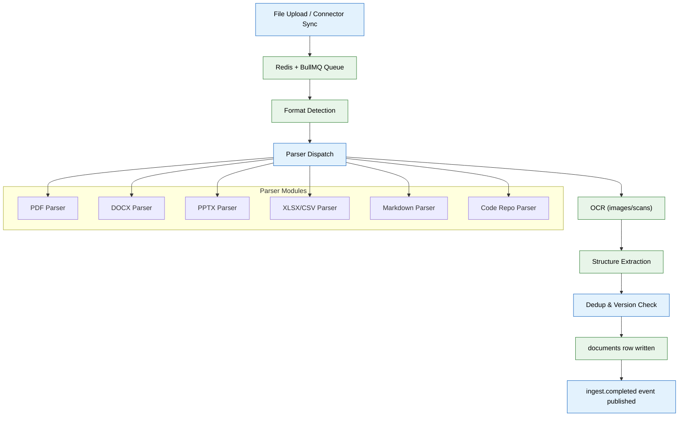

# 03 — Ingestion Pipeline (MVP)



## Context
Read `02-database-schema.md` first. This phase turns an uploaded or synced file into a parsed, structured record ready for the Memory Agent (file 04) to extract from. It does not do entity extraction itself — it stops at "parsed and stored," file 04 picks up from there.

## Objective
Build a queue-driven ingestion pipeline: a file goes in (upload or connector sync), a parsed `documents` row comes out, without blocking the interactive app.

## Requirements

**Queue:** Redis + BullMQ. File uploads and connector syncs enqueue an `ingest` job; a worker process (separate from the API's request-handling process) consumes it.

**Parsers (one module per type, in `apps/ai-service/ingestion/parsers/`):**
- PDF, DOCX, PPTX, XLSX/CSV, Markdown, plain text — extract both structure (headings, tables) and text content.
- Images/scans — OCR with a confidence score attached to the extraction; anything below a defined threshold (e.g. 0.75) is stored but flagged `needs_review: true` in the document's metadata rather than trusted silently.
- Code repositories (from the GitHub connector, file 07) — extract structure (languages, dependency graph, README, commit history shape) into a semantic summary; do not store full source verbatim in `documents.summary`.
- Spreadsheets — infer what the sheet *is* (grade tracker, budget, project plan) from headers/structure before summarizing, don't just dump cell contents.

**Dedup & versioning:** before creating a new `documents` row, check for an existing document at a similar path/content (content-hash + filename similarity). If found, create a `document_versions` row linking to the prior version instead of a wholly new document.

**Pipeline stages** (implement as a sequence, each stage's output feeding the next):
```
Source → format detection → parser dispatch → OCR (if needed) → structure extraction
   → dedup/version check → documents row written → ingest.completed event published
```

**Test fixtures:** create `apps/ai-service/ingestion/fixtures/` with at least one real sample of each supported type (a sample resume PDF, a scanned certificate image, a small code repo, a spreadsheet) and golden-output JSON for each, used in the test suite below.

## Out of scope
Entity/relationship extraction, embeddings, knowledge graph writes (all file 04). Organization Agent naming/foldering proposals (file 08). Any UI for uploading (file 14).

## Acceptance criteria
- [ ] Each parser has a golden-file test against its fixture, asserting correct structure extraction.
- [ ] A large batch upload does not block a concurrent, unrelated API request (verified with a load test enqueuing 50 jobs while hitting `/health`).
- [ ] OCR confidence scoring works — a deliberately blurry test image is flagged `needs_review: true`.
- [ ] Uploading a near-duplicate of an already-ingested file creates a `document_versions` row, not a duplicate `documents` row.
- [ ] `ingest.completed` events are published and observable (even if nothing subscribes yet — file 04 is the first real subscriber).

## Common Mistakes

| Mistake | Consequence |
|---------|-------------|
| Blocking the API request thread during document parsing | UI freezes for all users while a single large file processes |
| Not setting parser timeouts | A malformed PDF or infinite-scan image hangs the worker indefinitely |
| Ignoring OCR confidence threshold | Garbage text from a blurry scan silently populates the knowledge graph |

## Best Practices

| Practice | Why |
|----------|-----|
| Always queue ingestion jobs, never process inline | Keeps API response times predictable regardless of file size |
| Store golden fixtures and expected outputs alongside parsers | Makes regression detection automatic when parser logic changes |
| Version parser output format in document metadata | Allows smooth migration when parser improvements change output shape |

## Security Considerations

| Concern | Mitigation |
|---------|------------|
| Maliciously crafted PDFs could exploit parser libraries | Run parsers in a sandboxed subprocess with restricted filesystem access |
| Uploaded files may contain hidden macros or scripts | Scan for executable content in Office documents; strip macros before parsing |
| Queue job payloads could leak content | Never include full document body in job payloads — reference by storage key instead |

## Performance Considerations

| Concern | Approach |
|---------|----------|
| Large OCR jobs consume CPU for extended periods | Limit concurrent OCR workers to 1–2 per instance; scale horizontally |
| Dedup content-hash comparison on every upload is expensive | Cache recent hashes in Redis; batch-compute only for new (uncached) documents |
| BullMQ job backlog can grow during connector bulk sync | Implement priority queuing: user uploads > scheduled syncs |
