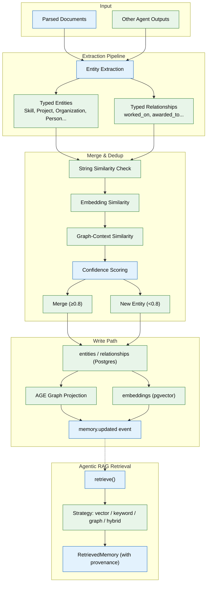

# 04 — Memory System (MVP)
### The memory prompt. This is the core of the product — take more care here than anywhere else.



## Context
Read `03-ingestion-pipeline.md` first. Ingestion produces parsed `documents`; this phase turns that into structured, queryable memory. Every other agent (file 08) reads from and writes to what you build here. If this is shallow or wrong, everything built on top of it is shallow or wrong too.

## Objective
Build the Memory Agent: the internal agent that extracts entities and relationships from every parsed document (and, later, every other agent's output), merges them correctly against existing memory, and writes to the knowledge graph and vector store — plus the agentic RAG retrieval layer other agents use to read it back.

## Memory types (MVP — six, not the full enterprise taxonomy)
Implement exactly these, matching the `memory_records.type` enum from file 02: `profile` (stable facts — education, skills, certifications), `document` (per-file summary + embedding), `career` (applications, outcomes), `episodic` (timestamped events), `preference` (inferred/stated patterns), `working` (current session context — the only type cleared per session; everything else is permanent unless explicitly deleted).

## Requirements

**Extraction (`apps/ai-service/agents/memory_agent/extraction.py`):**
- Input: a parsed `documents` row (or any other agent's output — this module is called by more than just ingestion, design the interface accordingly: `extract(content: str, source_type: str, source_id: str, workspace_id: str) -> ExtractedFacts`).
- Output: candidate entities (typed: `Skill`, `Project`, `Organization`, `Person`, `Certificate`, `Event`, `Job`, `Course`, `Publication`) and candidate typed relationships (`worked_on`, `awarded_to`, `requires_skill`, `applied_to`, `mentored_by`) between them, each with an initial confidence score based on source clarity.
- Use structured output (JSON schema-constrained generation), not free-form text parsing — precision matters more than fluency here.

**Merge & dedup (`apps/ai-service/agents/memory_agent/merge.py`):**
- Before writing a candidate entity, check for an existing match using a combination of: string similarity on `canonical_name`/`aliases`, embedding similarity, and graph-context similarity (shared relationships).
- **Critical rule:** if match confidence is below a defined threshold (e.g. 0.8), do NOT merge — create a new, separate entity instead, and log it to a `needs_reflection` queue for the Reflection Agent (enterprise phase) to revisit later. A wrong merge silently corrupts two records; a missed merge is a correctable annoyance. Never trade the former for the latter.
- Write a test suite specifically for this: seed "React" and "React.js" mentions and assert they merge; seed two genuinely different people with the same first name and assert they do NOT merge.

**Write path:**
```
Candidate facts → merge/dedup check → write to entities/relationships (Postgres)
   → mirror into AGE graph projection → generate embedding → write to embeddings table
   → publish memory.updated event
```

**Agentic RAG retrieval (`apps/ai-service/retrieval/`):**
- Expose one function: `retrieve(query: str, workspace_id: str, strategy: Literal["vector","keyword","graph","hybrid"] = "hybrid", limit: int = 10) -> list[RetrievedMemory]`, where each `RetrievedMemory` carries its source provenance (which document/event produced it) — never return a fact without a traceable source.
- `hybrid` (the default) combines vector similarity (pgvector), keyword match (Postgres full-text search is sufficient for MVP — no dedicated search engine yet), and graph traversal (AGE) and re-ranks the combined candidates by relevance, freshness (`freshness_at`), and confidence.
- The calling agent chooses the strategy explicitly when it knows better (e.g. an exact course-code lookup should pass `strategy="keyword"`), and falls back to `hybrid` by default.

**Consolidation (basic MVP version — full Reflection Agent is enterprise-phase):**
- A scheduled job that finds `memory_records` of the same type/entity with overlapping content and merges the lowest-confidence, oldest duplicates into the highest-confidence one, preserving the merged-away record's content in an audit trail rather than deleting it.

## Out of scope
The full 20-type memory taxonomy, the standalone Reflection Agent, memory export/import, a dedicated vector DB or Neo4j migration (all enterprise upgrades — see `enterprise/04-memory-system.md`).

## Acceptance criteria
- [ ] Ingesting three documents that separately mention "React", "React.js", and "ReactJS" in project descriptions results in exactly one `Skill` entity, linked to all three projects.
- [ ] Ingesting documents about two different people who happen to share a first name does NOT merge them.
- [ ] `retrieve("machine learning projects", workspace_id, strategy="hybrid")` returns entities that never contain the literal phrase "machine learning" but are semantically related, ranked above less-relevant literal matches.
- [ ] Every item returned by `retrieve()` includes a traceable `source_document_id` or `source_memory_id`.
- [ ] The consolidation job, run against seeded duplicate-heavy data, reduces record count without losing any distinct fact (verified by comparing pre/post content coverage, not just row count).

## Common Mistakes

| Mistake | Consequence |
|---------|-------------|
| Setting merge confidence threshold too low | Two distinct entities silently merge, corrupting both records |
| Extracting entities without typed relationships | Graph becomes a bag of disconnected nodes, useless for traversal |
| Storing embeddings without a `model_version` column | A future model upgrade silently mixes incompatible vector spaces |

## Best Practices

| Practice | Why |
|----------|-----|
| Always include `source_document_id` on every extracted fact | Enables provenance tracing and audit without re-extraction |
| Use JSON schema-constrained structured output for extraction | Precision matters more than fluency — free-text parsing introduces ambiguity |
| Run the merge/dedup test suite before every extraction pipeline change | Wrong merges are the hardest memory-system bug to detect after data is written |

## Security Considerations

| Concern | Mitigation |
|---------|------------|
| Memory records contain inferred personal data | Apply workspace-scoped access to all memory reads; never allow cross-workspace retrieval |
| Embeddings encode semantic information permanently | Treat embedding vectors as PII-equivalent — apply same export/delete controls |
| Consolidation could accidentally merge cross-entity data | Restrict merge operations to entities within the same workspace only |

## Performance Considerations

| Concern | Approach |
|---------|----------|
| Multi-strategy hybrid retrieval (vector + keyword + graph) has additive latency | Run retrieval strategies in parallel with a timeout, not sequentially |
| Embedding generation for every write is expensive | Batch embedding requests; cache embeddings for unchanged content |
| Graph traversal depth impacts query time | Limit graph traversal to max 3 hops in MVP; index traversal starting nodes |
