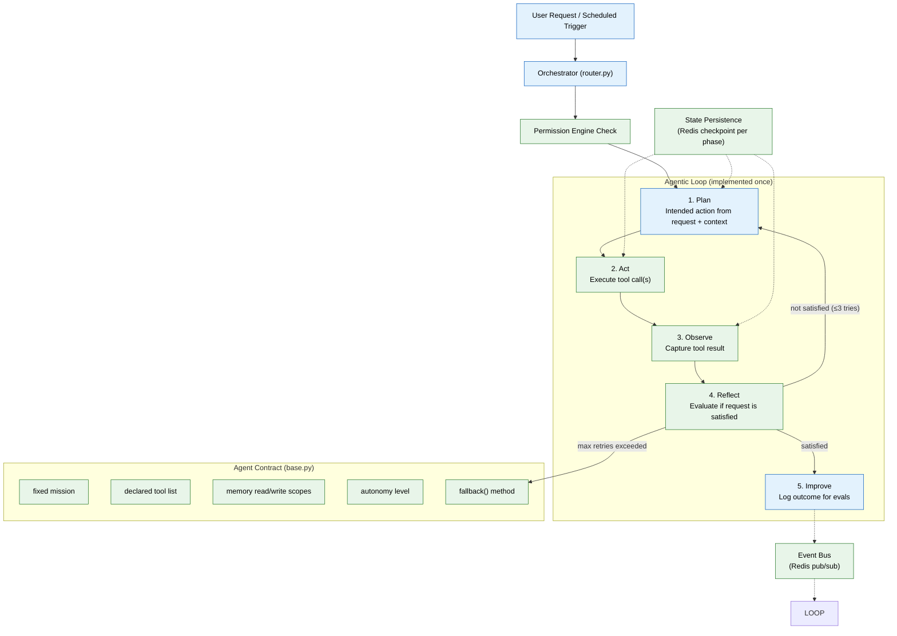

# 05 — Agent Harness & Orchestration (MVP)

## Context
Read `04-memory-system.md` first. This phase builds the shared runtime every specialist agent (file 08) runs inside — the harness is more important than any single agent, since it's what makes twenty-eight future agents auditable instead of twenty-eight bespoke black boxes. Get this right once; every later agent becomes cheap to add.

## Objective
Build the agent harness (the production environment around a model call) and the Orchestrator that routes requests into it. The harness implements one agentic loop, shared by every agent: **Plan → Act → Observe → Reflect → Improve.**

## Harness anatomy — the eight parts, and where each one actually lives
The model is only one component. Everything around it — the harness — is what makes an agent reliable rather than a chatbot with tools bolted on. This project splits the harness into eight named parts; none of them live only in this file, so this table is the map back to where each is actually implemented:

| Harness part | What it does | Where it's built |
|---|---|---|
| Planner | Turns a request + context into an intended action | The "Plan" phase, below |
| Memory | Durable knowledge the agent reads/writes | File 04 |
| State | What's in progress right now, survivable across a failure | New requirement, below |
| Tools | What the agent is allowed to call | File 07 |
| Guardrails | What the agent is not allowed to do | File 11 |
| Evals | Whether the agent is actually any good | File 10 |
| Context | What's assembled and handed to the model for this call | File 06 |
| Execution control | What actually gets to run, and under whose permission | The "Act" phase + Permission Engine (file 13) |

If a future change touches any one of these, update the relevant file above — don't duplicate harness logic into a new location just because it's convenient in the moment.

## Requirements

**Agent contract (`apps/ai-service/agents/base.py`):** every agent is a class implementing:
- `mission: str` — fixed, cannot be overridden at runtime.
- `tools: list[Tool]` — the declared, MCP-shaped tool list (file 07) this agent may call; calling anything outside this list must be impossible, not just discouraged.
- `memory_scopes: MemoryScopes` — explicit read/write permissions per memory type (file 04's types); enforced by the harness, not by the agent's own discipline.
- `default_autonomy: Literal["suggest", "full", "read_only", "approval_gated"]`.
- `fallback() -> Action` — required method defining what the agent does when uncertain (ask the user; never guess).

**The loop (`apps/ai-service/orchestrator/loop.py`):** implement each phase as a distinct, observable step (this maps directly to file 12's tracing requirements):
1. **Plan** — given the request and retrieved context (file 06), the agent produces an intended action.
2. **Act** — the harness executes the planned tool call(s), never the agent directly.
3. **Observe** — the tool result is captured and attached to the agent's context.
4. **Reflect** — the agent (or, for MVP, a simple rule-check) evaluates whether the observed result actually satisfies the original request; if not, loop back to Plan with the new information (bounded — cap at a max of 3 iterations before escalating to the user).
5. **Improve** — the outcome (success/failure/user-correction) is logged in a form the eval framework (file 10) can consume later; MVP just needs the logging hook, not automated improvement yet.

**State persistence (`apps/ai-service/orchestrator/state.py`):** a request's loop state (which phase it's in, what's been planned, what's been observed so far) is checkpointed after every phase to Redis, keyed by a request ID — not held only in an in-memory process variable. If the `ai-service` process crashes or restarts mid-loop, the request resumes from its last completed phase on restart rather than silently vanishing or restarting from Plan with no memory of prior Observe results. This is scoped to single-request resumability within one service instance's lifetime for MVP; durable, cross-session resumability for long-running multi-step plans is an enterprise upgrade (see `enterprise/05-agent-harness-orchestration.md`).

**Orchestrator (`apps/ai-service/orchestrator/router.py`):**
- Single entry point: `handle(request: UserRequest | ScheduledTrigger) -> AgentResponse`.
- Routes to the correct specialist agent based on intent (a lightweight classification call is sufficient for MVP — no need for a complex planner agent yet).
- Every routed call passes through the Permission Engine (file 13) before the target agent's loop begins — no agent-to-agent call bypasses this, including internal ones.
- Every phase of the loop publishes an event (`agent.plan`, `agent.act`, `agent.observe`, etc.) to the event bus (Redis pub/sub is sufficient for MVP; Kafka is an enterprise upgrade) for the observability layer (file 12) to consume.

## Out of scope
The Self-Improvement Agent and formal Quality Assurance Agent gate (both enterprise phase — MVP relies on the "Reflect" step's basic rule-checks and human approval instead), multi-agent negotiated handoffs, subagent context isolation for parallel work (single-threaded loop per request is fine for MVP).

## Acceptance criteria
- [ ] A stub "echo agent" (mission: repeat back what it's told) runs through all five loop phases with each phase individually visible in the logs.
- [ ] Attempting to call a tool not in an agent's declared `tools` list raises an error at the harness level, not just a lint warning.
- [ ] A forced tool failure during "Act" correctly triggers a bounded Reflect→re-Plan cycle, and escalates to the user after 3 failed attempts rather than looping forever.
- [ ] The Orchestrator correctly routes at least three distinct sample requests to three different stub agents based on intent.
- [ ] Killing the `ai-service` process mid-loop (after Observe, before Reflect) and restarting it resumes the request from the checkpointed state rather than restarting from Plan or losing the request entirely.

## Common Mistakes

| Mistake | Consequence |
|---------|-------------|
| Implementing the agentic loop separately per agent | Every agent becomes a unique black box — audit, evals, and guardrails can't be applied uniformly |
| Letting agents call tools outside their declared list | An agent meant for reading memory could accidentally write or delete |
| Skipping state persistence for the loop | A crash mid-operation silently drops the request with no recovery path |

## Best Practices

| Practice | Why |
|----------|-----|
| Make every loop phase observable from day one | File 12's tracing depends on discrete, named phases — retrofitting is harder than building it in |
| Cap the Reflect → re-Plan loop at 3 iterations max | Prevents infinite loops and ensures user escalation happens before timeout |
| Test fallback behavior with a mock "uncertain" agent | The fallback path is the most important safety net — it must work even when the model doesn't |

## Security Considerations

| Concern | Mitigation |
|---------|------------|
| Orchestrator could route to wrong agent if intent classification is poor | Add a confidence threshold; route to a clarifying question if below threshold |
| State checkpoint data in Redis contains agent context | Encrypt Redis data at rest; set TTL on checkpoint keys |
| Agent contract `fallback()` could be left unimplemented | Make `fallback()` an abstract method — the harness must reject any agent that doesn't define it |

## Performance Considerations

| Concern | Approach |
|---------|----------|
| Redis checkpoint writes add latency to every loop phase | Async checkpoint writes (fire-and-forget with retry queue); block only on the Improve phase |
| Per-request single-threaded loop limits throughput | Horizontally scale ai-service instances; each worker handles independent requests |
| Intent classification model call adds latency to every request | Use a lightweight classifier for routing; reserve strong model for the agent's loop body |
