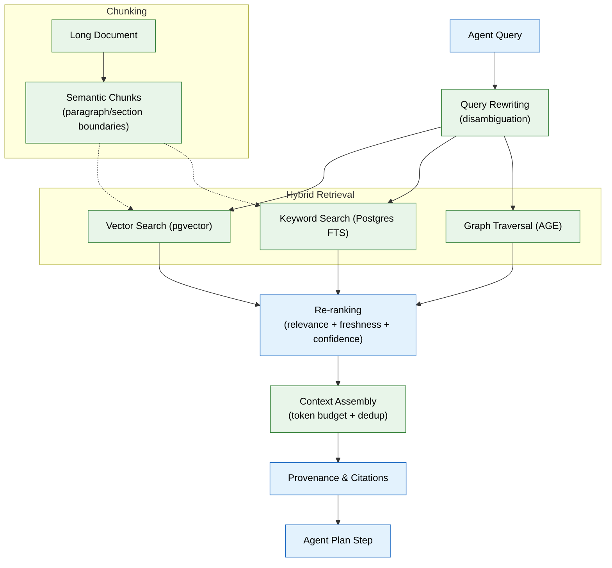

# 06 — RAG & Retrieval (MVP)

## Context
Read `04-memory-system.md` and `05-agent-harness-orchestration.md` first. File 04 already implements the core `retrieve()` function — this phase hardens it into something every agent can depend on for quality, not just correctness, and wires it into the harness's "Plan" step.

## Objective
Make retrieval good enough that agents make correct decisions from it: proper chunking, the right embedding model, real re-ranking, and mandatory citations — not just "a vector search that returns something."

## Requirements

**Chunking (`apps/ai-service/retrieval/chunking.py`):**
- Chunk long documents by semantic boundary (paragraph/section), not fixed character count — a chunk should never split a sentence or a table row.
- Store chunk-to-document mapping so a retrieved chunk always resolves back to its full source document for provenance.

**Embedding model:** pick one embedding model for MVP (state your choice and reasoning in code comments — optimize for retrieval quality and cost, not the largest available model) and record `model_version` on every row in `embeddings` (file 02) so a future model upgrade can re-embed deliberately instead of silently mixing incompatible vector spaces.

**Re-ranking (`apps/ai-service/retrieval/rerank.py`):**
- After hybrid retrieval (file 04) returns candidates, re-rank by a weighted combination of: relevance (similarity score), freshness (`freshness_at`), and confidence (`memory_records.confidence` / `entities` confidence).
- Make the weights configurable per agent — a Job Search Agent query should weight freshness higher than a Profile lookup, for example.

**Context assembly (`apps/ai-service/retrieval/context.py`):**
- Given re-ranked candidates and a token budget (passed by the calling agent), select the most relevant, non-redundant subset that fits — don't just concatenate the top N.
- Every assembled context item retains its provenance pointer through to the final agent output — this is what makes citations possible, not an afterthought bolted onto the response.

**Query rewriting (basic):** if a user's query is ambiguous relative to the workspace's known entities (e.g., "that project" with no clear antecedent), the retrieval layer should attempt one rewrite pass using recent conversation context (`working` memory) before falling back to asking the user.

## Out of scope
Semantic caching, a dedicated vector database (pgvector is sufficient for MVP scale), context compression beyond basic dedup, a standalone Knowledge Graph exploration UI (file 14 covers the basic viewer).

## Acceptance criteria
- [ ] A test document with a table survives chunking without the table being split mid-row.
- [ ] Re-ranking demonstrably changes result order versus raw similarity score alone, on a seeded test case where a fresher, lower-similarity result should outrank a stale, higher-similarity one.
- [ ] Context assembly respects a token budget — a deliberately small budget still returns a coherent, non-truncated-mid-sentence context.
- [ ] Every fact surfaced in an agent's final output (tested via the Resume Agent stub) can be traced back to a specific source document through the citation chain.

## Common Mistakes

| Mistake | Consequence |
|---------|-------------|
| Fixed-character chunking splits sentences or table rows | Retrieved chunks are unreadable or lose semantic meaning |
| Mixing embedding models without tracking `model_version` | Different vector spaces produce meaningless similarity scores |
| Omitting freshness from reranking weights | Stale but highly similar results outrank recent, lower-similarity but more relevant ones |

## Best Practices

| Practice | Why |
|----------|-----|
| Store chunk-to-document mappings | Enables every retrieved chunk to resolve back to its source for full context |
| Make reranking weights configurable per agent | A Job Search Agent needs fresh results; a Profile Agent needs high-confidence ones |
| Always pass a token budget to context assembly | Prevents overflowing the model's context window with redundant candidates |

## Security Considerations

| Concern | Mitigation |
|---------|------------|
| Retrieved context could include cross-workspace data | Filter every retrieval by `workspace_id` at the query layer, not just at presentation |
| Query rewriting could expose user intent to unintended agents | Log rewritten queries and link them to the original; include trace ID in logs |
| Context assembly could inadvertently include PII from aggregated chunks | Run assembled context through the PII detector (file 11) before handing to the agent |

## Performance Considerations

| Concern | Approach |
|---------|----------|
| Hybrid retrieval (3 strategies) is 3x the latency | Run all three strategies in parallel; use the fastest-returning results while waiting for others |
| Re-ranking on every retrieval adds O(n log n) cost | Limit re-rank candidates to top 50 from each strategy before combining |
| Embedding lookup on every retrieval at scale is expensive | Add semantic caching for repeated queries (cache keyed by query embedding hash) |
