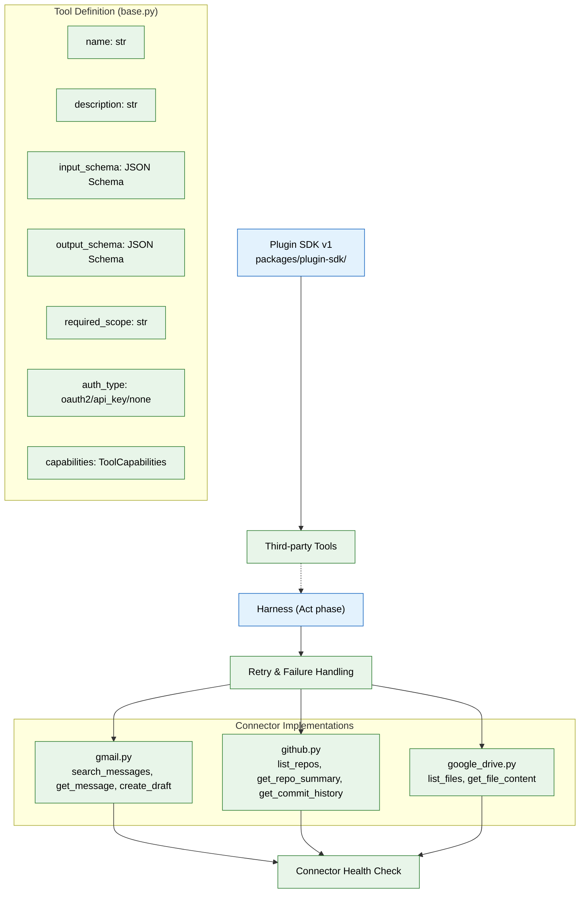

# 07 — MCP & Tool Ecosystem (MVP)



## Context
Read `01-foundation-infra.md` and `05-agent-harness-orchestration.md` first. This phase gives agents something real to call — connectors, defined as MCP-shaped tools from day one.

## Objective
Implement the tool/connector layer as MCP-shaped internal tools (name, JSON-schema input/output, required scope, auth type) and ship the first three real connectors: Gmail (read + draft only), GitHub (read-only), Google Drive (read-only).

## Requirements

**Tool definition format (`apps/ai-service/tools/base.py`):** every tool — internal or connector-backed — is defined as:
```python
class Tool:
    name: str
    description: str
    input_schema: dict       # JSON Schema
    output_schema: dict      # JSON Schema
    required_scope: str      # e.g. "gmail:read"
    auth_type: Literal["oauth2", "api_key", "none"]
    capabilities: ToolCapabilities   # e.g. {"streaming": bool, "idempotent": bool}
    async def call(self, input: dict, context: ToolContext) -> dict: ...
```
This shape is deliberately identical to an MCP tool definition — when you later wire up real MCP transport (consuming or exposing MCP servers), it should be a transport change to `call()`, not a redesign of this class.

**Retry and failure handling:** every tool call is wrapped by the harness (file 05's "Act" phase), not left to each connector to handle inconsistently. Classify failures as transient (network blip, rate limit, timeout — safe to retry with backoff) or permanent (invalid input, revoked auth, not-found — do not retry, surface immediately). A tool that doesn't declare which of its failure modes are which defaults to "permanent" (fail fast) rather than silently retrying something that will never succeed.

**Streaming support:** for tool calls that can take a while (a large file OCR pass, a broad search), a tool may declare `capabilities.streaming = true` and yield partial results the harness's "Observe" phase can attach incrementally, rather than the caller blocking until the entire operation finishes. Tools that don't support streaming return a single blocking result, which remains the default and is fine for most MVP tool calls.

**Connector implementations (`apps/ai-service/tools/connectors/`):**
- `gmail.py` — OAuth2, scopes limited to `gmail.readonly` and `gmail.compose` (draft creation only, never send). Tools exposed: `search_messages`, `get_message`, `create_draft`.
- `github.py` — OAuth2 or PAT, read-only scopes. Tools exposed: `list_repos`, `get_repo_summary`, `get_commit_history`.
- `google_drive.py` — OAuth2, `drive.readonly` scope. Tools exposed: `list_files`, `get_file_content`.
- Each connector's OAuth token is stored via `connectors.token_ref` (file 02) pointing to a secret, never the token itself in the database row.

**Connector health:** each connector implementation must expose a `health_check()` used by a background job to detect expired/revoked tokens and mark `connectors.status` accordingly, surfaced later on the Connectors screen (file 14).

**Plugin SDK v1 (`packages/plugin-sdk/`):** a minimal TypeScript/Python package that lets a third party define a new `Tool` following the exact shape above, without touching `apps/ai-service` core code — even if no external plugin exists yet, build the seam now so it's not a later rewrite.

## Out of scope
Real MCP transport/protocol wiring (the shape is MCP-compatible now; actual MCP server consumption/exposure is enterprise phase), the Plugin Marketplace, additional connectors beyond the three listed (Slack, Notion, LinkedIn, etc. are enterprise phase), sandboxing hardening beyond basic scope enforcement.

## Acceptance criteria
- [ ] A user can connect Gmail, GitHub, and Google Drive via OAuth and immediately revoke any one of them from a test endpoint.
- [ ] Every tool call is checked against `required_scope` before execution — calling `create_draft` without `gmail.compose` scope granted fails at the tool layer, not silently.
- [ ] `health_check()` correctly detects a deliberately revoked token in a test.
- [ ] A sample third-party tool built against the Plugin SDK, with no changes to `apps/ai-service` core, successfully registers and is callable by a stub agent.
- [ ] A tool call forced to fail with a transient error (simulated timeout) retries with backoff; a tool call forced to fail with a permanent error (invalid input) fails immediately with no retry.
- [ ] A tool declaring `capabilities.streaming = true` yields at least one partial result before completion, visible to the harness's Observe phase before the full call finishes.

## Common Mistakes

| Mistake | Consequence |
|---------|-------------|
| Storing OAuth tokens in the database plaintext (not via `token_ref`) | A database breach leaks all connector credentials |
| Not classifying failures as transient vs permanent | Retrying a revoked-token error wastes resources and delays user notification |
| Defining tool shapes differently from MCP schema | A future MCP transport migration becomes a rewrite instead of a configuration change |

## Best Practices

| Practice | Why |
|----------|-----|
| Build the Plugin SDK seam even with zero plugins planned | Adding plugin support later without breaking existing tools requires the same interface anyway |
| Always expose a `health_check()` per connector | Detecting expired tokens proactively is far better than failing mid-request |
| Declare `capabilities.idempotent` on every tool | Enables safe retry — non-idempotent tools need special handling in the harness's Act phase |

## Security Considerations

| Concern | Mitigation |
|---------|------------|
| OAuth token refresh flow could leak refresh tokens | Never pass refresh tokens to the tool layer; handle refresh entirely in connector internals |
| Plugin SDK allows third-party code execution | Sandbox plugin execution; require plugin capabilities declaration at registration time |
| Connector scopes may grant more access than documented | Enforce `required_scope` at the tool layer, not just the OAuth consent screen |

## Performance Considerations

| Concern | Approach |
|---------|----------|
| Streaming tool calls hold open connections longer | Set a streaming timeout per-tool; close idle streams after the deadline |
| Health-check jobs hit connector APIs on a schedule | Use exponential backoff between health checks for previously-failing connectors |
| Plugin SDK adds import-time overhead | Lazy-load plugins on first tool call, not at service startup |
