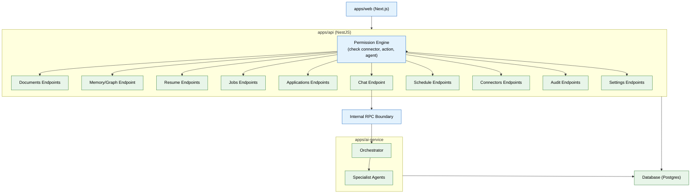

# 13 — API & Backend Services (MVP)

## Context
Read `02-database-schema.md` and `08-specialist-agents.md` first. This phase is the resource-oriented API surface `apps/web` (file 14) consumes — it's the only door into the system; nothing bypasses it.

## Objective
Build the core REST API in `apps/api` (NestJS): resource endpoints for every MVP feature, with the Permission Engine enforced on every single call.

## Requirements

**Permission Engine (`apps/api/permissions/`):** a single middleware/guard every endpoint passes through, checking the request against `permissions` (file 02) along three axes — connector, action type (read/write/act), and requesting agent (if the call originates from an internal agent action rather than direct user action). No endpoint, including internal service-to-service calls from `apps/ai-service`, bypasses this.

**Endpoints (resource-oriented, `/workspaces/{id}/...`):**
- `documents` — list, get, upload (enqueues file 03's pipeline), approve/reject Organization Agent proposals.
- `memory/graph` — read-only graph query endpoint for the Memory Graph screen.
- `resume` — get master resume, generate variant, answer a gap-fill question.
- `jobs` — get shortlist, approve/reject a match.
- `applications` — list, get detail, update outcome.
- `chat` — post a message, routed through the Orchestrator (file 05).
- `schedule` — list events, add/edit manually.
- `connectors` — list, initiate OAuth connect, revoke.
- `audit` — query `agent_actions` with filters (agent, date range, type).
- `settings` — get/update per-agent autonomy level, trigger export/delete (file 15).

**Internal RPC boundary:** `apps/api` calls `apps/ai-service` for anything agent/memory-related (chat, resume generation, job search) over an internal HTTP/RPC interface — `apps/web` never calls `apps/ai-service` directly. This keeps the Permission Engine's enforcement point singular.

**API documentation:** generate an OpenAPI spec from the NestJS decorators — this is what file 14's frontend team (or agent) builds against, and later becomes the seed for the public API (enterprise phase).

## Out of scope
Public API/SDK for external developers, webhook architecture, API versioning strategy, rate-limit tiers beyond the basic per-workspace limiting already in file 09 (all enterprise phase).

## Acceptance criteria
- [ ] Every endpoint has an automated test asserting it rejects a request lacking the required permission scope.
- [ ] The generated OpenAPI spec accurately reflects every implemented endpoint (verified by a contract test, not just manual inspection).
- [ ] A chat request round-trips correctly through `apps/api` → `apps/ai-service` → Orchestrator → back, with the trace (file 12) showing the full path.
- [ ] Revoking a connector immediately blocks any endpoint that depends on it, without requiring a service restart.

## Common Mistakes

| Mistake | Consequence |
|---------|------------|
| Bypassing the Permission Engine for internal service-to-service calls | Internal routes become an unguarded backdoor into the system |
| Not generating an OpenAPI spec from NestJS decorators | Frontend and API get out of sync; manual docs drift from reality |
| Allowing `apps/web` to call `apps/ai-service` directly | The Permission Engine's singular enforcement point is completely bypassed |

## Best Practices

| Practice | Why |
|----------|-----|
| Every endpoint must pass through the Permission Engine | No endpoint, including health and status, should be exempt from at least a basic auth check |
| Generate and test the OpenAPI spec in CI | Contract tests catch mismatches between documented and actual endpoints automatically |
| Keep the internal RPC interface thin and stable | A chatty RPC boundary creates coupling — batch related calls into single RPC requests |

## Security Considerations

| Concern | Mitigation |
|---------|------------|
| The Permission Engine is a single point of failure for auth | Make it stateless (no local cache of permissions) so it's always current with the database |
| Internal RPC from api to ai-service could be spoofed | Authenticate internal RPC calls with a shared service secret, not just network-level access |
| OpenAPI spec exposes the full endpoint surface | Restrict OpenAPI endpoint to admin access in production; never expose to unauthenticated users |

## Performance Considerations

| Concern | Approach |
|---------|----------|
| Permission Engine check on every endpoint adds per-request latency | Cache permission evaluations in Redis (short TTL — 30s); invalidate on permission change |
| Aggregated query endpoints (dashboard) can be slow without dedicated indexes | Create materialized views or dedicated summary endpoints for dashboard queries |
| Chat endpoint blocks the request thread while the agent loop runs | Use async request handling; return a request ID immediately and let the frontend poll for completion |
