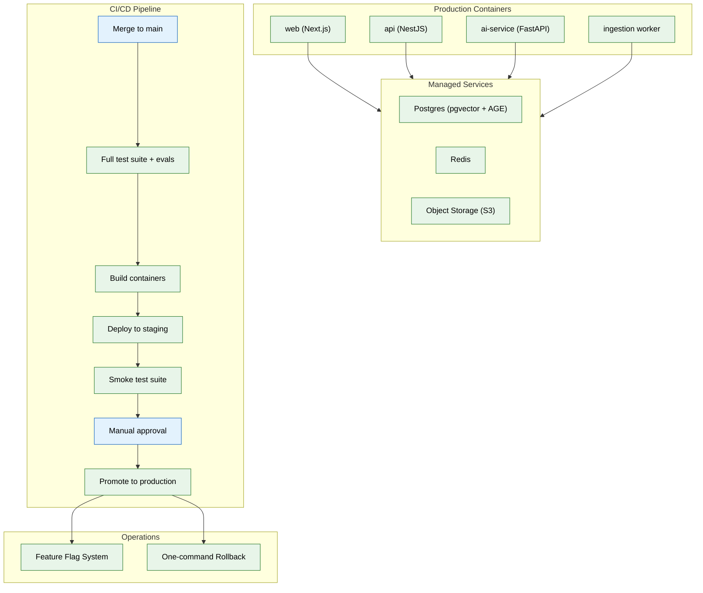

# 16 — Deployment & Infrastructure (MVP)

## Context
Read all prior files. This is the last MVP phase — everything before this has been built and tested locally/in CI; this phase makes it real for actual users.

## Objective
Containerize every service, stand up staging and production environments on a PaaS (not Kubernetes yet — that's an enterprise-scale upgrade), and wire CI/CD to auto-deploy on merge.

## Requirements

**Containers (`infra/docker/`):** a production Dockerfile per service (`web`, `api`, `ai-service`, plus the ingestion worker as a distinct process/container from file 03), optimized for image size and cold-start time, not just "it builds."

**Environments:** staging (auto-deployed from `main` on every merge) and production (manually promoted from a known-good staging build) — on a PaaS (e.g. Render, Fly.io, or equivalent managed container platform) chosen for operational simplicity at MVP scale over Kubernetes' flexibility, with an explicit note in `infra/docker/README.md` on what would trigger a Kubernetes migration (multi-region need, complex autoscaling policy needs — this is the enterprise-phase trigger, not a default).

**Managed services:** Postgres (with pgvector + AGE extensions available — confirm the chosen provider supports both before committing), Redis, and object storage as managed cloud services, not self-hosted, at MVP scale.

**CI/CD pipeline (extends file 01's CI):** on merge to `main` — run full test suite (including evals from file 10) → build containers → deploy to staging → run a smoke test suite against staging → require manual approval → promote to production.

**Feature flagging:** a basic flag system (even a simple config-driven one is fine) so new agents/features (e.g. the Application Agent's real submission path) can be enabled for an internal cohort before general availability, per the phased rollout implied by the build order in file 00.

**Rollback:** deployment must support a one-command rollback to the previous known-good build — verify this works before considering the phase complete, don't assume it from the platform's marketing.

## Out of scope
Kubernetes, multi-region deployment, autoscaling policies beyond the PaaS's default, disaster recovery runbooks, chaos engineering (all enterprise phase — see `enterprise/16-deployment-infrastructure.md`).

## Acceptance criteria
- [ ] A merged PR auto-deploys to staging with zero manual steps, and the smoke test suite runs automatically against it.
- [ ] Production promotion requires an explicit manual approval step — no accidental production deploys.
- [ ] A deliberate rollback (reverting to the prior build) is tested and completes without data loss.
- [ ] The eval suite (file 10) runs as a required CI gate before any deploy, not just as a local/manual check.

## Common Mistakes

| Mistake | Consequence |
|---------|------------|
| Skipping the smoke test suite against staging before promotion | A broken staging deploy silently reaches production after manual approval |
| Using Kubernetes before it's needed | Operational complexity explodes while the team should be focused on product — PaaS is sufficient for MVP |
| No rollback verification before considering deployment complete | When a bad deploy happens, the team discovers the rollback procedure doesn't work |

## Best Practices

| Practice | Why |
|----------|-----|
| Let staging auto-deploy on every merge to main | Catches integration issues in a production-like environment before any user sees them |
| Require manual approval for production promotion | Prevents an accidental deploy from reaching real users even if CI passes |
| Verify rollback before the phase is marked complete | A rollback that's never been tested is not a rollback — it's a hope |

## Security Considerations

| Concern | Mitigation |
|---------|------------|
| Container images may contain secrets baked in at build time | Use build args for non-sensitive config; resolve secrets at runtime from the secrets manager |
| Staging environment has access to production-like data stores | Isolate staging credentials; never give staging access to production data |
| Feature flags may expose incomplete features to unauthorized users | Flag evaluation must check user role/workspace, not just the flag value |

## Performance Considerations

| Concern | Approach |
|---------|----------|
| Full eval suite before every deploy adds minutes to CI | Run per-agent evals in parallel on separate CI workers |
| Cold-start time for AI service with model loading is slow | Pre-warm model connections in the container entrypoint; keep a warm connection pool |
| Feature flag evaluation on every request adds latency | Cache flag evaluations at the edge/API layer with short TTL |
