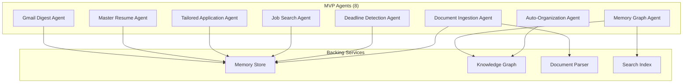

# MVP Agent Inventory

> **Purpose:** Define the 8 MVP AI agents, their capabilities, and execution patterns
> **Status:** ✅ Upgraded to enterprise quality
> **Owner:** AI Team
> **Version:** 2.0
> **Last Updated:** 2026-07-17

## Agent Architecture

## Agent Summary

| # | Agent | Category | Model | Memory | Schedule |
|---|-------|----------|-------|--------|----------|
| 1 | Document Ingestion | Ingestion | Claude Sonnet | Write | Event-driven |
| 2 | Auto-Organization | Memory | Claude Sonnet | Read/Write | Daily |
| 3 | Deadline Detection | Analysis | Claude Haiku | Read | Hourly |
| 4 | Job Search | Retrieval | Claude Sonnet | Read | Daily |
| 5 | Tailored Application | Action | Claude Sonnet | Read/Write | On-demand |
| 6 | Master Resume | Memory | Claude Sonnet | Read/Write | On-demand |
| 7 | Memory Graph | Memory | Claude Haiku | Read | Event-driven |
| 8 | Gmail Digest | Communication | Claude Sonnet | Read | Weekly |
