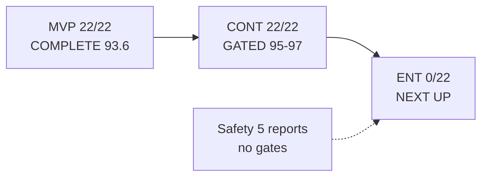

# Vaeloom Phases — Execution Status Overlay (WS-E)

> **Owner:** WS-E (Testing/Product/Phases) · **Verified:** 2026-09-15
> **Method:** on-disk evidence only (`Get-ChildItem` counts; gate/handoff files
> read). Prompt contract:
> `docs/prompts/vaeloom-66-independent-end-to-end-phase-prompts/` (live overlay
> there); this file is the `docs/phases/` rollup.

## Totals

| Track                          | Dirs  | Files signal                                                                                                                                | Gates | Handoffs | Verdict                                                         |
| ------------------------------ | ----- | ------------------------------------------------------------------------------------------------------------------------------------------- | ----- | -------- | --------------------------------------------------------------- |
| MVP `mvp-p00..p21`             | 22/22 | All have `09-gate-report*` + `10-handoff*` (p00..p06/p09 carry 2–3 gates: re-baseline / re-run / gap-closure)                               | 22/22 | 22/22    | **COMPLETE** (P21 93.6 MVP CLOSE)                               |
| CONT `cont-p00..p21`           | 22/22 | All have `06-gate-report.md` + `09-handoff*.md` (p14: `05-evidence-defects-gate` + `06-gate`; p19: `03-security-legal-ai-gate` + `06-gate`) | 22/22 | 22/22    | **GATED** (95.47–96.91; P21 96.76 → `09-handoff-to-ent-p00.md`) |
| Safety `agentic-safety-w1..w5` | 5/5   | 5× `01-wave-report.md` only                                                                                                                 | 0     | 0        | **REPORTS ONLY**                                                |
| ENT `ent-p00..p21`             | 0/22  | Dirs DO NOT EXIST (Enterprise track prompts only, zero evidence)                                                                            | 0     | 0        | **NOT STARTED — next up**                                       |

- **Grand:** `docs/phases/` = **570 files / 49 dirs** (22 + 22 + 5).
- **CONT gate band:** P00 95.47, P01 95.15, P02 95.51, P03 95.88, P04 95.62, P05
  96.16, P06 96.08, P07 96.16, P08 96.08, P09 96.16, P10 96.16, P11 96.16, P12
  96.16, P13 96.49, P14 96.91, P15 95.72, P16 96.47, P17 96.73, P18 96.65, P19
  96.73, P20 96.65, P21 96.76.

## Next up

1. ENT-P00 Intake and Existing-State Assessment — authorized by
   `cont-p21/09-handoff-to-ent-p00.md`; evidence stub spec in
   `docs/ENT-Backlog.md`.
2. Pre-release re-measure: `--cov` (EXC-P14-01), WCAG axe (EXC-P14-02), k6
   (EXC-P14-03) — see `docs/testing/Test-Matrix.md`.
3. Release blockers unchanged: dirty tree + OpenAPI 162-vs-99/110 drift + dual
   migration trees + untracked scripts + suite not re-run today
   (`MASTER-CHECKLIST-2026-09-15.md` RED).

