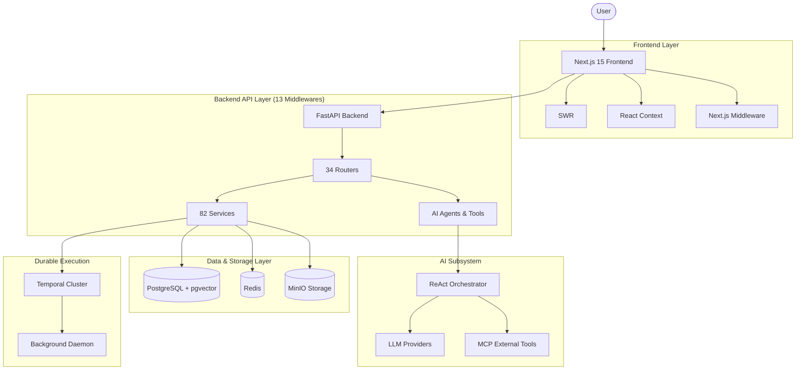

# 02 Architecture Reality

## Frontend Stack

- **Framework**: Next.js 15 App Router
- **UI Components**: @vaeloom/ui-kit (internal component library, NOT shadcn)
- **Styling**: Tailwind CSS + Framer Motion
- **Data Fetching**: SWR
- **State Management**: React Context (AuthProvider, ThemeProvider,
  ToastProvider, KeyboardShortcutProvider)
- **Security Middleware**: Auth enforcement, security headers (CSP, HSTS,
  X-Frame-Options)
- **API Communication**: CSRF token handling in `api.ts`, snake_case to
  camelCase transformation via `transformKeys()`
- **Real-time**: SSE streaming for chat

## Backend Stack

- **Framework**: FastAPI (Python 3.12)
- **ORM & DB**: SQLAlchemy async + PostgreSQL (pgvector)
- **Middleware (13 layers in order)**: BodySizeLimit, Idempotency,
  PromptInjection, APIVersion, RequestLogging, CorrelationID, SecurityHeaders,
  CSRF, Auth, Tenant, RateLimit, IPAllowlist, CORS
- **Routing & Services**: 34 routers, 82 services, 24 agents
- **Database Migrations**: Alembic (36 total)
- **Caching & Limiting**: Redis for rate limiting, CSRF, caching
- **Storage**: MinIO for object storage
- **Workflow Engine**: Temporal for durable execution
- **Background Tasks**: Background daemon with cron schedules
- **Streaming**: SSE streaming for agent output

## Data Layer

- **Core Database**: PostgreSQL with pgvector extension
- **Models**: 30+ SQLAlchemy models
- **Security**: 42/42 tables with RLS (real PostgreSQL RLS via `SET LOCAL` GUCs)
- **Encryption**: Fernet column-level encryption for sensitive fields
- **Knowledge Representation**: Knowledge graph via Entity/Relationship models,
  vector embeddings via pgvector or Qdrant

## AI Layer

- **Agents**: 24 specialist agents with declarative `AgentCard` configs
- **Orchestration**: ReAct loop orchestrator with supervisor mode
- **Tooling**: 40+ tools with scope-based permissions, MCP integration for
  external tools
- **LLM Providers**: OpenAI, Anthropic, Google Gemini, Groq
- **Retrieval**: Hybrid RAG combining vector, keyword, and graph retrieval
- **Context Management**: Context engine with token budget management
- **Loop Safety**: Oscillation detection, budget limits (3 iterations, 12 tool
  calls, $0.50, 120s)
- **Safety Controls**: Approval gates for destructive/outbound actions

## Infrastructure

- **Containerization**: Docker Compose (API, Web, Postgres, Redis, MinIO,
  Temporal cluster, Nginx, PgBouncer)
- **CI**: GitHub Actions (lint, type-check, tests, Docker build)
- **CD**: Terraform, ECR, cosign image signing, k6 load tests, Kustomize deploy
- **Observability**: OpenTelemetry, Prometheus `/metrics`, Grafana, Alertmanager

## Architecture Diagram

