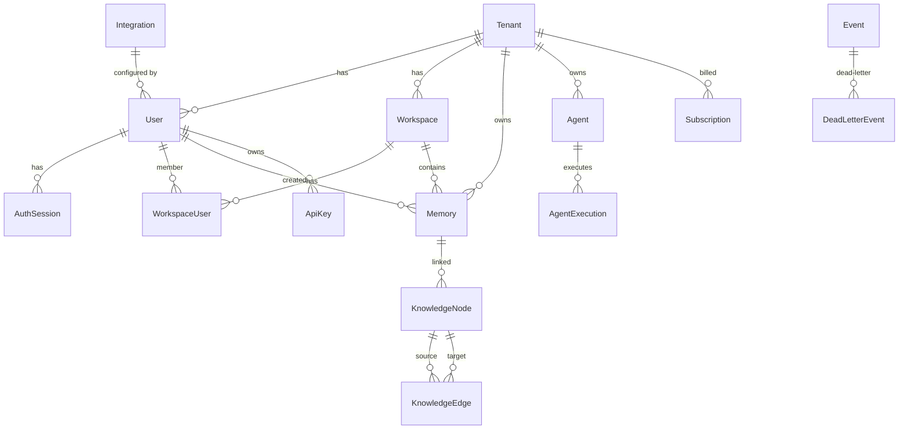

# Database Schemas

> **Purpose:** Define the database schema architecture, naming conventions, and migration strategy for Vaeloom
> **Status:** ✅ Upgraded to enterprise quality
> **Owner:** Backend Team
> **Version:** 2.0
> **Last Updated:** 2026-07-17

## Architecture

Vaeloom uses PostgreSQL 16 with the following extensions:
- `pgcrypto` — UUID generation, encrypt/decrypt
- `vector` — pgvector for embedding similarity search

## Entity Relationship

## Naming Conventions

| Convention | Rule | Example |
|---|---|---|
| Table names | snake_case, plural | `knowledge_nodes`, `agent_executions` |
| Column names | snake_case | `created_at`, `display_name` |
| Primary keys | `id` with UUIDv4 | `id String @id @default(uuid())` |
| Foreign keys | `{table}_id` | `tenant_id`, `workspace_id` |
| Timestamps | `created_at`, `updated_at` | `DateTime @default(now())` |
| JSON fields | `Json` type with defaults | `metadata Json @default("{}")` |

## Migration Strategy

| Environment | Strategy | Rollback |
|---|---|---|
| Development | `prisma migrate dev` | `prisma migrate reset` |
| Staging | `prisma migrate deploy` | Manual rollback via migration history |
| Production | `prisma migrate deploy` with CI approval | Point-in-time recovery + migration revert |

## Related Documents

- [Prisma Schema](../../apps/api/prisma/schema.prisma)
- [Event Schemas](../../events/schemas/README.md)
- [Backend Architecture](../../docs/Backend/Backend-Architecture.md)
