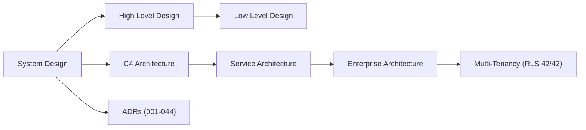

# Vaeloom Architecture Index

> **Purpose:** Pointer index — the authoritative design content lives in the
> files below, not here. **Last updated:** 2026-09-15

## System Views (C4)

| Level                | Document                                                                                                                 |
| -------------------- | ------------------------------------------------------------------------------------------------------------------------ |
| Context + Container  | [C4 Architecture](architecture/C4-Architecture.md)                                                                       |
| Component            | [Service Architecture](architecture/Service-Architecture.md), [Microservices](architecture/Microservices.md)             |
| Code-adjacent detail | [Low Level Design](architecture/High-Level-Design.md) (HLD) → [Low Level Design](architecture/Low-Level-Design.md) (LLD) |

Start with [System Design](architecture/System-Design.md) for the high-level
overview (6-layer MVP + 8-layer Enterprise overlay).

## Design Records

| Document                                                                                                                                 | Covers                                 |
| ---------------------------------------------------------------------------------------------------------------------------------------- | -------------------------------------- |
| [High Level Design](architecture/High-Level-Design.md)                                                                                   | Component breakdown                    |
| [Low Level Design](architecture/Low-Level-Design.md)                                                                                     | Detailed specifications                |
| [Data Flow](architecture/Data-Flow.md)                                                                                                   | Data flow across services              |
| [Event Architecture](architecture/Event-Architecture.md) / [Event Flow](architecture/Event-Flow.md)                                      | Event-driven design (BullMQ, Temporal) |
| [Caching](architecture/Caching.md), [Queue](architecture/Queue.md), [Search](architecture/Search.md), [Storage](architecture/Storage.md) | Cross-cutting infrastructure           |
| [Scalability](architecture/Scalability.md), [Performance](architecture/Performance.md)                                                   | Scaling strategy, targets              |
| [Infrastructure](architecture/Infrastructure.md), [Disaster Recovery](architecture/Disaster-Recovery.md)                                 | Infra overview, DR plan                |
| [ADRs](architecture/03-adrs.md) + [`docs/adr/`](adr/)                                                                                    | 44 records, ADR-001..ADR-044           |

## Enterprise Architecture

- [Enterprise Architecture](enterprise/Enterprise-Architecture.md) — enterprise
  design
- [Multi-Tenancy](enterprise/Multi-Tenancy.md) — TenantContext, GUCs, RLS 42/42
- Supporting: Organizations, Admin Portal, Billing, Licensing, Feature Flags,
  Enterprise APIs, Plugin Marketplace (all under `enterprise/`)
- Backend enforcement views:
  [Backend Architecture](backend/Backend-Architecture.md),
  [API Architecture](backend/API-Architecture.md),
  [Security Architecture](security/Security-Architecture.md)

## How to Navigate

New here? Read [System Design](architecture/System-Design.md), then the
[Glossary](GLOSSARY.md), then the area doc you need. Full category map:
[DOCUMENTATION-MAP](DOCUMENTATION-MAP.md).
