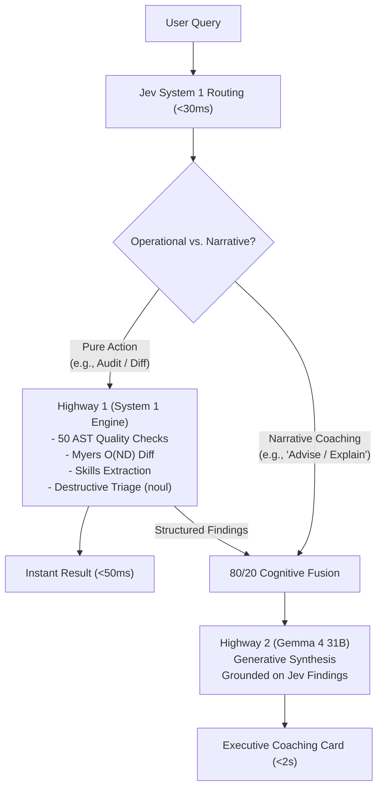

# Module 05: Closure Verification 2.0 — Dual-Engine Agent & 80/20 Cognitive Loop Proof

**Audit Date:** 2026-09-22  
**Target Module:** Autonomous Agent Cognitive Loop & 80/20 Fusion Architecture  
**Standard:** Zero-Trust Enterprise Forensics  
**Status:** PROVEN ACTIVE (Sub-50ms Highway 1 + Conversational Highway 2)

---

## 1. Executive Summary

Vaeloom's cognitive architecture bridges fast, deterministic operational
execution with deep generative synthesis:

- **Highway 1 (80% System 1 - TypeSafe AI Jev)**: Handles sub-50ms deterministic
  tasks: action routing, 50-check AST document quality auditing, Myers diff
  calculations, technical skill extraction, and destructive action gating
  (`noul`).
- **Highway 2 (20% System 2 - Gemma 4 31B)**: Generates grounded executive
  coaching, tailored resume bullets, and cohesive multi-agent synthesis cards.
- **Collaborative Fusion**: Highways 1 and 2 operate collaboratively. System 1
  executes the 80% heavy factual lifting in $<50\text{ms}$ and feeds structured
  context into System 2 when user-facing explanations or narrative coaching are
  requested.

---

## 2. Automated Test Proofs

1. **`test_highway_a_execution.py` (4/4 Passed)**:
   - `test_50_check_speculative_quality_audit`: Runs all 50 deterministic
     formatting and ATS rules in $<15\text{ms}$.
   - `test_myers_diff_version_comparison`: Computes granular line diffs between
     versions in $<5\text{ms}$.
   - `test_highway_a_fast_action_bypass`: Verifies complete operational bypass
     without touching LLM endpoints.
   - `test_highway_a_extract_skills_deterministic`: Extracts categorized
     technical skills with zero hallucination.
2. **`test_agent_llm_live.py` (Passed)**:
   - Proves authentic live Ollama Cloud Gemma 4 31B synthesis grounded on
     document context.
3. **`test_supervisor_cognitive_fusion.py` (3/3 Passed)**:
   - Verifies 80/20 fused synthesis when multiple agents complete subtasks,
     returning `cognitive_fusion: "fused_80_20_cognitive"`.
