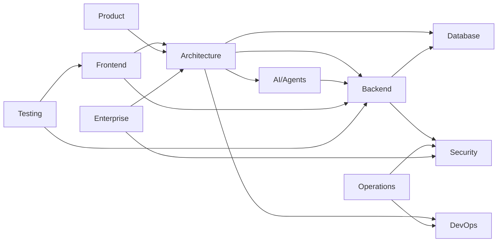

# Documentation Map

> **Purpose:** Complete map of all documentation with status, ownership, and
> relationships

## Category Summary

| Category             | Directory                    | Files     | Owner       | Maturity                        |
| -------------------- | ---------------------------- | --------- | ----------- | ------------------------------- |
| Architecture         | `docs/architecture/`         | 19        | Platform    | ✅ Stable                       |
| AI / Agents          | `docs/ai/`                   | 24        | AI Team     | ✅ Stable                       |
| Backend              | `docs/backend/`              | 23        | Backend     | ✅ Stable                       |
| Database             | `docs/database/`             | 11        | Backend     | ✅ Stable                       |
| DevOps               | `docs/devops/`               | 13        | DevOps      | ✅ Stable                       |
| Engineering          | `docs/engineering/`          | 29        | Engineering | ✅ Stable                       |
| Enterprise           | `docs/enterprise/`           | 11        | Enterprise  | ✅ Stable                       |
| Frontend             | `docs/frontend/`             | 25        | Frontend    | ✅ Stable                       |
| Operations           | `docs/operations/`           | 18        | DevOps      | ✅ Stable                       |
| Product              | `docs/product/`              | 35        | Product     | ✅ Stable                       |
| Security             | `docs/security/`             | 17        | Security    | ✅ Stable                       |
| Testing              | `docs/testing/`              | 13        | QA          | ✅ Stable                       |
| Compliance           | `docs/compliance/`           | 4         | Security    | ✅ Stable                       |
| ADRs                 | `docs/adr/`                  | 39        | Platform    | ✅ Stable                       |
| Temporal             | `docs/temporal/`             | 9         | Platform    | ✅ Stable                       |
| MCP                  | `docs/mcp/`                  | 3         | Platform    | ✅ Stable                       |
| Developer Experience | `docs/developer-experience/` | 9         | Platform    | ✅ Stable                       |
| API Reference        | `docs/backend/openapi.yaml`  | 1         | Backend     | ✅ Stable                       |
| Root-level docs      | `docs/*.md`                  | 33        | Mixed       | 🔄 Needs Update                 |
| Phase Evidence       | `docs/phases/`               | 492       | Platform    | 🧊 Frozen — do not modify       |
| Phase Prompts        | `docs/prompts/`              | 81        | Platform    | 🔒 SHA-pinned — do not reformat |
| **Total**            | **22 categories**            | **~1033** | —           | —                               |

## Dependency Graph

## Related Documents

- [Master Index](./README.md)
- [Usage Guide](./USAGE-GUIDE.md)
- [Document Template](./TEMPLATE.md)

**Note on stale numbers in phase docs:** Phase evidence files (`docs/phases/`)
contain historical baselines that were accurate at the time of execution (e.g.,
`2557` tests, `99` OpenAPI paths). These are frozen audit records and should NOT
be modified. Current values: **2731 tests**, **110 OpenAPI paths**, **44 ADRs**
— see `AGENTS.md` and `docs/backend/openapi.yaml`.

## Diagram Index

| Diagram                    | Purpose                                          | Documentation                                                        |
| -------------------------- | ------------------------------------------------ | -------------------------------------------------------------------- |
| System Architecture        | 6-layer MVP + 8-layer Enterprise overlay         | `02-system-architecture.md`                                          |
| Agent Execution Lifecycle  | Router → Supervisor/Loop → approval → QA → audit | `03-agent-workflow.md`                                               |
| Memory + Retrieval Reality | 6 types, dual stores, 3 disjoint RAG paths       | `04-memory-knowledge-graph.md`                                       |
| Agent Architecture         | 10 MVP-canonical / 22 routable + QA gate         | `ai/AI-Agents.md`, `agents/mvp/agent-inventory.md`                   |
| Security Architecture      | AuthN/AuthZ/tenant/RBAC reality                  | `security/Security-Architecture.md`                                  |
| Connector Architecture     | 15 built-in connectors + OAuth lifecycle         | `backend/Connectors.md` (to add)                                     |
| Approval / HITL            | HMAC ledger + pending proposal cards             | `03-agent-workflow.md`, `backend/Authorization.md` (to add)          |
| Event / Temporal           | Workflows + activities + queues                  | `architecture/Event-Architecture.md`, `temporal/catalog.md` (to add) |
| Career Flows (as-built)    | Resume/ATS-as-tools/Job-fallback/Application     | `product/Feature-Specs/*` (to add)                                   |
| Frontend / Backend         | 27 pages → REST gateway → FastAPI monolith       | `frontend/Frontend-Architecture.md` (to add)                         |

## Canonical Phase Sources (added 2026-08-11)

| Item                                                    | Location                                                                                                                                                         | Role                                                                                               |
| ------------------------------------------------------- | ---------------------------------------------------------------------------------------------------------------------------------------------------------------- | -------------------------------------------------------------------------------------------------- |
| 66 Independent End-to-End Phase Prompts (3 tracks x 22) | [`./prompts/vaeloom-66-independent-end-to-end-phase-prompts/`](./prompts/vaeloom-66-independent-end-to-end-phase-prompts/)                                       | **Source of truth** for phase execution; integrity-pinned by `SHA256SUMS.md` (do not reformat)     |
| Execution status overlay                                | [`./prompts/vaeloom-66-independent-end-to-end-phase-prompts/EXECUTION-STATUS.md`](./prompts/vaeloom-66-independent-end-to-end-phase-prompts/EXECUTION-STATUS.md) | Live GO / IN PROGRESS / NOT STARTED per phase                                                      |
| Phase execution evidence                                | [`./phases/`](./phases/)                                                                                                                                         | `mvp-p00` … `mvp-p21` (MVP COMPLETE) + `cont-p00` … `cont-p04` gate reports, registers, handoffs   |
| MVP e2e baseline — enterprise-hardened (GOVERNING)      | `./vaeloom-mvp-e2e-enterprise-hardened.md`                                                                                                                       | Canonical MVP corrections/hardening (INT-02)                                                       |
| MVP e2e baseline                                        | `./vaeloom-mvp-e2e.md`                                                                                                                                           | Original 22-phase MVP execution baseline (INT-03)                                                  |
| Enterprise e2e baseline                                 | `./vaeloom-enterprise-e2e.md`                                                                                                                                    | Enterprise 0–21 execution baseline (INT-04, reference)                                             |
| Gatekeeper compendium zip (INT-01 substitute)           | `C:\Users\Dell\Downloads\vaeloom\vaeloom-complete-three-track-phase-gatekeeper-deliverables.zip`                                                                 | Governing 3-track 32-section gatekeepers; SHA-256 pinned in `phases/mvp-p00/01-source-register.md` |
