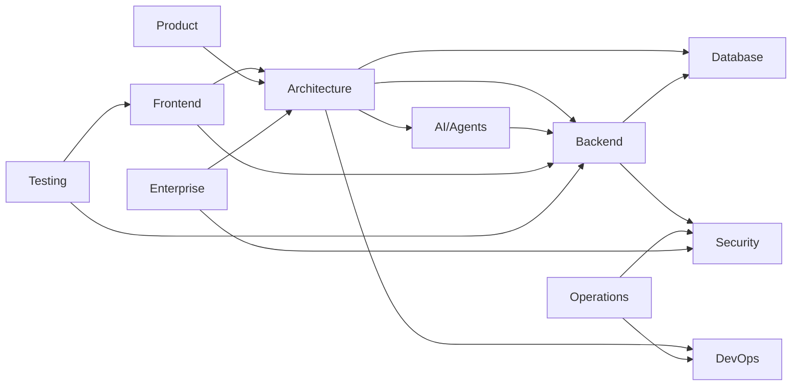

# Documentation Map

> **Purpose:** Complete map of all documentation with status, ownership, and
> relationships

## Category Summary

| Category | Directory | Files | Owner | Maturity |
| ------------ | -------------------- | --------- | ----------- | ------------- |
| Architecture | `docs/Architecture/` | 18 | Platform | ✅ Stable |
| AI / Agents | `docs/AI/` | 23 | AI Team | ✅ Stable |
| Backend | `docs/Backend/` | 21 | Backend | ✅ Stable |
| Database | `docs/Database/` | 10 | Backend | ✅ Stable |
| DevOps | `docs/DevOps/` | 12 | DevOps | ✅ Stable |
| Engineering | `docs/Engineering/` | 11 | Engineering | ✅ Stable |
| Enterprise | `docs/Enterprise/` | 9 | Enterprise | ✅ Stable |
| Frontend | `docs/Frontend/` | 17 | Frontend | ✅ Stable |
| Operations | `docs/Operations/` | 16 | DevOps | ✅ Stable |
| Product | `docs/Product/` | 22 | Product | ✅ Stable |
| Security | `docs/Security/` | 14 | Security | ✅ Stable |
| Testing | `docs/Testing/` | 12 | QA | ✅ Stable |
| API | `docs/API/` | 1 (index) | Platform | 🔄 Needs Work |
| Guides | `docs/Guides/` | 1 (index) | Platform | 🔄 Needs Work |
| Contributing | `docs/Contributing/` | 1 (index) | Engineering | 🔄 Needs Work |
| **Total** | **15 categories** | **178** | — | — |

## Dependency Graph

## Related Documents

- [Master Index](./README.md)
- [Usage Guide](./USAGE-GUIDE.md)
- [Document Template](./TEMPLATE.md)

## Canonical Phase Sources (added 2026-08-11)

| Item | Location | Role |
| ------------------------------------------------------- | ---------------------------------------------------------------------------------------------------------------------------------------------------------------- | -------------------------------------------------------------------------------------------------- |
| 66 Independent End-to-End Phase Prompts (3 tracks x 22) | [`./prompts/vaeloom-66-independent-end-to-end-phase-prompts/`](./prompts/vaeloom-66-independent-end-to-end-phase-prompts/) | **Source of truth** for phase execution; integrity-pinned by `SHA256SUMS.md` (do not reformat) |
| Execution status overlay | [`./prompts/vaeloom-66-independent-end-to-end-phase-prompts/EXECUTION-STATUS.md`](./prompts/vaeloom-66-independent-end-to-end-phase-prompts/EXECUTION-STATUS.md) | Live GO / IN PROGRESS / NOT STARTED per phase |
| Phase execution evidence | [`./phases/`](./phases/) | `mvp-p00` … `mvp-p10` gate reports, registers, handoffs |
| MVP e2e baseline — enterprise-hardened (GOVERNING) | `./vaeloom-mvp-e2e-enterprise-hardened.md` | Canonical MVP corrections/hardening (INT-02) |
| MVP e2e baseline | `./vaeloom-mvp-e2e.md` | Original 22-phase MVP execution baseline (INT-03) |
| Enterprise e2e baseline | `./vaeloom-enterprise-e2e.md` | Enterprise 0–21 execution baseline (INT-04, reference) |
| Gatekeeper compendium zip (INT-01 substitute) | `C:\Users\Dell\Downloads\vaeloom\vaeloom-complete-three-track-phase-gatekeeper-deliverables.zip` | Governing 3-track 32-section gatekeepers; SHA-256 pinned in `phases/mvp-p00/01-source-register.md` |
