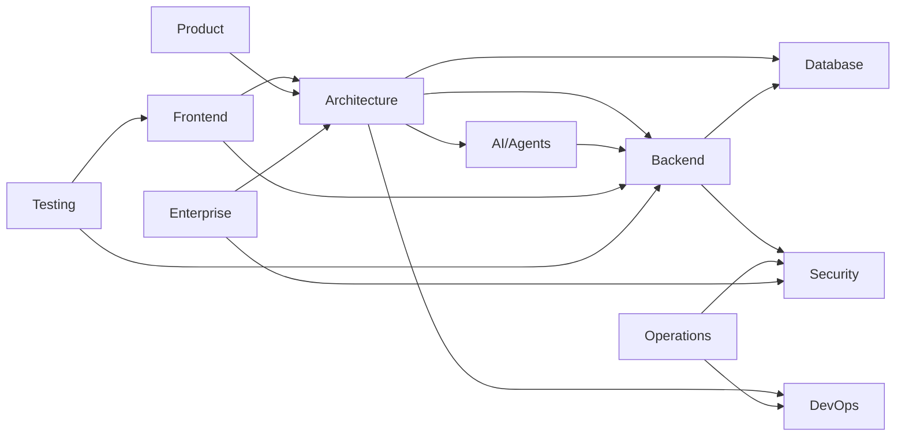

# Documentation Map

> **Purpose:** Complete map of all documentation with status, ownership, and
> relationships

## Architecture Tier Summary

| Tier | Directory | Scope & Purpose | Authority |
| :--- | :--- | :--- | :--- |
| **SPECS** | `specs/` | Authoritative system contracts, schemas, API contracts (`openapi.yaml`), and 66 phase engineering prompts | 🔒 Canonical SPEC |
| **DOCS** | `docs/` | Human-facing architecture explanations, developer onboarding, reference guides, ADR history, and runbooks | 📖 Human Knowledge |
| **EVIDENCE** | `evidence/` | Immutable point-in-time compliance logs, 50 phase execution audits (`mvp/`, `cont/`, `ent/`), and DR drill logs | 🧾 Audit Evidence |
| **ARCHIVE** | `archive/` | Historical milestone audits (107 files), superseded monolithic drafts from July 2026, and dated temporal reports | 🗄️ Historical Archive |

### Category Breakdown

| Category | Directory | Files | Owner | Role |
| :--- | :--- | :--- | :--- | :--- |
| **Phase Contracts** | `specs/phase-contracts/` | 80 | Platform | 🔒 Canonical Phase Specifications |
| **API Specifications** | `specs/api/` | 4 | Backend | 🔒 OpenAPI (162 paths / 203 ops) + API Reference |
| **Product Specifications** | `specs/product/` | 20 | Product | 🔒 Functional Requirements & 13 Feature Specs |
| **System Invariants** | `specs/architecture/` | 6 | Platform | 🔒 C4 Architecture, LLD, Event Catalog |
| **Database Schemas** | `specs/database/` | 4 | Backend | 🔒 67 Tables (Schema, Data Dict, Indexes, ERD) |
| **AI & Agent Cards** | `specs/ai/` | 10 | AI Team | 🔒 28 Agents, Tool Calling, Safety Guardrails |
| **Security Policies** | `specs/security/` | 9 | Security | 🔒 IAM, Encryption, Threat Model, Retention |
| **Durable Execution** | `specs/temporal/` | 2 | Platform | 🔒 8 Queues, 6 Workflows, Idempotency |
| **UI Design System** | `specs/frontend/` | 4 | Frontend | 🔒 Design Tokens, Components, WCAG AA Rules |
| **Quality & Coverage** | `specs/quality/` | 7 | QA | 🔒 Test Pyramid (75/20/5), SLAs/SLOs, Coverage Floor |
| **Architecture Guides** | `docs/architecture/` | 13 | Platform | 📖 System Narrative & High-Level Design |
| **ADR History** | `docs/adr/` | 45 | Platform | 📖 44 Architecture Decision Records & Index |
| **Backend Guides** | `docs/backend/` | 20 | Backend | 📖 Local Dev, Troubleshooting, Connectors |
| **Frontend Guides** | `docs/frontend/` | 21 | Frontend | 📖 App Router (41 routes), SWR, UX Guides |
| **AI Concept Guides** | `docs/ai/` | 19 | AI Team | 📖 Memory Taxonomy, RAG Architecture, Graph |
| **Operational Runbooks** | `docs/operations/` | 20 | DevOps | 📖 SRE Runbooks, Incident Response, Backup |
| **Security Guides** | `docs/security/` | 12 | Security | 📖 Audit Logs Guide, GDPR, SOC 2, DPIA |
| **Testing Tutorials** | `docs/testing/` | 10 | QA | 📖 Unit, Integration, E2E, Load Testing Guides |
| **Phase Evidence** | `evidence/phases/` | 574 | Platform | 🧊 Immutable Phase Gate Reports & Scorecards |
| **Historical Audits** | `archive/audits/` | 114 | Security/QA | 🗄️ Point-in-Time Audits & Verification Logs |
| **Monolith Archive** | `archive/monoliths/` | 6 | Platform | 🗄️ Superseded Pre-Modular July 2026 Monoliths |

## Dependency Graph

## Related Documents

- [Master Index](./README.md)
- [Usage Guide](./usage-guide.md)
- [Document Template](./template.md)

**Note on stale numbers in phase docs:** Phase evidence files (`docs/phases/`)
contain historical baselines that were accurate at the time of execution (e.g.,
`2557` tests, `99` OpenAPI paths). These are frozen audit records and should NOT
be modified. Current values: **2731 tests**, **162 OpenAPI paths / 203 ops**
(v0.2.0, regen 2026-09-15 via `scripts/gen_openapi.py`), **44 ADRs** — see
`AGENTS.md` and `docs/backend/openapi.yaml`.

## Diagram Index

| Diagram                    | Purpose                                          | Documentation                                               |
| -------------------------- | ------------------------------------------------ | ----------------------------------------------------------- |
| System Architecture        | 6-layer MVP + 8-layer Enterprise overlay         | `02-system-architecture.md`                                 |
| Agent Execution Lifecycle  | Router → Supervisor/Loop → approval → QA → audit | `03-agent-workflow.md`                                      |
| Memory + Retrieval Reality | 6 types, dual stores, 3 disjoint RAG paths       | `04-memory-knowledge-graph.md`                              |
| Agent Architecture         | 10 MVP-canonical / 22 routable + QA gate         | `ai/AI-Agents.md`, `agents/mvp/agent-inventory.md`          |
| Security Architecture      | AuthN/AuthZ/tenant/RBAC reality                  | `security/Security-Architecture.md`                         |
| Connector Architecture     | 15 built-in connectors + OAuth lifecycle         | `backend/Connectors.md`                                     |
| Approval / HITL            | HMAC ledger + pending proposal cards             | `03-agent-workflow.md`, `backend/Authorization.md`          |
| Event / Temporal           | Workflows + activities + queues                  | `architecture/Event-Architecture.md`, `temporal/catalog.md` |
| Career Flows (as-built)    | Resume/ATS-as-tools/Job-fallback/Application     | `product/Feature-Specs/`                                    |
| Frontend / Backend         | 27 pages → REST gateway → FastAPI monolith       | `frontend/Frontend-Architecture.md`                         |

## Canonical Phase Sources

| Item | Location | Role |
| :--- | :--- | :--- |
| **66 Phase Prompts & Contracts (3 tracks x 22)** | [`../specs/phase-contracts/`](../specs/phase-contracts/) | **Governing contract** for phase execution; integrity-pinned by `SHA256SUMS.md` |
| **Live Execution Status Overlay** | [`../specs/phase-contracts/EXECUTION-STATUS.md`](../specs/phase-contracts/EXECUTION-STATUS.md) | Single canonical source of truth for phase progress |
| **Phase Execution Evidence** | [`../evidence/phases/`](../evidence/phases/) | `mvp/` (P00..P21 COMPLETE), `cont/` (P00..P21 COMPLETE), `ent/` (active) |
| **MVP E2E Baseline — Enterprise Hardened** | [`../specs/product/vaeloom-mvp-e2e-enterprise-hardened.md`](../specs/product/vaeloom-mvp-e2e-enterprise-hardened.md) | Canonical MVP hardening specification baseline (INT-02) |
| **Enterprise E2E Baseline** | [`../specs/product/vaeloom-enterprise-e2e.md`](../specs/product/vaeloom-enterprise-e2e.md) | Enterprise execution specification baseline (INT-04) |
| **Superseded Monoliths** | [`../archive/monoliths/`](../archive/monoliths/) | Pre-modular July 2026 baselines (`vaeloom-mvp-e2e.md`, `vaeloom-complete-documentation.md`) |
