# Vaeloom Documentation

> **Purpose:** Master index and navigation hub for all Vaeloom documentation
> **Status:** ✅ Published **Owner:** Platform Team **Version:** 2.1 **Last
> Updated:** 2026-08-29 **Total Documents:** 793+

## Documentation Taxonomy

```mermaid
graph TD
 classDef core fill:#e3f2fd,stroke:#1565c0
 classDef platform fill:#e8f5e9,stroke:#2e7d32
 classDef product fill:#fff3e0,stroke:#e65100
 classDef ops fill:#f3e5f5,stroke:#6a1b9a

 DOC["Vaeloom Docs"]--> ARCH["Architecture"]
 DOC--> AI["AI / Agents"]
 DOC--> BACKEND["Backend"]
 DOC--> DB["Database"]
 DOC--> DEVOPS["DevOps"]
 DOC--> ENG["Engineering"]
 DOC--> ENT["Enterprise"]
 DOC--> FE["Frontend"]
 DOC--> OPS["Operations"]
 DOC--> PROD["Product"]
 DOC--> SEC["Security"]
 DOC--> TEST["Testing"]
 DOC--> API["API Reference"]
 DOC--> GUIDES["Guides"]
 DOC--> CONTRIB["Contributing"]

 class ARCH,AI,BACKEND,DB core
 class DEVOPS,ENG,ENT platform
 class FE,OPS,PROD product
 class SEC,TEST,API,GUIDES,CONTRIB ops
```

## Category Index

### 🏗️ Architecture

| #   | Document                                                       | Description                      |
| --- | -------------------------------------------------------------- | -------------------------------- |
| 1   | [System Design](./Architecture/System-Design.md)               | High-level system architecture   |
| 2   | [High Level Design](./Architecture/High-Level-Design.md)       | HLD with component breakdown     |
| 3   | [Low Level Design](./Architecture/Low-Level-Design.md)         | LLD with detailed specifications |
| 4   | [Service Architecture](./Architecture/Service-Architecture.md) | Service decomposition            |
| 5   | [Microservices](./Architecture/Microservices.md)               | Microservices architecture       |
| 6   | [C4 Architecture](./Architecture/C4-Architecture.md)           | C4 model diagrams                |
| 7   | [Event Architecture](./Architecture/Event-Architecture.md)     | Event-driven architecture        |
| 8   | [Event Flow](./Architecture/Event-Flow.md)                     | Event flow diagrams              |
| 9   | [Data Flow](./Architecture/Data-Flow.md)                       | Data flow across services        |
| 10  | [Caching](./Architecture/Caching.md)                           | Caching strategy                 |
| 11  | [Queue](./Architecture/Queue.md)                               | Message queue architecture       |
| 12  | [Search](./Architecture/Search.md)                             | Search architecture              |
| 13  | [Storage](./Architecture/Storage.md)                           | Storage strategy                 |
| 14  | [Scalability](./Architecture/Scalability.md)                   | Scaling strategy                 |
| 15  | [Performance](./Architecture/Performance.md)                   | Performance targets              |
| 16  | [Disaster Recovery](./Architecture/Disaster-Recovery.md)       | DR plan                          |
| 17  | [Infrastructure](./Architecture/Infrastructure.md)             | Infrastructure overview          |
| 18  | [ADRs](./Architecture/03-adrs.md)                              | Architecture Decision Records    |

### 🤖 AI / Agents

| #   | Document                                         | Description                  |
| --- | ------------------------------------------------ | ---------------------------- |
| 1   | [AI Agents](./AI/AI-Agents.md)                   | Agent architecture overview  |
| 2   | [Memory](./AI/Memory.md)                         | Memory system design         |
| 3   | [Knowledge Graph](./AI/Knowledge-Graph.md)       | Knowledge graph architecture |
| 4   | [LLM Architecture](./AI/LLM-Architecture.md)     | LLM integration              |
| 5   | [RAG](./AI/RAG.md)                               | RAG pipeline                 |
| 6   | [Agentic RAG](./AI/Agentic-RAG.md)               | Agentic retrieval            |
| 7   | [MCP](./AI/MCP.md)                               | Model Context Protocol       |
| 8   | [Tool Calling](./AI/Tool-Calling.md)             | Tool execution               |
| 9   | [Reasoning](./AI/Reasoning.md)                   | Reasoning patterns           |
| 10  | [Guardrails](./AI/Guardrails.md)                 | Safety guardrails            |
| 11  | [Safety](./AI/Safety.md)                         | AI safety                    |
| 12  | [Prompt Engineering](./AI/Prompt-Engineering.md) | Prompt design                |
| 13  | [Prompt Standards](./AI/Prompt-Standards.md)     | Prompt conventions           |
| 14  | [Prompt Library](./AI/Prompt-Library.md)         | Prompt templates             |
| 15  | [Agent Prompt Specs](./AI/Agent-Prompt-Specs.md) | Agent prompt specifications  |
| 16  | [Evaluation](./AI/Evaluation.md)                 | AI evaluation framework      |
| 17  | [Eval Datasets](./AI/Eval-Datasets.md)           | Evaluation datasets          |
| 18  | [Model Routing](./AI/Model-Routing.md)           | Model routing logic          |
| 19  | [Model Benchmarking](./AI/Model-Benchmarking.md) | Model benchmarks             |
| 20  | [Inference Pipeline](./AI/Inference-Pipeline.md) | Inference pipeline           |
| 21  | [AI Cost Strategy](./AI/AI-Cost-Strategy.md)     | Cost optimization            |
| 22  | [AI Versioning](./AI/AI-Versioning.md)           | Versioning strategy          |
| 23  | [Embeddings](./AI/Embeddings.md)                 | Embedding strategy           |

### ⚙️ Backend

| #   | Document                                                  | Description                    |
| --- | --------------------------------------------------------- | ------------------------------ |
| 1   | [Backend Architecture](./Backend/Backend-Architecture.md) | Backend overview               |
| 2   | [API Architecture](./Backend/API-Architecture.md)         | API design                     |
| 3   | [API Reference](./Backend/API-Reference.md)               | API endpoint reference         |
| 4   | [API Versioning](./Backend/API-Versioning.md)             | Versioning strategy            |
| 5   | [REST Standards](./Backend/REST-Standards.md)             | REST conventions               |
| 6   | [GraphQL](./Backend/GraphQL.md)                           | GraphQL integration            |
| 7   | [Authentication](./Backend/Authentication.md)             | Auth patterns                  |
| 8   | [Authorization](./Backend/Authorization.md)               | Authorization model            |
| 9   | [RBAC](./Backend/RBAC.md)                                 | Role-based access control      |
| 10  | [ABAC](./Backend/ABAC.md)                                 | Attribute-based access control |
| 11  | [Validation](./Backend/Validation.md)                     | Input validation               |
| 12  | [Error Standards](./Backend/Error-Standards.md)           | Error handling                 |
| 13  | [Service Contracts](./Backend/Service-Contracts.md)       | Service interfaces             |
| 14  | [Module Specs](./Backend/Module-Specs.md)                 | Module specifications          |
| 15  | [Event Catalog](./Backend/Event-Catalog.md)               | Event definitions              |
| 16  | [Business Logic](./Backend/Business-Logic.md)             | Business logic patterns        |
| 17  | [Connectors](./Backend/Connectors.md)                     | Connector architecture         |
| 18  | [Workers](./Backend/Workers.md)                           | Background workers             |
| 19  | [Cron Jobs](./Backend/Cron-Jobs.md)                       | Scheduled tasks                |
| 20  | [Rate Limiting](./Backend/Rate-Limiting.md)               | Rate limiting                  |
| 21  | [Queue](./Backend/Queue.md)                               | Queue management               |

### 🗄️ Database

| #   | Document                                         | Description               |
| --- | ------------------------------------------------ | ------------------------- |
| 1   | [Database Design](./Database/Database-Design.md) | Database architecture     |
| 2   | [Schema](./Database/Schema.md)                   | Schema definitions        |
| 3   | [ER Diagram](./Database/ER-Diagram.md)           | Entity-relationship model |
| 4   | [Data Dictionary](./Database/Data-Dictionary.md) | Data definitions          |
| 5   | [Indexes](./Database/Indexes.md)                 | Index strategy            |
| 6   | [Migrations](./Database/Migrations.md)           | Migration strategy        |
| 7   | [Backups](./Database/Backups.md)                 | Backup strategy           |
| 8   | [Replication](./Database/Replication.md)         | Replication setup         |
| 9   | [Partitioning](./Database/Partitioning.md)       | Partitioning strategy     |
| 10  | [Optimization](./Database/Optimization.md)       | Query optimization        |

### 🚀 DevOps

| #   | Document                                                         | Description            |
| --- | ---------------------------------------------------------------- | ---------------------- |
| 1   | [CI/CD](./DevOps/CI-CD.md)                                       | Pipeline architecture  |
| 2   | [Docker](./DevOps/Docker.md)                                     | Containerization       |
| 3   | [Kubernetes](./DevOps/Kubernetes.md)                             | K8s deployment         |
| 4   | [Terraform](./DevOps/Terraform.md)                               | IaC configuration      |
| 5   | [Monitoring](./DevOps/Monitoring.md)                             | Monitoring setup       |
| 6   | [Alerting](./DevOps/Alerting.md)                                 | Alert configuration    |
| 7   | [Logging](./DevOps/Logging.md)                                   | Logging infrastructure |
| 8   | [Tracing](./DevOps/Tracing.md)                                   | Distributed tracing    |
| 9   | [Configuration Management](./DevOps/Configuration-Management.md) | Config management      |
| 10  | [Deployment](./DevOps/Deployment.md)                             | Deployment strategy    |
| 11  | [Container Signing](./DevOps/Container-Signing.md)               | Container security     |
| 12  | [SBOM Policy](./DevOps/SBOM-Policy.md)                           | SBOM compliance        |

### 📐 Engineering

| #   | Document                                                | Description        |
| --- | ------------------------------------------------------- | ------------------ |
| 1   | [Coding Standards](./Engineering/Coding-Standards.md)   | Code style guide   |
| 2   | [Naming Convention](./Engineering/Naming-Convention.md) | Naming rules       |
| 3   | [Branch Strategy](./Engineering/Branch-Strategy.md)     | Git branching      |
| 4   | [Git Workflow](./Engineering/Git-Workflow.md)           | Git process        |
| 5   | [Commit Convention](./Engineering/Commit-Convention.md) | Commit standards   |
| 6   | [Code Review](./Engineering/Code-Review.md)             | Review process     |
| 7   | [PR Guidelines](./Engineering/PR-Guidelines.md)         | PR standards       |
| 8   | [Release Process](./Engineering/Release-Process.md)     | Release management |
| 9   | [Versioning](./Engineering/Versioning.md)               | Version strategy   |
| 10  | [Folder Structure](./Engineering/Folder-Structure.md)   | Repository layout  |
| 11  | [TEMPLATE.md](./TEMPLATE.md)                            | Document template  |

### 🏢 Enterprise

| #   | Document                                                           | Description          |
| --- | ------------------------------------------------------------------ | -------------------- |
| 1   | [Enterprise Architecture](./Enterprise/Enterprise-Architecture.md) | Enterprise design    |
| 2   | [Multi-Tenancy](./Enterprise/Multi-Tenancy.md)                     | Tenant isolation     |
| 3   | [Organizations](./Enterprise/Organizations.md)                     | Org structure        |
| 4   | [Admin Portal](./Enterprise/Admin-Portal.md)                       | Admin UI             |
| 5   | [Billing](./Enterprise/Billing.md)                                 | Billing system       |
| 6   | [Licensing](./Enterprise/Licensing.md)                             | License management   |
| 7   | [Feature Flags](./Enterprise/Feature-Flags.md)                     | Feature toggles      |
| 8   | [Enterprise APIs](./Enterprise/Enterprise-APIs.md)                 | Enterprise API specs |
| 9   | [Plugin Marketplace](./Enterprise/Plugin-Marketplace.md)           | Plugin ecosystem     |

### 🎨 Frontend

| #   | Document                                                     | Description         |
| --- | ------------------------------------------------------------ | ------------------- |
| 1   | [Frontend Architecture](./Frontend/Frontend-Architecture.md) | Frontend overview   |
| 2   | [UI Architecture](./Frontend/UI-Architecture.md)             | UI structure        |
| 3   | [Component Library](./Frontend/Component-Library.md)         | Component catalog   |
| 4   | [Design System](./Frontend/Design-System.md)                 | Design tokens       |
| 5   | [Theme System](./Frontend/Theme-System.md)                   | Theming             |
| 6   | [State Management](./Frontend/State-Management.md)           | State patterns      |
| 7   | [Navigation](./Frontend/Navigation.md)                       | Navigation system   |
| 8   | [Responsive Design](./Frontend/Responsive-Design.md)         | Responsive strategy |
| 9   | [Accessibility](./Frontend/Accessibility.md)                 | WCAG compliance     |
| 10  | [Animation System](./Frontend/Animation-System.md)           | Motion design       |
| 11  | [UX Guidelines](./Frontend/UX-Guidelines.md)                 | UX principles       |
| 12  | [Dashboard](./Frontend/Dashboard.md)                         | Dashboard spec      |
| 13  | [Forms](./Frontend/Forms.md)                                 | Form patterns       |
| 14  | [Charts](./Frontend/Charts.md)                               | Chart components    |
| 15  | [Mobile Architecture](./Frontend/Mobile-Architecture.md)     | React Native        |
| 16  | [Internationalization](./Frontend/Internationalization.md)   | i18n strategy       |

### 🔧 Operations

| #   | Document                                                        | Description                  |
| --- | --------------------------------------------------------------- | ---------------------------- |
| 1   | [Operations Runbook](./Operations/01-operations-runbook.md)     | Operations guide             |
| 2   | [Incident Response](./Operations/02-incident-response.md)       | Incident management          |
| 3   | [SLA](./Operations/SLA.md)                                      | Service level agreements     |
| 4   | [SLI](./Operations/SLI.md)                                      | Service level indicators     |
| 5   | [SLO](./Operations/SLO.md)                                      | Service level objectives     |
| 6   | [SRE](./Operations/SRE.md)                                      | Site reliability engineering |
| 7   | [Observability](./Operations/Observability.md)                  | Observability stack          |
| 8   | [Business Continuity](./Operations/Business-Continuity-Plan.md) | BC/DR plan                   |
| 9   | [Capacity Planning](./Operations/Capacity-Planning.md)          | Capacity management          |
| 10  | [Cost Optimization](./Operations/Cost-Optimization.md)          | Cost management              |
| 11  | [Rollback Strategy](./Operations/Rollback-Strategy.md)          | Rollback procedures          |
| 12  | [Support](./Operations/Support.md)                              | Support model                |
| 13  | [Vendor Risk](./Operations/Vendor-Risk-Assessment.md)           | Vendor assessment            |
| 14  | [Maintenance](./Operations/Maintenance.md)                      | Maintenance schedules        |

### 📈 Product

| #   | Document                                                                | Description                |
| --- | ----------------------------------------------------------------------- | -------------------------- |
| 1   | [Vision](./Product/Vision.md)                                           | Product vision             |
| 2   | [Mission](./Product/Mission.md)                                         | Company mission            |
| 3   | [PRD](./Product/PRD.md)                                                 | Product requirements       |
| 4   | [MVP Spec](./01-Vaeloom-MVP-Spec.md)                                    | MVP specification          |
| 5   | [Business Requirements](./Product/Business-Requirements.md)             | Business needs             |
| 6   | [Functional Requirements](./Product/Functional-Requirements.md)         | Functional specs           |
| 7   | [Non-Functional Requirements](./Product/Non-Functional-Requirements.md) | NFRs                       |
| 8   | [Features](./Product/Features.md)                                       | Feature catalog            |
| 9   | [User Stories](./Product/User-Stories.md)                               | User stories               |
| 10  | [User Personas](./Product/User-Personas.md)                             | User profiles              |
| 11  | [User Journey](./Product/User-Journey.md)                               | Journey maps               |
| 12  | [User Research](./Product/User-Research.md)                             | Research findings          |
| 13  | [Product Strategy](./Product/Product-Strategy.md)                       | Strategy document          |
| 14  | [Roadmap](./Product/Roadmap.md)                                         | Product roadmap            |
| 15  | [Goals](./Product/Goals.md)                                             | Product goals              |
| 16  | [KPIs](./Product/KPIs.md)                                               | Key performance indicators |
| 17  | [Success Metrics](./Product/Success-Metrics.md)                         | Success measures           |
| 18  | [Competitive Analysis](./Product/Competitive-Analysis.md)               | Competitive landscape      |
| 19  | [Pricing](./Product/Pricing.md)                                         | Pricing model              |
| 20  | [Business Model](./Product/Business-Model.md)                           | Business model             |
| 21  | [FAQ](./Product/FAQ.md)                                                 | Frequently asked questions |
| 22  | [Problem](./Product/Problem.md)                                         | Problem statement          |

### 🔒 Security

| #   | Document                                                     | Description         |
| --- | ------------------------------------------------------------ | ------------------- |
| 1   | [Security Architecture](./Security/Security-Architecture.md) | Security overview   |
| 2   | [Threat Model](./Security/Threat-Model.md)                   | Threat analysis     |
| 3   | [OWASP](./Security/OWASP.md)                                 | OWASP compliance    |
| 4   | [IAM](./Security/IAM.md)                                     | Identity & access   |
| 5   | [Encryption](./Security/Encryption.md)                       | Encryption strategy |
| 6   | [Secrets](./Security/Secrets.md)                             | Secrets management  |
| 7   | [Privacy](./Security/Privacy.md)                             | Privacy policy      |
| 8   | [GDPR](./Security/GDPR.md)                                   | GDPR compliance     |
| 9   | [SOC2](./Security/SOC2.md)                                   | SOC 2 compliance    |
| 10  | [Compliance](./Security/Compliance.md)                       | Compliance overview |
| 11  | [Audit Policy](./Security/Audit-Policy.md)                   | Audit framework     |
| 12  | [Audit Logs](./Security/Audit-Logs.md)                       | Audit logging       |
| 13  | [Data Retention](./Security/Data-Retention-Policy.md)        | Data retention      |
| 14  | [Penetration Test](./Security/Penetration-Test-Procedure.md) | Pentest procedures  |

### 🧪 Testing

| #   | Document                                                | Description        |
| --- | ------------------------------------------------------- | ------------------ |
| 1   | [Testing Strategy](./Testing/Testing-Strategy.md)       | Testing overview   |
| 2   | [Unit Testing](./Testing/Unit-Testing.md)               | Unit test patterns |
| 3   | [Integration Testing](./Testing/Integration-Testing.md) | Integration tests  |
| 4   | [E2E Testing](./Testing/E2E-Testing.md)                 | End-to-end tests   |
| 5   | [Performance Testing](./Testing/Performance-Testing.md) | Performance tests  |
| 6   | [Load Testing](./Testing/Load-Testing.md)               | Load tests         |
| 7   | [Security Testing](./Testing/Security-Testing.md)       | Security tests     |
| 8   | [Regression Testing](./Testing/Regression-Testing.md)   | Regression tests   |
| 9   | [Chaos Testing](./Testing/Chaos-Testing.md)             | Chaos engineering  |
| 10  | [Coverage](./Testing/Coverage.md)                       | Coverage targets   |
| 11  | [AI Testing](./Testing/AI-Testing.md)                   | AI evaluation      |
| 12  | [Prompt Testing](./Testing/Prompt-Testing.md)           | Prompt testing     |

### 📡 API Reference

| #   | Document                                                    | Description      |
| --- | ----------------------------------------------------------- | ---------------- |
| 1   | [SDK Documentation](./SDK-Documentation.md)                 | SDK overview     |
| 2   | [Integration Guide](./Integration-Guide.md)                 | Integration docs |
| 3   | See also: [API Architecture](./Backend/API-Architecture.md) |                  |
| 4   | See also: [API Reference](./Backend/API-Reference.md)       |                  |

### 📖 Guides

| #   | Document                                                                       | Description           |
| --- | ------------------------------------------------------------------------------ | --------------------- |
| 1   | [Developer Guide](./developer-experience/Developer-Guide.md)                   | Developer setup       |
| 2   | [Setup Guide](./developer-experience/Setup.md)                                 | Environment setup     |
| 3   | [Architecture Walkthrough](./developer-experience/Architecture-Walkthrough.md) | Codebase tour         |
| 4   | [API Examples](./developer-experience/API-Examples.md)                         | API usage examples    |
| 5   | [CLI Reference](./developer-experience/CLI.md)                                 | CLI commands          |
| 6   | [Debugging](./developer-experience/Debugging.md)                               | Debug guide           |
| 7   | [Scripts](./developer-experience/Scripts.md)                                   | Automation scripts    |
| 8   | [How It Works](./Vaeloom-How-It-Works-Visual.md)                               | Visual overview       |
| 9   | [Enterprise Paper](./Vaeloom-Enterprise-Paper.md)                              | Enterprise whitepaper |

### 🤝 Contributing

| #   | Document                                                   | Description        |
| --- | ---------------------------------------------------------- | ------------------ |
| 1   | [Contributing](./Contributing/README.md)                   | Contribution guide |
| 2   | [Environment Setup](./developer-experience/Environment.md) | Environment config |

## Quick Navigation

| I want to...                        | Start here                                                   |
| ----------------------------------- | ------------------------------------------------------------ |
| Understand the overall architecture | [System Design](./Architecture/System-Design.md)             |
| Learn about AI agents               | [AI Agents](./AI/AI-Agents.md) + [Memory](./AI/Memory.md)    |
| Set up my dev environment           | [Developer Guide](./developer-experience/Developer-Guide.md) |
| Review API endpoints                | [API Reference](./Backend/API-Reference.md)                  |
| Deploy the platform                 | [Deployment](./DevOps/Deployment.md)                         |
| Review security posture             | [Security Architecture](./Security/Security-Architecture.md) |
| Understand the product vision       | [Vision](./Product/Vision.md) + [PRD](./Product/PRD.md)      |
| Start contributing code             | [Contributing](./Contributing/README.md)                     |

---

## Document Lifecycle

| Status          | Meaning                                |
| --------------- | -------------------------------------- |
| 🆕 New          | Initial draft, under review            |
| ✅ Upgraded     | Reviewed, approved, enterprise quality |
| 🔄 Needs Update | Content is stale, needs refresh        |
| 🗄️ Deprecated   | Superseded, kept for reference         |

---

_Last updated: 2026-08-29 | Total documents: 793+ markdown files across 28
directories_

### 🕐 Temporal / LangGraph Integration

| #   | Document                                                                        | Description                      |
| --- | ------------------------------------------------------------------------------- | -------------------------------- |
| 1   | [Local Dev](./temporal/local-dev.md)                                            | Temporal local development setup |
| 2   | [Runbook](./temporal/runbook.md)                                                | Temporal operations runbook      |
| 3   | [Catalog](./temporal/catalog.md)                                                | Workflow/activity catalog        |
| 4   | [Idempotency](./temporal/idempotency.md)                                        | Idempotency patterns             |
| 5   | [Migration](./temporal/migration.md)                                            | Migration strategy               |
| 6   | [LangGraph Readiness](./temporal/langgraph-readiness.md)                        | LangGraph readiness assessment   |
| 7   | [Production Hardening](./temporal/langgraph-production-hardening-2026-08-28.md) | Production hardening report      |

### 📋 Phase Execution Evidence

| Track     | Phases        | Files   | Status                  |
| --------- | ------------- | ------- | ----------------------- |
| MVP       | P00–P21       | 325     | ✅ ALL COMPLETE         |
| CONT      | P00–P04       | 50      | ✅ COMPLETE through P04 |
| ENT       | P00–P21       | 0       | ⬜ NOT STARTED          |
| **Total** | **27 phases** | **376** |                         |

---

_Last generated: 2026-07-17 | Total documents: 256_

## Root-Level Documents

| Document                                                                        | Description                                        |
| ------------------------------------------------------------------------------- | -------------------------------------------------- |
| [00-Documentation-Completion-Report](./00-documentation-completion-report.md)   | Prior documentation completion report (2026-07-16) |
| [00-Gap-Analysis-Report](./00-gap-analysis-report.md)                           | Gap analysis baseline                              |
| [02-System-Architecture](./02-system-architecture.md)                           | System architecture overview                       |
| [03-Agent-Workflow](./03-agent-workflow.md)                                     | Agent workflow diagrams                            |
| [04-Memory-Knowledge-Graph](./04-memory-knowledge-graph.md)                     | Memory/KG architecture                             |
| [05-Vaeloom-MVP-Spec](./05-vaeloom-mvp-spec.md)                                 | MVP spec (superseded by 01)                        |
| [06-Vaeloom-Enterprise-Paper](./06-vaeloom-enterprise-paper.md)                 | Enterprise paper (superseded)                      |
| [Admin](./admin.md)                                                             | Admin documentation                                |
| [Analytics](./analytics.md)                                                     | Analytics documentation                            |
| [AUDIT-REPORT](./AUDIT-REPORT.md)                                               | Pre-existing quality audit                         |
| [DEPLOYMENT-RUNBOOK](./DEPLOYMENT_RUNBOOK.md)                                   | Deployment procedures                              |
| [DEVELOPER-ONBOARDING](./DEVELOPER_ONBOARDING.md)                               | Developer onboarding guide                         |
| [DISASTER-RECOVERY](./DISASTER_RECOVERY.md)                                     | DR plan and procedures                             |
| [DOCUMENTATION-MAP](./DOCUMENTATION-MAP.md)                                     | Documentation category map                         |
| [IMPLEMENTATION-GAP-REPORT](./IMPLEMENTATION-GAP-REPORT.md)                     | Doc-vs-implementation gaps                         |
| [Integration-Guide](./Integration-Guide.md)                                     | Third-party integration guide                      |
| [MIGRATION-REPORT](./MIGRATION-REPORT.md)                                       | Migration report                                   |
| [SDK-Documentation](./SDK-Documentation.md)                                     | SDK overview                                       |
| [TEMPLATE](./template.md)                                                       | Document template                                  |
| [USAGE-GUIDE](./usage-guide.md)                                                 | Usage guide                                        |
| [Vaeloom-Complete-Documentation](./vaeloom-complete-documentation.md)           | Full documentation dump                            |
| [Vaeloom-Documentation-Site](./vaeloom-documentation-site.md)                   | Documentation site                                 |
| [Vaeloom-Enterprise-Paper](./vaeloom-enterprise-paper.md)                       | Enterprise paper                                   |
| [Vaeloom-Enterprise-E2E](./vaeloom-enterprise-e2e.md)                           | Enterprise E2E baseline                            |
| [Vaeloom-MVP-E2E](./vaeloom-mvp-e2e.md)                                         | MVP E2E baseline                                   |
| [Vaeloom-MVP-E2E-Enterprise-Hardened](./vaeloom-mvp-e2e-enterprise-hardened.md) | MVP E2E hardened                                   |
| [Vaeloom-How-It-Works](./vaeloom-how-it-works-visual.md)                        | Visual overview                                    |
| [CHANGELOG](../CHANGELOG.md)                                                    | Release changelog                                  |
| [CONTRIBUTING](../CONTRIBUTING.md)                                              | Contribution guide                                 |
| [SECURITY](../SECURITY.md)                                                      | Security policy                                    |
| [MAINTAINERS](../MAINTAINERS.md)                                                | Maintainers list                                   |
| [CODE-OF-CONDUCT](../CODE_OF_CONDUCT.md)                                        | Code of conduct                                    |
| [COMMIT-PLAN](../COMMIT_PLAN.md)                                                | Commit plan                                        |
| [IMPLEMENTATION-CHECKLIST](../IMPLEMENTATION-CHECKLIST.md)                      | Implementation checklist                           |

---

_Last generated: 2026-07-17 | Total documents: 256_
